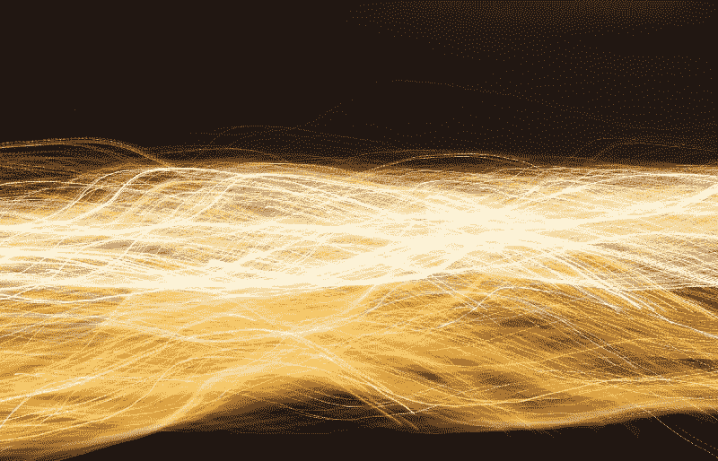
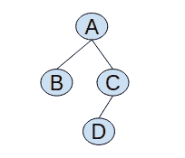
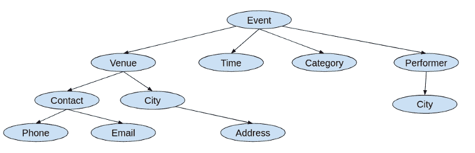
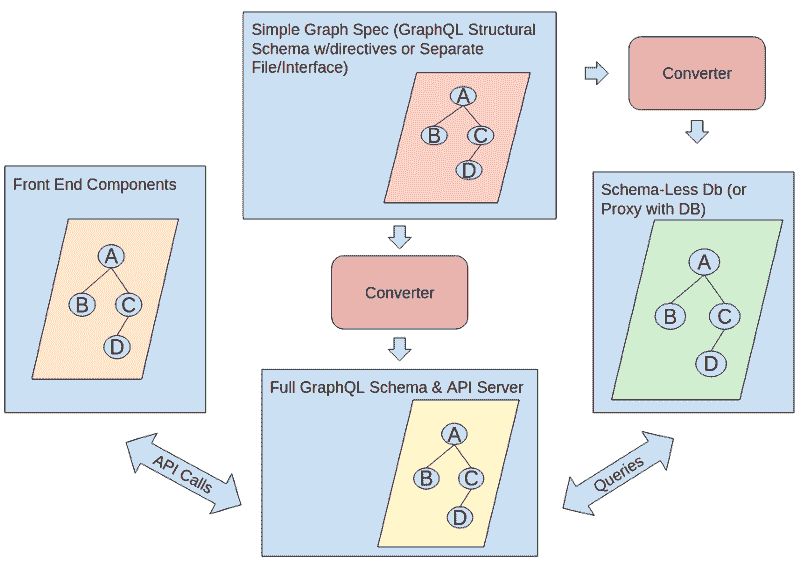

# 现在如何构建一个尖端的服务器

> 原文：<https://www.freecodecamp.org/news/meet-the-full-graph-stack-d32150308a87/>

作者:Yisroel Yakovson

# 现在如何构建一个尖端的服务器

Photo by [Maxime VALCARCE](https://unsplash.com/photos/mAj8xn5zXsk?utm_source=unsplash&utm_medium=referral&utm_content=creditCopyText) on [Unsplash](https://unsplash.com/search/photos/server?utm_source=unsplash&utm_medium=referral&utm_content=creditCopyText)

### 了解完整的图表堆栈

你正在寻找一些快速的新技能吗？或者，你想在一天之内为一家初创公司创建一个健壮的后端吗？

我要告诉你我是怎么做到的。更重要的是，我将告诉你 [GraphQL](https://graphql.org/index.html) 如何对应用程序堆栈进行了一次辉煌的颠覆。

我获得了计算机科学硕士学位，最近还获得了一些数据用户界面方面的专利。所以在某些方面，我可以欣赏这些突破的力量。

Full Graph Stack

时代在变，很快。我花了一个月的时间重新思考后端、API、数据库和栈。我正要雇用一名高级后端开发人员。有趣的是，最后，我决定我不需要一个。你可能也不会。

我把这种新型的应用堆栈称为*全图形堆栈*，或者简称为*图形堆栈*。

### 基本方法

您可以构建一个图表，显示前端所需的数据。然后，最近开发的工具从头开始生成后端。

如果你不清楚什么是[图](https://en.wikipedia.org/wiki/Graph_theory#Graph)，花几分钟澄清一下。一个非正式的定义就足够了:图是一组点(想想圆)和连接它们的线。这些点的俗称是*节点*，线是*边*。

A Very Simple Sample Graph

应用程序(包括 web 应用程序)包含多种类型的信息。一个图可以代表一个 app 的数据需求。信息类型是节点，它们之间的关系是边。例如，应用程序处理事件的图表可能如下所示:

An App Graph

关键是这样一个图从前端到后端组织了你的应用程序代码的每一层的*。*

### 它是如何工作的

一个完整的图栈关注于一个 [GraphQL 模式规范。](https://graphql.org/learn/schema/) [指令](https://graphql.org/learn/queries/#directives)可能会增强规范。如果您不熟悉 GraphQL，请仔细阅读。出于我们的目的，API 查询是应用程序图的子集。

GraphQL 模式包含一个核心类型及其关系的图表。Apollo 提供了一套简化 GraphQL 接口构建的服务。资料图为 *TypeDefs* 。

TypeDefs 是整个图形堆栈的核心。你的工作是创建 TypeDefs 来显示你的应用程序图。转换器产生:

*   TypeDefs 中的完整 GraphQL 模式。这包括*突变*，也就是更新。
*   *解析器*。这些是在后端实现查询和变异的函数。在[第二篇](https://medium.com/@yisroelyakovson/building-a-single-graph-stack-f95590ade5af)中讨论过，我用的转换器是 [neo4j-graphql-js](https://github.com/neo4j-graphql/neo4j-graphql-js) 。

Full Graph Stack Overview

关键是后端使用的数据库要么是[无模式的](https://blog.couchbase.com/the-value-of-schema-less-databases/)。无模式意味着数据不局限于预定义的结构或模式。传统的关系数据库将数据限制在其模式中。

常见的方法是使用 [Prisma 创建一个虚拟的无模式数据库。](https://www.prisma.io/)

但是我强烈建议您考虑第二种方法:使用一个固有的无模式数据库！[文档库](https://database.guide/what-is-a-document-store-database/)和[图形数据库](https://orientdb.com/graph-database/)没有固有的模式。因此，您可以使用无模式数据库，并使其数据符合 GraphQL API 的模式。

您可能会反对将 GraphQL 模式映射到关系数据库并不难。我同意，但是今天我们需要迭代的灵活性。完整的图形堆栈可以满足您的需求。一家初创公司可以无止境地旋转。无模式数据库很容易更新以适应 API 的变化。

### 图形数据库

我认为图形数据库是获得完整图形堆栈的最理想的方法。数据库本身是图，因此透明地映射到 GraphQL 模式。在某些时候，您可能不得不处理您的数据库服务器。当它的数据结构与您的 API 相同时，这样做是最简单和直观的。

图形数据库并不新鲜。许多语义数据库模型在 70 年代和 80 年代涌现出来。大多数将模式表示为图形。但直到最近十年，它们都没有引起太多关注。

最近的发展推动了对图形数据模型的新认识:

*   大数据
*   机器学习成熟
*   需要更高效、更灵活的关系数据库替代品(所谓的 *NoSQL 数据库*)。

现在有很多图形数据库提供商。目前的市场领导者是 Neo4j，但是激烈的竞争迫在眉睫。我并不声称我已经研究过这些选项并确定 Neo4j 是最好的。但是，Neo4j 已经非常成熟，并且有很多人支持使用它们。

### 前端

在这些文章中，我关注的是后端，但是图栈一直延伸到前端。

[大堆栈站点](https://grandstack.io/)观察到[反应](https://reactjs.org/)特别适合一个图形堆栈。React 使用简单的元素层次结构，可以映射到 GraphQL 查询。

Apollo 的[查询组件](https://www.apollographql.com/docs/react/essentials/queries.html)甚至让一个元素直接查询它的数据。所以使用 query 的组件映射到 GraphQL。你的[真理的单一来源](http://www.hackingwithreact.com/read/1/12/state-and-the-single-source-of-truth)变成了后端。这比在 Redux 状态下重新创建后端数据要简单得多。

### 优势

全图形栈是一个新的范例，并不是每个人都掌握了它的力量。近年来，许多文章和博客都在讨论围绕 GraphQL 的解决方案。大多数人声称“即时后端”之类的东西。但是运行堆栈的单个图的基本目标还没有被全球理解。一旦人们欣赏这种愿景，工具将变得更加一致和完整。

简而言之，完整图形堆栈的优势在于:

1.  快速实施。
2.  灵活性。您可以快速迭代您的解决方案。
3.  透明度。
4.  一致性。每一层都是一样的图表。
5.  独立。具有简化后端的 api 级焦点消除了后端服务的锁定。这是一个令人惊讶的转变。权力从相互竞争的云服务提供商手中转移。

查看[在一小时内启动您的 MVP 服务器](https://medium.com/p/f95590ade5af/edit)了解构建 MVP 服务器的分步说明！

这是关于完整图形堆栈的三篇文章中的第一篇。参见 [在一小时内发布你的 MVP 服务器](https://medium.com/p/f95590ade5af/edit) *和* [在一天内从 MVP 发布到生产服务器](https://medium.com/p/ec231a938551/edit) *。*