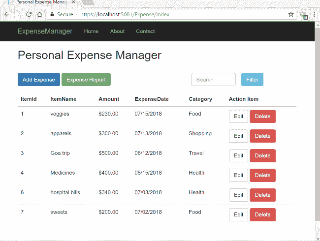
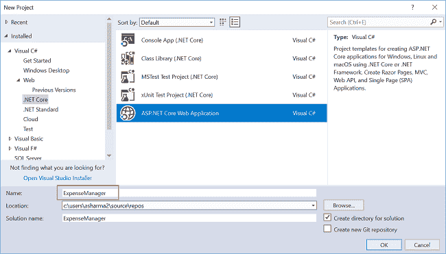
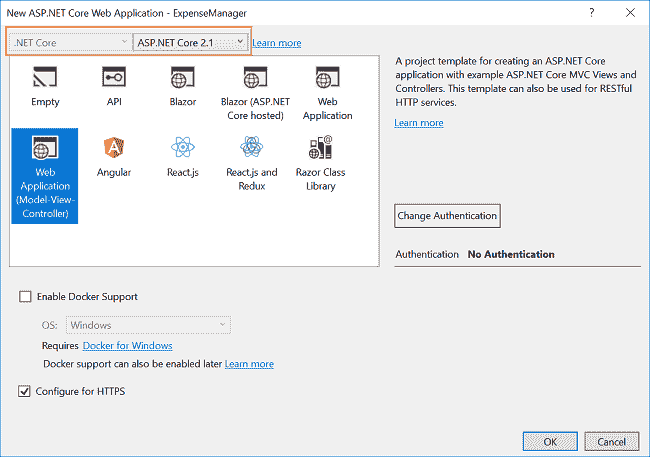
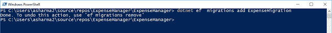
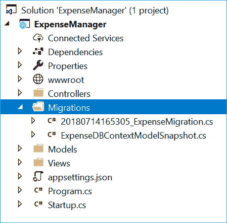
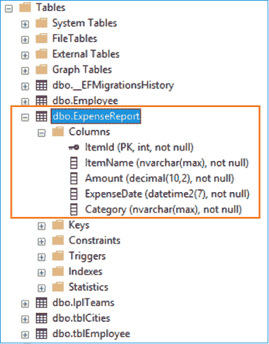
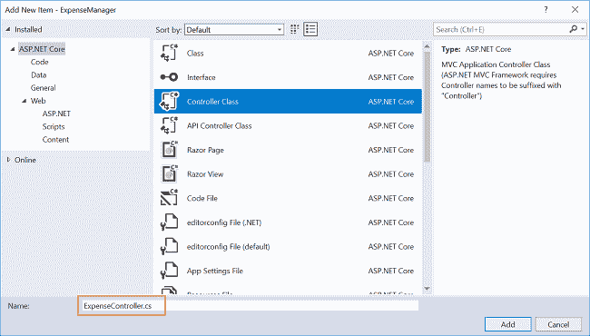
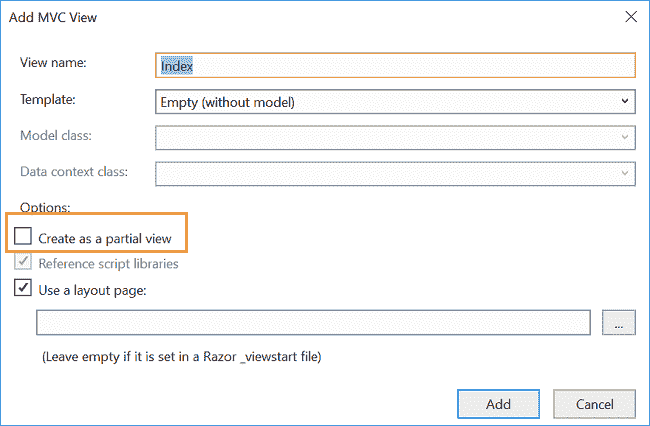
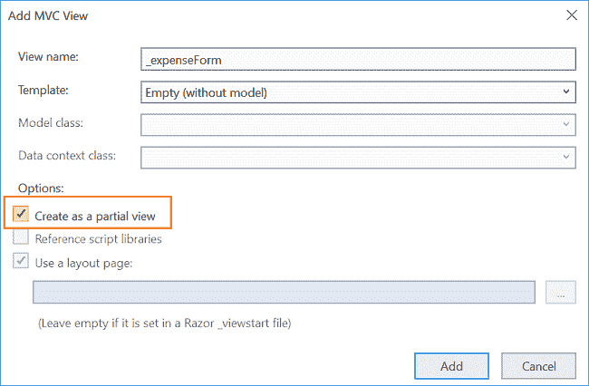
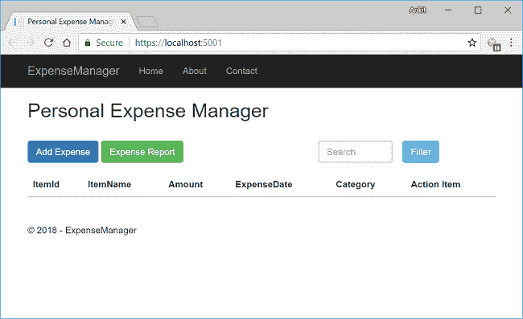

# 如何使用实体框架核心和高图表创建费用管理器

> 原文：<https://www.freecodecamp.org/news/how-to-create-an-expense-manager-using-entity-framework-core-and-highcharts-32f3b1ad0dbc/>

### 介绍

在本文中，我们将使用 ASP.NET 核心 2.1 和实体框架(EF)核心代码优先的方法创建一个个人费用管理器。该费用管理器跟踪您的日常费用，并提供比较图表来显示您的费用摘要。我们使用模态对话框来处理用户输入，并使用 Highcharts 显示每月和每周的费用摘要图表。因此，这将是一个单页应用程序(SPA)。

我们将使用 Visual Studio 2017 和 SQL Server 2017 进行演示。

让我们看看最终的应用:



### 先决条件

*   安装。NET Core 2.1 SDK 从[这里](https://www.microsoft.com/net/learn/get-started/windows#windowscmd)
*   从[这里](https://visualstudio.microsoft.com/downloads/)安装最新版本的 Visual Studio 2017
*   SQL Server 2008 或以上版本

### 源代码

在继续之前，我建议您从 [GitHub](https://github.com/AnkitSharma-007/ExpenseManager-ASPCore-EFCore-Highchart) 获取源代码。

### 创建 ASP.NET 核心项目

打开 Visual Studio，选择“文件”>“新建”>“项目”。

选择项目后，将会打开一个“新项目”对话框。选择”。NET Core”显示在 Visual C#菜单内的左侧面板中。

然后，选择“ASP。NET Core Web Application”从可用的项目类型。将项目的名称命名为“ExpenseManager ”,然后按“OK”创建 ASP.NET 核心项目。



单击 OK 后，将打开一个新对话框，要求您选择项目模板。

您将在模板窗口的左上角看到两个下拉菜单。选择”。NET Core”和“ASP。NET Core 2.1 英寸。然后，选择“Web 应用(模型-视图-控制器)”模板，按“确定”。



### 将模型添加到应用程序中

因为我们使用 EF 核心代码优先的方法，首先我们将创建我们的模型类。然后，我们将使用该模型生成我们的数据库表。

右键单击“模型”文件夹，选择“添加”>“类别”。将您的类命名为“ExpenseReport”。 *cs* ”。这个类将包含我们的“雇员”模型属性。

打开“ExpenseReport.cs”文件，输入以下代码:

```
using System;
using System.Collections.Generic;
using System.ComponentModel.DataAnnotations;
using System.ComponentModel.DataAnnotations.Schema;
using System.Linq;
using System.Threading.Tasks;

namespace ExpenseManager.Models
{
    public class ExpenseReport
    {
        [Key]
        public int ItemId { get; set; }
        [Required]
        public string ItemName { get; set; }

        [Required]
        [DataType(DataType.Currency)]
        [Column(TypeName = "decimal(10, 2)")]
        public decimal Amount { get; set; }

        [DataType(DataType.Date)]
        [DisplayFormat(DataFormatString = "{0:MM/dd/yyyy}", ApplyFormatInEditMode = true)]
        [Required]
        public DateTime ExpenseDate { get; set; } = DateTime.Now;

        [Required]
        public string Category { get; set; }
    }
}
```

在创建数据库表时，我们使用了带有`ItemId`的`[Key]`属性使其成为主键。

### 使用 EF 核心代码优先方法创建数据库表

为了使用 EF 核心代码优先的方法创建我们的表，我们需要安装几个 NuGet 包。

导航到“工具”>“获取软件包管理器”>“软件包管理器控制台”。

我们必须为我们的目标数据库提供者安装软件包。在本例中，它是 SQL Server。因此，运行以下命令:

```
Install-Package Microsoft.EntityFrameworkCore.SqlServer
```

因为我们使用 EF 工具从现有的模型中创建一个表，所以我们也将安装工具包。运行以下命令:

```
Install-Package Microsoft.EntityFrameworkCore.Tools
```

包安装成功后，我们将创建一个`dbcontext`类。在 Models 文件夹中添加文件“ExpenseDBContext.cs ”,并放入以下代码:

```
using Microsoft.EntityFrameworkCore;
using System;
using System.Collections.Generic;
using System.Linq;
using System.Threading.Tasks;

namespace ExpenseManager.Models
{
    public class ExpenseDBContext : DbContext
    {
        public virtual DbSet<ExpenseReport> ExpenseReport { get; set; }

        protected override void OnConfiguring(DbContextOptionsBuilder optionsBuilder)
        {
            if (!optionsBuilder.IsConfigured)
            {
#warning To protect potentially sensitive information in your connection string, you should move it out of source code. See http://go.microsoft.com/fwlink/?LinkId=723263 for guidance on storing connection strings.
                optionsBuilder.UseSqlServer("Your connection string");
            }
        }
    }
}
```

**不要忘记**来放置你自己的连接字符串(在`“”`里面)。

我们将创建一个数据集迁移，用于保持数据库模式与模型同步。此时没有数据库，所以第一次迁移将创建它，**和**为我们已经创建的`ExpenseDBContext`上的`DbSet`属性所代表的实体添加表。

要创建数据集迁移，请导航到项目文件夹并打开 PowerShell 窗口。在其中执行以下命令:

```
dotnet ef  migrations add ExpenseMigration
```

请参考下图:



这将在我们的项目中创建一个名为“Migrations”的文件夹，其中包含用于迁移**和**模型快照的代码。请参考下图:



在 PowerShell 窗口中输入以下命令来执行迁移:

```
dotnet ef database update
```

请参考下图:


这将在我们的数据库中创建表“ExpenseReport ”,我们在连接字符串中提到过。您可以看到列`ItemId`是这里的主键。



因此，使用 EF 代码优先的方法成功地完成了数据库的创建。

### 向我们的应用程序添加数据访问层

将类文件“ExpensesDataAcessLayer.cs”添加到“Models”文件夹中，并放入以下代码:

```
using Microsoft.EntityFrameworkCore;
using System;
using System.Collections.Generic;
using System.Linq;
using System.Threading.Tasks;

namespace ExpenseManager.Models
{
    public class ExpensesDataAcessLayer
    {
        ExpenseDBContext db = new ExpenseDBContext();
        public IEnumerable<ExpenseReport> GetAllExpenses()
        {
            try
            {
                return db.ExpenseReport.ToList();
            }
            catch
            {
                throw;
            }
        }

        // To filter out the records based on the search string 
        public IEnumerable<ExpenseReport> GetSearchResult(string searchString)
        {
            List<ExpenseReport> exp = new List<ExpenseReport>();
            try
            {
                exp = GetAllExpenses().ToList();
                return exp.Where(x => x.ItemName.IndexOf(searchString, StringComparison.OrdinalIgnoreCase) != -1);
            }
            catch
            {
                throw;
            }
        }

        //To Add new Expense record       
        public void AddExpense(ExpenseReport expense)
        {
            try
            {
                db.ExpenseReport.Add(expense);
                db.SaveChanges();
            }
            catch
            {
                throw;
            }
        }

        //To Update the records of a particluar expense  
        public int UpdateExpense(ExpenseReport expense)
        {
            try
            {
                db.Entry(expense).State = EntityState.Modified;
                db.SaveChanges();

                return 1;
            }
            catch
            {
                throw;
            }
        }

        //Get the data for a particular expense  
        public ExpenseReport GetExpenseData(int id)
        {
            try
            {
                ExpenseReport expense = db.ExpenseReport.Find(id);
                return expense;
            }
            catch
            {
                throw;
            }
        }

        //To Delete the record of a particular expense  
        public void DeleteExpense(int id)
        {
            try
            {
                ExpenseReport emp = db.ExpenseReport.Find(id);
                db.ExpenseReport.Remove(emp);
                db.SaveChanges();

            }
            catch
            {
                throw;
            }
        }

        // To calculate last six months expense
        public Dictionary<string, decimal> CalculateMonthlyExpense()
        {
            ExpensesDataAcessLayer objexpense = new ExpensesDataAcessLayer();
            List<ExpenseReport> lstEmployee = new List<ExpenseReport>();

            Dictionary<string, decimal> dictMonthlySum = new Dictionary<string, decimal>();

            decimal foodSum = db.ExpenseReport.Where
                (cat => cat.Category == "Food" && (cat.ExpenseDate > DateTime.Now.AddMonths(-7)))
                .Select(cat => cat.Amount)
                .Sum();

            decimal shoppingSum = db.ExpenseReport.Where
               (cat => cat.Category == "Shopping" && (cat.ExpenseDate > DateTime.Now.AddMonths(-7)))
               .Select(cat => cat.Amount)
               .Sum();

            decimal travelSum = db.ExpenseReport.Where
               (cat => cat.Category == "Travel" && (cat.ExpenseDate > DateTime.Now.AddMonths(-7)))
               .Select(cat => cat.Amount)
               .Sum();

            decimal healthSum = db.ExpenseReport.Where
               (cat => cat.Category == "Health" && (cat.ExpenseDate > DateTime.Now.AddMonths(-7)))
               .Select(cat => cat.Amount)
               .Sum();

            dictMonthlySum.Add("Food", foodSum);
            dictMonthlySum.Add("Shopping", shoppingSum);
            dictMonthlySum.Add("Travel", travelSum);
            dictMonthlySum.Add("Health", healthSum);

            return dictMonthlySum;
        }

        // To calculate last four weeks expense
        public Dictionary<string, decimal> CalculateWeeklyExpense()
        {
            ExpensesDataAcessLayer objexpense = new ExpensesDataAcessLayer();
            List<ExpenseReport> lstEmployee = new List<ExpenseReport>();

            Dictionary<string, decimal> dictWeeklySum = new Dictionary<string, decimal>();

            decimal foodSum = db.ExpenseReport.Where
                (cat => cat.Category == "Food" && (cat.ExpenseDate > DateTime.Now.AddDays(-7)))
                .Select(cat => cat.Amount)
                .Sum();

            decimal shoppingSum = db.ExpenseReport.Where
               (cat => cat.Category == "Shopping" && (cat.ExpenseDate > DateTime.Now.AddDays(-28)))
               .Select(cat => cat.Amount)
               .Sum();

            decimal travelSum = db.ExpenseReport.Where
               (cat => cat.Category == "Travel" && (cat.ExpenseDate > DateTime.Now.AddDays(-28)))
               .Select(cat => cat.Amount)
               .Sum();

            decimal healthSum = db.ExpenseReport.Where
               (cat => cat.Category == "Health" && (cat.ExpenseDate > DateTime.Now.AddDays(-28)))
               .Select(cat => cat.Amount)
               .Sum();

            dictWeeklySum.Add("Food", foodSum);
            dictWeeklySum.Add("Shopping", shoppingSum);
            dictWeeklySum.Add("Travel", travelSum);
            dictWeeklySum.Add("Health", healthSum);

            return dictWeeklySum;
        }
    }
}
```

这个文件将有方法来处理我们的数据库上的 CRUD 操作。我们还计算了每个类别最近六个月和最近四周的总支出。

### 将控制器添加到应用程序

右键单击“控制器”文件夹，选择“添加”>“新项目”。将会打开“添加新项目”对话框。选择“ASP。NET Core”，然后从模板面板中选择“控制器类”，并将名称设置为“ExpenseController.cs”。按“添加”。



这将在**控制器文件夹中创建我们的控制器`ExpenseController` **。打开“ExpenseController.cs”文件，输入以下代码:****

```
**`using System;
using System.Collections.Generic;
using System.Linq;
using System.Threading.Tasks;
using ExpenseManager.Models;
using Microsoft.AspNetCore.Mvc;

namespace ExpenseManager.Controllers
{
    public class ExpenseController : Controller
    {
        ExpensesDataAcessLayer objexpense = new ExpensesDataAcessLayer();
        public IActionResult Index(string searchString)
        {
            List<ExpenseReport> lstEmployee = new List<ExpenseReport>();
            lstEmployee = objexpense.GetAllExpenses().ToList();

            if (!String.IsNullOrEmpty(searchString))
            {
                lstEmployee = objexpense.GetSearchResult(searchString).ToList();
            }
            return View(lstEmployee);
        }

        public ActionResult AddEditExpenses(int itemId)
        {
            ExpenseReport model = new ExpenseReport();
            if (itemId > 0)
            {
                model = objexpense.GetExpenseData(itemId);
            }
            return PartialView("_expenseForm", model);
        }

        [HttpPost]
        public ActionResult Create(ExpenseReport newExpense)
        {
            if (ModelState.IsValid)
            {
                if (newExpense.ItemId > 0)
                {
                    objexpense.UpdateExpense(newExpense);
                }
                else
                {
                    objexpense.AddExpense(newExpense);
                }
            }
            return RedirectToAction("Index");
        }

        [HttpPost]
        public IActionResult Delete(int id)
        {
            objexpense.DeleteExpense(id);
            return RedirectToAction("Index");
        }

        public ActionResult ExpenseSummary()
        {
            return PartialView("_expenseReport");
        }

        public JsonResult GetMonthlyExpense()
        {
            Dictionary<string, decimal> monthlyExpense = objexpense.CalculateMonthlyExpense();
            return new JsonResult(monthlyExpense);
        }

        public JsonResult GetWeeklyExpense()
        {
            Dictionary<string, decimal> weeklyExpense = objexpense.CalculateWeeklyExpense();
            return new JsonResult(weeklyExpense);
        }
    }
}`**
```

**控制器将有方法调用我们的数据访问层方法来处理数据库操作。**

### **向应用程序添加视图**

**我们将创建三个视图文件:**

1.  **“index . cs html”—该视图将显示所有费用数据，并包含一个搜索框来搜索特定项目。**
2.  **" _ expense form . cs html "--这是一个局部视图，包含处理用户输入的表单。这用于添加和编辑功能，并将在模式对话框中呈现。**
3.  **" _ expense report . cs html ":-这也是一个局部视图，它将使用 Highcharts 在条形图中显示费用摘要。它还呈现为模式对话框。**

#### **索引视图**

**要创建视图文件，右键单击控制器中的“Index”方法，并选择“Add View…”。这将打开一个“添加 MVC 视图”对话框。输入视图名称“Index ”,点击“Add”。**确保**“创建为局部视图”复选框**未被**选中。请参考下图:**

****

**这将在“Expense”文件夹中的“Views”文件夹下创建“Index.cshtml”文件。打开“Index.cshtml”文件，输入以下代码:**

```
**`@model IEnumerable<ExpenseManager.Models.ExpenseReport>

@{
    ViewData["Title"] = "Personal Expense Manager";
}
<link href="~/lib/bootstrap/dist/css/bootstrap.css" rel="stylesheet" />
<script src="~/lib/jquery/dist/jquery.min.js"></script>
<script src="~/lib/bootstrap/dist/js/bootstrap.js"></script>
<script src="//cdnjs.cloudflare.com/ajax/libs/bootstrap-datepicker/1.8.0/js/bootstrap-datepicker.js"></script>
<link href="https://cdnjs.cloudflare.com/ajax/libs/bootstrap-datepicker/1.8.0/css/bootstrap-datepicker.css" rel="stylesheet">

<h2>Personal Expense Manager</h2>
<br />
<div>
    <div style="float:left">
        <button class="btn btn-primary" onclick="AddEditExpenses(0)">Add Expense</button>
        <button class="btn btn-success" onclick="ReportExpense()">Expense Report</button>
    </div>
    <div style="float:right; width:40%;">
        <form asp-controller="Expense" asp-action="Index" class="form-group">
            <div class="col-sm-6">
                <input class="form-control" type="text" name="SearchString" placeholder="Search">
            </div>
            <button type="submit" class="btn btn-default btn-info">Filter</button>
        </form>
    </div>
</div>
<br />
<br />
<table class="table">
    <thead>
        <tr>
            <th>@Html.DisplayNameFor(model => model.ItemId)</th>
            <th>@Html.DisplayNameFor(model => model.ItemName)</th>
            <th>@Html.DisplayNameFor(model => model.Amount)</th>
            <th>@Html.DisplayNameFor(model => model.ExpenseDate)</th>
            <th>@Html.DisplayNameFor(model => model.Category)</th>
            <th>Action Item</th>
        </tr>
    </thead>
    <tbody>
        @foreach (var item in Model)
        {
            <tr>
                <td>@Html.DisplayFor(modelItem => item.ItemId)</td>
                <td>@Html.DisplayFor(modelItem => item.ItemName)</td>
                <td>@Html.DisplayFor(modelItem => item.Amount)</td>
                <td>@Html.DisplayFor(modelItem => item.ExpenseDate)</td>
                <td>@Html.DisplayFor(modelItem => item.Category)</td>
                <td>
                    <button class="btn btn-default" onclick="AddEditExpenses(@item.ItemId)">Edit</button>
                    <button class="btn btn-danger" onclick="DeleteExpense(@item.ItemId)">Delete</button>
                </td>
            </tr>
        }
    </tbody>
</table>

<div class="modal fade" id="expenseFormModel" role="dialog">
    <div class="modal-dialog">
        <div class="modal-content">
            <div class="modal-header">
                <a href="#" class="close" data-dismiss="modal">&times;</a>
                <h3 id="title" class="modal-title">Add Expense</h3>
            </div>
            <div class="modal-body" id="expenseFormModelDiv">
            </div>
        </div>
    </div>
</div>

<div class="modal fade" id="expenseReportModal" role="dialog">
    <div class="modal-dialog modal-lg">
        <div class="modal-content">
            <div class="modal-header">
                <a href="#" class="close" data-dismiss="modal">&times;</a>
                <h3 class="modal-title">Expense Report</h3>
            </div>
            <div class="modal-body" id="expenseReportModalDiv">
            </div>
        </div>
    </div>
</div>

<script>

    var AddEditExpenses = function (itemId) {
        var url = "/Expense/AddEditExpenses?itemId=" + itemId;
        if (itemId > 0)
            $('#title').html("Edit Expense");

        $("#expenseFormModelDiv").load(url, function () {
            $("#expenseFormModel").modal("show");

        });

        $('#expenseFormModel').on('shown.bs.modal', function () {

            $('#calender-container .input-group.date').datepicker({
                todayBtn: true,
                calendarWeeks: true,
                todayHighlight: true,
                autoclose: true,
                container: '#expenseFormModel modal-body'
            });

        });
    }

    var ReportExpense = function () {
        var url = "/Expense/ExpenseSummary";

        $("#expenseReportModalDiv").load(url, function () {
            $("#expenseReportModal").modal("show");
        })
    }

    var DeleteExpense = function (itemId) {

        var ans = confirm("Do you want to delete item with Item Id: " + itemId);

        if (ans) {
            $.ajax({
                type: "POST",
                url: "/Expense/Delete/" + itemId,
                success: function () {
                    window.location.href = "/Expense/Index";
                }
            })
        }
    }
</script>

<script>

    $('body').on('click', "#btnSubmit", function () {
        var myformdata = $("#expenseForm").serialize();

        $.ajax({
            type: "POST",
            url: "/Expense/Create",
            data: myformdata,
            success: function () {
                $("#myModal").modal("hide");
                window.location.href = "/Expense/Index";
            },
            error: function (errormessage) {
                alert(errormessage.responseText);
            }
        })
    })
</script>`**
```

**让我们来理解这个代码。**

**在顶部，我们包括了引导和 jQuery 参考。**

**之后，我们添加了两个按钮，一个用于添加新费用，另一个用于创建费用摘要。**

**我们还包括了一个包含搜索框的表单，用于过滤记录。单击“Filter”按钮，表单被提交，它调用控制器中的`Index`方法——这将返回符合搜索标准的项目。搜索功能仅在“物件名称”字段中提供。**

**我们使用一个表格来显示数据库中的所有费用记录。每条记录都有两个对应的操作按钮——“编辑”和“删除”。**

**我们还创建了两个模态对话框。一个用于添加/编辑费用数据，另一个用于显示费用汇总报告。**

**在脚本部分，我们定义了一个`AddEditExpenses`函数。当点击“添加费用”或“编辑”按钮时，将调用此功能。我们在这个方法中将`itemId`作为参数传递。如果`ItemId`值**没有设置**，那么它被认为是一个`Add`功能。如果`ItemId` **被设置，**则为`Edit`功能。**

**我们将在控制器中调用`AddEditExpenses`，它将返回分部视图“_expenseForm”并将其绑定到 ExpenseReport 模型。对于`Add`呼叫，模态对话框将为空，如果是`Edit`呼叫，模态对话框将包含费用项目数据。我们使用引导日期选择器来选择费用日期，因此我们在模式对话框加载时设置了日期选择器属性。**

**`ReportExpense`函数将调用我们控制器中的`ExpenseSummary`方法。这将返回部分视图“_expenseReport”以显示为模式对话框。此局部视图将使用 Highcharts 显示每月和每周的费用摘要图表。**

**`DeleteExpense`功能用于删除特定费用的记录。这将调用控制器中的`Delete`方法，从数据库中删除费用记录。**

**我们还使用动态绑定来绑定“expenseForm”模型的提交事件。该表单在“_expenseForm.cshtml”视图中定义。在提交表单时，我们在控制器类中调用了对`Create`方法的 ajax 调用。**

**由于`Edit`和`Add`功能使用相同的形式，我们需要区分使用`ItemId`值。在控制器的`Create`方法中，如果设置了`ItemId`，那么我们将调用`UpdateExpense`方法。否则，调用`AddExpense`方法。成功提交后，我们将关闭该模式并重定向至“索引”视图，以显示更新的费用列表。**

#### **费用表单视图**

**这是一个局部视图，单击“索引”视图中的“添加费用”按钮，该视图将显示在模式对话框中。**

**要创建视图文件，右键单击控制器文件中的任意位置，然后选择“添加视图…”。这将打开一个“添加 MVC 视图”对话框。输入视图的名称为“_expenseForm ”,然后单击“Add”。**确保**选择了**复选框**。请参考下图:**

****

**打开“_expenseForm.cshtml 文件”并输入以下代码:**

```
**`@model ExpenseManager.Models.ExpenseReport

<script src="//cdnjs.cloudflare.com/ajax/libs/bootstrap-datepicker/1.3.0/js/bootstrap-datepicker.js"></script>
<link href="https://cdnjs.cloudflare.com/ajax/libs/bootstrap-datepicker/1.8.0/css/bootstrap-datepicker.css" rel="stylesheet">

<div>
    <div class="row">
        <div class="col-md-8">
            <form id="expenseForm">
                <input type="hidden" asp-for="ItemId" />
                <div class="form-group">
                    <label asp-for="ItemName" class="control-label"></label>
                    <input asp-for="ItemName" class="form-control" />
                </div>
                <div class="form-group">
                    <label asp-for="Category" class="control-label"></label>
                    <select asp-for="Category" class="form-control">
                        <option value="">-- Select Category --</option>
                        <option value="Food">Food</option>
                        <option value="Shopping">Shopping</option>
                        <option value="Travel">Travel</option>
                        <option value="Health">Health</option>
                    </select>
                </div>
                <div class="form-group">
                    <label asp-for="Amount" class="control-label"></label>
                    <input asp-for="Amount" class="form-control" />
                </div>
                <div class="form-group" id="calender-container">
                    <label asp-for="ExpenseDate" class="control-label"></label>
                    <div class="input-group date">
                        <input asp-for="ExpenseDate" type="text" class="form-control"><span class="input-group-addon"><i class="glyphicon glyphicon-calendar"></i></span>
                    </div>
                </div>
                <div class="form-group">
                    <button type="button" id="btnSubmit" class="btn btn-block btn-info">Save</button>
                </div>
            </form>
        </div>
    </div>
</div>`**
```

**在顶部，我们包含了对 bootstrap-datepicker 的引用，这样我们就可以在模态对话框中使用它。然后我们有一个`<fo` rm >元素，它绑定到我们的模型。我们还有`ave a` 提交按钮，它将使用 ajax 调用在我们的控制器中发布表单数据到`o the` Create 方法。**

#### **费用报表视图**

**这是单击“索引”视图中的“费用报告”按钮时，在模式对话框中显示的局部视图。**

**创建一个新的分部视图“_expenseReport.cshtml”并放入以下代码:**

```
**`<script src="https://code.highcharts.com/highcharts.js"></script>

<button id="btnMonthlyReport" class="btn btn-info">Monthly Report</button>
<button id="btnWeeklyReport" class="btn btn-warning">Weekly Report</button>
<div id="container" style="min-width: 400px; height: 400px; margin: 0 auto">

</div>

<script>

    $(document).ready(function () {
        $("#btnWeeklyReport").click(function () {
            var titleMessage = "Expenses in last four weeks is : ";

            $.ajax({
                type: "GET",
                url: "/Expense/GetWeeklyExpense",
                contentType: "application/json",
                dataType: "json",
                success: function (result) {
                    var keys = Object.keys(result);
                    var weeklydata = new Array();
                    var totalspent = 0.0;
                    for (var i = 0; i < keys.length; i++) {
                        var arrL = new Array();
                        arrL.push(keys[i]);
                        arrL.push(result[keys[i]]);
                        totalspent += result[keys[i]];
                        weeklydata.push(arrL);
                    }
                    createCharts(weeklydata, titleMessage, totalspent.toFixed(2));
                }
            })
        })

        $("#btnMonthlyReport").click(function () {
            var titleMessage = "Expenses in last six months is : ";

            $.ajax({
                type: "GET",
                url: "/Expense/GetMonthlyExpense",
                contentType: "application/json",
                dataType: "json",
                success: function (result) {
                    var keys = Object.keys(result);
                    var monthlydata = new Array();
                    var totalspent = 0.0;
                    for (var i = 0; i < keys.length; i++) {
                        var arrL = new Array();
                        arrL.push(keys[i]);
                        arrL.push(result[keys[i]]);
                        totalspent += result[keys[i]];
                        monthlydata.push(arrL);
                    }
                    createCharts(monthlydata, titleMessage, totalspent.toFixed(2));
                }
            })
        })
    })

    function createCharts(sum, titleText, totalspent) {
        Highcharts.chart('container', {
            chart: {
                type: 'column'
            },
            title: {
                text: titleText + ' ' + totalspent
            },
            xAxis: {
                type: 'category',
                labels: {
                    rotation: -45,
                    style: {
                        fontSize: '13px',
                        fontFamily: 'Verdana, sans-serif'
                    }
                }
            },
            yAxis: {
                min: 0,
                title: {
                    text: 'Money spent'
                }
            },
            legend: {
                enabled: false
            },
            tooltip: {
                pointFormat: 'Total money spent: <b>{point.y:.2f} </b>'
            },
            series: [{
                type: 'column',
                data: sum,
            }]
        });
    }

</script>`**
```

**在顶部，我们包含了对 Highcharts 的`cdn`引用。我们还提供了两个按钮。一个用于查看过去六个月的月度报告。另一个是查看最近四周的周报。该报告将以条形图的形式生成，以提供费用汇总的比较研究。**

**单击 weekly report 按钮，我们将调用控制器的`GetWeeklyExpense`方法。这将返回 JSON 格式的数据。我们将把这些数据传递给`createCharts`函数，使用 Highcharts 创建每周费用条形图。**

**类似地，我们将在单击“Monthly Report”按钮时调用控制器的`GetMonthlyExpense`方法。JSON 结果将被传递给`createCharts`函数，以使用 Highcharts 创建每月费用条形图。**

### **配置路由 URL**

**打开“Startup.cs”文件以设置应用程序路线的格式。向下滚动到`app.UseMvc`方法，在这里您可以设置路由 URL。**

**确保您的路由 URL 设置如下:**

```
**`app.UseMvc(routes =>
{
    routes.MapRoute(
        name: "default",
        template: "{controller=Expense}/{action=Index}");
});`**
```

**这个 URL 模式将`ExpenseController`设置为默认控制器，将`Index`方法设置为默认动作方法。默认路由参数不需要出现在匹配的 URL 路径中。**

**如果我们不在 URL 中添加任何控制器名称，那么它将把`ExpenseController`作为默认控制器，把`ExpenseController`的`Index`方法作为默认动作方法。**

**类似地，如果我们只将 `/Expense`附加到 URL，它将导航到费用控制器的`Index`操作方法。**

### **执行演示**

**按 F5 启动应用程序。您可以看到类似如下所示的页面:**

****

**这里我们有一个“添加费用”按钮来添加新的费用报告。“费用报告”按钮将打开一个对话框，显示每月和每周费用数据的条形图。在右上角，我们有一个搜索框，使用项目名称搜索记录。**

**请看下面的 GIF 图片，了解应用程序的演示:**

****

### **结论**

**我们在 Visual Studio 2017 和 SQL Server 2017 的帮助下，使用 ASP.NET 核心和实体框架核心创建了个人费用管理器应用程序。我们还使用 Highcharts 为每月和每周的费用摘要创建了一个条形图。**

**请从 [GitHub](https://github.com/AnkitSharma-007/ExpenseManager-ASPCore-EFCore-Highchart) 下载源代码，四处游玩，以便更好地理解。**

**你可以看看我其他关于 ASP 的文章。网芯[这里](http://ankitsharmablogs.com/category/asp-net-core/)。**

**你在准备面试吗？阅读我关于[技术面试 C#编码问题](http://ankitsharmablogs.com/csharp-coding-questions-for-technical-interviews/)的文章。**

### **其他有用的资源**

*   **[使用 Visual Studio 代码和 EF 的 ASP.NET 核心 MVC 的 CRUD 操作](http://ankitsharmablogs.com/crud-operation-asp-net-core-mvc-using-visual-studio-code-ef/)**
*   **[ASP.NET 核心—带有 React.js 的 CRUD 和实体框架核心](http://ankitsharmablogs.com/asp-net-core-crud-with-react-js-and-entity-framework-core/)**
*   **[ASP.NET 核心—使用 Angular 5 和实体框架核心的 CRUD】](http://ankitsharmablogs.com/asp-net-core-crud-using-angular-5-and-entity-framework-core/)**
*   **[使用 ADO.NET 和 Visual Studio 2017 的 ASP.NET 核心 MVC 的 CRUD 操作](http://ankitsharmablogs.com/crud-operation-with-asp-net-core-mvc-using-ado-net/)**
*   **[使用 Visual Studio 代码和 ADO.NET 的 ASP.NET 核心 MVC 的 CRUD 操作](http://ankitsharmablogs.com/crud-operation-with-asp-net-core-mvc-using-visual-studio-code-and-ado-net/)**
*   **[ASP.NET 岩心——使用角度为 5 的高图表](http://ankitsharmablogs.com/asp-net-core-using-highcharts-with-angular-5/)**

**最初发表于[https://ankitsharmablogs.com/](https://ankitsharmablogs.com/)**