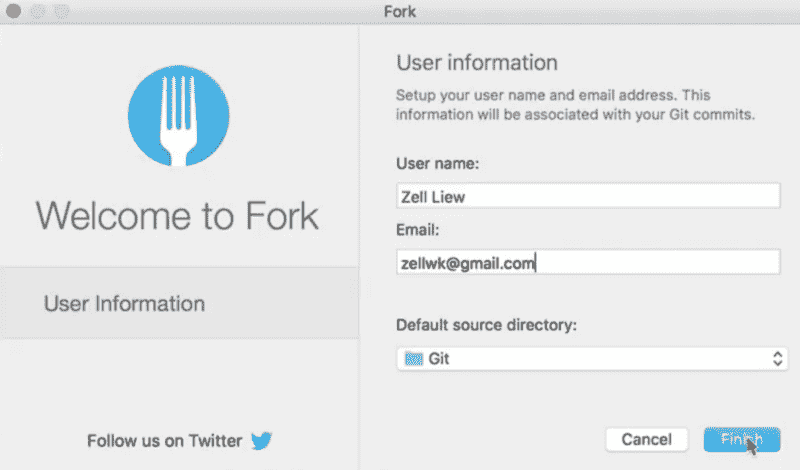

# 如何在几分钟内建立一个 Git 客户机

> 原文：<https://www.freecodecamp.org/news/how-to-set-up-a-git-client-in-just-a-few-minutes-3d78b8d2264f/>

今天我们要谈谈 Git。您将学习什么是 Git，以及如何在您的计算机上设置 Git 客户端。

### Git 是什么？

想象你在玩游戏。在这个游戏中，你可以创建保存点。当你在游戏中死亡时，你需要加载你的游戏并从你的保存点继续。

如果你没有创建一个保存点，你将在游戏开始时再次从头开始。这不是一个有趣的经历，所以保存你的游戏总是一个好主意。

Git 就像是你工作的一个保存点系统。您可以创建保存点。在 Git 中，我们称每个保存点为提交。

当您在 Git 中创建一个提交时，您可以从该提交中加载您的工作。如果您创建了五个提交，那么您可以从这些提交中的任何一个加载您的工作。

这就是 Git 的用途。我们称之为版本控制系统，因为您可以从任何提交中保存和加载您的工作。

### 选择 Git 客户端

很多人教你如何使用命令行来使用 Git，但这对初学者来说可能会很可怕。

我们将扔掉命令行，使用应用程序来帮助您开始使用 Git。这些应用程序也被称为 Git 客户端。

我最喜欢的 Git 客户端是[塔](https://git-tower.com/)。它非常强大。Tower 的唯一缺点是每年的费用为 55.20 美元。如果您是编程新手，您可能不想从 Tower 开始。你可能想尝试一个免费的应用程序。

以下是一些不错的免费应用:

1.  [源代码管理](https://www.sourcetreeapp.com/)
2.  [吉塔拉克](https://www.gitkraken.com/)
3.  [叉子](https://git-fork.com/)

Sourcetree 可能是最好的免费应用。这是好的，并具有与塔不相上下的功能。但是 Sourcetree 可能会有问题，您可能无法自己解决这些错误。(我试过了，我做不到)。

GitKraken 是另一个很多人喜欢的热门应用。我认为 GitKraken 太花哨了，而且关注了错误的东西。

Fork 看起来简洁明了，很容易上手。它现在处于测试阶段，所以是免费的，但你可能需要以后付费。

我将向您展示如何设置 Fork。

### 设置叉子

这是您第一次打开 Fork 时的欢迎屏幕:



它会要求您输入用户名和电子邮件地址。当有多人在同一个项目中工作时，这些用于高级用途的识别目的。

“用户名”有点误导，因为这应该是你的名字，而不是实际的用户名。

#### 默认源目录

我喜欢 Fork 的一点是它要求你设置一个默认的源目录。

这意味着您用 Git 复制(或克隆)的项目将自动进入指定的文件夹，这使得它很容易被找到。

#### 初始化 Git 存储库

创建 Git 存储库有两种方法。

在创建 Git 存储库之前，您需要在源目录中创建一个项目文件夹。一旦您在源目录中有了一个文件夹，您可以在 Fork 中点击`File`然后`Create new repository`来创建您的 Git 目录。

要检查是否创建了 Git 存储库，您可以打开项目文件夹并检查是否有一个`.git`文件夹。这个`.git`文件夹是一个隐藏文件夹。你需要[显示你的隐藏文件](https://ianlunn.co.uk/articles/quickly-showhide-hidden-files-mac-os-x-mavericks/)才能看到。

初始化 Git 存储库的第二种方法是通过命令行。

为此，您首先需要在源目录中创建项目文件夹。然后，您将项目文件夹拖到终端应用程序中。这将自动导航到终端中的项目文件夹。

如果您想了解更多关于终端的知识，我推荐您从我的文章[开始，克服您对命令行](https://zellwk.com/fear-of-command-line/)的恐惧。

一旦您导航到终端中的项目文件夹，您就可以输入`git init`来初始化存储库。

```
git init
```

### 包扎

Git 就像游戏中的保存点系统。您可以使用 Git 来保存和加载您的工作。

感谢阅读。这篇文章对你有什么帮助吗？如果我有，[我希望你考虑分享它](http://twitter.com/share?text=Setting%20up%20a%20Git%20Client%20by%20@zellwk%20?%20&url=https://zellwk.com/blog/setting-up-git/&hashtags=)。在阅读这篇文章之前，你可能只是帮助了和你有同样感受的人。谢谢你。

这篇文章最初发表在我的博客上。如果你想要更多的文章来帮助你成为一个更好的前端开发者，注册我的[时事通讯](https://zellwk.com/)。