# 如何使用服务器端 Blazor 构建单页面应用程序

> 原文：<https://www.freecodecamp.org/news/how-to-build-a-single-page-application-using-server-side-blazor-1e37875e8ed/>

### 介绍

在本文中，我们将使用服务器端 Blazor 创建一个单页面应用程序(SPA)。我们将使用实体框架核心数据库。单页应用程序是加载单个 HTML 页面的 web 应用程序。当用户与应用程序交互时，它们会动态更新页面。

我们将创建一个样本员工记录管理系统。我们将对它执行 CRUD 操作。一个模态弹出窗口将显示表单来处理用户输入。该表单还将有一个下拉列表，将绑定到一个数据库表。我们还将为用户提供一个过滤选项，根据员工姓名过滤员工记录。

我们将使用 Visual Studio 2017 和 SQL Server 2017 进行演示。

让我们看看最终的应用:

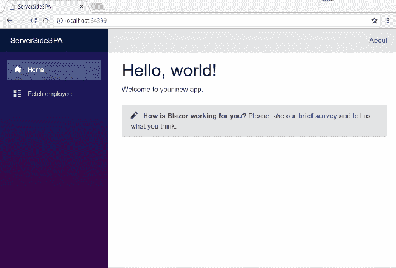

### 什么是服务器端 Blazor？

Blazor 0 . 5 . 0 版允许我们在服务器上运行 Blazor 应用程序。这意味着我们可以在。网芯。网络上的 SignalR 连接将处理其他功能，如 UI 更新、事件处理和 JavaScript 互操作调用。

要了解更多信息，请参考我以前的文章[了解服务器端 Blazor](http://ankitsharmablogs.com/understanding-server-side-blazor/) 。

### 先决条件

*   安装。NET Core 2.1 以上 SDK 从[这里](https://www.microsoft.com/net/learn/get-started-with-dotnet-tutorial#windowscmd)
*   从此处[安装 Visual Studio 2017 v15.7 或以上版本](https://visualstudio.microsoft.com/downloads/)
*   从[这里](https://marketplace.visualstudio.com/items?itemName=aspnet.blazor)安装 ASP.NET 核心 Blazor 语言服务扩展
*   SQL Server 2012 或以上版本。

v15.7 以下的 Visual Studio 2017 版本不支持 Blazor 框架。

### 源代码

从 [GitHub](https://github.com/AnkitSharma-007/Blazor-Server-Side-SPA) 获取该应用的源代码。

重要提示:

**本文对 Blazor 0.5.0 版本有效。在 Blazor 的未来版本中，服务器端 Blazor 可能会发生重大变化。**

### 创建表格

我们将使用两个表来存储我们的数据。

1.  员工:用于存储员工详细信息。它包含 EmployeeID、姓名、城市、部门和性别等字段。
2.  城市:包含城市列表。它用于填充雇员表的*城市*字段。它包含两个字段，CityID 和 CityName

执行以下命令创建两个表:

```
CREATE TABLE Employee (  
EmployeeID int IDENTITY(1,1) PRIMARY KEY,  
Name varchar(20) NOT NULL ,  
City varchar(20) NOT NULL ,  
Department varchar(20) NOT NULL ,  
Gender varchar(6) NOT NULL  
)    
GO      

CREATE TABLE Cities (      
CityID int IDENTITY(1,1) NOT NULL PRIMARY KEY,      
CityName varchar(20) NOT NULL       
)      
GO
```

现在，我们将一些数据放入城市表中。我们将使用这个表在我们的 web 应用程序中绑定一个下拉列表。用户将从该下拉列表中选择所需的城市。使用以下 insert 语句:

```
INSERT INTO Cities VALUES('New Delhi');  
INSERT INTO Cities VALUES('Mumbai');  
INSERT INTO Cities VALUES('Hyderabad');  
INSERT INTO Cities VALUES('Chennai');  
INSERT INTO Cities VALUES('Bengaluru');
```

现在，我们的数据库部分完成了。因此，我们将继续使用 Visual Studio 2017 创建服务器端应用程序。

### 创建服务器端 Blazor 应用程序

打开 Visual Studio 并选择文件>>新建>>项目。

选择项目后，将会打开一个“新项目”对话框。选择。NET Core 内的 Visual C#菜单从左侧面板。然后，选择“ASP。NET Core Web Application”从可用的项目类型。对于项目名称，输入 *ServerSideSPA* 并按 OK。

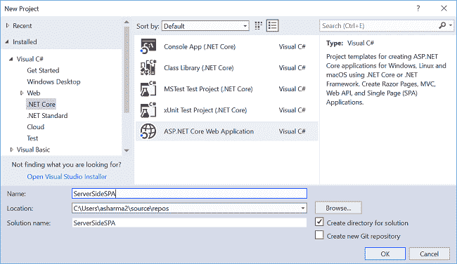

单击 OK 后，将打开一个新对话框，要求您选择项目模板。您将在模板窗口的左上角看到两个下拉菜单。选择”。NET Core”和“ASP。NET Core 2.1 英寸。然后，选择“Blazor(ASP.NET 核心中的服务器端)”模板并按 OK

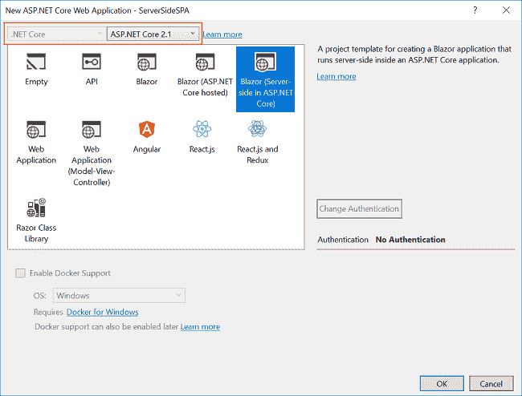

这将创建我们的服务器端 Blazor 解决方案。您可以在解决方案资源管理器中观察文件夹结构，如下图所示:

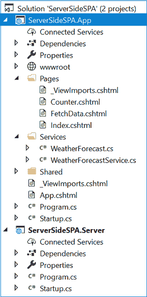

该解决方案有两个项目文件:

1.  ServerSideSPA。App:这是我们的服务器端 Blazor 应用。这个项目拥有我们所有的组件逻辑和服务。我们还将在这个项目中创建我们的模型和数据访问层。
2.  ServerSideSPA。服务器:这是 ASP.NET 核心托管应用程序。服务器端的 Blazor 应用程序将在 ASP.NET 核心主机应用程序中运行，而不是在浏览器中运行客户端。

在 Blazor 的未来版本中，这两个项目可能会合并为一个。但是现在，由于 Blazor 编译模型的差异，需要进行分离。

### 将模型搭建到应用程序

我们使用实体框架核心数据库优先的方法来创建我们的模型。我们将在 *ServerSideSPA 中创建我们的模型类。App* 项目。
导航到工具> >获取软件包管理器> >软件包管理器 Conso *le。选择“S* e *rve* rSideSPA。App”从默认项目下拉列表中选择。请参考下图:

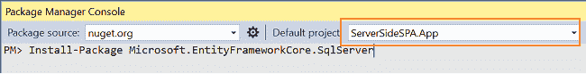

首先，我们将为我们的目标数据库提供者安装软件包，在本例中是 SQL Server。因此，运行以下命令:

```
Install-Package Microsoft.EntityFrameworkCore.SqlServer
```

因为我们使用实体框架工具从现有的数据库中创建一个模型，所以我们也将安装工具包。因此，运行以下命令:

```
Install-Package Microsoft.EntityFrameworkCore.Tools
```

在您安装了这两个包之后，我们将使用以下命令从数据库表中构建我们的模型:

```
Scaffold-DbContext "Your connection string here" Microsoft.EntityFrameworkCore.SqlServer -OutputDir Models -Tables Employee, Cities
```

不要忘记放入您自己的连接字符串(在" ")中。该命令成功执行后，它会在 *ServerSideSPA 中创建一个 models 文件夹。App* 项目。它包含三个类文件: *myTestDBContext.cs、Cities.cs* 和 *Employee.cs* 。因此，我们使用 EF 核心数据库优先方法成功搭建了我们的模型。

### 为应用程序创建数据访问层

右键单击 ServerSideSPA。App 项目然后选择添加>>新文件夹并命名为 f *旧数据*访问。我们将添加我们的类来处理这个文件夹中与数据库相关的操作。

右击 *DataAccess* 文件夹，选择添加>T3 类。

将您的类命名为*employeedataaccesslayer . cs .*打开*employeedataaccesslayer . cs*，并将以下代码放入其中:

```
using Microsoft.EntityFrameworkCore;
using ServerSideSPA.App.Models;
using System;
using System.Collections.Generic;
using System.Linq;
using System.Threading.Tasks;

namespace ServerSideSPA.App.DataAccess
{
    public class EmployeeDataAccessLayer
    {
        myTestDBContext db = new myTestDBContext();

        //To Get all employees details     
        public List<Employee> GetAllEmployees()
        {
            try
            {
                return db.Employee.AsNoTracking().ToList();
            }
            catch
            {
                throw;
            }
        }

        //To Add new employee record       
        public void AddEmployee(Employee employee)
        {
            try
            {
                db.Employee.Add(employee);
                db.SaveChanges();
            }
            catch
            {
                throw;
            }
        }

        //To Update the records of a particluar employee      
        public void UpdateEmployee(Employee employee)
        {
            try
            {
                db.Entry(employee).State = EntityState.Modified;
                db.SaveChanges();
            }
            catch
            {
                throw;
            }
        }

        //Get the details of a particular employee      
        public Employee GetEmployeeData(int id)
        {
            try
            {
                var employee = db.Employee.Find(id);
                db.Entry(employee).State = EntityState.Detached;
                return employee;
            }
            catch
            {
                throw;
            }
        }

        //To Delete the record of a particular employee      
        public void DeleteEmployee(int id)
        {
            try
            {
                Employee emp = db.Employee.Find(id);
                db.Employee.Remove(emp);
                db.SaveChanges();
            }
            catch
            {
                throw;
            }
        }

        // To get the list of Cities
        public List<Cities> GetCityData()
        {
            try
            {
                return db.Cities.ToList();
            }
            catch
            {
                throw;
            }
        }
    }
}
```

这里，我们定义了处理数据库操作的方法:

*   *GetAllemployees* 将从 Employee 表中获取所有的雇员数据。
*   *AddEmployee* 将创建一个新的员工记录。
*   *UpdateEmployee* 将更新现有员工的记录。
*   *GetEmployeeData* 将获取与传递给它的员工 ID 相对应的员工记录。
*   *DeleteEmployee* 将删除与传递给它的员工 id 相对应的员工记录。
*   *GetCityData* 将从*城市*表中获取所有城市的列表。

### 创建服务类

右键单击*服务*文件夹并选择添加> >类。将其命名为“EmployeeService.cs”和 *cli* ck Add。这将把雇员服务类添加到服务文件夹中。

打开 EmployeeService.cs，将以下代码放入其中:

```
using ServerSideSPA.App.DataAccess;
using ServerSideSPA.App.Models;
using System;
using System.Collections.Generic;
using System.Linq;
using System.Threading.Tasks;

namespace ServerSideSPA.App.Services
{
    public class EmployeeService
    {
        EmployeeDataAccessLayer objemployee = new EmployeeDataAccessLayer();

        public Task<List<Employee>> GetEmployeeList()
        {
            return Task.FromResult(objemployee.GetAllEmployees());
        }

        public void Create(Employee employee)
        {
            objemployee.AddEmployee(employee);
        }

        public Task<Employee> Details(int id)
        {
            return Task.FromResult(objemployee.GetEmployeeData(id));
        }

        public void Edit(Employee employee)
        {
            objemployee.UpdateEmployee(employee);
        }

        public void Delete(int id)
        {
            objemployee.DeleteEmployee(id);
        }

        public Task<List<Cities>> GetCities()
        {
            return Task.FromResult(objemployee.GetCityData());
        }
    }
}
```

我们将从我们的服务中调用 *EmployeeDataAccessLayer* 类的方法。服务将被注入到我们的组件中。组件将调用服务方法来访问数据库。

在这个时间点上，ServerSideSPA。App 项目具有以下结构:

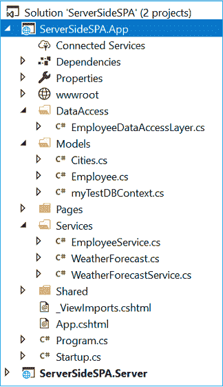

### 配置服务

为了使服务对组件可用，我们需要在服务器端应用程序上配置它。打开 ServerSideSPA。App >> Startup.cs 文件。在启动类的 ConfigureSerdevices 方法中添加下面一行。

```
services.AddSingleton<EmployeeService>();
```

请参考下图:

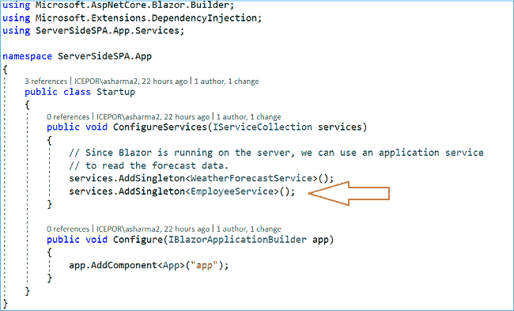

现在我们将继续创建我们的视图组件。

### 创建视图组件

我们将在*服务器页面中添加 Razor 页面。App /Pages* 文件夹。默认情况下，我们在应用程序中提供了“计数器”和“获取数据”页面。这些默认页面不会影响我们的应用程序。为了这个教程，从*服务器侧删除它们。App /Pages* 文件夹。

右键单击 ServerSideSPA。App */Pages* 文件夹然后选择添加> >新项。将会打开“添加新项目”对话框。选择“ASP。NET Core”。然后从模板面板中选择“Razor Page ”,然后用它来管理数据。 cshtml。单击添加。

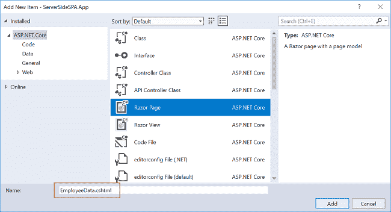

这将在*页面*文件夹中添加一个 *EmployeeData.cshtml* 页面。这个 razor 页面将有两个文件， *EmployeeData.cshtml* 和*employeedata . cshtml . cs .*
现在，我们将向这些页面添加代码。

### EmployeeData.cshtml

打开 *EmployeeData.cshtml* 页面，将以下代码放入其中:

```
@page "/fetchemployee"
@inherits EmployeeDataModel

<h1>Employee Data</h1>
<p>This component demonstrates CRUD operation on Employee data</p>

<div>
    <div style="float:left">
        <button class="btn btn-primary" onclick="@AddEmp">Add Employee</button>
    </div>
    <div style="float:right; width:40%;">
        <div class="col-sm-6" style="float:left">
            <input class="form-control" type="text" placeholder="Search" bind="@SearchString" />
        </div>
        <div>
            <button type="submit" class="btn btn-default btn-info" onclick="@FilterEmp">Filter</button>
        </div>
    </div>
</div>

@if (empList == null)
{
    <p><em>Loading...</em></p>
}
else
{
    <table class='table'>
        <thead>
            <tr>
                <th>ID</th>
                <th>Name</th>
                <th>Gender</th>
                <th>Department</th>
                <th>City</th>
            </tr>
        </thead>
        <tbody>
            @foreach (var emp in empList)
            {
                <tr>
                    <td>@emp.EmployeeId</td>
                    <td>@emp.Name</td>
                    <td>@emp.Gender</td>
                    <td>@emp.Department</td>
                    <td>@emp.City</td>
                    <td>
                        <button class="btn btn-default" onclick="@(async () => await EditEmployee(@emp.EmployeeId))">Edit</button>
                        <button class="btn btn-danger" onclick="@(async () => await DeleteConfirm(@emp.EmployeeId))">Delete</button>
                    </td>
                </tr>
            }
        </tbody>
    </table>

    if (isAdd)
    {
        <div class="modal" tabindex="-1" style="display:block" role="dialog">
            <div class="modal-dialog">
                <div class="modal-content">
                    <div class="modal-header">
                        <h3 class="modal-title">@modalTitle</h3>
                        <button type="button" class="close" onclick="@closeModal">
                            <span aria-hidden="true">X</span>
                        </button>
                    </div>
                    <div class="modal-body">
                        <form>
                            <div class="form-group">
                                <label for="Name" class="control-label">Name</label>
                                <input for="Name" class="form-control" bind="@emp.Name" />
                            </div>
                            <div class="form-group">
                                <label asp-for="Gender" class="control-label">Gender</label>
                                <select asp-for="Gender" class="form-control" bind="@emp.Gender">
                                    <option value="">-- Select Gender --</option>
                                    <option value="Male">Male</option>
                                    <option value="Female">Female</option>
                                </select>
                            </div>
                            <div class="form-group">
                                <label asp-for="Department" class="control-label">Department</label>
                                <input asp-for="Department" class="form-control" bind="@emp.Department" />
                            </div>
                            <div class="form-group">
                                <label asp-for="City" class="control-label">City</label>
                                <select asp-for="City" class="form-control" bind="@emp.City">
                                    <option value="">-- Select City --</option>
                                    @foreach (var city in cityList)
                                    {
                                        <option value="@city.CityName">@city.CityName</option>
                                    }
                                </select>
                            </div>
                        </form>
                    </div>
                    <div class="modal-footer">
                        <button class="btn btn-block btn-info" onclick="@(async () => await SaveEmployee())" data-dismiss="modal">Save</button>
                    </div>
                </div>
            </div>
        </div>
    }

    if (isDelete)
    {
        <div class="modal" tabindex="-1" style="display:block" role="dialog">
            <div class="modal-dialog">
                <div class="modal-content">
                    <div class="modal-header">
                        <h3 class="modal-title">Delete Employee</h3>
                    </div>
                    <div class="modal-body">
                        <h4>Do you want to delete this employee ??</h4>
                        <table class="table">
                            <tr>
                                <td>Name</td>
                                <td>@emp.Name</td>
                            </tr>
                            <tr>
                                <td>Gender</td>
                                <td>@emp.Gender</td>
                            </tr>
                            <tr>
                                <td>Department</td>
                                <td>@emp.Department</td>
                            </tr>
                            <tr>
                                <td>City</td>
                                <td>@emp.City</td>
                            </tr>
                        </table>
                    </div>
                    <div class="modal-footer">
                        <button class="btn btn-danger" onclick="@(async () => await DeleteEmployee(emp.EmployeeId))" data-dismiss="modal">YES</button>
                        <button class="btn btn-warning" onclick="@closeModal">NO</button>
                    </div>
                </div>
            </div>
        </div>
    }
}
```

我来解释一下这段代码。在顶部，我们将该页面的路由定义为“/fetchemployee”。这意味着，如果我们将“/fetchemployee”附加到应用程序的根 URL，我们将被重定向到此页面。

我们还继承了 *EmployeeData.cshtml.cs* 文件中定义的 *EmployeeDataModel* 类。这将允许我们使用 EmployeeDataModel 类中定义的方法。

在这之后，我们定义了一个按钮来添加新的雇员记录。单击时，该按钮将打开一个模态弹出窗口来处理用户输入。

我们还定义了一个搜索框和一个相应的按钮，根据雇员姓名过滤雇员记录。如果您输入员工姓名并单击筛选按钮，它将显示所有匹配的员工记录。如果我们没有在搜索框中输入任何值就单击 filter 按钮，它将返回所有员工记录。

从数据库返回的雇员记录存储在变量 *empList* 中。如果变量不为 null，那么我们将把值绑定到一个表中，以表格形式显示雇员记录。每个员工记录还会有两个操作链接— *编辑*来编辑员工记录，以及*删除*来删除员工记录。

为了处理用户输入，我们使用了一个表单。我们使用一个表单来实现添加员工和编辑员工功能。窗体是在一个模式弹出窗口中定义的。基于布尔属性 isAdd 的值，模式弹出窗口显示在屏幕上。此布尔属性的值在代码隐藏(. cshtml.cs)页中设置。

在变量 *cityList* 的帮助下，表单中的城市下拉列表绑定到数据库中的城市表。城市列表将在应用程序启动时填充。

该表单将有一个*保存*按钮，该按钮将调用 SaveEmployee 方法。该方法在代码隐藏文件中定义，用于添加或更新雇员记录。

类似于*添加*模态弹出，我们也有一个*删除*模态弹出。这将是一个只读模式，要求确认删除雇员记录。单击“是”后，将调用 *DeleteEmployee* 方法删除员工记录。

### EmployeeData.cshtml.cs

打开 *EmployeeData.cshtml.cs* ，将以下代码放入其中。

```
using System;
using System.Collections.Generic;
using System.Linq;
using System.Threading.Tasks;
using Microsoft.AspNetCore.Blazor;
using Microsoft.AspNetCore.Blazor.Components;
using Microsoft.AspNetCore.Blazor.Services;
using ServerSideSPA.App.Models;
using ServerSideSPA.App.Services;

namespace ServerSideSPA.App.Pages
{
    public class EmployeeDataModel : BlazorComponent
    {
        [Inject]
        protected EmployeeService employeeService { get; set; }

        protected List<Employee> empList;
        protected List<Cities> cityList = new List<Cities>();
        protected Employee emp = new Employee();
        protected string modalTitle { get; set; }
        protected Boolean isDelete = false;
        protected Boolean isAdd = false;

        protected string SearchString { get; set; }

        protected override async Task OnInitAsync()
        {
            await GetCities();
            await GetEmployee();
        }

        protected async Task GetCities()
        {
            cityList = await employeeService.GetCities();
        }

        protected async Task GetEmployee()
        {
            empList = await employeeService.GetEmployeeList();
        }

        protected async Task FilterEmp()
        {
            await GetEmployee();
            if (SearchString != "")
            {
                empList = empList.Where(x => x.Name.IndexOf(SearchString, StringComparison.OrdinalIgnoreCase) != -1).ToList();
            }
        }

        protected void AddEmp()
        {
            emp = new Employee();
            this.modalTitle = "Add Employee";
            this.isAdd = true;
        }

        protected async Task EditEmployee(int empID)
        {
            emp = await employeeService.Details(empID);
            this.modalTitle = "Edit Employee";
            this.isAdd = true;
        }

        protected async Task SaveEmployee()
        {
            if (emp.EmployeeId != 0)
            {
                await Task.Run(() =>
                {
                    employeeService.Edit(emp);
                });
            }
            else
            {
                await Task.Run(() =>
                {
                    employeeService.Create(emp);
                });
            }
            this.isAdd = false;
            await GetEmployee();
        }

        protected async Task DeleteConfirm(int empID)
        {
            emp = await employeeService.Details(empID);
            this.isDelete = true;
        }

        protected async Task DeleteEmployee(int empID)
        {
            await Task.Run(() =>
            {
                employeeService.Delete(empID);
            });
            this.isDelete = false;
            await GetEmployee();
        }
        protected void closeModal()
        {
            this.isAdd = false;
            this.isDelete = false;
        }
    }
}
```

我来解释一下这段代码。我们已经定义了一个类 *EmployeeDataModel。*它将保存我们将在 *EmployeeData.cshtml* 页面中使用的所有方法。

我们将我们的 *EmployeeService* 注入到 *EmployeeDataModel* 类中，以便客户端方法可以调用我们的服务。

变量 *empList* 和 *cityList* 保存来自 Employee 和 Cities 表的数据。变量被填充到 OnInitAsync 中，以确保数据在页面加载时对我们可用。

我们将使用 *FilterEmp* 方法根据雇员姓名属性过滤雇员数据。该属性将忽略搜索字符串的文本大小写。它返回与搜索字符串完全或部分匹配的所有记录。

点击“添加雇员”按钮将调用 *AddEmp* 方法。它将初始化 Employee 模型的一个空实例，并将 *isAdd* 布尔标志的值设置为 true。这将打开一个带有表单的模态弹出窗口，要求用户输入新的雇员记录。类似地，我们定义了一个 *EditEmployee* 方法。它根据被调用的雇员 id 获取雇员的记录。它还会将 *isAdd* 的值设置为 true，以打开模式弹出窗口来编辑雇员记录。

*SaveEmployee* 方法将检查它是被调用来添加新的雇员记录还是编辑现有的雇员记录。如果设置了 EmployeeId 属性，那么这是一个“编辑”请求，我们将调用服务的编辑方法。如果没有设置 EmployeeId，那么它就是一个“create”请求，我们将调用服务的 Create 方法。然后，我们将通过调用 *GetEmployee* 方法获取更新后的雇员记录，并将 *isAdd* 的值设置为 false，从而关闭模式弹出窗口。

通过点击对应于雇员记录的删除按钮来调用 *DeleteConfirm* 方法。它会将 isDelete 布尔标志的值设置为 true。这将显示一个删除确认模式弹出窗口。在弹出窗口中单击 YES 后，将调用 DeleteEmployee 方法。这将删除雇员记录并将 *isDelete* 布尔标志设置为 false 以关闭模式弹出窗口。

### 向导航菜单添加链接

最后一步是在导航菜单中添加指向“EmployeeData”页面的链接。打开*ServerSideSPA.App/Shared/NavMenu.cshtml*页面，输入以下代码:

```
<div class="top-row pl-4 navbar navbar-dark">
    <a class="navbar-brand" href="">ServerSideSPA</a>
    <button class="navbar-toggler" onclick=@ToggleNavMenu>
        <span class="navbar-toggler-icon"></span>
    </button>
</div>

<div class=@(collapseNavMenu ? "collapse" : null) onclick=@ToggleNavMenu>
    <ul class="nav flex-column">
        <li class="nav-item px-3">
            <NavLink class="nav-link" href="" Match=NavLinkMatch.All>
                <span class="oi oi-home" aria-hidden="true"></span> Home
            </NavLink>
        </li>
        <li class="nav-item px-3">
            <NavLink class="nav-link" href="fetchemployee">
                <span class="oi oi-list-rich" aria-hidden="true"></span> Fetch employee
            </NavLink>
        </li>
    </ul>
</div>

@functions {
bool collapseNavMenu = true;

void ToggleNavMenu()
{
    collapseNavMenu = !collapseNavMenu;
}
}
```

这就完成了我们使用服务器端 Blazor 的单页面应用程序。

### 执行演示

按 F5 启动应用程序。

将打开一个网页，如下图所示。左侧的导航菜单显示了员工数据页面的导航链接。

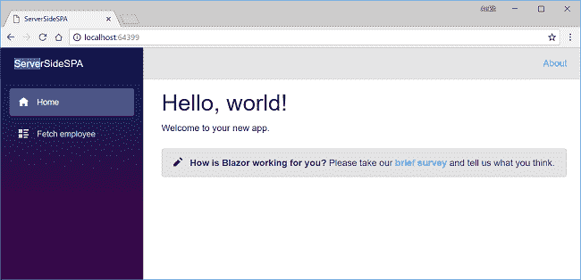

单击“员工数据”链接将重定向到 Employee data 视图。在这里，您可以看到页面上的所有员工数据。请注意，URL 后面附加了“/fetchemployee”。

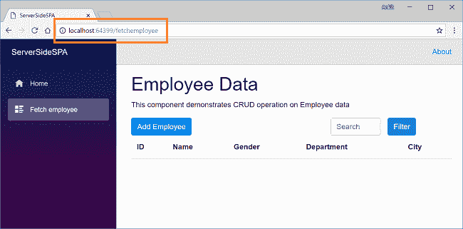

点击*添加员工*按钮，打开“添加员工”模式弹出窗口。在所有字段中输入数据，然后单击 Save 创建新的员工记录。

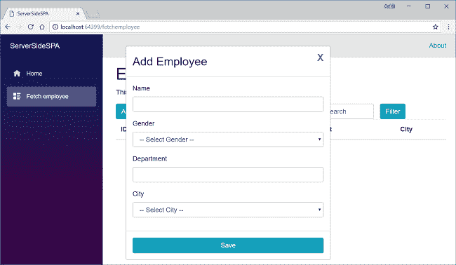

这将创建一个新的雇员记录，并在视图表中显示数据。再添加几条记录，视图将类似于如下所示:

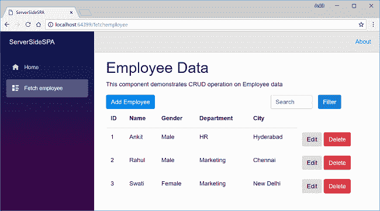

单击 Edit 按钮将打开编辑员工记录的模式弹出窗口。编辑输入字段并单击 save 以更新员工记录。

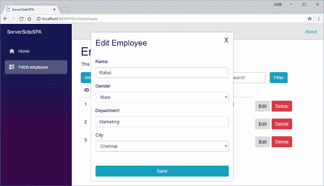

要筛选员工记录，请在搜索框中输入员工姓名，然后单击筛选按钮。搜索文本不区分大小写。筛选操作将返回与搜索字段中输入的姓名相匹配的所有员工记录。请参考下图:

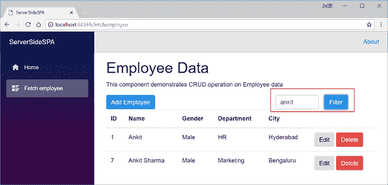

如果您单击与员工记录对应的删除按钮，它将打开一个删除确认弹出窗口，要求确认删除员工记录。

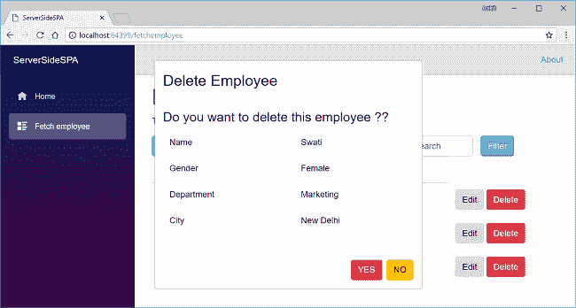

单击“是”将删除员工数据，并通过刷新视图表显示更新的员工列表。

### 结论

我们在 Visual Studio 2017 和 SQL Server 2017 的帮助下，使用 Entity Framework Core DB first 方法创建了一个服务器端 Blazor 应用程序。我们使用了一个模态弹出窗口来通过表单处理用户输入。我们还实现了员工记录的搜索功能。

请从 [GitHub](https://github.com/AnkitSharma-007/Blazor-Server-Side-SPA) 获取源代码，并四处播放，以便更好地理解。

获取我的书 [Blazor 快速入门指南](https://www.amazon.com/Blazor-Quick-Start-Guide-applications/dp/178934414X/ref=sr_1_1?ie=UTF8&qid=1542438251&sr=8-1&keywords=Blazor-Quick-Start-Guide)以了解更多关于 Blazor 的信息。

你可以在这里查看我关于 Blazor 的其他文章。

准备面试？阅读我关于技术面试的 C#编码问题的文章

### 请参见

*   [ASP.NET 核心 Blazor 入门](http://ankitsharmablogs.com/asp-net-core-getting-started-with-blazor/)
*   [ASP.NET 核心—使用 Blazor 的 CRUD 和实体框架核心](http://ankitsharmablogs.com/asp-net-core-crud-using-blazor-and-entity-framework-core/)
*   [使用 EF 核心在 Blazor 中级联 DropDownList](http://ankitsharmablogs.com/cascading-dropdownlist-in-blazor-using-ef-core/)
*   [使用 Blazor 的 Razor 页面创建 SPA](http://ankitsharmablogs.com/creating-a-spa-using-razor-pages-with-blazor/)
*   [在 IIS 上部署 Blazor 应用程序](http://ankitsharmablogs.com/deploying-a-blazor-application-on-iis/)

最初发表于[https://ankitsharmablogs.com/](https://ankitsharmablogs.com/)