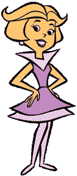
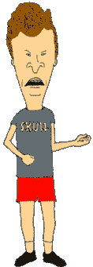
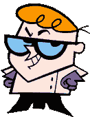
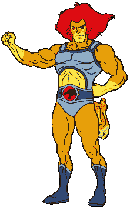
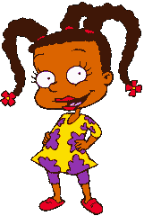

# 你在 web 开发中会遇到的不好的事情

> 原文：<https://www.freecodecamp.org/news/the-bad-toons-you-will-meet-in-web-development-6f316009c273/>

对更多网络开发人员的需求意味着每天都会有新面孔进入我们的行业。像 [freeCodeCamp](https://www.freecodecamp.org/) 这样的优秀资源降低了进入门槛。我对任何新人的希望是，他们在这个领域取得成功，并享受他们所做的工作。

这些新来者将在 web 开发社区中遇到各种各样的人。有些很酷，有些就没那么酷了。我想花一点时间来关注一些糟糕的态度。为什么？如果我们对这些不良态度进行分类，它们会变得更容易识别和纠正。

> 免责声明:事实是，我们都对这些行为中的大部分有罪。我也没有叫出任何特定的个人，你也不应该。事实上，这个轻松的主题的要点是让我们自我反省，笑一笑，然后改进。

#### 摩登原始人

像你公司的许多高级开发人员一样，燧石族从上个世纪就开始开发 web 应用程序。然而，他们利用这种资历成为糟糕的领导者。

摩登原始人在几年前就找到了他们喜欢的技术。他们以此为由拒绝任何新事物。有时，他们甚至会列举他们的资历来结束谈话。

当我的一个同行第一次遇到燧石族时，他真的很困扰。他想成为自己公司的高级开发人员(并且正在粉碎)，但不是燧石族。最后，他给未来的自己写了以下一封信，以此来记住如何与新开发人员互动:

> “不要扼杀某人的热情或想法。欣赏工作，判断他们是否理解问题，然后再假设他们不理解。让他们提出自己的观点，并保持开放的心态，也许你以前没有想过这个问题。如果这是你所期望的，温和一点，提供指导或跟进。”

#### 杰特森号

一个来自未来的杰特森……或者使用 Twitter 保持对网络发展趋势的了解。他们喜欢在 alpha 版本中尝试热门的新 JavaScript 包。

Jetson 的缺点是他们不会花时间去权衡新技术的利弊。他们也不考虑为什么解决方案以前没有做过。也许新技术真的是一个新想法，但也可能是人们在过去发现了它的问题。

#### 平头

烟屁股喜欢呆在 Twitter 和 web dev subreddits 上，就像杰特森一样。问题是他们不在那里寻找新的东西去尝试。相反，烟屁股从同龄人那里寻求神秘的网络积分(支持票、爱心和喜欢)。这意味着他们会说任何话来得到这些分数。

对于网络开发者的在线社区来说，这些角色可能是最糟糕的。他们没有正确评估分享的信息就发布帖子。仅仅因为你对 web 开发社区中的一些事情持否定态度，并不意味着**而不是**会让你成为一个笨蛋。烟屁股是那些不顾上下文而快速评论的人。

#### 丽莎

Lisa 是一个有才华的开发人员，有太多的课外活动。她花很多时间在副业项目、会议会谈、博客文章*(咳，咳)*。这导致 Lisa 忽略了她在实际团队工作中的份额。她的团队支持她所做的一切。他们只是希望她能被整个团队的目标所接受。

#### 德克斯特

德克斯特超级聪明，但在他的实验室里独自工作。他从不为别人写文档。没有有用的 README 文件来帮助入门，也没有内嵌注释来解释他的代码。这个项目的新成员与 Dexter 的斗争最激烈，不管是什么级别的经验。

#### 泡泡糖公主

这是我最喜欢的一个，因为我在企业界已经听过无数次了。泡泡糖公主喜欢她的王国(团队)依赖于她。她从来不像 Dexter 那样写文档，而是故意的。她的首要目标是确保工作的安全性和重要性。泡泡糖公主为别人不知道的项目选择晦涩的技术。她也不擅长努力培训同事。

#### 雷猫

对雷猫来说一切都是战斗。他们的技术需要让其他技术显得过时。雷猫相信他们的技术或做事方式是唯一的方法。如果队友用不同的方式编写 CSS 类名，这对雷猫来说也是一个悲剧。

一只雷猫被卷入了一场精彩的战斗中。关于如何在团队和行业内做事的民间辩论是健康的。退一步考虑辩论中什么是重要的也是健康的。

#### 鲁格拉特

一只老鼠患有冒名顶替综合症，害怕得不敢寻求帮助。他们容易忘记的是，其他人也在挣扎。毕竟，web 开发是一个包含许多主题的巨大领域。你永远不会成为所有网页开发的专家！Rugrats 通常与新的 web 开发人员联系在一起，但实际上可以是任何人。

#### 蓝精灵

蓝精灵只和他们行业中的其他蓝精灵一起出去玩，并鼓舞他们。“光明蓝精灵”只与使用相似技术或持有相同观点的蓝精灵互动并帮助他们。

最危险的蓝精灵只关注相同性别、种族和其他歧视性价值观的蓝精灵。这很糟糕，因为 web 开发从一个[多样化和授权的社区](https://www.ibm.com/design/thinking/page/framework/principles/diverse-empowered-teams)中获得了最具创新性的想法。如果我们不积极争取少数族裔的代表权，我们的行业将会停滞不前。

### 结论

这些卡通带来了不好的回忆吗？你对这些角色有共鸣吗？你认为还有其他需要承认的不良行为吗？请在评论中分享它们，或者发微博给我，地址是 [@seejamescode](https://twitter.com/seejamescode) ！