# 设计师来自土星，开发者来自木星:或者说，为什么交流很重要

> 原文：<https://www.freecodecamp.org/news/designers-are-from-saturn-developers-are-from-jupiter-or-why-communication-matters-7d91794e5a37/>

由阿尔比诺托尼娜

# 设计师来自土星，开发者来自木星:或者说，为什么交流很重要

#### 关于'但它看起来不同的规格'的影响，用户界面工具包，和其他东西。

两个不同的星球，但至少它们在同一个太阳系里！与行星的类比到此结束。

#### 过敏建议

这是一篇关于[设计系统](https://www.uxpin.com/studio/blog/design-systems-vs-pattern-libraries-vs-style-guides-whats-difference/)的文章，特别是关于 UI 工具包和设计师与开发者之间交流的动态的主题。

**设计师**，一些事情告诉我你了解设计系统，你可能会挖掘它们:)如果你想了解更多，内森·柯蒂斯写了很多关于它的东西。我非常喜欢和尊重他在设计系统上的[工作](https://medium.com/eightshapes-llc/tagged/design-systems)。

**开发者**，最后我要展示一些代码。操场是一个 React + CSS-in-JS 库(比如 emotion 或者 styled-components)的 app。

### 一种典型的场景

我们的设计师制作了一系列精美的设计，包括我们的*文档*页面的布局:

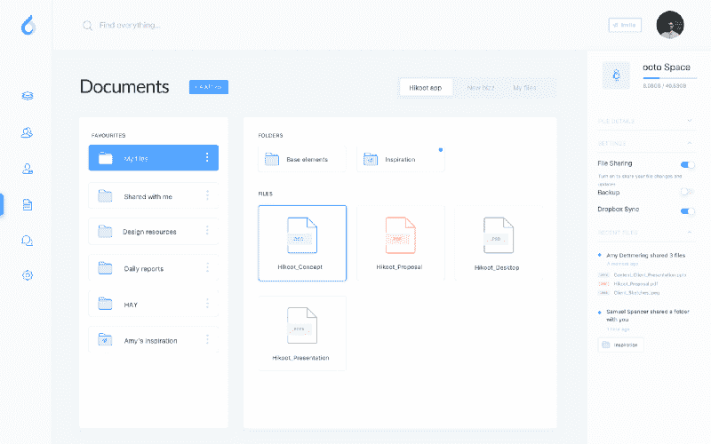

[https://www.sketchappsources.com/free-source/2576-ooto-productivity-dashboards-sketch-freebie-resource.html](https://www.sketchappsources.com/free-source/2576-ooto-productivity-dashboards-sketch-freebie-resource.html)

很干净，很平衡，有点赏心悦目。对于设计师来说，这是一个漫长过程的高潮，包括研究、采访、思考、回顾、反思、白板、原型和线框图等一系列任务。这是一个开发人员通常不会经历的漫长而乏味的过程。

设计师们是如何制作出这幅图像的呢？他们可能使用了一个设计工具包。一个很流行的是[小品](https://www.sketchapp.com/)。

唉，这个软件的工作方式与开发人员的工作方式截然相反。**我说这就是我们问题的关键**。

设计师需要能够让他们快速重复的工具，回顾和更新，一个接一个的反馈，一个接一个的利益相关者会议。设计师需要像素描这样的工具。

#### 另一方面，开发人员的工作方式不同。

他们在不断变化的代码库上工作，这些代码库在任何时候都必须产生一个应用程序的工作版本。实现像我们例子中这样的布局需要付出努力，包括设计、抽象、实现、重构、测试、审查、重构、错误修复、重构。开发人员需要确保他们不会破坏其他任何东西或者用**坏的、重复的代码**污染代码库。

对我来说，做一名设计师更像是来回跳跃，而开发人员工作在一个连续的开发循环中。

#### 可视化规范文件

现在是设计师和开发者交流的时候了，*交出接力棒。*

有布局、空间和颜色(等等)需要记录。Sketch 或者其他任何工具都不太了解你当前的代码库，你的文件结构，或者你的抽象，那么 Sketch 能做什么呢？衡量事物。这就是将要产生的结果:

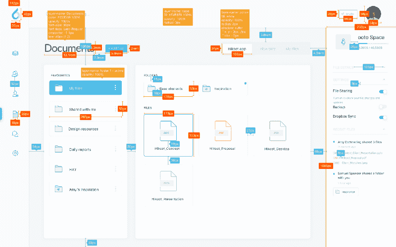

### 几天过去了…

东西都准备好了，设计师们第一眼就看到了:

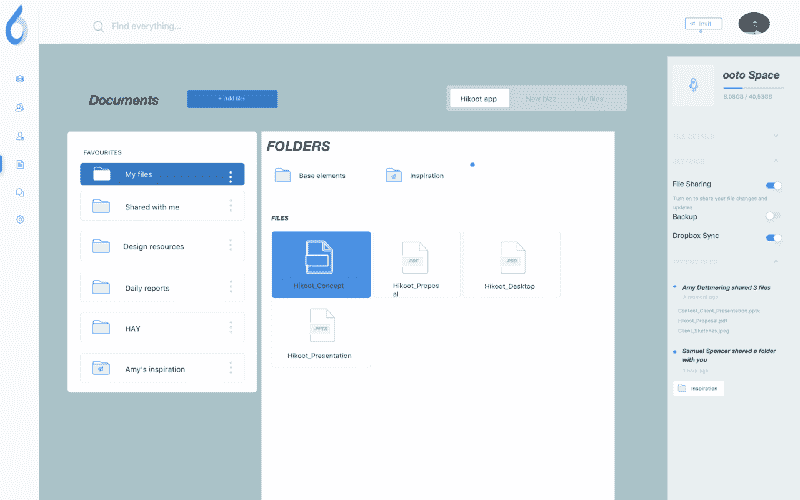

### 沮丧的设计师，沮丧的开发者。

那才是结界真正被打破的时刻。**规格文件**。颜色、间距、排版、布局、沟通错误的细节、缺失行为等小问题。

开发人员将不得不在代码库中动态地解释规范并使之适应他们自己的系统，而他们只需要担心新特性的业务逻辑的实现。不过，这不怪设计师——他们可能只是不知道这样一个系统。

我爷爷常说:

> 当设计人员和开发人员没有很好的沟通时，获得一个有很好的共享和沟通的工具、抽象和约束集的设计系统。

### 你需要一个好的 UI 工具包

通过一个共享的系统，设计师和开发人员可以真正无压力地有效沟通。UI 工具包旨在**强化**设计系统中记录的原则。它由一套**高度共享和记录的**约定、UI 模式、行为来管理，并且由每个人来设计、测试和达成一致。这是设计师和开发人员共同努力的地方。

#### 为什么你真的需要一个好的 UI 工具包

*   你的应用程序越来越复杂了吗？
*   设计师们对应用程序中的不一致性谈论了很多吗？
*   CI/CD？走得快快快？
*   远程团队？
*   那些 CSS 文件变得有点乱？
*   开始在意 app 的大小了？
*   用户体验是你商业模式的核心吗？

您不需要勾选所有这些—甚至一个可能就足够了:)

#### 为什么您需要自己的 UI 工具包

一个设计系统是关于语言的。视觉语言、UI 设计语言等。**定义自己的**需要很大的努力:产品、设计、工程，所有这些部门都会大量参与。

很多时候那只是**不可行的选择**。有很多令人惊叹的框架，[语义界面](https://react.semantic-ui.com/)，[蚂蚁设计](https://ant.design/)，[引导](https://getbootstrap.com/docs/4.1/getting-started/introduction/)，[材质界面](https://material-ui.com/)。它们都带有一种预制的语言和一个久经考验的用户界面工具包。

**军规？在我看来，很快它们就不再适合你了。**你会想躲开他们。**此外，UI 工具包可能设计得很难控制。请记住，那些框架是用来传递无数案例的，可能比您需要的更多。另外，这种**的额外复杂性也是以 kb** 为单位的。**

#### 作为艺术家偷窃

不要采用 UI 工具包。取而代之的是从别人那里复制，我的意思是选择最适合你的部分并从头开始实现它们。现在，高度以用户为中心的公司拥有自己的设计系统是很常见的，而且其中很多都是开源的！

看看这个设计系统列表:[https://adele.uxpin.com](https://adele.uxpin.com/):

*   BBC: [凝胶](http://www.bbc.co.uk/gel)
*   特雷罗:[玉米片](https://design.trello.com/)
*   销售人员:[闪电](https://www.lightningdesignsystem.com/)

还有几十个。最后，设计和交付这个**一起**就是全部的问题。这是关于**为你的领域**打造特定的东西，也是**独特的**和代表你的**品牌的**。这是值得的，你也可以给它一个好听的名字:)

### 让我们做一个

我将向您展示引导您自己的设计系统是多么容易。

> 我要称它为拉里。

让我们取一小部分布局，并尝试从头开始构建:

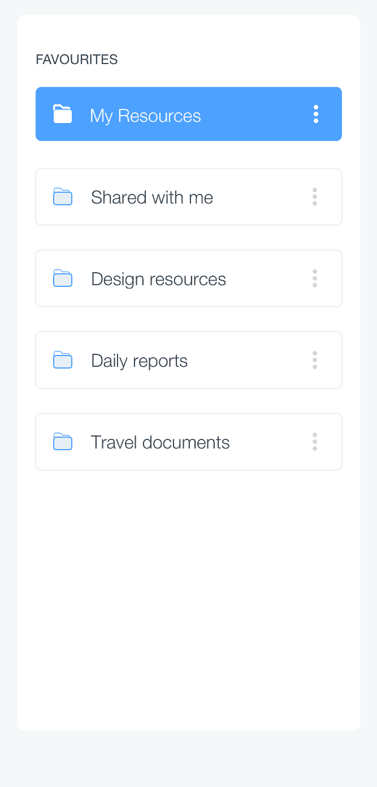

#### 首先是最终结果

下面的 CodeSandbox 是世界上唯一一个实现 **Larry:** 的应用

你可以在**GitHub**:【https://github.com/albinotonnina/larry】T4 上找到**拉里**

#### 文档

这一点最重要。谁负责这个，可能是设计师？嗯，通常是这样，但是相信我:你们两个应该平等地参与记录你们的语言。你们俩应该在这里的所有事情上都达成一致。

让我们开始定义一些非常基本的约定:

#### 颜色；色彩；色调

让我们为我们的布局生成一个调色板。

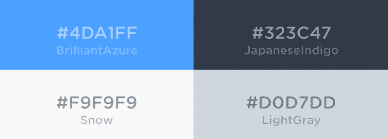

我建议你用这些颜色定义一系列语义名称，就像这样:

**header text**= Japanese indigo
**paragraph text**= Japanese indigo
**element background default**= Snow
**element background hover**= brilliant azure
**element button**= light gray—alpha 60%

当 **指定**(这是一个单词)时，你们都要使用这些名字**。**

#### 间隔

**格外注意间距。没有明确的空间策略，事情会变得很糟糕。**

定义并同意间距系统，例如:

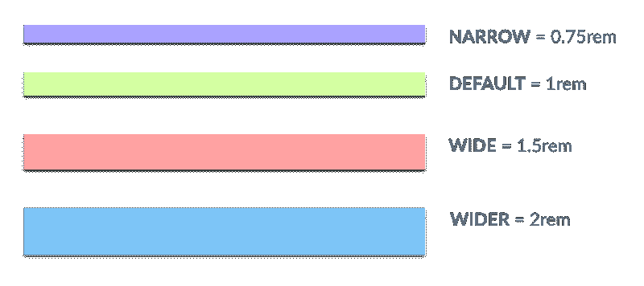

**一个规格文件应该是这样的:**

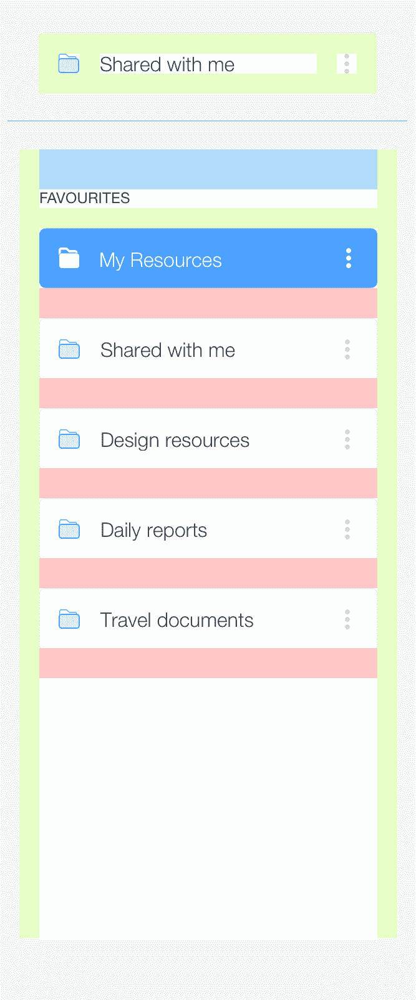

#### 排印

确保标题、段落中的字体大小、字体粗细、行高、边距、颜色等完全匹配。用你喜欢的名字称呼他们，比如 HeaderHuge，HeaderLarge，HeaderTiny 或者适当的使用语义标签(h1，h2，h3)。只要**确保你在这个**上是一致的。

#### 模式

什么和 UI Toolkit 押韵？**图案库**！您需要开始填充您的模式库。您想要的是让您需要的组件按照您同意的方式运行，这样您就可以随时按照您想要的方式组合它们。

从**粒子**和**基本体**开始，这样一个盒子组件，用于当你必须在别的东西周围设置间隔和边界的时候。

添加**更专业的新粒子**，比如一个文本组件或者一个 flex 组件，你可以把它想象成一个盒子组件+一些 Flex 工具。

将它们视为孤立存在的粒子，不知道它们将被使用的环境以及它们周围应该存在的空间。

继续更复杂的 UI 组件，其他最小组件的组合，等等。

这里重要的不是技术或者文档中的抽象类型。重要的是你们一起做这个**。**

**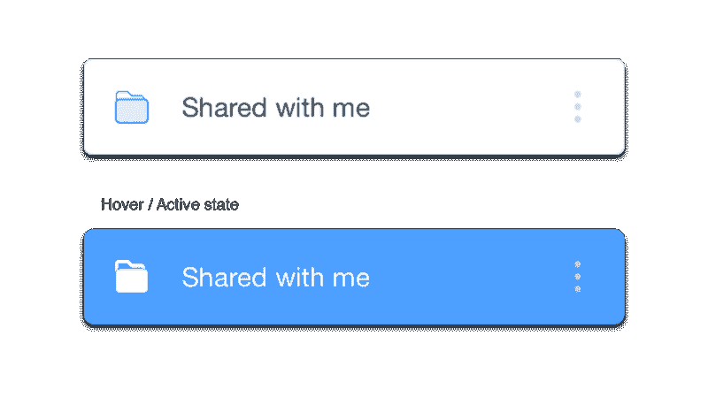

Example of a more complex UI Component** 

#### **你明白要点了吗？**

**你已经定义了常数，还需要制造一些粒子。**

**你将重复这些粒子，并很快扩展库，所以拥抱并准备好弹性。开发人员，你不希望设计师在开始实现代码之前*完成*记录整个系统。**你们必须一起做这件事，否则它不会起飞。****

**所以，设计师和开发者们，紧随文章**之后，如果你们还没有拉里**的话，就去做吧！**

### **密码**

**你有一个拉里的副本，你可以克隆并玩它。您的 Larry 可能不同，或者您可能使用不同的框架，因此我将介绍这种方法的关键点。**

#### **主题，定义常量**

**这是一个包含主题常量的对象，所以空间定义、颜色、字体、排版、断点等等。这是拉里的主题，这是它的一个样本版本:**

**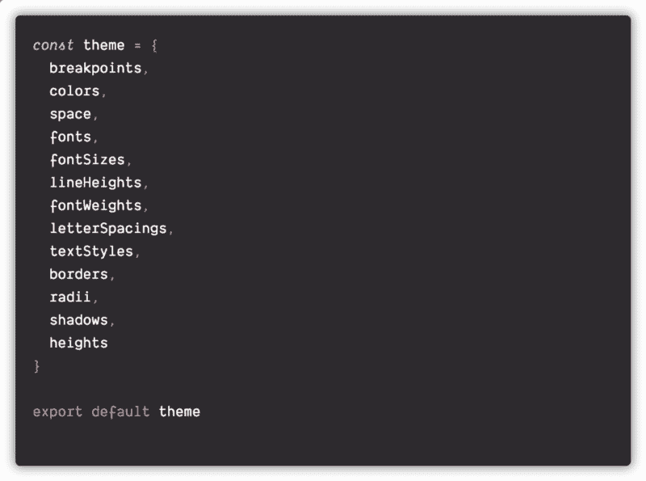**

**这里您可以实现的复杂性/完整性没有限制，毕竟这是一个生成 JavaScript 对象的问题，想象一下您可以做什么！**

**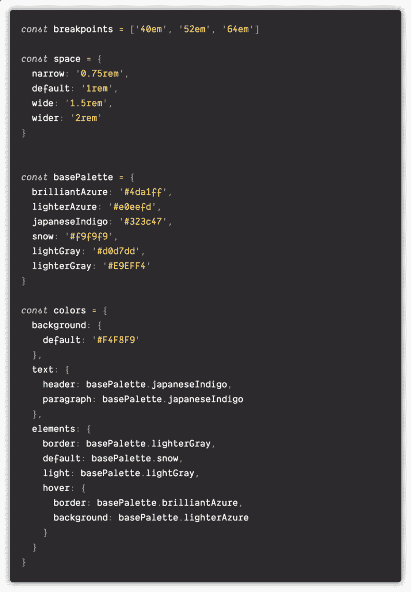**

**这是一个核心文件。每个颜色、边距或填充、字体大小或字体粗细或断点都必须来自这里，并且只能来自这里。**

**CSS-in_JS 库是令人惊奇的工具，而[风格系统](https://github.com/jxnblk/styled-system)使它们变得更好。这是一组设计系统的实用程序，由将`props`作为参数并返回样式对象的函数组成，同时使使用主题中的值和跨断点应用样式变得更简单。**

**这种方法利用了这些实用程序，因此可以随意对其进行评估。**

#### **将主题插入您的应用程序**

**将这些常量提供给你的应用程序:应用程序中的每个组件都可以访问我们的主题常量。**

**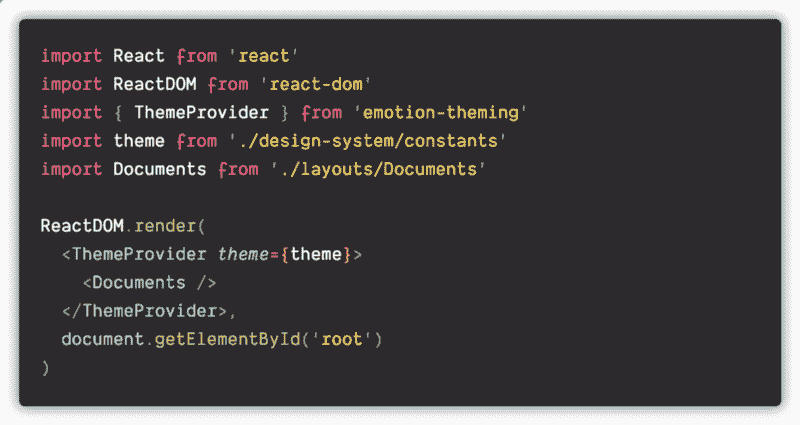**

#### **创建基本的 UI 组件**

**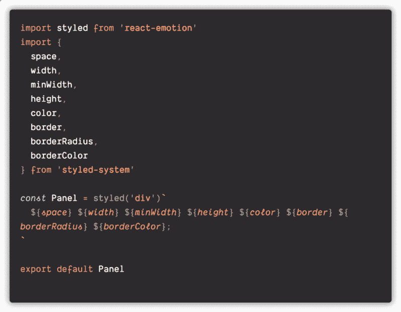

a primitive Box UI Component** 

#### **更专门化的 ui 组件**

**这是一个 Flex 组件。**

**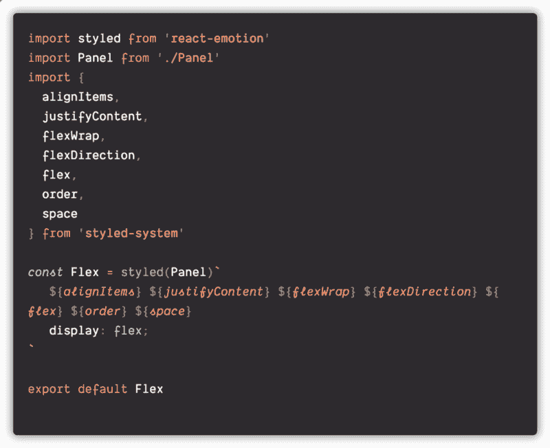**

#### **在您的功能文件中实现 UI 组件**

**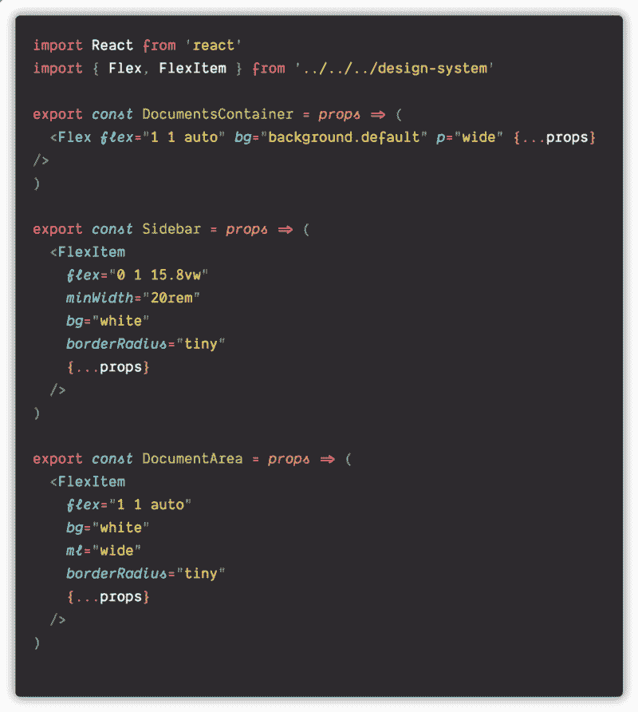**

#### **渲染某物的时间到了**

**这是实现 UI 组件和业务逻辑的地方。**

**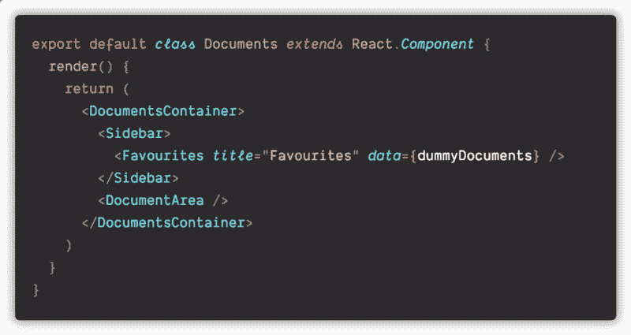**

### **文件结构**

**这是拉里的文件结构。我对文件结构没有强烈的意见，实际上我相信一些不同的东西:移动你的文件直到你对它们感到舒服。**

**拉里都在一个“**设计-系统”**文件夹里。在这里您可以找到它的常量、通用的和可重用的 UI 组件。**

**还要注意文档布局文件夹中的 UI 文件夹——这是我定义和导出特定于我们特性的 UI 组件的地方。**

**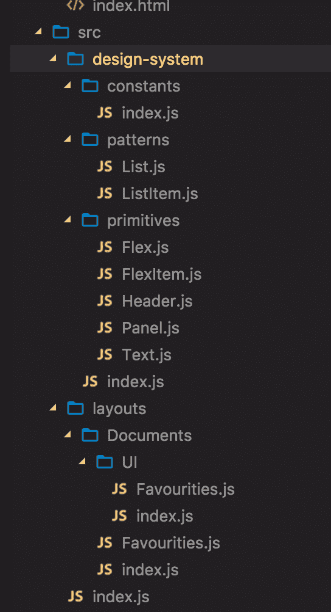**

### **结论**

**对于大型复杂的应用程序，保持 UI 的一致性和内聚性从来都不是一件容易的事情。设计系统有帮助。定制的设计系统和定制的 UI 工具包真的很有帮助。**

**设计师和开发人员可能对同一个问题有非常不同的方法，但这并不意味着他们不能有效地沟通。**

**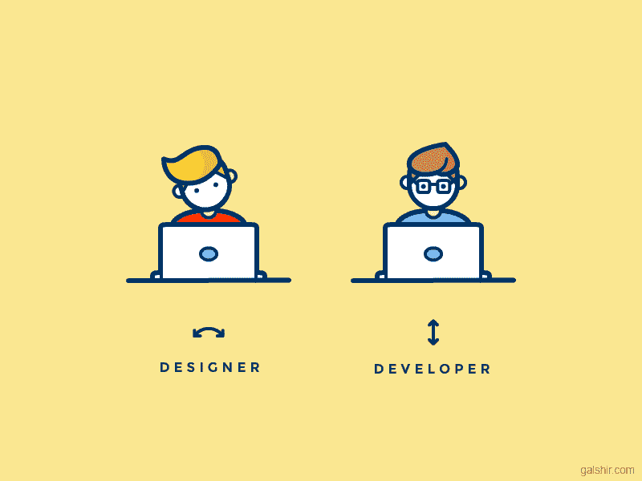

[https://dribbble.com/shots/2712522-Designer-vs-Developer](https://dribbble.com/shots/2712522-Designer-vs-Developer)** 

### **感谢您的阅读**

**你有积极的经验可以分享吗？请在评论中这样做。**

**你好，我叫阿尔比诺·汤妮娜，我是一名在伦敦工作的软件工程师，你可以在 [Twitter](https://twitter.com/albinotonnina) 或 [Github](https://github.com/albinotonnina) 或 [Instagram](https://www.instagram.com/albino_tonnina/) 或城市周围找到我。**

****

#### **我最新的文章**

**如何在 10 分钟内丢掉一份 IT 工作
[说到网页布局……介绍一下魔法帽技术？✨](https://medium.com/@albinotonnina/magic-hat-technique-408a3fa590bb)**

**在推特上关注我！**