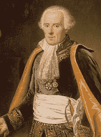
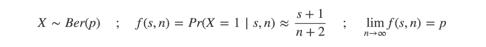
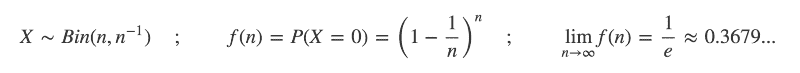
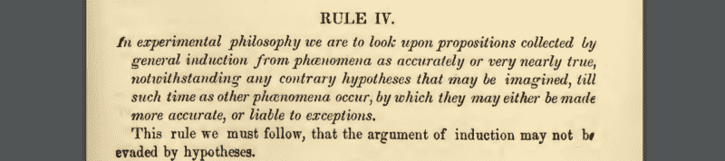
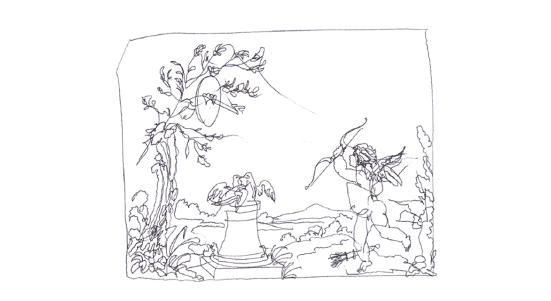

# 明天太阳会升起吗？

> 原文：<https://www.freecodecamp.org/news/will-the-sun-rise-tomorrow-255afc810682/>

#### 拉普拉斯、贝叶斯和当今的机器学习

这可能不是你担心的问题。毕竟，这似乎每天都会发生。

但是明天太阳升起的概率是多少呢？

信不信由你，这个问题是数学史上最伟大的人物之一[皮埃尔·西蒙·拉普拉斯](http://scienceworld.wolfram.com/biography/Laplace.html)在他 1814 年的开创性著作*[Essai philosophique sur les probabilityés](https://ia801407.us.archive.org/35/items/essaiphilosophiq00lapluoft/essaiphilosophiq00lapluoft_bw.pdf)中考虑过的。*

*从根本上说，拉普拉斯对这个问题的处理是为了说明一个更一般的概念。这并不是一个严肃的尝试去估计太阳是否真的会升起。*

*在他的文章中，拉普拉斯描述了一个概率推理的框架，今天我们认为这就是贝叶斯。*

*贝叶斯方法是许多现代机器学习算法的基石。但是使用这些方法所需的计算能力直到 20 世纪下半叶才出现。*

*(到目前为止，似乎目前最先进的人工智能在明天的日出这个问题上保持沉默。)*

*尽管拉普拉斯的思想是在两个多世纪前发展起来的，但今天仍然适用。本文将回顾其中的一些观点，并展示它们在现代应用中的应用，也许是拉普拉斯的同时代人所设想的。*

#### *皮埃尔·西蒙·拉普拉斯*

*1749 年，皮埃尔·西蒙·拉普拉斯出生在博蒙特-昂-奥格的小诺曼底公社，最初被认定为神学家。*

*然而，在卡昂大学学习期间，他发现了自己在数学方面的非凡才能。他转到了巴黎，在那里他给伟大的数学家和物理学家让·勒朗德·达朗贝尔留下了深刻的印象。*

*24 岁时，拉普拉斯被选入著名的科学院。*

**

*拉普拉斯是一位惊人多产的科学家和数学家。在他的众多贡献中，他在概率、行星运动和数学物理方面的工作最为突出。他将安托万·拉瓦锡、让·达朗贝尔、西蒙·泊松，甚至拿破仑·波拿巴等人物视为合作者、顾问和学生。*

*拉普拉斯的《哲学随笔》基于他在 1795 年的一次演讲。它概述了他两年前于 1812 年出版的著作《概率分析理论》中所包含的思想。*

*在《哲学随笔》中，拉普拉斯提出了概率的十个原则。前几个包括基本的定义，以及如何计算独立和相关事件的概率。*

*原则八、九和十涉及概率在我们今天称为成本收益分析中的应用。*

*第六个是[托马斯·贝叶斯 1763 年的同名定理](http://mathworld.wolfram.com/BayesTheorem.html)的重要推广。*

*它指出，对于一个给定的事件，每个可能原因的可能性是通过将该原因的先验概率乘以一个分数得到的。*

*这个分数是由特定原因引起的事件的概率除以由任何原因引起的事件发生的概率。*

*

Probability of A-given-B equals probability of A times probability of B-given-A, divided by probability of B* 

*这个定理在机器学习中的影响不能被夸大。*

*第七条原则是自发表以来引起最大争议的一条。然而，实际的措辞是无伤大雅的。*

*更确切地说，是拉普拉斯选择了通过例证的方式来讨论第二天太阳升起的概率，这反过来在接下来的两个世纪里引起了嘲笑和反对。*

*继承规则今天仍然以各种形式使用，有时是以拉普拉斯最初描述的形式。*

*事实上，继承规则代表了将贝叶斯思维应用于系统的重要的早期步骤，对于这些系统，我们只有非常有限的数据和很少或没有先验知识。这是现代机器学习问题中经常面临的一个起点。*

#### *拉普拉斯继承法则*

*拉普拉斯《Essai philosophique》*中给出的概率第七原理，本质上是直截了当的。**

**它指出，给定事件发生的概率是通过将每个潜在原因的概率乘以导致该事件发生的原因的概率相加得到的。**

**拉普拉斯然后继续概述了一个基于从瓮中抽取球的例子。到目前为止，一切顺利。还没有争议。**

**然而，他随后描述了在我们对事件发生的概率的先验知识有限(或者实际上没有)的情况下，如何继续估计事件发生的概率。**

> **"因此，一个事件连续发生了若干次，下一次发生的概率等于增加的单位数除以同样增加的两个单位数。"**

**翻译成英语就是:“因此，人们发现，对于一个到目前为止已经发生过多次的事件，它下次再次发生的概率等于这个数加 1，除以这个数加 2”。**

**或者，用数学符号表示:**

****

**也就是说，给定 *n* 次试验中的*次*次成功，下一次试验成功的概率大约是(s+1)/(n+2)。**

**为了证明他的观点，拉普拉斯毫不犹豫地说:**

> **“……例如，把历史上最古老的时代追溯到五千年前，即 1，826，213 天，而太阳在此期间不断升起，在二十四小时前的每一场革命中，1，826，214 个小时前，打赌明天还会升起。”**

**也就是说:“……例如，假设太阳在过去的 5000 年里每天都在升起，也就是 1826213 天，那么它明天升起的概率是 1826214/1826215”。**

**99.9%，这是一个非常确定的赌注。太阳每天都在升起，这一点变得更加确定。**

**然而拉普拉斯承认，对于理解太阳升起的机制并且看不到太阳停止运行的理由的人来说，即使这种概率也低得不合理。**

**事实证明，这种资格或许和实际的规则本身一样重要。毕竟，它暗示了这样一个事实:我们对一个系统的先验知识被编码在我们为其每一个潜在结果分配概率时所做的假设中。**

**这在今天的机器学习中是正确的，尤其是当我们试图从有限或不完整的训练数据中学习时。**

**但是拉普拉斯继承规则背后的基本原理是什么，它是如何在一些当今最流行的机器学习算法中存在的？**

#### **没有什么是不可能的？**

**为了更好地理解拉普拉斯规则的意义，我们需要考虑对一个系统只有很少的先验知识意味着什么。**

**假设你有一个拉普拉斯的骨灰盒，你知道里面至少有一个红球。你对骨灰盒“系统”的内容一无所知。也许它包含许多不同的颜色，也许它只包含那一个红色的球。**

**从瓮中抽出一个球。你知道它是红色的概率大于零，或者小于等于一。**

**但是，由于你不知道骨灰盒是否包含其他颜色，你不能说画红色的概率肯定等于 1。你不能排除任何其他可能性。**

**那么，如何估计从骨灰盒中抽出红球的概率呢？**

**嗯，根据拉普拉斯连续法则，你可以将从瓮中抽取一个球建模为一个伯努利试验，有两种可能的结果:“红色”和“非红色”。**

**在我们从瓮中提取任何东西之前，我们已经考虑到了两种可能的结果。在这样做的时候，我们有效地从瓮中“伪计数”了两次想象中的抽取，观察了一次每个结果。**

**这使得每个结果(“红色”和“非红色”)的概率为 1/2。**

**随着从骨灰盒中抽取的次数增加，这些伪计数的影响变得越来越不重要。如果抽中的第一个球是红色的，你将下一个球是红色的概率更新为(1+1)/(1+2) = 2/3。**

**如果下一个球是红色的，概率更新为 3/4。如果你一直画红色，概率会越来越接近 1。**

**用今天的语言来说，概率涉及一个[样本空间](http://mathworld.wolfram.com/SampleSpace.html)。这是给定“实验”(选择一个结果的过程)的所有可能结果的数学集合。**

**20 世纪 30 年代，安德雷·柯尔莫哥洛夫将概率置于正式的公理基础之上。 [Kolmogorov 的公理](https://www.le.ac.uk/users/dsgp1/COURSES/LEISTATS/Lecture2.pdf)很容易证明一个样本空间必须包含至少一个元素。**

**Kolmogorov 还将[概率定义为一个度量值](https://en.wikipedia.org/wiki/Probability_measure),它为样本空间的所有元素返回一个介于 0 和 1 之间的实数值。**

**自然地，概率是对真实世界系统建模的一种有用的方法，尤其是当您假设对样本空间的内容有完整的了解时。**

**但是当我们不理解手头的系统时，我们就不知道样本空间——除此之外，它必须包含至少一个元素。这是许多机器学习环境中的常见起点。我们必须一边走一边学习样本空间的内容。**

**因此，我们应该允许样本空间包含至少一个额外的、无所不包的元素——或者，如果你愿意，可以称之为“未知的未知”。拉普拉斯的连续法则告诉我们，在对已知事件进行 n 次重复观测后，给“未知的未知”赋予 1/n *+* 2 的概率。**

**虽然在许多情况下，忽略未知的可能性是很方便的，但总是允许这种可能性存在是有认识论依据的。**

**其中一个论点被称为克伦威尔法则，由已故的丹尼斯·林德利创造。引用 17 世纪的[奥利弗·克伦威尔](https://www.historic-uk.com/HistoryUK/HistoryofEngland/Oliver-Cromwell/):**

> **"我以基督的名义恳求你，想想你可能弄错了"**

**这句颇具戏剧性的话要求我们允许意外发生的可能性微乎其微。用贝叶斯概率的语言来说，这相当于要求我们总是考虑非零的先验。**

**因为如果你的先验概率设定为零，那么再多的证据也无法说服你。毕竟，即使是最有力的反证，当乘以零时，后验概率仍然是零。**

#### **反对，拉普拉斯的辩护**

**拉普拉斯的日出例子招致了他同时代人的许多批评，这并不奇怪。**

**人们反对拉普拉斯假设的明显的简单性——甚至是天真。有 1/1，826，215 的概率第二天太阳不会升起的想法似乎很荒谬。**

**人们很容易相信，鉴于大量的试验，非零概率事件一定会发生。因此，观察这么多连续的日出而没有一次失败肯定意味着拉普拉斯的估计是高估了？**

**例如，你可能期望在一百万次试验后，你会观察到百万分之一的事件——根据定义几乎可以保证！不这样做的概率有多大？**

**嗯，如果你掷两次硬币都没有正面着地，你不会感到惊讶。如果你掷骰子六次，但从未看到数字 6，这也不会引起关注。这些事件的概率分别为 1/2 和 1/6，但这绝对不能保证它们会在前两次和前六次试验中发生。**

**早在 17 世纪，伯努利的一个[结果发现了极限，因为概率 1/n 和试验次数 n*变得非常大:*](https://en.wikipedia.org/wiki/E_(mathematical_constant)#Bernoulli_trials)**

****

**虽然平均来说，在 n 次尝试后，你至少会观察到一个概率为 1/n 的事件发生，但仍有超过 1/3 的可能性你不会观察到。**

**同样，如果太阳没有升起的真实概率确实是 1/1，826，215，那么我们也许不应该对历史上从未记录过这样的事件感到惊讶。**

**而且，可以说，拉普拉斯的资格太优厚了。**

**的确，对于一个声称理解了太阳每天升起的机制的人来说，他不能理解的概率肯定接近于零。**

**然而，要理解这样一种机制，除了我们已经观察到的以外，还需要我们对这个系统有先验知识。这是因为这种机制被隐含地假定为常数——换句话说，在任何时候都成立。**

**从某种意义上说，这个假设让我们在我们实际观察到的基础上“想象”出无限数量的观察结果。这是艾萨克·牛顿在他著名的《自然哲学的数学原理》第三本书的开头提出的假设。**

**牛顿概述了四条“哲学中的推理规则”。第四条规则声称，我们可以把从以前的观察中得出的命题视为“非常接近真实”，直到被未来的观察所反驳。**

**

“In experimental philosophy we are to look upon propositions collected by general induction from phenomena as accurately or very nearly true”** 

**这一假设对科学革命至关重要，尽管对大卫·休谟等哲学家来说是当头一棒，因为他以论证归纳问题而闻名。**

**正是这种认识论上的妥协让我们进行有用的科学研究，进而发明技术。沿着这条线的某个地方，当我们看到太阳无法升起的估计概率越来越接近于零时，我们允许自己“向下舍入”并声称完全成熟的科学真理。**

**但是，所有这些大概都超出了拉普拉斯最初试图阐明的观点的范围。**

**事实上，他选择日出的例子是不幸的。当应用于完全未知的“黑箱”系统时，继承规则真正发挥了它的作用，对于这些系统，我们没有(或很少)观测值。**

**这是因为继承规则提供了一个无信息先验的早期例子。**

#### **如何尽可能少的假设**

**贝叶斯概率是现代机器学习中的一个重要概念。诸如[朴素贝叶斯分类](http://scikit-learn.org/stable/modules/naive_bayes.html)、[期望最大化](https://en.wikipedia.org/wiki/Expectation%E2%80%93maximization_algorithm)、[变分推理](http://www.orchid.ac.uk/eprints/40/1/fox_vbtut.pdf)和[马尔可夫链蒙特卡罗](https://en.wikipedia.org/wiki/Markov_chain_Monte_Carlo)等算法是当今最常用的算法。**

**贝叶斯概率通常是指[对概率](https://plato.stanford.edu/entries/probability-interpret/)的一种解释，其中你根据新的证据更新你的(通常是主观的)信念。**

**两个关键概念是先验概率和后验概率。**

**后验概率是我们在面对新证据时更新我们的信念后得出的结果。**

**先验概率(或“先验”)是我们在看到新证据之前认为正确的概率。**

**数据科学家感兴趣的是，在完全没有任何先验知识的情况下，我们如何为事件分配先验概率。这是机器学习和预测分析中许多问题的典型起点。**

**先验可以提供信息，从某种意义上说，它们伴随着关于不同事件发生概率的“观点”。这些“观点”可强可弱，通常基于过去的观察或其他合理的假设。在我们希望快速训练我们的机器学习模型的情况下，这些是非常宝贵的。**

**然而，前科也可能不具信息性。这意味着他们尽可能少地假设某一事件各自的概率。这些在我们希望我们的机器学习模型从空白状态学习的情况下是有用的。**

**所以我们必须问:你如何衡量一个先验概率分布的“信息量”有多大？**

**[信息论](http://web.mit.edu/6.933/www/Fall2001/Shannon2.pdf)提供了答案。这是数学的一个分支，研究如何测量和交流信息。**

**信息可以从确定性或缺乏确定性的角度来考虑。**

**毕竟，在日常生活中，你对某个事件了解得越多，对其结果就越有把握。信息越少就越不确定。这意味着信息论和概率论有着千丝万缕的联系。**

**[信息熵](http://mathworld.wolfram.com/Entropy.html)是信息论中的一个基本概念。它作为给定[概率分布](http://mathworld.wolfram.com/DistributionFunction.html)固有的不确定性的度量。高熵概率分布的结果更不确定。**

****

**或许凭直觉，你可以推断出一个均匀的概率分布——每个事件发生的可能性相等的分布——具有最大的可能熵。例如，如果你掷一枚公平的硬币和一枚有偏见的硬币，你最不确定的结果是什么？**

**信息熵提供了量化这一点的正式方法，如果你懂一些微积分，[你可以在这里查看证明](https://en.wikipedia.org/wiki/Lagrange_multiplier#Example_3:_Entropy)。**

**所以均匀分布，在一个非常真实的意义上，是信息最少的分布。因为这个原因，它对无知的先验做出了明显的选择。**

**也许你已经发现了拉普拉斯的继承规则如何有效地等同于使用一个统一的先验？通过在我们观察到任何结果之前添加一个成功和一个失败，我们使用一个均匀的概率分布来表示我们对系统的“先验”信念。**

**然后，随着我们观察到越来越多的结果，证据的分量越来越压倒先验。**

#### **案例研究:朴素贝叶斯分类**

**今天，拉普拉斯继承规则被推广到加法平滑和伪计数。**

**这些技术允许我们对训练数据中没有观察到的事件使用非零概率。这是机器学习算法在面对以前从未见过的输入时能够进行归纳的重要部分。**

**例如，以朴素贝叶斯分类为例。**

**这是一个简单而有效的算法，可以使用贝叶斯定理对文本和其他适当的标记化数据进行分类。**

**该算法在预先分类的数据语料库上训练，其中每个文档由一组单词或“特征”组成。给定某个类别，该算法首先估计每个特征的概率。**

**使用贝叶斯定理(以及一些关于特征独立性的非常天真的假设)，该算法可以在给定以前未见过的文档中观察到的特征的情况下，近似每一类的相对概率。**

**

The best estimate is the class, k, which maximizes the likelihood of observing the individual features, x, within a given document** 

**朴素贝叶斯分类中的一个重要步骤是估计在给定类中观察到某个特征的概率。这可以通过计算在训练数据中该类的每个记录中观察到该特征的频率来实现。**

**例如，单词“Python”可能出现在所有归类为“编程”的文档中的 12%,相比之下，所有归类为“启动”的文档中的 1%。“学习”这个词可能出现在 10%的编程文档和 20%的所有启动文档中。**

**就拿“学 Python”这句话来说吧。**

**使用这些频率，我们发现句子被归类为“编程”的概率等于 0.12 ×0.10 = 0.012，被归类为“启动”的概率为 0.01×0.20 = 0.002。**

**所以“编程”是这两类中可能性较大的。**

**但是，每当我们考虑一个在给定类中从未出现过的特征时，这种基于频率的方法就会遇到麻烦。这意味着它的频率为零。**

**朴素贝叶斯分类要求我们将概率相乘，但是将任何东西乘以零当然总是会得到零。**

**那么，如果一个以前看不见的文档确实包含一个在训练数据的给定类中从未观察到的单词，会发生什么呢？无论文档中每隔一个单词在该类别中出现的频率有多高，该类别都将被认为是不可能的。**

#### **加法平滑**

**一种叫做加法平滑的方法提供了一个解决方案。我们在分子中加入一个小常数，而不是零频率。这防止了看不见的类别/特征组合偏离分类器。**

**当该常数等于 1 时，加法平滑与应用拉普拉斯连续法则相同。**

**与朴素贝叶斯分类一样，加法平滑也用于其他概率机器学习环境中。例子包括语言建模、神经网络和隐马尔可夫模型中的问题。**

**用数学术语来说，加法平滑相当于使用贝塔分布作为[共轭先验](https://en.wikipedia.org/wiki/Conjugate_prior)，用于对二项式和几何分布进行贝叶斯推断。**

**贝塔分布是定义在区间[0，1]上的一族概率分布。它需要两个形状参数，α 和β。拉普拉斯的继承法则对应于设定α = 1，β *=* 1。**

**如上所述，beta(1，1)分布是信息熵最大化的分布。然而，对于一次成功和一次失败的假设不成立的情况，有可供选择的先验。**

**例如，霍尔丹的先验被定义为贝塔(0，0)分布。它适用于我们甚至不确定是否可以考虑二元结果的情况。霍尔丹的先验将无限量的“重量”放在零和一上。**

**Jeffrey 的先验，beta(0.5，0.5)分布，是另一个无信息先验。它具有在重新参数化下保持不变的有用特性。它的推导超出了本文的范围，但是如果你有兴趣，[可以看看这个线程](https://math.stackexchange.com/questions/210607/in-what-sense-is-the-jeffreys-prior-invariant)。**

#### **思想的遗产**

**就我个人而言，我发现概率和统计中的一些最早的想法如何在多年的争论中幸存下来，并且仍然在现代机器学习中得到广泛使用，这很有趣。**

**意识到两个多世纪前发展起来的思想的影响今天仍能感受到，这是非同寻常的。在过去十年左右的时间里，机器学习和数据科学获得了真正的主流动力。但是，在第一台计算机接近实现之前，它们的基础就已经奠定了。**

**这种想法接近知识哲学并非巧合。随着机器变得越来越智能，这变得尤其重要。在什么时候焦点会转移到我们的意识哲学上？**

**最后，拉普拉斯和他同时代的人会如何看待今天的机器学习？很容易让人联想到他们会对已经取得的进展感到震惊。**

**但这可能会损害他们的远见。毕竟，早在 17 世纪，法国哲学家勒内·笛卡尔就写过关于 T2 的机械论哲学。描述一台假想的机器:**

> **“我想让你们考虑一下……我赋予这台机器的所有功能，比如……接收光线、声音、气味、味道……这些思想在记忆中的印记……最后是外在的动作……尽可能地模仿一个真正的男人……把这些功能……看作是他的器官唯一的安排**

**也就是说:“我希望你认为我赋予这台机器的所有功能，比如……光、声音、气味和味道的接收……这些想法在记忆中的印记……以及尽可能完美地模仿真人的外部运动……认为这些功能只受器官的控制，就像钟表的运动受其配重和轮子的控制一样”**

**上面的段落描述了一个假设的机器，它能够对刺激做出反应，并像“真正的人”一样行事。它发表在笛卡尔 1664 年的作品《人类的道路》(traitéde l ' homme)*——比拉普拉斯的《概率哲学随笔》早了整整 150 年。***

***事实上，18 世纪和 19 世纪初，皮埃尔·杰凯-德罗兹和 T2·亨利·梅拉尔代特等发明家建造了令人难以置信的复杂自动机。这些发条机器人可以被“编程”为[写](https://www.youtube.com/watch?v=bY_wfKVjuJM)、[画](https://www.youtube.com/watch?v=LCNQvm61_78)、[演奏音乐](https://www.youtube.com/watch?v=9n0gCi-oQ9s)。***

***

Drawing produced by one of Henri Maillardet’s early 19th Century automata ([video](https://www.youtube.com/watch?v=LCNQvm61_78))*** 

***因此，毫无疑问，拉普拉斯和他同时代的人能够构想出智能机器的概念。他们肯定也注意到了概率领域的进展如何应用于机器智能。***

***就在《哲学随笔》的开头，拉普拉斯写到了一个假想的超级智能，追溯性地命名为“拉普拉斯的恶魔”:***

> ***“一种在某一时刻能够了解所有具有动画性质的力量以及组成这种力量的人各自的情况的智力，如果它足够广泛，能够分析这种数据……对她来说，没有什么是不确定的，未来就像过去一样，将会出现在她眼前。”***

***也就是说:“一种智能，在某一时刻，它知道所有使自然活跃的力量，以及构成自然的各种生物的情况，如果它大到足以将这些数据提交分析……对它来说，没有什么是不确定的，未来和过去一样，会出现在它的眼前”。***

***拉普拉斯的恶魔有可能被实现为笛卡尔的智能机器之一吗？现代情感压倒性地表明不。***

***然而，拉普拉斯在较小规模上设想的前提可能很快就会成为现实，这在很大程度上要归功于他自己在概率领域的开创性工作。***

***与此同时，太阳将(可能)继续升起。***