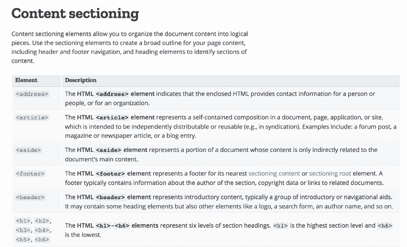
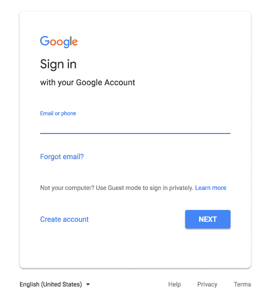
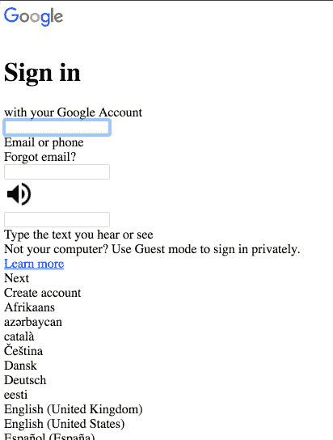

# 如何开始使用网站辅助功能

> 原文：<https://www.freecodecamp.org/news/4-principles-for-getting-started-with-website-accessibility-4e85f75730b/>

当我进入前端开发人员行列时，没有人和我谈论[可访问性](https://benrobertson.io/accessibility)。我不知道拥有一个无法访问的网站会触犯法律，直到有一天，一位大学客户向我的团队寻求帮助，要求进行可访问性审计。男人是我在我的头上。

我开始深入研究，但发现许多文档令人生畏。有些我理解不了。有太多东西需要消化，但我最终还是熬过来了。(好吧，实际上我还在努力)。

从那以后，我明白了可接近性不一定是令人生畏的，甚至可以是有趣的。

一开始对我有帮助的是一些实用的原则，帮助我掌握基本知识。

所以让我与你分享:**本的本土网络无障碍原则。**

它们不是规则。

当我开始开发易访问的网站时，这些是我必须进行的思维转变。

让我们开始吧。

### 原则 1:网页设计不仅仅是平面设计

当我开始我的第一份网络工作时，有人递给我一张网站的图片，并让我把它变成一个网站。

在我这样做之后，设计师们小心翼翼地将我的网站与他们的网站图片进行比较，并告诉我所有我犯的错误。

> *行高应该是 18px，不是 16。*

> 这种灰色是错误的浅灰色。应该是浅浅灰色。

> *框阴影模糊关闭一个像素。*

诸如此类的东西。他们给我留下了深刻的印象，我学到了很多。

但是我们没有人真正考虑到网络不是一个受控的媒介。我们太关注作品的视觉元素，以至于没有考虑该网站在 99 美元的 3G 安卓手机上的表现，或者对于色盲或完全失明的人的表现。

事实上，不同的人可以在不同的情况下访问网页，这使得网页设计比平面设计更重要。

因此，我不再仅仅关注视觉元素，而是将我的工作分成三个主要任务。

#### 网页设计的三项任务

**任务 1:编写好的(阅读:语义)标记**

首要任务是编写好的标记。

这意味着很好地组织页面上的内容。使用 HTML 的方式，它的意思是使用。默认情况下，可以访问 HTML。所以如果我们从一开始就做对了，我们的工作就会容易得多。稍后我们会在这上面多花些时间。

**任务 2:用 CSS 增强标记**

第二个任务是使用 CSS 来增强我们写的优秀的标记。

CSS 应该用来强调你的内容的意义。它应该使它更有意义，更有影响力。但是你必须从使用正确的 HTML 开始，否则你的工作会困难很多。

**任务 3:用 JavaScript 在你的 HTML 和 CSS 上分层交互**

第三个任务是用 JavaScript 在结构和样式上增加交互性。

#### 前后

在采用这种方法之前，我习惯于寻找最容易设计的元素，并使用它。

> 我需要大的文本，所以我用 h1。

> 我有一个复杂的手风琴界面，所以我会使用一堆 div。

诸如此类的东西。但这只关注于视觉方面。为了建立可访问的网站，我们需要考虑的不仅仅是网站与图片的匹配程度。它不仅仅是视觉设计或平面设计。这就是为什么我们称之为网页设计。

这就引出了原则 2。

### 原则 2:尽快(尽可能语义化)

以下是我推荐的做法。

每次你开始输入`<d` iv > …

停下来。

照照镜子。

问问你自己。

我可以用一个更有语义的元素吗？

如何知道是否有更语义化的元素可以使用？

Mozilla 开发网络有一个页面，其中包含了按用途组织的所有 HTML 元素。(这个参考很牛逼——用吧！)



让我们来看看我们有哪些语义上的选择。

#### `<d` iv >的替代方案

如果你有一个独立的页面部分，考虑在>标签上使用`<secti`。

如果你有博客、新闻文章、论坛帖子或任何类型的独立内容，你可以使用`<artic` le >。

有几个同类的部件放在一起？考虑使用有序或无序列表(`<` ul & g `t; o` r < ol >)。

在你的博客文章的顶部有标题和元数据吗？使用一个`<head` er >。底部有标签之类的吗？`Use a <footer>`。

有边栏吗？用一个`<aside>`！

有需要点击的东西吗？使用一个`<button>`。这个很重要。如果它需要可点击，而不是一个链接，你应该使用按钮。

让我重复一遍:如果它需要被点击，而不是一个链接，你可能应该[使用一个按钮](https://benrobertson.io/accessibility/javascript-accessibility#1-use-the-button-element-for-anything-that-users-click-on)。我们稍后会详细讨论这一点。

只要记住:尽快。尽可能语义化。

### 原则 3:网站裸体应该好看

我的意思是，如果你删除了页面中的所有 CSS，你的网站仍然应该是可读和可用的。

这个原则真正地将[原则 2 的要点尽快](https://benrobertson.io/accessibility/principles-getting-started-website-accessibility#principle-2-be-asap-as-semantic-as-possible)讲清楚了。

请这样想:如果您的标记是语义性的，那么您使用的是传达含义的元素。这意味着浏览器将为你的标记的含义和/或功能提供启示和标志。

所以“裸测试”实际上是测试你的标记的语义性。

你的标记应该看起来像一个结构良好的大纲，就像我们过去在学校为研究论文做的那样。

#### 你怎么检查这个？

这是代码。如果您将它放入您的开发工具控制台，它将从您的文档的`<he` ad >中删除所有内容，包括样式。

```
document.head.parentNode.removeChild(document.head);
```

它所做的是瞄准文档头，然后删除它的所有子文档。

大多数时候，我在浏览器中把它当作一个小书签。

```
javascript:(function() { document.head.parentNode.removeChild(document.head); })();
```

要将它用作书签，请在浏览器中添加一个新书签。在 URL 字段中，复制并粘贴上面的代码，而不是 URL。现在，你可以在任何网站上点击这个书签，它将从文档头中删除所有的样式。

让我们来看一个实际例子。

### Google 登录表单

我想每个人都很熟悉谷歌的登录表单。它有一个标题、电子邮件输入和几个按钮，分别是忘记电子邮件、创建帐户和下一个。



The Google Sign-In Form

那么当我们看着它的时候会发生什么呢？

### 裸 Google 登录表单



The Google Sign-in form with CSS removed.

在我们移除样式后，标题中仍然有一个漂亮的符号，所以我们知道这个页面是关于什么的。

我们有一些输入，但是标签不是很清楚。

还有…我们的纽扣去哪了？

如果你仔细观察，你会发现以前的“下一步”、“忘记邮件”和“创建帐户”按钮现在都是普通文本。

我们现在有三个输入，而不是之前的一个，标签似乎在它们后面。

下一个和创建账户按钮交换了位置。

所以一切都还在这里，但我要说我主要关心的是按钮不是真正的按钮。他们不清楚。

我只想说，仅仅因为谷歌没有在>元素上使用 HTML `<butt`并不意味着这种形式本质上是不可访问的。这只是意味着他们必须做更多的 JavaScript 和管理键盘交互的工作，而浏览器通常会为你做这些。

我通常把裸考作为自我检查。仅仅因为一个网站没有通过裸测试并不意味着这个网站就一定无法访问。你可以通过裸考，但仍然有一个可访问的网站。但是裸测试将揭示出没有使用语义标记的区域，这些区域可能需要特别注意可访问性。

#### 裸体测试时要注意什么

当我运行这个测试时，这里是我寻找的。

首先，我检查以确保网站的结构是合理的。事情的顺序正确吗？每个部分都有清晰的标题和正确的标题标签吗？

接下来，内容看起来有条理吗？我能像略读大纲一样略读页面并了解内容吗？

第三，我观察交互元素是否看起来是交互的。如果我已经使用`<d` iv > s 创建了一堆交互元素，它们看起来不会是交互的。然后我就知道要多花一点时间来检查这些元素的键盘功能的可访问性。

最后，我想确保输入有清晰的标签。

这大概概括了裸考。重申一下，测试的目的是揭示你的网站语义的弱点，并指出你需要多花一点时间测试的地方，以确保这些组件是可访问的。

### 原则 4:和你的电脑说话

这是我的第四个也是最后一个原则:和你的电脑说话。

好吧，也许不要对着你的电脑大声说话。我在这里的意思是**与你的电脑沟通**——使用 [ARIA 属性](https://www.w3.org/WAI/standards-guidelines/aria/)给浏览器一些上下文。

#### ARIA 属性

ARIA 代表可访问的富互联网应用程序。如果您选择使用 ARIA 状态、角色和属性，它们会告诉浏览器关于您的网页的某些信息。

我建议你在适当的时候使用它们。它们对用户来说是不可见的，但是它们将被浏览器和屏幕阅读器用来在幕后为用户提供一点额外的上下文。

以下是一些例子:

#### `aria-label`

属性可以作为 HTML 元素的属性添加，以告诉屏幕阅读器它是什么。我经常在链接上使用这些，为屏幕阅读器用户提供链接走向的额外上下文。

#### `aria-labelledby`

如果您想将几个现有的文本节点连接成一个`aria-label`，您应该使用`aria-labelledby`。该属性将接受一个或多个对文本节点的 ID 引用，您希望使用这些节点来标记输入。这里有一个例子:

```
<p id="sample-id">Some Text</p>
<input aria-labelledby="sample-id another-id" value="" />
<p id="another id">That defines this input.</p>
```

屏幕阅读器会将输入读为“定义该输入的某个文本”。

最酷的是，它连接了所有传入的 id 的文本。(`aria-label`没有这个相同的功能)。有几个例子可以说明为什么你可能想在 w3 网站上串联标签。

#### `aria-expanded`

`[aria-expanded](https://benrobertson.io/accessibility/javascript-accessibility#3-manage-aria-states)` [属性](https://benrobertson.io/accessibility/javascript-accessibility#3-manage-aria-states)告诉一个元素是开放的还是封闭的。你可以在控制主导航的汉堡按钮上使用它。当屏幕阅读器用户将焦点放在`aria-expanded`值为 false 的按钮上时，屏幕阅读器会说类似“主菜单，折叠按钮”这样的话，并且他们知道他们可以打开菜单。

#### `aria-describedby`

`aria-describedby`属性指向描述当前元素的元素。如果您想在输入中添加一些错误文本，您可以使用这个。

这里有一个例子:

```
<label for="example-input">Email</label> 
<input type="email" id="example-input" aria-describedby="email-error" /> 
<div id="email-error"> 
  <p>The email address is in an invalid format.</p> 
</div>
```

在本例中，在表单提交时，文本“电子邮件地址的格式无效。”被动态添加到 div 中。当输入被聚焦时，这个消息将被大声地读给屏幕阅读器。

#### `aria-live`

让计算机知道页面的某个区域将在以后更新。这对于 AJAX 来说非常方便。它的值可以是礼貌、果断或关闭。

有了这些属性，您就为浏览器提供了额外的上下文，这样它就可以更好地了解某个元素可能具有的功能，并为屏幕阅读器和其他辅助技术的用户提供更多的上下文。

### 原则概要

这概括了我的四个简单原则。

简单回顾一下:

原则 1 是网页设计不仅仅是平面设计。

原则 2 是尽可能语义化。

原则 3 是网站裸体应该好看。

原则 4 是用 ARIA 和你的电脑对话。

记住这些原则，你将能够避免使用只关注外观的非语义代码所犯的大部分错误。

而且，如果你想知道如何开始将这些付诸实践，我正在推出一个免费的电子邮件课程: [*9 个常见的网站易访问性错误以及如何修复它们*](https://benrobertson.io/courses/common-accessibility-mistakes/) 。点击此处报名[即可参加课程！](https://benrobertson.io/courses/common-accessibility-mistakes/)

[**常见的无障碍错误及如何避免**](https://benrobertson.io/courses/common-accessibility-mistakes/)
[*针对网页开发者的免费网页无障碍入门课程。点击这里注册！* benrobertson.io](https://benrobertson.io/courses/common-accessibility-mistakes/)

*最初发表于 [benrobertson.io](https://benrobertson.io/accessibility/principles-getting-started-website-accessibility) 。*