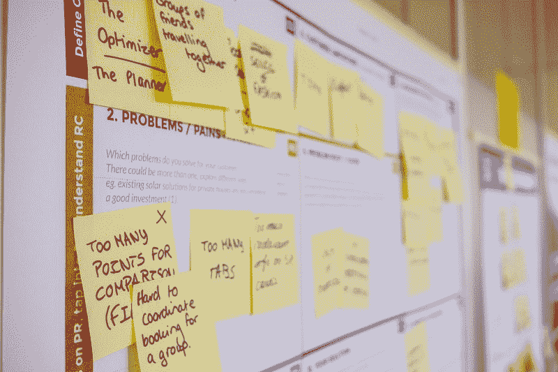
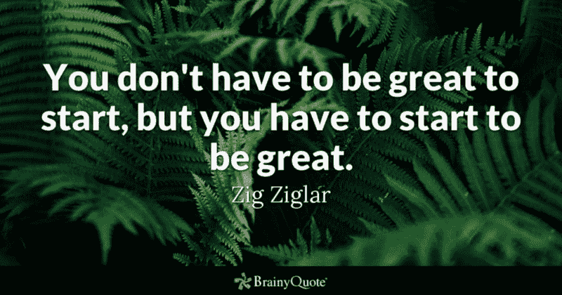
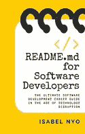

# 如果你是一名开发人员，你应该开始写博客——原因如下。

> 原文：<https://www.freecodecamp.org/news/if-youre-a-developer-you-should-start-blogging-and-here-s-why-b5cb2951d95c/>

伊莎贝尔·尼奥

## 我的博客之旅和一路上学到的技能

生活中有很多偶然事件让我在职业生涯中受益匪浅，写博客绝对是其中之一。今天，我想带你开始我的博客之旅，和你分享我从博客中学到的一些技巧。

### 我的博客旅程是如何开始的

T-shirt from [womenintechnology.threadless.com](https://womenintechnology.threadless.com)

让我们从头开始。任何旅程背后总有一个原因。所以我想解决的第一个问题是我为什么开始写博客。是为了名声还是想创造一个个人品牌？是为了赚点外快吗？

答案是两者都不是。我开始写博客的原因其实很简单。这是因为我需要一个地方来记录我的学习，它需要是一个我可以从任何地方访问的地方，而不需要绑定到物理设备或位置。所以不是在我的家用电脑或工作电脑上。

因此，我心中只有一个观众:我自己。我开始为自己写博客，这样我可以在世界任何地方访问内容。我的博客住在我的域名-[eisabainyo.net](http://eisabainyo.net/weblog)。这是在智能手机出现之前。

这很好地引出了我想回答的下一个问题:我是什么时候开始写博客的？我记得确切的日期，因为那是一个很容易记住的日子——大约 13 年前的圣诞节。准确地说，是 2005 年 12 月 25 日。

我写了些什么，尤其是在圣诞节，我听到你问。当时我在一家传媒公司做开发，上班时间和业余时间做网页开发。我讲了我个人的项目，写了任何关于 web 开发的东西——CSS、JavaScript、API、PHP，以及当时的任何 web 技术。你说得出的，我都写了博客。？

不缺少写博客的内容，因为我生活在网络开发中。

### 与时俱进

快进到现在，我的个人生活和职业生活都发生了变化。我现在是一名工程经理，也是一个六岁女孩的骄傲母亲。

因此，我的博客已经从一个提供代码片段和演示的技术博客发展成为一个从一个也是母亲的女性技术领导者的角度谈论技术职业、领导力和生活的博客。

我写博客的地点和方式也发生了变化。有趣的是，我的博客也与技术领域的变化保持一致。当我开始写博客时，我使用 WordPress 软件，并将其安装在一个共享托管平台上。大约 6-7 年前，当社交媒体开始流行时，我开始在 LinkedIn 上写博客。今天，我在 Medium 上写博客。基本上，我的观众去哪里，我就去哪里。现在想想我开始为自己写博客，真是好笑。

就交易工具而言，我以前使用的是台式电脑，后来我改用了 windows 笔记本电脑。如今，我在苹果电脑上写博客，有时也用智能手机写。Medium 有一个非常好的 iPhone 应用程序，可以让我这样做。有时候，Notes 应用程序也很好用。

## 我从博客中学到了什么

现在，我想与你分享我从博客中学到的技能，以及这些技能如何在我的职业生涯中帮助我。

### 时间管理

Photo by [Stanislaw Gregor](https://unsplash.com/@staszek998?utm_source=medium&utm_medium=referral) on [Unsplash](https://unsplash.com?utm_source=medium&utm_medium=referral)

时间管理是我评价最高的技能之一，我很自豪地说，这是我在全职工作和家庭责任之外，通过保持合理的最新博客学到的东西。对我来说，时间管理不是你做这件事或那件事。这是关于拥有能帮助你最好地利用你所拥有的时间的策略。

时间管理是个人的，因为它必须为你工作，而且必须符合你的喜好。例如，如果你不是一个早起的人，一个时间管理策略说早上 5 点起床，有额外的一个小时为新的一天做准备，清理你的收件箱，对你来说不会很好。

考虑到这一点，我想我会和你分享一些我的时间管理策略，这样你可以选择接受或放弃你认为合适的策略:

摆脱浪费时间的东西:例如，不看电视或网飞，不拖延。

保留清单:我有购物清单、午餐盒清单(给我女儿的)、清洁清单、想法清单和假日活动清单，仅举几例。

**了解每件事背后的原因:**我发现，当我知道某个特定活动背后的原因或目的时，我更有可能有动力去实现它，而不是仅仅因为没有选择而去做这个活动。

例如，我写博客是因为我喜欢促进知识共享，同时学习和成长。如果我找不到一个好的理由来解释我为什么要做某件事，那么这是一个机会让我真正决定这件事是否是我应该做的。

放松和反思:把“放松”这个词看作一种时间管理策略似乎有点讽刺，但我对此深信不疑。下午 6 点以后，你很少会在办公室看到我，因为我发现我在办公室呆多久并不重要。在某一点上，我没有增加价值或做任何高影响力的工作，因为我的大脑在 8 小时后就停止工作了。它需要充电。

因此，我的时间管理策略是时不时地休息一下，放松并反思我所做的事情，这样我就可以以饱满的注意力和精力重新开始。

**专注于高价值的工作:**要能够专注于将要给你带来最大价值的高价值工作，无论是个人的还是职业的，你需要首先认清它是什么，不是什么。我通过回答一个简单的问题来确定一件事是否是高价值的工作——这件事在未来(几天、几个月或几年后)还重要吗？

例如，通过我的博客，我收到了相当多的电子邮件、评论和直接信息。我都读了吗？是的，我都略读了。我要全部回复吗？不，我没有。虽然我知道回复每一个人是很好很有礼貌的，但有时没有必要。

让我给你举几个例子。有些人想让我推销他们的产品，但我并不相信，有些人是骗子，有些人只是想表达他们的观点。只是一点免责声明:这并不意味着如果我不回复某人，我不重视他们的反馈或我认为他们是骗子。这只意味着我重视我的时间和他们的时间。

### 设计思维

Photo by [Daria Nepriakhina](https://unsplash.com/@epicantus?utm_source=medium&utm_medium=referral) on [Unsplash](https://unsplash.com?utm_source=medium&utm_medium=referral)

关于我的博客，我经常被问到的一个问题是，我是如何想出内容创意的。我的答案是两个字:设计思维。

设计思维现在有点流行，有很多文章都在谈论设计思维。与流行的观念相反，设计思维不仅仅是关于事物“看起来”如何，也不仅仅是设计师关心的问题。

因此，让我们回到基础，理解什么是设计思维。

> 设计思维是一种解决问题的迭代方法，它有意识地寻找具有不同观点、知识、技能和经验的人，并让他们一起工作，为现实世界的问题创造一个实用的解决方案

虽然我没有一个团队在我的博客上工作，但我确实和很多人交谈，从他们那里得到反馈、问题和评论。这就是我的内容想法的来源。

我明白了，不管我认为我的内容有多棒，如果没有一个观众对那个特定的话题感兴趣，它就不会给他们增加价值。设计思维方法鼓励我与我的观众产生共鸣，以结构化的方式定义内容的想法，保留优先的想法积压，进行必要的研究，最后但同样重要的是，编写给我的观众增加价值的内容。

与设计思维过程的最后一步“测试”一样，我会不断查看反馈和用户参与度(如社交媒体分享、评论、媒体亮点)，以真正了解我是否已经实现了我试图通过我的内容实现的目标，以及我如何改进我的下一个内容。

### 对反馈持开放态度

Photo by [Nicholas Green](https://unsplash.com/@nickxshotz?utm_source=medium&utm_medium=referral) on [Unsplash](https://unsplash.com?utm_source=medium&utm_medium=referral)

我们都知道反馈是一份礼物，但是接受不积极的反馈需要一些练习。通过我的博客，我收到了很多反馈。有些是正反馈，有些不是。

随着时间的推移，我已经学会真正重视负面反馈，而不是对此感到不安。我收到的每一条负面反馈都教会了我一些东西。有些负面反馈是善意的，有些不是。但是不管它的意图是什么，所有的负面反馈都有助于我成长。如果你想知道我对负面反馈的反应，以下是我收到负面反馈时通常会做的事情:

1.  花点时间去理解反馈，让它深入人心。
2.  决定这是不是我想做的事情——是回复这个人，还是为未来做一个心理记录，或者为自己增加一个行动项目。
3.  如果反馈是负面的，不是善意的，允许自己忽略并继续前进。

通过我的博客从其他人那里获得反馈，我也了解并接受了这个非常简单的事实——不是每个人都会同意你的观点，不是每个人都必须分享你的观点，这完全没问题。

### 通讯技能

Photo by [rawpixel](https://unsplash.com/@rawpixel?utm_source=medium&utm_medium=referral) on [Unsplash](https://unsplash.com?utm_source=medium&utm_medium=referral)

博客是一种通过文字表达自我的形式。通过写博客，我发现自己越来越善于表达自己的想法，无论是书面的还是口头的。

我已经学会了清晰地交流，既通过思考我想要留下的信息和印象，也通过改变我的交流方式来满足我的目标受众——都是通过写博客。不管你目前处于职业生涯的哪个阶段(例如，你是开发人员、技术主管、经理还是首席技术官)，优秀的沟通技巧可以成就你的职业生涯，也可以毁掉你的职业生涯。

很多时候，是你的沟通技巧让你与众不同，让你脱颖而出。

## 今天就开始写博客

你有博客吗？如果是这样，那就太好了。继续写博客！如果你还没有博客，我希望我通过与你分享我的旅程来鼓励你写博客。这真的对我的职业生涯和人生观有很大的帮助，超过了我的预期。

就像励志演说家金克拉曾经说过的那样，

> “你不必一开始就变得伟大，但你必须开始变得伟大。”

**感谢您的阅读！**

如果你喜欢这个故事，你可能会喜欢看看我的新书，[**readme . MD for Software Developers**](https://www.amazon.com/dp/B07DZGBF59)**:***技术颠覆时代的终极软件开发职业指南。*

订阅[我的邮件列表](http://eisabainyo.net/weblog/subscribe/)接收关于技术职业、领导力&生活的文章和资源。