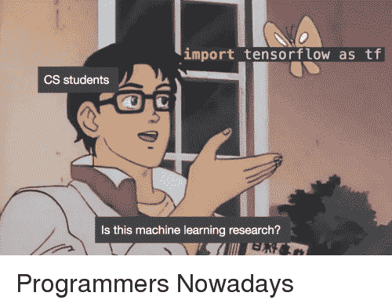
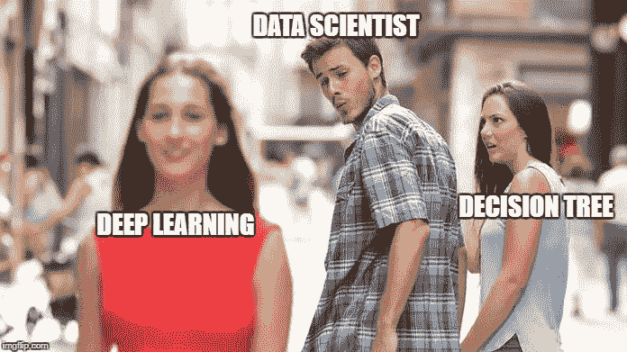

# 这就是为什么任何人都可以学习机器学习

> 原文：<https://www.freecodecamp.org/news/this-is-why-anyone-can-learn-machine-learning-a5333ee64dff/>

作者 Siraj Raval

# 这就是为什么任何人都可以学习机器学习

Photo by [Alex Knight](https://unsplash.com/photos/2EJCSULRwC8?utm_source=unsplash&utm_medium=referral&utm_content=creditCopyText) on [Unsplash](https://unsplash.com/search/photos/machine-learning?utm_source=unsplash&utm_medium=referral&utm_content=creditCopyText)

#### **简介**

机器学习传统上是一项只有博士和拥有大量财政资源的机构才能利用的技术。但是现在，有那么多工具可以让任何人开始学习机器学习。没有借口！

在这篇博文中，我将强调机器学习的四个基石，以及它们中的每一个在过去几年中是如何民主化的。

如果你想了解我最新的人工智能内容，请确保[订阅](https://goo.gl/qzhYkG)我的 YouTube 频道。

机器学习的四大基石是**数据**、**计算**、**算法**、**教育**。

#### **数据**

在 GitHub 上查看[这个](https://github.com/awesomedata/awesome-public-datasets)惊人的公共数据集列表。如果这还不够的话， [Kaggle](https://www.kaggle.com/datasets) 还有一些令人惊讶的抛光数据集。无论你是使用公开可用的数据集，还是通过像 [scrapy](https://www.analyticsvidhya.com/blog/2017/07/web-scraping-in-python-using-scrapy/) 这样的 Python 库从网络上抓取数据，现在每个人都可以访问高质量的数据集。

当然，大型科技公司也有自己的数据花园，但像 [OpenMined](https://openmined.org/) 这样的分散式初创公司正在努力创造服务，让数据科学家也可以在这些数据上训练他们的模型。

#### **计算**

有 GPU 吗？机器学习，尤其是深度学习，需要大量昂贵的计算。神经网络需要使用大规模并行计算，而 GPU 非常适合。

不幸的是，GPU 可能非常昂贵。但是有了像谷歌的 [CoLab](https://colab.research.google.com/) 或 Kaggle 的[内核](https://www.kaggle.com/c/invasive-species-monitoring/kernels)这样的工具，任何人都可以使用免费的(特斯拉 K80)GPU 在浏览器中运行机器学习代码。

#### **算法**

算法是一种商品。幸运的是，机器学习领域已经建立了一种开源代码和大量结果共享的文化。无论是在年度 NIPS 还是 ICLR 会议上，研究人员都非常乐意分享他们的成果。

如果你想跟上最新的研究，你可以使用 [Arxiv Sanity Preserver](http://www.arxiv-sanity.com/) 以漂亮的索引方式阅读最新的论文。当然还有机器学习[子编辑](https://www.reddit.com/r/MachineLearning/)。你可以使用现有的代码，或者使用免费的 [Tensorflow](https://www.tensorflow.org/guide/) 库来构建你自己的模型。

#### **教育**

权力越大，责任越大。你有代码，你有数据，你有计算能力。现在你只需要学会如何使用它们！

当然，除了我的 YouTube 频道，还有很多免费的教育资源可以帮助你学习如何使用机器学习工具。我制作了一个为期三个月的机器学习课程，使用了上述所有资源和我在网上找到的几个资源来帮助初学者入门。你会发现[在这里](https://www.youtube.com/watch?v=Cr6VqTRO1v0)。

#### 向前去学习吧！

你现在应该很兴奋。这是一个不可思议的活着的时代！太多的变化发生得太快了。在所有这些复杂性中，机器学习可以帮助我们以其他方式无法理解的方式理解我们的世界。它可以帮助我们比以往任何时候都更有效地创造和发现新事物。你有能力，明智地使用它。