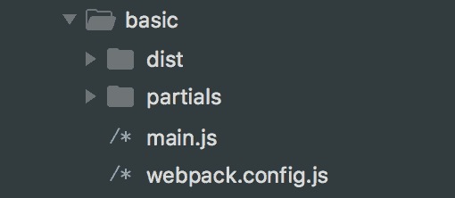
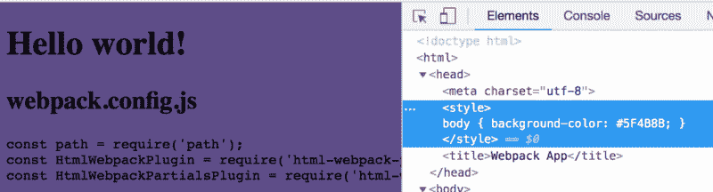
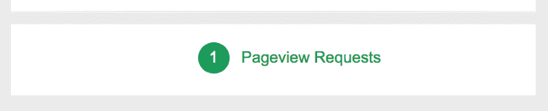

# 如何在 Webpack 中设置可靠且可维护的谷歌分析

> 原文：<https://www.freecodecamp.org/news/how-to-set-up-reliable-and-maintainable-google-analytics-in-webpack-6b68bfde29b3/>

一个新的应用程序设置中最混乱的部分之一是试图找出你的谷歌分析初始化脚本的存放位置。有一些现有的选项，如[反应头盔](https://github.com/nfl/react-helmet)来管理你的文件头。你可以把它扔进你的单片`index.html`文件里。

问题是，这些设置很少按照你想要的方式工作。它们最终成为 JavaScript 中难看的 HTML 字符串块。在整个项目生命周期中，您最终不得不管理我之前提到的那块巨大的`index.html`文件。

### 为什么这很重要

除了如何管理代码之外，如果分析对您和您的业务至关重要，您需要确保设置可靠且安装正确。

许多开发人员认为，因为它是一个 JS 片段，所以最好的做法是把它放在页面的底部。这样做的问题是，在最后抛出它会留下更高的风险，即您会在用户退出页面之前错过跟踪点击，因为在页面的其余部分加载之前，分析不会初始化。这就是为什么谷歌自己推荐[将代码片段安装在尽可能高的位置](https://support.google.com/analytics/answer/1008080?hl=en)。

正如我所说的，这很重要，如果你对它更放松，并想了解你的投资组合网站上的事情是如何运行的，你可能不会关心那么多。然而，如果你扩展到其他工具，如谷歌优化的 A/B 测试，更重要的是让 GA 识别页面和实验运行，以避免额外的延迟或更糟糕的页面闪烁。？


Undesirable content flicker while running a test

### 我们将如何解决这个问题

HTML Webpack 插件的部分是 HTML Webpack 插件的扩展，简化了你的部分管理。它的目标是特别尝试避免在 Webpack 项目中维护一个`index.html`文件的做法，而是遵从可维护的部分来简化您的设置。

现在，我们将专注于设置 Google Analytics，但是我推荐使用 [Google Tag Manager](https://marketingplatform.google.com/about/tag-manager/) 来管理标签，我将在后面的后续文章中介绍。

**TL；博士—** 如果你想直接跳到解决方案，[你可以在这里抓取代码](https://github.com/colbyfayock/html-webpack-partials-plugin/tree/master/examples/analytics)。

### 入门指南

我们希望从一个已经配置了 HTML Webpack 插件的基本 Webpack 设置开始。本指南不会带您完成该设置，但如果您不熟悉，这里有几个起点:

*   [Webpack 的入门指南](https://webpack.js.org/guides/getting-started/#basic-setup)
*   【html 网页包插件的网页包指南
*   你可以在谷歌上搜索一下，找到大量优秀的教程

最后，如果你已经设置了一个`index.html`，我现在不会评价你，但是希望这能启发你以同样的方式处理其他代码片段，并完全消除对托管`index.html`文件的需要。

#### 正在安装 HTML Webpack 插件的部分内容

一旦您已经安装了基本设置和 HTML Webpack 插件，我们的 Partials 插件很容易添加:

```
yarn add html-webpack-partials-plugin -D
```

*注意:确保根据您的项目配置正确设置包依赖关系。*

#### 建立你的部分

接下来，我们要创建我们的分部。我倾向于在源根目录下创建一个名为`partials`的新目录来管理它们。例如，如果您的入口点位于`src/main.js`，那么您的 partials 目录将紧挨着它位于`src/partials`。



一旦您有了首选位置，让我们在新的 partials 目录中创建一个`analytics.html`文件。现在，让我们加入一些测试代码，这样我们就知道它是有效的。在`analytics.html`中:

```
<style>
body { background-color: #5F4B8B; }
</style>
```

#### 配置您的部分

打开你的`webpack.config.js`,让我们设置包含在我们构建中的部分。

首先，要求插件在你的配置的顶部。在`webpack.config.js`中:

```
const HtmlWebpackPartialsPlugin = require('html-webpack-partials-plugin');
```

接下来，这非常重要，在你的`HtmlWebpackPlugin()`实例之后包含一个插件*的新实例。在`webpack.config.js`的插件部分:*

```
...
plugins: [
  new HtmlWebpackPlugin(),
  new HtmlWebpackPartialsPlugin({
    path: './path/to/src/partials/analytics.html'),
    location: 'head',
    priority: 'high'
  })
...
```

现在，在继续之前，让我们先分解一下配置:

*   **path** :这听起来像是我们项目中部分文件的路径。确保将它更新到正确的位置，以便插件可以找到它。
*   **位置**:插件寻找的 HTML 标签。
*   **优先级**:这决定了在编译时，我们的插件是在指定的`location`标签的开头还是结尾添加我们的分部(开始还是结束)。

就像我们之前提到的那样，我们希望在`<he` ad >尽可能高的位置添加这个。对于大多数 HTML 标签来说，如果先验 T2 很高，偏旁就在开始标签后面加上。但是 wit `h the` < head >标签，Partials loo `ks for` 你的 charset meta 标签并在之后立即注入它，因为首先在文档中呈现它很重要。

#### 测试一下

编译 Webpack，在浏览器中打开您的项目，您现在应该会看到一个漂亮的紫外背景。？



如果您查看一下源代码，您应该会看到代码片段被添加到了`charset`标记之后！

#### 现在谈谈分析

让我们更新我们的`analytics.html`文件，如下所示:

```
<script async src="https://www.googletagmanager.com/gtag/js?id=UA-XXXXXXXX-X"></script>
<script>
window.dataLayer = window.dataLayer || [];
function gtag(){dataLayer.push(arguments);}
gtag('js', new Date());
gtag('config', 'UA-XXXXXXXX-X');
</script>
```

只需确保更新 id(`UA-XXXXXXXX-X`)以匹配您的 Google Analytics 属性值。您的分析片段也可能因您的设置而异。

你现在应该能够重新编译 Webpack，并看到你的页面开始 ping 谷歌分析！？

*注意:在 GA 被识别之前，你可能需要从一个服务器加载你的项目文件，而不是直接从你的本地文件系统加载*

### 让我们更进一步

这很好，但是在处理 Google Analytics 时，最好有一些不同的属性，比如一个用于开发，一个用于生产。这有助于避免来自开发团队(或您)的数据污染产品属性。

#### 设置部分变量

让我们回到我们的`webpack.config.js`文件，设置一个变量来传递我们的属性 ID:

```
...
plugins: [
  new HtmlWebpackPlugin(),
  new HtmlWebpackPartialsPlugin({
    path: './path/to/src/partials/analytics.html'),
    location: 'head',
    priority: 'high',
    options: {
      ga_property_id: 'UA-XXXXXXXX-X'
    }
  })
...
```

接下来，更新您的`analytics.html`文件来识别这个值。类似于 HTML Webpack 插件，Partials 使用 [Lodash 模板](https://lodash.com/docs/#template)来完成这项工作。在`analytics.html`中:

```
<script async src="https://www.googletagmanager.com/gtag/js?id=<%= ga_property_id %>"></script>
<script> window.dataLayer = window.dataLayer || [];
function gtag(){dataLayer.push(arguments);}
gtag('js', new Date());
gtag('config', '<%= ga_property_id %>');
</script>
```

现在重新编译获利！



Google Tag Assistant showing successful pageview request

为了验证你的标签设置是否正确，我建议你查看 Chrome 上的谷歌标签助手。

#### 为不同的属性 id 进行设置

从这里开始，您可以选择如何管理不同的属性 id。您可以:

*   设置单独的[开发和生产 Webpack 配置](https://webpack.js.org/guides/production/)
*   创建一个允许您导入设置的环境配置(例如:`env.config.js`)
*   两者(推荐)

通过这种方式进行设置，您将有机会在本地开发和生产构建之间动态地运行这些属性。只要记住，如果要添加敏感数据，不要将 env 文件存储在 git 中。？

### 那么我们能从中得到什么呢？

理想的场景是，你拿着这个，在你生活在`index.html`的 HTML 的剩余时间里运行它。这有助于将您的代码分成更易于管理的部分，并让 Webpack 为您生成文件，而不是让您自己去覆盖和管理它。

具体到谷歌分析，我们有几个好处:

*   确保代码片段加载到可靠的位置
*   提供了一种更合理的方式来维护代码片段本身
*   通过 Webpack 配置管理您的属性 ID
*   另外:通过 Webpack 配置将它作为 env 变量加载

要查看带有示例代码的完整解决方案，请查看 GitHub repo 中的示例。

[](https://twitter.com/colbyfayock)

*   [？在 Twitter 上关注我](https://twitter.com/colbyfayock)
*   [？️订阅我的 Youtube](https://youtube.com/colbyfayock)
*   [✉️注册我的简讯](https://www.colbyfayock.com/newsletter/)

*最初发布于[https://www . colbyfayock . com/2018/08/reliable-and-maintain-Google-analytics-in-web pack](https://www.colbyfayock.com/2018/08/reliable-and-maintainable-google-analytics-in-webpack)。*