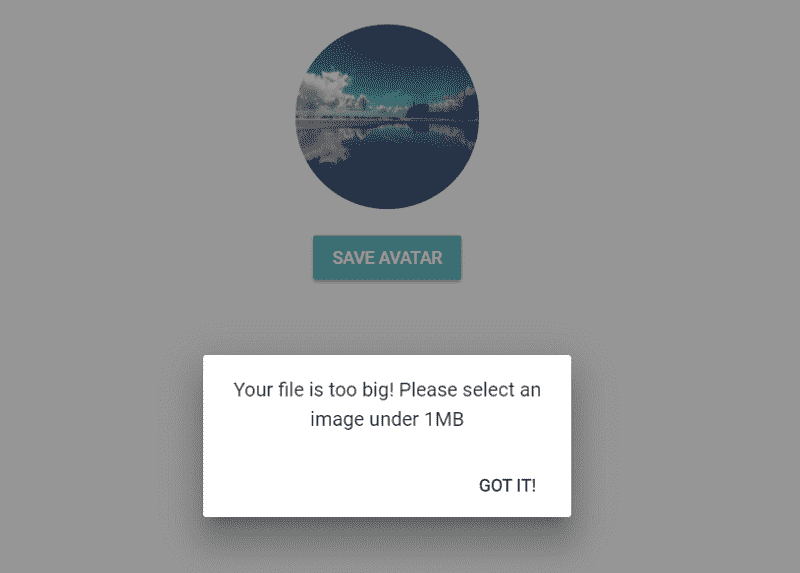
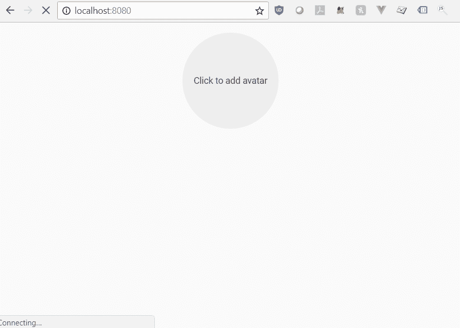

# 如何使用 Vue.js 2.0 构建灵活的图像上传组件

> 原文：<https://www.freecodecamp.org/news/how-to-build-a-flexible-image-uploader-component-using-vue-js-2-0-5ee7fc77516/>

作者凯茜·哈

# 如何使用 Vue.js 2.0 构建灵活的图像上传组件


Background Image Credit: [rawpixel](https://unsplash.com/@rawpixel) on [Unsplash.com](https://unsplash.com)

我用 [Vue.js 2.0](http://Vue.js 2.0) 编码到现在大概半年了，还蛮牛逼的。它非常直观和简单。HTML/CSS/Javascript 之间的划分使得学习和编码变得轻而易举。

但是用一个相对较新的框架编码的麻烦(和乐趣)是缺少你想要构建的教程。尤其是当你心中有一个具体的事情。

我在尝试为 [Torneo](http://www.torneo.ca) 创建个人资料照片上传程序时遇到了这个问题。当然，我可以用一个别致的包装，但那有什么意思呢？

所以，通过修改和组合[两个](https://alligator.io/vuejs/file-select-component/) [伟大的](https://scotch.io/tutorials/how-to-handle-file-uploads-in-vue-2)教程，我创建了自己的**可重用图片上传组件**。

查看 [git 库](https://github.com/cathyhax/image-uploader/tree/master)中的所有代码。

### 期望的行为

我创建该组件的目的如下:

*   该组件应该能够被其父组件中的任何元素激活以上传图像
*   我们应该能够在父组件中看到图像的预览
*   上传的图像应该以 FormData 格式保存，以发送到后端
*   该组件应该检查上传图像的大小限制(这也可以在后端完成，但在前端要快一些)
*   一次一个文件(注意[本教程](https://scotch.io/tutorials/how-to-handle-file-uploads-in-vue-2)讲述了如何处理多个文件——你所需要的只是一些循环)

### 第一步:设置

我们将从安装 webpack-simple 模板开始。我们还将安装 [Vuetify](https://vuetifyjs.com/en/) 来节省一些造型的时间。注意，< v-… >包装的东西都是 Vuetify 的。因为它们的标签是不言自明的，所以我不会深入探讨。我会让你去[看他们的文件。](https://vuetifyjs.com/en/getting-started/quick-start)

```
# install the vue-clinpm install vue-cli -g# initiate the webpack-simple, and follow instructionsvue init webpack-simple image-upload
```

```
# install dependenciesnpm install
```

```
# install Vuetifynpm install vuetify --save
```


A light celebration

### **步骤 2:创建图像上传模板**

太好了！现在我们已经设置并安装了模板，我们可以删除任何占位符内容。然后，我们可以为图像上传程序创建一个新的组件文件。

```
<template>  <div>
```

```
 <!-- slot for parent component to activate the file changer -->    <div @click="launchFilePicker()">      <slot name="activator"></slot>    </div>
```

```
 <!-- image input: style is set to hidden and assigned a ref so that it can be triggered -->    <input type="file"       ref="file"       :name="uploadFieldName"       @change="onFileChange(          $event.target.name, $event.target.files)"       style="display:none">
```

```
 <!-- error dialog displays any potential errors -->    <v-dialog v-model="errorDialog" max-width="300">      <v-card>        <v-card-text class="subheading">{{errorText}}</v-card-text>        <v-card-actions>          <v-spacer></v-spacer>          <v-btn @click="errorDialog = false" flat>Got it!</v-btn>        </v-card-actions>      </v-card>    </v-dialog>
```

```
 </div></template>
```

1.  为了使 image uploader 组件能够被父组件中的任何元素激活，我们可以利用 Vue 的[“slot”](https://vuejs.org/v2/guide/components-slots.html)功能。
2.  因为我们希望输入的“触发器”在父组件中，所以我们希望文件输入的功能在子组件中，但不能看到它。我们可以将输入的样式改为“display:none”来隐藏它。
3.  图像输入被赋予一个“ref ”,这样当点击该槽时，我们可以通过它的引用来激活图像输入。
4.  为了使图像上传器更加用户友好，我们可以使用一个对话框来显示任何潜在的错误。



接下来，我们可以在 JavaScript 部分使用一些 Vue.js 魔法，给我们的组件注入一些活力:

```
<script>
```

```
 export default {
```

```
 name: 'image-input',
```

```
 data: ()=> ({      errorDialog: null,      errorText: '',      uploadFieldName: 'file',      maxSize: 1024    }),
```

```
 props: {          // Use "value" here to enable compatibility with v-model      value: Object,    },
```

```
 methods: {      launchFilePicker(){        this.$refs.file.click();      },
```

```
 onFileChange(fieldName, file) {        const { maxSize } = this        let imageFile = file[0]          //check if user actually selected a file        if (file.length>0) {          let size = imageFile.size / maxSize / maxSize          if (!imageFile.type.match('image.*')) {            // check whether the upload is an image            this.errorDialog = true            this.errorText = 'Please choose an image file'          } else if (size>1) {            // check whether the size is greater than the size limit            this.errorDialog = true            this.errorText = 'Your file is too big! Please select an image under 1MB'          } else {            // Append file into FormData & turn file into image URL            let formData = new FormData()            let imageURL = URL.createObjectURL(imageFile)            formData.append(fieldName, imageFile)
```

```
 // Emit FormData & image URL to the parent component            this.$emit('input', { formData, imageURL })          }        }      }    }  }</script>
```

5.要使图像上传器组件 v-model 兼容，请在 props 中使用“value”。组件发出的任何数据都将在“值”属性中被捕获。

6.当单击父组件中的文件输入激活器时，“this。$refs.file.click()"用于激活文件选择器。

7.一旦用户从文件选择器中选择了某样东西/关闭了文件选择器，我们需要检查:

*   用户是否实际选择了一个文件
*   文件是否是图像
*   文件是否大于大小限制(对于用户上传来说通常是个好主意)

8.如果用户选择的文件没有问题，则创建一个 FormData 元素，并使用服务器可以接受的名称将文件附加到元素中。此外，将图像文件转换成一个[对象 URL](https://developer.mozilla.org/en-US/docs/Web/API/URL/createObjectURL) ，以便父组件可以读取它进行预览。

9.将数据(上传到服务器的 FormData 和预览的 imageURL)发送到父组件。

### 步骤 3:创建父组件



A glimpse of the end product, to encourage you to keep reading

在父组件中，我们可以可视化子组件的功能。

```
<template>  <v-app id="app" class="mt-0">    <v-container grid-list-xl>      <image-input v-model="avatar">        <div slot="activator">          <v-avatar size="150px" v-ripple v-if="!avatar" class="grey lighten-3 mb-3">            <span>Click to add avatar</span>          </v-avatar>          <v-avatar size="150px" v-ripple v-else class="mb-3">                      </v-avatar>        </div>      </image-input>      <v-slide-x-transition>        <div v-if="avatar && saved == false">          <v-btn class="primary" @click="uploadImage" :loading="saving">Save Avatar</v-btn>        </div>      </v-slide-x-transition>    </v-container>  </v-app></template>
```

1.  将 activator 元素包装在一个中，并让子组件知道它属于我们命名为“activator”的槽。
2.  根据用户是否选择了文件，使用 Vue 的 [v-if 和 v-else](https://vuejs.org/v2/guide/conditional.html) 显示上传提示或头像预览。
3.  有条件地显示按钮以保存用户的更改。

*快好了！*接下来，是时候向父组件添加一些 Javascript 了:

```
<script>import ImageInput from './components/ImageInput.vue'
```

```
export default {  name: 'app',  data () {    return {      avatar: null,      saving: false,      saved: false    }  },  components: {    ImageInput: ImageInput  },  watch:{    avatar: {      handler: function() {        this.saved = false      },      deep: true    }  },  methods: {    uploadImage() {      this.saving = true      setTimeout(() => this.savedAvatar(), 1000)    },    savedAvatar() {      this.saving = false      this.saved = true    }  }}</script>
```

4.在脚本部分，导入子组件。

5.当用户点击“保存”时，将头像上传到服务器(注意，我在上面的代码中是假装上传的。实际上，我们使用 [axios](https://github.com/axios) 将文件上传到服务器。后端然后将文件保存在文件系统中，并在数据中传递文件的路径)。


You’re pretty awesome for making it this far ❤

就是这样！这个组件还有很大的改进空间——比如传递道具来调整上传图像的大小，处理多个文件等等。如果您看到任何潜在的改进点或发现我的代码中的错误，请留下评论！

再次强调，请随意查看 [git 库](https://github.com/cathyhax/image-uploader/tree/master)中的所有代码。

最后，在这里插一句无耻的话:如果你碰巧对体育感兴趣，可以去看看[Torneo](https://www.torneo.ca)——一家我帮助开发的与体育相关的初创公司。