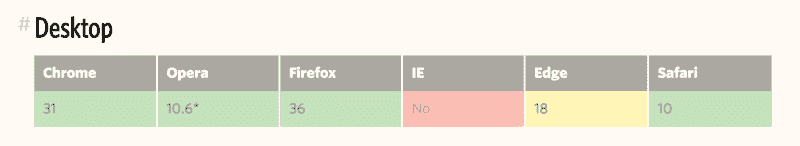
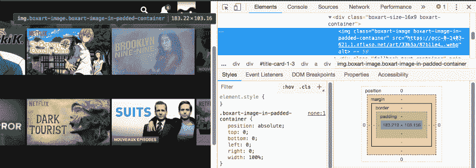

# 创建响应图像的省时 CSS 技术

> 原文：<https://www.freecodecamp.org/news/time-saving-css-techniques-to-create-responsive-images-ebb1e84f90d5/>

作为一名 web 开发人员，你很有可能遇到了本文的两个敌人:**图片**和**截止日期**。有时，由于某些原因，你的图像不适合布局，你不想把你的头缠上几个小时。

这种情况在我身上发生过很多次，我也从错误中吸取了教训。没有更多的黑魔法——这里是我最喜欢的五种处理图像大小调整的技巧。

### “天哪，我需要尽快得到它”的方式

现在是星期五下午 5 点，你必须完成这一页，但图像不适合布局。是时候使用你的魔术了！

```
.myImg {
  background-image: url("my-image.png");
  background-size: cover;
}
```

听起来很熟悉？我们都做过一次，对你来说不觉得是欺骗吗？

使用`background`属性非常有用，它们只是工作。但是，请记住，您应该只将它们用于非内容图像或作为文本的替换，以及在[某些特殊情况下](https://stackoverflow.com/a/1469139)。

### 来自未来的路

如果我告诉你这种魔法也存在于``元素中呢？向 object-fit 属性问好——顺便说一下，它也适用于视频！

```
.myImg {
  object-fit: cover;
  width: 320px;
  height: 180px;
}
```

那都是乡亲们！看看当我们检索友好值`cover`时，我们也可以使用`contain`。

#### 好吧，陷阱是什么？

不幸的是`object-fit`不能在 IE 和旧版本的 Safari 上运行，但是有一个[多填充](https://github.com/bfred-it/object-fit-images/)。



source: [https://css-tricks.com/almanac/properties/o/object-fit/#article-header-id-4](https://css-tricks.com/almanac/properties/o/object-fit/#article-header-id-4)

[https://codepen.io/adri_zag/embed/preview/VBQJYg?height=300&slug-hash=VBQJYg&default-tabs=html,result&host=https://codepen.io](https://codepen.io/adri_zag/embed/preview/VBQJYg?height=300&slug-hash=VBQJYg&default-tabs=html,result&host=https://codepen.io)

### “网飞”方式

你可能会想“不错的把戏，又一个在 IE 这样的老浏览器中不起作用的方法？”。别担心，这款到处都可以用，是我的最爱！你需要用一个相对填充的父对象来包装你的图像。

我们将在`padding`属性上保留一个百分比的图像比率。你的图像将是一个全尺寸的绝对儿童。

代码如下所示:

```
.wrapper {
  position: relative;
  padding-top: 56.25%; /* 16:9 Aspect Ratio */
}
img {
  position: absolute;
  left: 0;
  top: 0;
  width: 100%;
  height: auto;
}
```

“嘿，伙计，这看起来很复杂。”

一旦你有了这个概念，这个技术就简单了，而且[被广泛使用](https://www.w3schools.com/howto/howto_css_aspect_ratio.asp)。网飞用它！



Take a look at the class names !

一个小演示:

[https://codepen.io/adri_zag/embed/preview/BPrejO?height=300&slug-hash=BPrejO&default-tabs=html,result&host=https://codepen.io](https://codepen.io/adri_zag/embed/preview/BPrejO?height=300&slug-hash=BPrejO&default-tabs=html,result&host=https://codepen.io)

### 简单的方法

你可能已经知道这个了:

```
img {
  height: auto;
  width: 100%;
/* even more control with max-width */
  max-width: 720px;
}
```

如果你的布局不是太复杂，它在大多数情况下是有效的。

[https://codepen.io/adri_zag/embed/preview/LBQvwy?height=300&slug-hash=LBQvwy&default-tabs=html,result&host=https://codepen.io](https://codepen.io/adri_zag/embed/preview/LBQvwy?height=300&slug-hash=LBQvwy&default-tabs=html,result&host=https://codepen.io)

### 绩效方式(高级)

我所说的性能是指加载时间。一个大英雄形象会毁了它，让你的页面感觉很慢，尤其是在移动设备上。

你知道吗，在[现代浏览器](https://caniuse.com/#feat=srcset)中，你可以根据页面宽度改变图像来源。这就是`srcset`的用途！

您可以将它们与 HTML 5 `[<picture>](https://developer.mozilla.org/en-US/docs/Learn/HTML/Multimedia_and_embedding/Responsive_images)`标签结合起来，后者会随着一个``而优雅地降级。

```
<picture>
  <source media="(max-width: 799px)" srcset="elva-480w.jpg">
  <source media="(min-width: 800px)" srcset="elva-800w.jpg">
  
</picture>
```

[https://codepen.io/adri_zag/embed/preview/pZLBpx?height=300&slug-hash=pZLBpx&default-tabs=html,result&host=https://codepen.io](https://codepen.io/adri_zag/embed/preview/pZLBpx?height=300&slug-hash=pZLBpx&default-tabs=html,result&host=https://codepen.io)

### 概括一下

1.  如果您的图像不是页面内容的一部分，请使用`background-image` 。
2.  不在乎 IE 就用`object-fit`。
3.  网飞使用的填充容器技术适用于任何地方。
4.  大多数情况下，只需在 CSS 中添加`height: auto;`即可。
5.  如果你需要快速加载，使用`srcset`在手机上加载较小的图像。