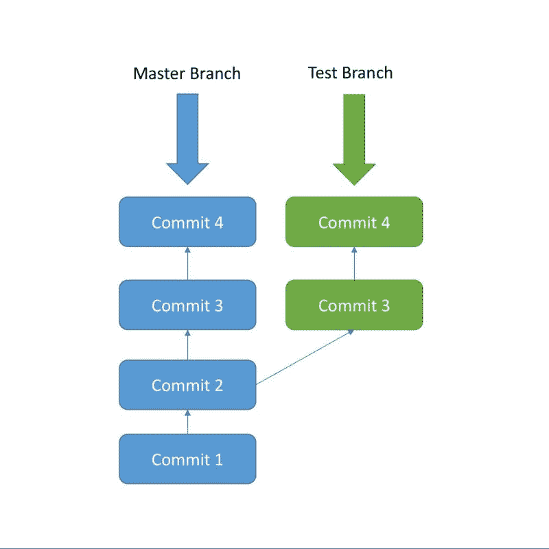
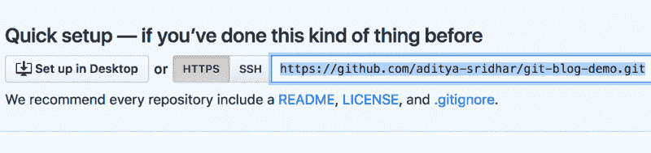

# Git 简介:什么是 Git，以及如何使用它

> 原文：<https://www.freecodecamp.org/news/what-is-git-and-how-to-use-it-c341b049ae61/>

Git 是一个**开源的分布式版本控制系统**。现在有很多词来定义 Git。

我来分解一下，解释一下措辞:

*   **控制系统:**这基本上意味着 Git 是一个内容跟踪器。所以 Git 可以用于存储内容——由于它提供的其他特性，它主要用于存储代码。
*   **版本控制系统**:存储在 Git 中的代码随着代码的增加而不断变化。此外，许多开发人员可以并行添加代码。因此，版本控制系统通过维护已发生更改的历史来帮助处理这一问题。此外，Git 还提供了分支和合并等特性，我将在后面介绍。
*   **分布式版本控制系统** : Git 有一个存储在服务器上的远程库和一个存储在每个开发人员电脑上的本地库。这意味着代码不仅仅存储在中央服务器中，而且代码的完整副本存在于所有开发人员的计算机中。Git 是一个分布式版本控制系统，因为代码存在于每个开发人员的计算机中。我将在本文后面解释远程和本地存储库的概念。

### 为什么需要 Git 这样的版本控制系统

现实生活中的项目通常有多个开发人员并行工作。因此，需要像 Git 这样的版本控制系统来确保开发人员之间没有代码冲突。

此外，这类项目中的需求经常变化。因此，版本控制系统允许开发人员返回到代码的旧版本。

最后，有时并行运行的几个项目涉及相同的代码库。在这种情况下，Git 中分支的概念非常重要。

### 现在让我们开始使用 Git 吧

我不会一次提到所有的概念，而是通过一个例子来解释 Git 的概念，这样更容易理解。

#### Download git

这个链接有关于如何在多个操作系统中安装 Git 的细节:
[https://Git-SCM . com/book/en/v2/Getting-Started-Installing-Git](https://git-scm.com/book/en/v2/Getting-Started-Installing-Git)

在命令提示符下使用以下命令验证是否安装了 Git:

```
git --version
```

#### 创建您的本地 Git 存储库

在您的计算机中，为您的项目创建一个文件夹。我们把项目文件夹叫做`simple-git-demo`。

进入项目文件夹，使用以下命令将本地 Git 存储库添加到项目中:

```
cd simple-git-demo
git init
```

`git init`命令将本地 Git 存储库添加到项目中。

#### 现在让我们添加一些小代码

在项目文件夹中创建一个名为`demo.txt`的文件，并在其中添加以下文本:

```
Initial Content
```

这里我们将用纯文本而不是实际代码进行演示，因为本文的主要焦点是 Git，而不是任何特定的编程语言。

### 准备和提交代码

提交是将代码添加到**本地存储库**的过程。在提交代码之前，它必须在**中转区**。暂存区用于跟踪所有要提交的文件。

任何未添加到临时区域的文件都不会被提交。这使得开发人员可以控制哪些文件需要提交。

#### 脚手架

使用以下命令转移文件:

```
git add demo.txt
```

如果您想要添加多个文件，您可以使用:

`git add file1 file2 file3`

如果要将项目文件夹中的所有文件添加到临时区域，请使用以下命令:

```
git add .
```

请小心使用，因为它会将项目中的所有文件和文件夹添加到临时区域。

#### 犯罪

使用以下命令提交文件:

```
git commit -m "Initial Commit"
```

“初始提交”是这里的提交消息。输入相关的提交消息，以指示在该特定提交中进行了哪些代码更改。

### Git 状态和 Git 日志

现在修改`demo.txt` 文件并添加以下代码片段:

```
Initial Content Adding more Content
```

#### 状态

使用`git status`找出关于修改了哪些文件以及暂存区中有哪些文件的信息——它还显示了其他信息，我们现在可以忽略这些信息。

使用以下命令查看状态:

```
git status
```

状态显示`demo.txt`已被修改，并且还不在暂存区中。

现在让我们将`demo.txt`添加到暂存区，并使用以下命令提交它:

```
git add demo.txt git commit -m "demo.txt file is modified"
```

### 原木

使用`git log`打印出到目前为止已经完成的所有提交。

用于此的命令是:
`git log`

该日志显示了每次提交的作者、提交日期和提交消息。

### 分支

到目前为止，我们还没有在 Git 中创建任何分支。默认情况下，Git 提交进入**主**分支。

#### 什么是分支？

分支只不过是指向 Git 存储库中最新提交的指针。所以目前我们的主分支是指向第二个提交`“demo.txt file is modified”`的指针。

#### 为什么需要多个分支？

需要多个分支来支持多个并行开发。参考下图，看看分支是如何工作的。



最初，提交 1 和提交 2 在主分支中完成。在提交 2 之后，创建了一个名为“Test”的新分支，提交 3 和提交 4 被添加到测试分支中。

同时，不同的提交 3 和提交 4 被添加到主分支。这里我们可以看到，在提交 2 之后，两个并行的开发在两个独立的分支中进行。

测试分支和主分支在这里有分歧，并且有不同的代码——来自测试分支的代码可以使用`git merge`与主分支合并。这将在后面介绍。

#### 在本地创建新的分支

使用以下命令创建一个名为 **test** 的新分支:

```
git branch test
```

该命令创建了`test`分支。

我们仍然在主分支的上下文中。以便切换到`test` 分支。使用以下命令:

```
git checkout test
```

现在我们在`test`分部。

您可以使用以下命令列出本地的所有分支:

```
git branch
```

#### 在新分支中执行一些提交

通过添加以下代码片段来修改`demo.txt`:

```
Initial Content Adding more Content Adding some Content from test Branch
```

现在，使用以下命令转移并提交:

```
git add demo.txt git commit -m "Test Branch Commit"
```

这个提交是在测试分支中完成的，现在测试分支比主分支领先 1 个提交——因为测试分支还包括来自主分支的 2 个提交。

您可以使用以下命令验证测试分支中的提交历史记录:

```
git log
```

### 合并

目前，测试分支领先于主分支 1 次提交。假设现在我们希望将测试分支中的所有代码带回主分支。这就是`git merge`非常有用的地方。

为了将测试分支中的代码合并到主分支中，请遵循以下步骤:

首先回到主分支:

```
git checkout master
```

然后运行`merge`命令:

```
git merge test
```

运行这两个命令后，合并应该会成功。在本例中，没有冲突。

但是在实际的项目中，当合并正在进行时会有冲突。解决冲突是需要经验的，所以随着你更多地使用 Git，你将能够找到解决冲突的窍门。

现在运行`git log` ,您会注意到主服务器也有 3 次提交。

### 远程 Git 存储库

到目前为止，我们一直只在本地存储库中工作。每个开发人员将在他们的本地存储库中工作，但是最终，他们将把代码推到远程存储库中。一旦代码在远程存储库中，其他开发人员就可以看到并修改代码。


Showing Remote and Local Repositories

#### 开源代码库

这里我们将使用 GitHub 作为远程存储库。

前往[https://github.com/](https://github.com/)创建一个账户。

在 GitHub 主页注册后，点击**开始一个项目**创建一个新的 Git 资源库。为存储库命名，然后单击“创建存储库”

赐名为`git-blog-demo`。

这将在 GitHub 中创建一个远程存储库，当您打开该存储库时，将会打开如下图所示的页面:



存储库 URL 是突出显示的部分`**https://github.com/aditya-sridhar/git-blog-demo.git**`

要将本地存储库指向远程存储库，请使用以下命令:

```
git remote add origin [repository url]
```

#### **去推**

为了将所有代码从本地存储库推送到远程存储库，使用以下命令:

```
git push -u origin master
```

这将代码从本地存储库中的主分支推到远程存储库中的主分支。

### 附加命令

#### Git Pull

`git pull`用于将最新的变更从远程存储库拉入本地存储库。远程存储库代码由不同的开发人员不断更新，因此`git pull` 是必要的:

```
git pull origin master
```

#### Git Clone

`git clone`用于将现有的远程存储库克隆到您的计算机中。用于此目的的命令是:

```
git clone [repository url]
```

### 祝贺

现在您已经知道了如何使用 Git 的基本知识，所以请继续深入探索吧！

我将很快再发表一篇关于稍微高级一点的 Git 概念的文章。敬请期待！

### 关于作者

我热爱科技，关注科技的进步。我也喜欢用我在技术领域的知识帮助别人。

请随时通过我的 LinkdIn 帐户与我联系[https://www.linkedin.com/in/aditya1811/](https://www.linkedin.com/in/aditya1811/)

你也可以在推特上关注我[https://twitter.com/adityasridhar18](https://twitter.com/adityasridhar18)

我的网站:[https://adityasridhar.com/](https://adityasridhar.com/)

### 我的其他帖子

[如何高效使用 Git](https://www.freecodecamp.org/news/how-to-use-git-efficiently-54320a236369/)