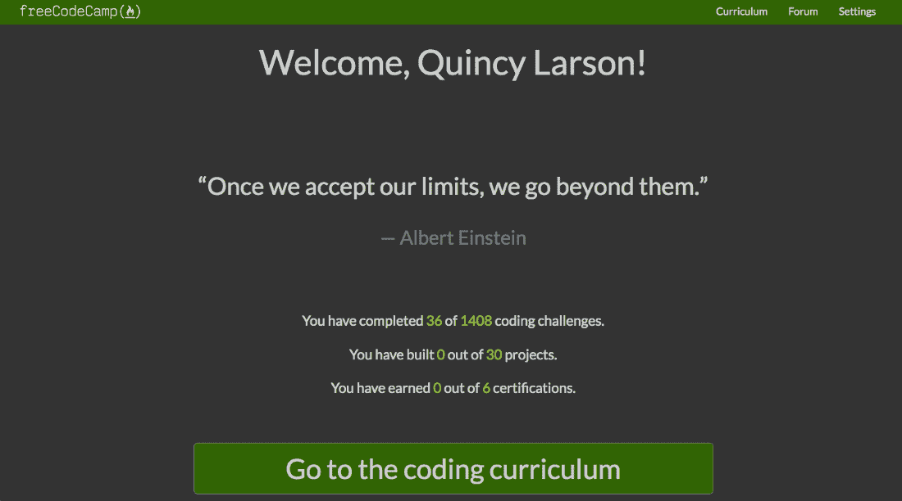

# freeCodeCamp 的新编码课程现已上线，有 1，400 门编码课程和 6 个开发者认证

> 原文：<https://www.freecodecamp.org/news/freecodecamps-new-coding-curriculum-is-now-live-with-1400-coding-lessons-and-6-developer-certifications-you-can-earn/>

在过去的一年里，我们的社区一直在努力开发一个大规模的新编程课程。现在，该课程已经上线，不再是测试版了！

我们重组了 freeCodeCamp 的课程，强调基本的软件开发技能和概念:

*   HTML、CSS 和 JavaScript
*   易接近
*   视觉设计
*   数据结构
*   面向对象编程
*   函数式编程
*   排除故障
*   信息安全
*   测试

您仍将学习特定的工具，如 Node.js 和 React，但这些工具会在我们的课程中进一步出现。

我们建议按照从开始到结束的顺序学习课程，但是如果你只是想学习一项特定的技能，可以随意跳过。

### 您可以获得的 6 种新开发人员认证。

**您仍然可以从 freeCodeCamp 设置页面申请所有最初的 3 个认证**(前端、后端和数据可视化)。现在我们还提供 6 种新的认证:

*   **响应式网页设计** (HTML、CSS、Flexbox、CSS 网格)
*   **JavaScript 算法和数据结构**(就 JavaScript。很多 JavaScript。)
*   **前端库** (React、Redux、Sass、Bootstrap、jQuery)
*   **数据可视化** (D3.js)
*   **API 和微服务** (Node.js，Express.js，databases)
*   **信息安全与质量保证** (Chai，Helmet.js，BCrypt，Passport.js)

这些新认证中的每一个都有 5 个必须完成的项目。所有其他的编码挑战都是可选的，帮助你为这些项目做好准备。

### 30 个核心课程项目中的每一个都有自己的测试套件。

以前 freeCodeCamp 的项目只有用户故事。由您来解释这些用户故事，并将它们转化为工作特性。

现在 freeCodeCamp 上每个必需的项目都有自己的测试套件。这些测试可以帮助指导您的编码。您可以运行它们来查看您的项目是否可以提交。

您可以通过包含一行 JavaScript 将这些测试套件包含在您的项目中。这意味着你可以在任何地方构建你的项目:在 [CodePen](https://codepen.io) 、 [Glitch](https://glitch.com) ，或者就在你的本地计算机上。我们唯一的要求是你的项目在网上有一个公开的网址。

### 数百个新的编码面试准备挑战

成千上万的人要求开设一个专注于编码面试准备的栏目。因此，我们增加了数百个高级算法和数据结构挑战，以及几十个可选的“带回家的项目”，您可以构建这些项目进行练习。

其中一些挑战非常困难，即使是经验丰富的程序员也需要几个小时才能完成。

在你完成 freeCodeCamp 的所有认证后很久，你还可以继续回来这里扩展你的技能。

### 闪电般的学习平台

我们从头开始重建了我们的学习平台。我们的全部课程现在都在 learn.freeCodeCamp.org 的子域上。这是一款单页 React 应用，设计简洁明了。

我们将整个平台缓存在 Netlify 的内容交付网络上，这样无论你在世界的哪个角落，你都可以很快得到它。

### 您可以在任何地方解决的全栈 web 开发挑战

许多挑战涉及构建 Node.js 应用程序。您可以在本地计算机或您自己的云服务器上构建这些。

我们推荐使用 [Glitch](https://glitch.com) ，这是一种免费、便捷的方式来构建您的 web 应用程序，不需要所有的 Git 和 Linux 命令。

然后 freeCodeCamp 将到达您的 API 端点并测试您的代码，以验证您已经正确构建了 API。

### 一个新的“随键入”搜索框

现在，您可以直接从 freeCodeCamp 的导航栏中搜索超过 8，000 个 freeCodeCamp 课程、文章、视频和播客。

### 新的欢迎仪表板

每次你登录[www.freeCodeCamp.org](https://www.freecodecamp.org)，你都会看到一个欢迎面板。这将是一篇鼓舞人心的引言和统计数据，介绍你在 freeCodeCamp 课程中取得的进步。

### 将会有错误—通过报告它们来帮助我们修复它们

我们刚刚推出了一大堆新代码。即使我们尽了最大的努力来测试它，总会有我们遗漏的东西。您可以[跟踪我们未解决的 GitHub 问题，并在此创建新问题](https://github.com/freeCodeCamp/freeCodeCamp/issues)。

我很高兴听到您对这个新的学习平台的任何反馈。

### 谢谢大家！

非常感谢帮助设计和测试新课程的数百名开源贡献者——他们中的许多人将参加我们在纽约市、都柏林和香港举办的 [2018 年顶级贡献者聚会](https://medium.freecodecamp.org/announcing-our-freecodecamp-2018-top-contributor-award-winners-861da08a77e1)。

你现在可以[投入新课程](https://learn.freecodecamp.org)。