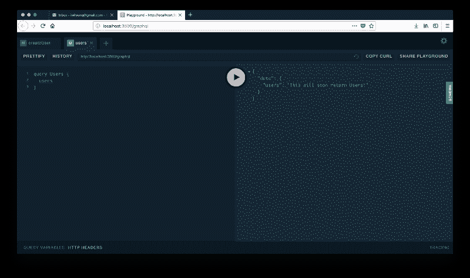
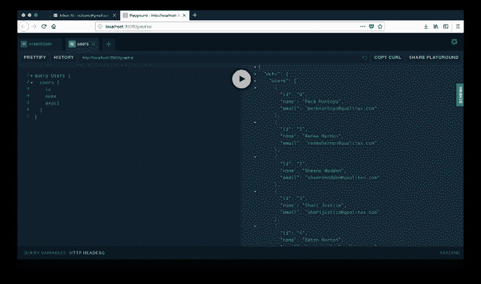
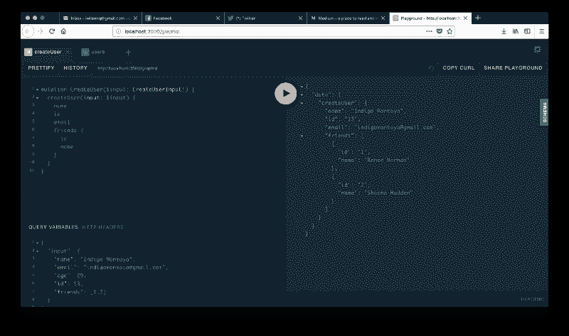

# 学习用最少的努力构建一个 GraphQL 服务器

> 原文：<https://www.freecodecamp.org/news/learn-to-build-a-graphql-server-with-minimal-effort-fc7fcabe8ebd/>

今天在 web 开发中，我们将学习如何:

*   使用 NodeJS 轻松设置 GraphQL 服务器
*   使用 json-server 模拟无数据库数据
*   构建一个使用 GraphQL 的 CRUD 应用程序
*   阿波罗如何为我们节省大量时间和精力

如果这些项目中有你感兴趣的，请继续阅读！如果您想参考完整的示例，请务必查看此回购的[源代码。](https://github.com/iwilsonq/social-graphql)

### 温柔的介绍

几年前，我用 Express 启动了我的第一个节点 HTTP 服务器。我这边只用了 6 行代码。

```
const express = require('express')
const app = express()

app.get('/', function(req, res) { 
  res.send({ hello: 'there' })
})

app.listen(3000, () => 'Listening at http://localhost:3000')
```

这大大减少了构建服务器端应用程序的必要工作，尤其是考虑到我们可以使用我们熟悉的 JavaScript。

无数关于设置节点服务器的教程和视频打开了闸门，通常是为了在创纪录的时间内构建某种 CRUD REST API。

CRUD 指的是可以创建、读取、更新和删除的应用程序、服务器或后端——可能来自真实的数据库。

但这是 2018 年，我们可以做更酷的事情。

我们用 GraphQL 代替 REST 吧。

### 输入 GraphQL

GraphQL 是一个声明性的数据获取和操作层，它使得使用 API 对客户端更加友好。

通过 GraphQL 服务器消费数据的一些好处是:

*   通过指定所需的字段，您可以准确地获得所请求的数据。
*   更少的请求和更少的过度提取。GraphQL 查询通常足够具体，以避免抓取不必要的记录或字段。
*   强类型模式，与对返回的数据类型没有意见的原始 JSON 字段相反。
*   GraphQL playground 提供了自动完成功能和内置文档。如果你喜欢和[邮递员](https://www.getpostman.com/)一起工作，那么这个界面会让你如鱼得水。

特别是最后一点使得新开发人员的入职变得更加容易。

他们再也不用去研究你在 swagger 上的几百个端点，因为他们可以在这个界面里探索它们之间的类型和关系。

很快会有更多的介绍，让我们开始编码吧。

### 入门和安装依赖项

让我们从创建一个目录和初始化一个`package.json`文件开始。

```
mkdir social-graphql && cd social-graphql && npm init -y
```

我们的技术堆栈将如下所示:

*   用 Node 运行 JavaScript(目前没有客户端代码)
*   写现代 ES6 的巴别塔
*   快速快速设置 HTTP 服务器
*   Apollo Server 提供了所有有用的 GraphQL 实用程序，帮助我们设置服务器和构建模式
*   json-server 用于测试假数据集(比查询真实数据库容易得多)

```
npm install -S express apollo-server-express graphql json-server axios
```

此外，我们将有一些开发依赖，这将有助于我们。

```
npm install -D babel-cli babel-preset-env nodemon npm-run-all
```

没有了依赖关系，我们可以开始编码了。

#### 从基本的 HTTP 服务器开始

让我们创建一个处理索引路由的 HTTP 服务器。也就是说，如果我运行服务器并导航到 [http://localhost:3500](http://localhost:3500) ，我应该会看到 JSON 消息，而不是“无法获取”/”。

创建一个`index.js`文件:

```
import express from 'express'

const PORT = process.env.PORT || 3500
const app = express()

app.get('/', function(req, res) {
  res.send({ hello: 'there!' })
})

app.listen(PORT, () => `Listening at http://localhost:${PORT}`)
```

这与本文开头的代码非常相似，除了导入语法和可通过环境变量配置的端口。

为了让导入语法在这里工作，我们需要利用我们的 babel 预置。创建一个名为`.babelrc`的文件，并:

```
{
  "presets": ["env"]
}
```

最后，为了运行服务器，将`package.json`中的启动脚本更新为:

```
"scripts": {
  "dev:api": "nodemon --exec 'babel-node index.js'"
}
```

然后在你的终端输入`npm run dev:api`。通过导航到 [http://localhost:3500](http://localhost:3500) 你将能够看到一个回应说“你好:那里！”。

与`npm start`脚本中更典型的`node index.js`不同，我们使用 dev 命令和 nodemon 执行 babel-node。

每当您保存文件时，Nodemon 都会重新启动您的开发服务器，这样您就不必这样做了。通常它用`node`来执行，但是我们告诉它用`babel-node`来执行，这样它就可以处理我们喜欢的 ES6 导入。

#### 升级到阿波罗

好了，我们已经组装了一个基本的 HTTP 服务器，可以为 REST 端点提供服务。让我们更新它以便服务于 GraphQL。

```
import express from 'express'
import { ApolloServer } from 'apollo-server-express'
import { resolvers, typeDefs } from './schema'

const PORT = process.env.PORT || 3500
const app = express()

const server = new ApolloServer({
  typeDefs,
  resolvers,
  playground: true
})

server.applyMiddleware({ app })

app.get('/', (req, res) => {
  res.send({ hello: 'there!' })
})

app.listen(PORT, () =>
  console.log(`Listening at http://localhost:${PORT}/graphql`)
)
```

然后，在一个名为`schema.js`的新文件中，插入:

```
import { gql } from 'apollo-server-express'

export const typeDefs = gql`
  type Query {
    users: String
  }
`

export const resolvers = {
  Query: {
    users() {
      return "This will soon return users!"
    }
  }
}
```

#### 解析器和模式(类型定义)

在这里，如果你是使用 GraphQL 的新手，你会看到我们赋予`typeDefs`的有趣语法。

在 ES6 JavaScript 中，我们可以像使用`gql`一样使用反勾来调用函数。就普通 JavaScript 而言，您可以这样阅读:

```
gql.apply(null, ["type Query {\n users: String \n }"])
```

本质上，它用一组参数调用`gql`。恰好在表达类似 JSON 的查询时，编写多行字符串很方便。

如果您仍在运行服务器，请转到[http://localhost:3500/graph QL](http://localhost:3500/graphql)。在这里，您将能够看到一个测试我们的查询的奇妙界面。



没错，不要再在一个模糊的端点上折腾了，我们可以用自动完成、美化和内置文档来测试我们的查询。它也是 Apollo 的开箱即用，所以你不需要安装额外的软件包或应用程序。

现在，让我们让这个查询更有趣一点。

#### 实现真实的 GraphQL 查询:列出用户

在深入本节之前，请确保将这个库中的`db.json`复制到您的工作目录中，与 index.js 和 schema.js 放在一起

然后，更新`package.json`中的脚本:

```
"scripts": {
  "dev": "npm-run-all --parallel dev:*",
  "dev:api": "nodemon --exec 'babel-node index.js' --ignore db.json",
  "dev:json": "json-server --watch db.json"
}
```

用`npm run dev`重新运行服务器，然后按 on。

在 GraphQL 服务器中，有一个根查询的概念。这个查询类型是对我们的 GraphQL 模式的任何数据提取请求的入口点。对我们来说，它看起来像这样:

```
type Query {
  users: String
}
```

如果我们为用户、帖子或飞机提供服务，请求数据的客户端必须通过根查询来完成。

```
type Query {
  users: [User] # here the "[]"s mean these are returning lists
  posts: [Post]
  airplanes: [Airplane]
}
```

例如，如果我们想在我们的服务器上定义一个新的查询，我们至少需要更新两个地方。

1.  将查询添加到我们的类型定义中的查询类型下。
2.  在 resolvers 对象中的查询对象下添加一个解析函数。

然后，我们需要确保返回数据的类型正确。对于用户列表，这意味着返回一个对象数组，每个对象都有姓名、电子邮件、年龄、朋友和 ID。

我们当前的模式让我们的用户查询返回一个简单的字符串。这是不好的，因为我们期望**用户**数据从这条路线返回。

更新`schema.js`如下:

```
export const typeDefs = gql`
  type User {
    id: ID
    name: String
    age: Int
    email: String
    friends: [User]
  }

  type Query {
    users: [User]
  }
`
```

很好，我们有了用户类型和返回用户列表的根查询。

让我们更新解析器:

```
export const resolvers = {
  Query: {
    users() {
      return userModel.list()
    }
  }
}
```

在我们的解析器中，我们从`userModel`调用 list，我们还没有定义它。

在名为`models.js`的新文件中，添加以下内容:

```
import axios from 'axios'

class User {
  constructor() {
    this.api = axios.create({
      baseURL: 'http://localhost:3000' // json-server endpoint
    })
  }

  list() {
    return this.api.get('/users').then(res => res.data)
  }
}

export default new User()
```

这个类在直接处理数据的逻辑上形成了一个抽象层。

最后，在`schema.js`的顶部，添加这个导入:

```
import userModel from './models'
```

返回到[http://localhost:3500/graph QL，](http://localhost:3500/graphql,)粘贴并运行以下查询:

```
query Users {
  users {
    id
    name
    email
  }
}
```

用户查询现在看起来更令人兴奋了！对于我们的`db.json`文件中的每个用户，我们已经返回了他们的 id、姓名和电子邮件。



因为我们使用本地端口上托管的 json-server，所以我们使用该模型，就好像它从远程 API 检索数据一样。

在许多情况下，我们的模型会进行数据库调用，或者从 firebase 这样的键值存储中检索数据。

然而，从客户的角度来看，他们不知道模型是如何检索数据的——他们只知道数据的形状。

这种抽象使得 GraphQL 成为将来自多个来源的数据解析到单个查询中的理想工具。

#### 朋友的朋友:更激烈的质疑

获取用户列表很简单，GraphQL 游乐场也是如此。但到目前为止，您可以轻松地用 REST 端点做同样的工作。

如果您想检索用户，以及特定用户的所有朋友，该怎么办？我们想要运行这样的查询:

```
query UsersAndFriends {
  users {
    id
    name
    friends {
      id
      name
    }
  }
}
```

为了做到这一点，请注意我们的`db.json`文件中的数据形状:每个用户都有一个 friends 字段，这是一个以 ID 为关键字的对象数组。

基本上，我们将对每个用户找到的每个 ID 发出某种请求。

这听起来像是一个密集的计算吗？

也就是说，我们将对我们检索的每个用户的每个朋友的数据存储执行一个新的查询。

实现某种类型的缓存将极大地有助于减少完成查询所需的工作量——但是我们现在不要担心优化它。

在`models.js`中，这个`find`方法对用户类:

```
class User {
  constructor() {
    this.api = axios.create({
      baseURL: 'http://localhost:3000' // json-server endpoint
    })
  }

  list() {
    return this.api.get('/users').then(res => res.data)
  }

  find(id) {
    return this.api.get(`/users/${id}`).then(res => res.data)
  }
}
```

现在我们可以在新的用户解析器中使用这个方法。这个解析器的不同之处在于，当它试图将连接解析到一个特定的类型时，就会用到它。

否则，当查询看到`friends`时，它不知道如何解析用户列表。

```
export const resolvers = {
  Query: {
    users() {
      return userModel.list()
    }
  },
  User: {
    friends(source) {
      if (!source.friends || !source.friends.length) {
        return
      }

      return Promise.all(
        source.friends.map(({ id }) => userModel.find(id))
      )
    }
  },
}
```

在 friends 方法中，source 是调用 resolver 函数时使用的父值。也就是说，对于 id 为 0 的用户 Peck Montoya，source 的值是包含朋友 id 列表的整个对象。

对于根查询，source 通常是未定义的，因为根查询不是从特定的源解析的。

当所有查找单个用户的请求都得到解决时，friends 方法返回。

如果您之前没有尝试过，现在尝试运行以下查询:

```
query UsersAndFriends {
  users {
    id
    name
    friends {
      id
      name
    }
  }
}
```

#### 突变:创建用户

到目前为止，我们只是得到了数据。如果我们想改变数据呢？

让我们首先创建一个有姓名和年龄的用户。

看看这个突变:

```
mutation CreateUser($name: String!, $email: String, $age: Int) {
  createUser(name: $name, email: $email, age: $age) {
    name
    email
    age
  }
}
```

乍一看有些区别:

*   我们用“突变”而不是“查询”来表示这个代码
*   我们传递两组看起来相似的参数

参数基本上是我们的查询所期望的变量的类型声明。

如果这些类型与客户端(如 web 或移动应用程序)传递的类型不匹配，GraphQL 服务器将抛出错误。

为了让这个查询立即工作，让我们首先更新`model.js`中的用户类:

```
create(data) {
  data.friends = data.friends 
    ? data.friends.map(id => ({ id })) 
    : []

  return this.api.post('/users', data).then(res => res.data)
}
```

当我们发出这个请求时，json-server 将把我们传递的数据追加给一个新用户。

现在将`schema.js`更新如下:

```
export const typeDefs = gql`

  # other types...

  type Mutation {
    createUser(name: String!, email: String, age: Int): User
  }
`

export const resolvers = {
  // other resolvers...
  Mutation: {
    createUser(source, args) {
      return userModel.create(args)
    }
  }
}
```

此时，查询应该可以工作了。但是我们可以做得更好一点。

#### 简化查询和变异参数

我们可以定义**输入类型**，而不是写出突变的每一个参数。这将使我们编写的未来突变和查询更加可组合。

```
export const typeDefs = gql`

  # other types...

  input CreateUserInput {
    id: Int
    name: String
    age: Int
    email: String
    friends: [Int]
  }

  type Mutation {
    createUser(input: CreateUserInput!): User
  }
`

export const resolvers = {
  // other resolvers...
  Mutation: {
    createUser(source, args) {
      return userModel.create(args.input)
    }
  }
} 
```

如果我们想实现一个 UpdateUser 变异，我们可以利用这个新的输入类型。

现在试试这个突变:

```
mutation CreateUser($input: CreateUserInput!) {
  createUser(input: $input) {
    name
    email
    age
    friends {
      id
      name
    }
  }
}
```

为了填充查询中的变量，单击并展开 GraphQL playground 左下角标有“Query Variables”的选项卡。

然后，输入这个 JSON:

```
{
  "input": {
    "name": "Indigo Montoya",
    "email": "indigomontoya@gmail.com",
    "age": 29,
    "id": 13,
    "friends": [1,2]
  }
}
```

假设一切顺利，您应该会看到我们刚刚创建的用户的响应。您还应该看到 id 为 1 和 2 的两个用户。



现在我们的创建方法还没有完全完成——我们新创建的用户的朋友不知道我们的新用户是他们的朋友。

为了创建一个引用其朋友的用户，我们需要更新被引用用户的朋友列表。

如果读者愿意的话，我会选择把它作为一个练习留给他们。

### 连接这些点(总结)

如果你想知道我是如何实现`deleteUser`和`updateUser`突变的，请务必查看这个回购的[源代码。](https://github.com/iwilsonq/social-graphql)

在我自己的项目中，将 GraphQL 与 Apollo 结合使用是一种爆炸。老实说，开发 GraphQL 模式和解析器比实现 HTTP 路由处理程序更有趣。

如果您想了解有关 GraphQL 的更多信息，请查看 Medium 上的这些出版物:

*   [打开 GraphQL 出版物](https://medium.com/open-graphql)
*   [阿波罗博客](https://blog.apollographql.com/)
*   [反应原生训练](https://medium.com/react-native-training)

如果你喜欢这篇文章，并希望在未来看到更多，请在评论中告诉我，并在 [Twitter](https://twitter.com/iwilsonq) 和 [Medium](https://medium.com/@iwilsonq) 上给我一个关注！