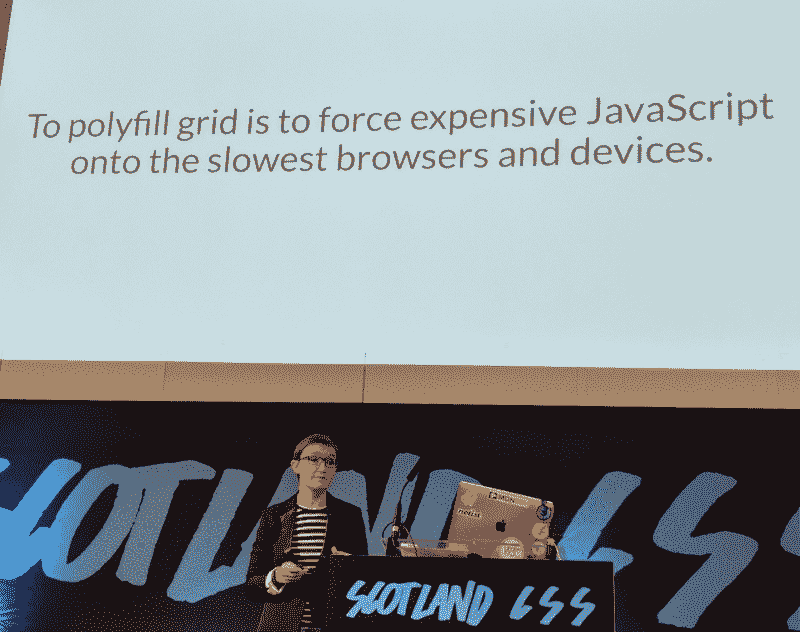
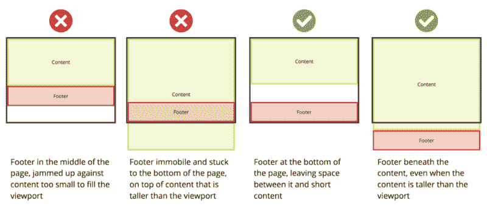

# CSS 网格的渐进式增强

> 原文：<https://www.freecodecamp.org/news/progressive-enhancement-with-css-grid-8138d4c7508c/>

CSS Grid(网格)现在已经出来一段时间了，在各大现代浏览器中[完全支持](https://caniuse.com/#search=css%20grid)。我将留给其他人去探究它为什么如此伟大，以及它使探索新的设计变得如此容易。如果你一直在寻找支持响应式网页设计的最佳方式，我还没有看到任何人不喜欢网格。它使用简单，但极其强大和灵活。

但是，我听到你说，我们的许多用户没有使用最新的浏览器版本，或者在 Chrome/Firefox 没有占据多数份额的市场上。说真的，重写我们所有的旧代码真的值得吗？

我也有类似的感觉，直到听到 Natalya Shelburne 的精彩演讲。她描述了她是如何开始使用 [CSS Grid 和 Bootstrap](https://open.nytimes.com/bootstrap-to-css-grid-87b3f5f830e4) 的，而不失去对旧浏览器的支持，通过**增强**而不是**删除**旧 CSS。



[Rachel Andrew](https://twitter.com/rachelandrew) by [Laura Kishimoto‏](https://twitter.com/chicgeek) at [ScotlandCSS](http://scotlandcss.com/)

重要的是，这没有使用任何 JavaScript polyfills，而是使用纯 CSS。正如雷切尔·安德鲁提到的:

> *众所周知，**不支持网格的浏览器是老式的**，速度较慢的浏览器，或者是在新兴市场的低功耗设备上最常见的浏览器。为什么要在这些设备上强制使用一堆 JavaScript 呢？*

Natalya 描述了如何在支持网格的浏览器中使用"[特性查询](https://developer.mozilla.org/en-US/docs/Web/CSS/@supports)"来实现网格，而不会失去现有的功能。MDN 将此称为“[渐进增强](https://developer.mozilla.org/en-US/docs/Web/CSS/CSS_Grid_Layout/CSS_Grid_and_Progressive_Enhancement)”，指出:

> 值得注意的是，你不必以一种*全有或全无*的方式使用网格。你可以从简单地用 grid 增强设计中的元素开始，否则这些元素可以用旧的方法显示。

### 使用网格

那么，我们该怎么做呢？

在之前的帖子中，我描述了一个简单的方法来“[保持你的页脚在它应该在的地方](https://medium.freecodecamp.org/how-to-keep-your-footer-where-it-belongs-59c6aa05c59c)”这避免了当页面的主要内容太小而不能将页脚推到页面底部时出现的问题。



From “[How to keep your footer where it belongs](https://medium.freecodecamp.org/how-to-keep-your-footer-where-it-belongs-59c6aa05c59c)”

这提供了一个机会来展示如何使用要素查询来使用格网。

**需要注意的是**这是一个**如何**在现有代码库中使用网格的例子，**不是为什么** 它是一个强大的工具*。*使用这个例子是因为它很小——因此可以理解**如何在更大的代码库中不受干扰地找到** 。

实际上，网格在这方面没有提供很大的改进。应该讨论使用新工具的好处，而不是仅仅因为它很酷就实施它！

例子如下。关于代码[的更多解释在这里](https://medium.freecodecamp.org/how-to-keep-your-footer-where-it-belongs-59c6aa05c59c)。

```
<!DOCTYPE html>
<html>
 <head>
   <link rel="stylesheet" type="text/css" href="main.css" />
 </head>
<body>
 <div id="page-container">
   <div id="content-wrap">
     <!-- all other page content -->
   </div>
   <footer id="footer"></footer>
 </div>
</body>
</html>
```

添加网格有两个主要部分:

*   添加所需的新网格属性
*   覆盖任何不再需要的属性。

`main.css`:

```
#page-container {
  position: relative;
  min-height: 100vh;
}
#content-wrap {
  padding-bottom: 2.5rem;    /* Footer height */
}
#footer {
  position: absolute;
  bottom: 0;
  width: 100%;
  height: 2.5rem;            /* Footer height */
}
```

`main.css`可以扩展为**添加**:

```
@supports (display: grid) {
    #page-container {
        position: static;               // override
        display: grid;                  // new   
        grid-template-rows: 1fr auto;   // new
        grid-template-columns: 100%;    // new
    }

    #content-wrap {
        padding-bottom: 0;              // override
    }
    #footer {
        position: static;               // override 
        height: auto;                   // override
    }
}
```

`position`被设置回其`static`的[默认值](https://developer.mozilla.org/en-US/docs/Web/CSS/position)，并且`padding`和`height`被重置为不干扰新布局的值。

`min-height: 100vh` 未引用。网格也使用它，所以不需要改变。

添加了三个新的相关属性。单个[分数单元](https://css-tricks.com/snippets/css/complete-guide-grid/#fr-unit) `1fr`的使用确保了`page-container`(在本例中为`content-wrap`)的第一个子元素将填充第二子元素`footer`的`auto`高度未占据的所有剩余空间。

这就是全部了！现在，支持网格的浏览器将使用特性查询中的代码，同时仍然完全支持不支持网格的浏览器。这甚至允许单个组件一次添加一个网格——团队可以看到这个过程是多么简单，而不需要投入大量的时间。

希望这说明了使用网格可以采用的增量方法。

#### 更复杂的用途

Natalya 撰写的更复杂的例子[启发了这篇更新文章，从中可以清楚地看到网格所提供的强大功能。这显示了大规模使用网格所能提供的力量。](https://open.nytimes.com/bootstrap-to-css-grid-87b3f5f830e4)

### 快速提示

可以在不访问旧浏览器或仿真器的情况下测试回退代码。暂时将`@supports (display: grid)`更改为不存在的值，例如`gridNO`，因此使用回退代码。

Firefox 提供了一些 Chrome 目前没有的优秀工具。这些是在“检查器”标签中激活的“网格显示设置”。这些设置有助于直观地说明 Grid 是如何执行的，这对于复杂的布局非常有用。


Firefox dev tools under Inspector

最后，雷切尔·安德鲁的一句话激励了我:

> 它不应该在所有浏览器中看起来都一样，它应该在所有浏览器中都是一个很好的体验。

很多公司的默认是争取在每个浏览器都有重复的体验。但是，值得考虑的是，在较旧、较慢的浏览器上，更简单的方法实际上可能是更好的体验吗？

感谢阅读？我希望这有助于激励您不仅在绿地项目中使用 Grid，而且在您今天可能使用的任何项目中使用 Grid！

### 资源

*   [从引导程序到 CSS 网格](https://open.nytimes.com/bootstrap-to-css-grid-87b3f5f830e4)
*   [用 CSS 网格将页脚保持在底部](https://dev.to/niorad/keeping-the-footer-at-the-bottom-with-css-grid-15mf)
*   [网格完整指南](https://css-tricks.com/snippets/css/complete-guide-grid/)
*   [CSS 网格布局和渐进增强](https://developer.mozilla.org/en-US/docs/Web/CSS/CSS_Grid_Layout/CSS_Grid_and_Progressive_Enhancement)
*   [使用 CSS 网格:支持没有网格的浏览器](https://www.smashingmagazine.com/2017/11/css-grid-supporting-browsers-without-grid/)

以下是我最近写的一些其他东西:

*   [使用 Pa11y CI 和 Drone 作为可访问性测试的把关者](https://hackernoon.com/using-pa11y-ci-and-drone-as-accessibility-testing-gatekeepers-a8b5a3415227)
*   [用 Nock 模仿 HTTP 请求](https://codeburst.io/testing-mocking-http-requests-with-nock-480e3f164851)