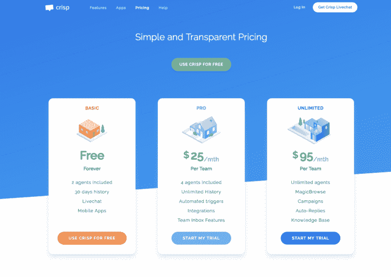
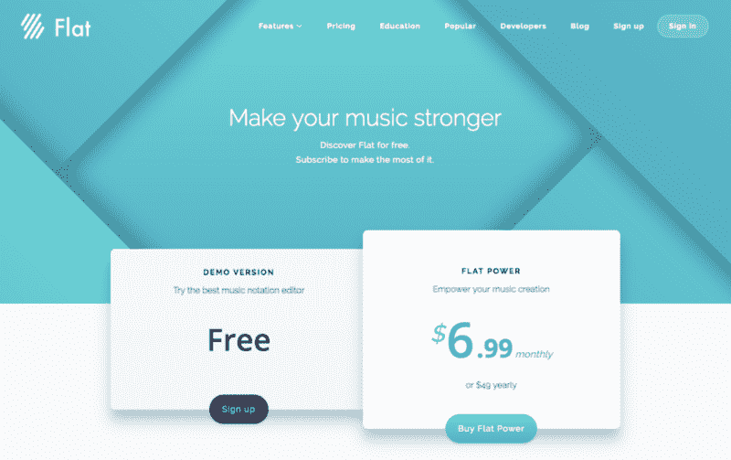
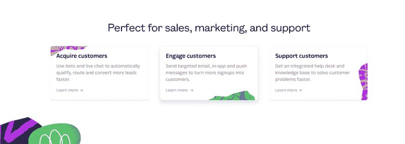
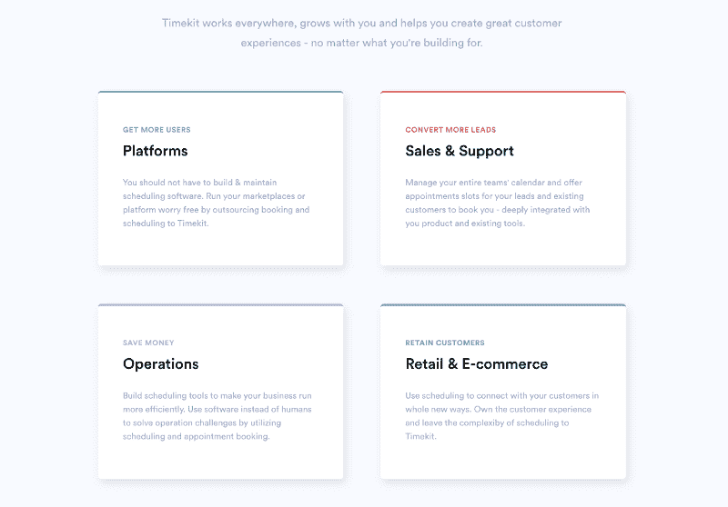
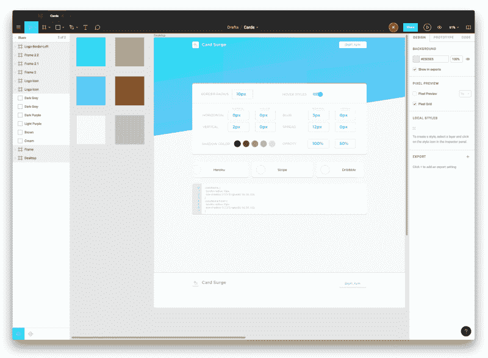
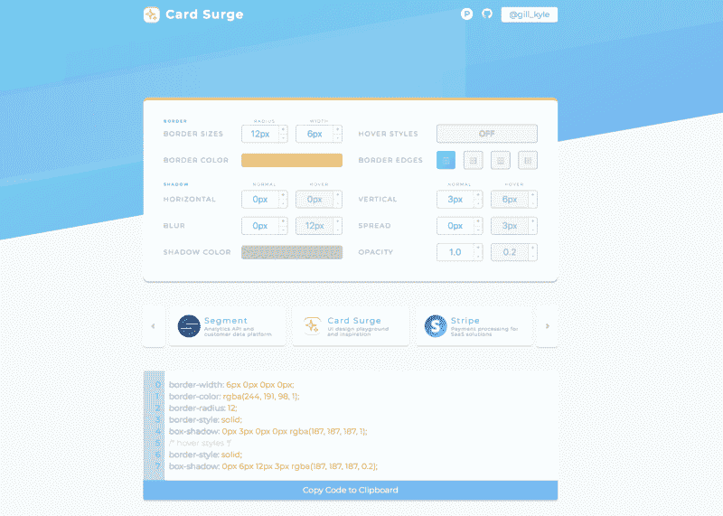

# 如何在 10 天内启动一个副业项目

> 原文：<https://www.freecodecamp.org/news/launching-a-side-project-in-10-days-615df3b0e808/>

凯尔·吉尔

# 如何在 10 天内启动一个副业项目

#### 征服从想法->设计->开发->部署过程的工具

像许多人一样，我并不缺少不需要真正存在的应用程序的想法。我倾向于保留这些想法，等待某个想象中的机会，在那里我有充足的空闲时间，我可以不考虑收入或支出来构建它们。对我来说，完成一个兼职项目的障碍往往不是知道如何做某事，而是找到实现它的动力和时间。

这就是为什么我设定了一个目标，要在 10 天内启动一个副业项目。

这篇文章不是关于用我不熟悉的新技术进行构建的优势，也不是我在做这件事时学到的 7 件事。相反，它是关于我快速构建一个 web 应用程序的过程，防止无关的想法混淆我的注意力，以及我实现它的工具带。最终结果是[卡涌](https://card.surge.sh/)。

### 创意(1 天)

我花了很多时间设计和建设网站，这意味着我也花了很多时间钻研流行品牌的精心设计的网站。我几乎不可避免地会打开 Chrome inspector 来检查样式是如何应用的，或者元素是如何布局的，因为我想看看什么可以将这些设计量化为好的。

然后我发现自己建立了自己的网站，并参考了这些例子。我重复打开检查器的过程，调整他们的风格，添加我自己的风格，没有得到它的权利，定位一切仍然不工作的`absolute`，并最终得出一些合理的东西。

在网上找到了其他对我有价值的设计工具，如[酷酷的](https://coolors.co/)或[英雄图案](https://www.heropatterns.com/)，我想我可以做一些类似的东西来满足自己的兴趣。所以我开始构建一种更快的方法来迭代卡片 UI。

我翻遍了现有的工具，发现它们看起来有点 meh。它们不容易创建一个像样的阴影(因为滑块经常用于很少需要调整超过一两个数字的输入)，并且没有参考实际工作的设计。我觉得这充分证明了我的想法。

### 设计(2 天)

你在任何地方都能看到卡片:定价页、产品页、列表等等。它们是对相关信息进行分组的一种很好的方式，也可以通过阴影或轮廓在页面上突显出来。您可以参考一些例子，了解它们是如何变化的:

[https://crisp.chat/en/pricing](https://crisp.chat/en/pricing)

[https://flat.io/pricing](https://flat.io/pricing)

[https://www.intercom.com](https://www.intercom.com/?ref=pages.xyz)

[https://www.timekit.io](https://www.timekit.io/)

它们可以有投影、某些边有边框而其他边没有边框、悬停样式、颜色可变，您甚至可以对单个元素应用多个阴影，以在投影中创建更具指数级的渐变。

我希望我的工具能帮助设计者和开发者创造出看起来像这样的卡片。我认为它应该看起来美观，并使用卡片本身来帮助演示如何让它们发光？

我开始在 [Figma](https://www.figma.com/) 中塑造我的想法，让自己不要过度关注那些我以后可以轻松完成的不重要的部分(比如添加品牌标志、添加社交图标等等)，并以此结束:

[https://www.figma.com/file/Cav6jxGjiOSOJLaZrnWUtiG1/Cards](https://www.figma.com/file/Cav6jxGjiOSOJLaZrnWUtiG1/Cards)

我知道我的最终产品中需要几样东西:

1.  一个编辑器来调整可以实时更新 UI 的样式
2.  一个可以在漂亮、新鲜的例子中旋转的滑块
3.  通过复制到剪贴板来导出代码的位置

这三个要素构成了设计，还有其他东西，比如它下面的内容，以及我如何精确地格式化我没有完成的页脚和页眉。它并没有完全充实，因为我想在我被不必要的改动弄得晕头转向之前开始构建，这些改动可能是好的。

### 开发(7 天)

我认为最耗时的部分实际上是为应用程序编写代码，我没有错。似乎总是有一些要担心的问题，直到你进入代码时才成为问题。事情会突然出现，比如表单元素的适当 UX、最初设计中没有考虑到的设计决策、您计划使用的库不支持的功能，或者以项目为代价要求您关注的 Twitter。？

我用 [Gatsby](https://www.gatsbyjs.org/) 引导开发过程，因为:

*   我可以使用 React 构建接口
*   将网站转换成 PWA 就像在配置文件中添加几行代码一样简单
*   托管将是一件轻而易举的事情，只需部署静态文件
*   我可以跳过许多最初的样板文件，开始以正确的方式构建有趣的部分
*   盖茨比真的很酷吗？

我从 [gatsby-default-starter](https://github.com/gatsbyjs/gatsby-starter-default) 开始，毫无问题地构建了大部分功能。我实现了第三方库，如 [react-color](https://github.com/casesandberg/react-color) 和 [react-slick](https://github.com/akiran/react-slick) 来消除构建复杂的滑块和颜色组件的需要。

在此期间，我决定如何在页面的其他部分布置我的设计没有包括的内容，并构建这些部分。我利用了 CSS Grid 等更新的趋势，使响应性布局变得更加容易。

在某一点上，我意识到我在应用程序布局中包含的对角线分隔线可以被抽象出来，变成其他人可以使用的 npm 包。在构建了一个简单的组件并在 npm 上发布了这个包之后，我意识到我已经偏离了完成项目的最初目标。这需要太多时间，所以我放弃了这个尝试(在把它添加到我前面提到的不必要的应用程序和项目列表中，以后再完成)。

我使用 GitHub [项目](https://github.com/gillkyle/card-surge/projects/1)来跟踪一些我想完成的优先级较低的小事，并最终采取了一些措施来添加用于谷歌分析的 [Gatsby 插件](https://www.gatsbyjs.org/plugins/)，一些元数据，并包括浏览器、移动设备和 PWA 清单配置的图标。

### 部署(大约 45 分钟)

**…发射！**

一旦我的应用程序按照我的设计和设想运行，我认为它仍然不够好。我设想了一个门户网站，用户可以在那里验证、保存和分享他们制作的样式，然后使用该应用程序作为返回的参考。我得出的结论是，这不是我的初衷，并决定总结一下我实际做了什么。如果以后我有动力或者发现它是人们会真正使用的东西，我可以在它的基础上进行构建。

因为我有一个目标，所以很容易就克服了那些不确定性的阻碍。

我终于意识到，我可以看看我的努力工作，欣赏我做的一件真正酷的事情:

The finished product in it’s natural habitat

差不多完成后，下一步就是部署它了。部署是一个非常简单的过程。我真的不想把钱投到一个领域的副业项目上，因为一两年后我可能就不太在乎了。所以我利用了 [Surge](http://surge.sh/) 在免费层托管你的网站的方式，并将其命名为 card surge，所以我所需要做的就是抢到 card 子域，我在 card.surge.sh 有了一个免费的品牌域名？。我运行 g `atsby build` ，然后运行 s `urge,`，我的代码在线并通过自动 SSL 在 CDN 上分发。

我也非常喜欢[Netlify](https://www.netlify.com/),所以我将 GitHub repo 指向 Netlify 上的一个项目，以自动构建任何对 Master 的拉请求或提交(当第一个拉请求进来时，在启动后仅仅几个小时，就派上了用场)。

不需要后台，我的网站就建立起来了，而且我没有花一分钱。

我用 [Kap](https://getkap.co/) 拍了一些截图和录音，写了一段描述，并在[产品搜索](https://www.producthunt.com/posts/card-surge)上发布了卡赞。

### 回首

快速工作并朝着完成日期(我已经在日历上看到了)努力真的很有收获。我不得不把问题简化成重要的事情，只解决那些实际上会妨碍我在截止日期前完成和启动的问题。

如果我找到另一个项目，我现实地认为我可以在几周内完成，我肯定会再做一次这样的冲刺。

克服任何保留，完成你一直等待完成的兼职项目——你不会后悔的！

### 感谢阅读！

如果你对我如何做某事、为什么做某事或我做错了什么有疑问，我很高兴在评论中、在 Twitter 上或通过电子邮件听到你的意见。

如果你觉得你读到的有趣或有帮助，欢迎留下一两个掌声，订阅未来的更新，或转发/分享这条推文:？