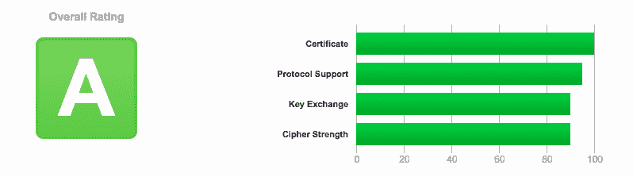
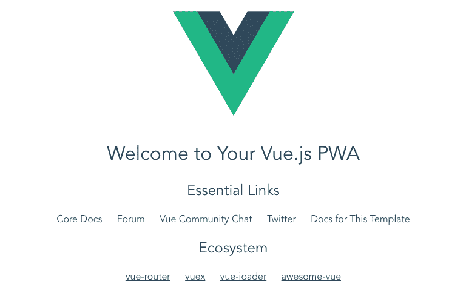
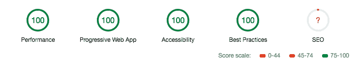

# 如何在高性能、安全的 NGINX 基础设施上创建 VueJS PWA

> 原文：<https://www.freecodecamp.org/news/vuejs-pwa-on-nginx-22360ee7a7bf/>

托马斯·赖内克

# 如何在高性能、安全的 NGINX 基础设施上创建 VueJS PWA

自从几个月前我的一个开发人员向我展示了渐进式网络应用程序的概念后，我就一直很好奇。最后我终于有时间把手弄脏了:-)

这篇文章描述了我的第一步和对基于花哨的 [VueJS](https://vuejs.org/) 框架的 PWAs 的高级介绍，并主要集中于它在一个安全的 [nginx](https://www.nginx.com/) 服务器上的部署。

以下是我用来深入这个话题的一些讲座:

[**Progressive Web Apps | Web | Google Developers**](https://developers.google.com/web/progressive-web-apps/)
[*light house，一款开源的自动化工具，用于提高您的 Progressive Web Apps 的质量，消除了许多…*developers.google.com](https://developers.google.com/web/progressive-web-apps/)[**使用 Vue - Pusher 开始使用 PWA 博客**](https://blog.pusher.com/getting-started-pwa-vue/)
[*在本教程中，将介绍如何使用 Vue 构建带有 Progressive Web Apps 的图书列表应用…*blog.pusher.com](https://blog.pusher.com/getting-started-pwa-vue/)

这是我们将要设置的场景的粗略架构。如您所见，这更像是一个传统的内部设置，我假设您拥有一个已配置并指向您的根服务器的域。在本文中，我不讨论基于云的部署:


base architecture

### 预热和 nginx 安装

让我们从一些准备工作开始，设置我们稍后将用于部署的基础架构:

*   如果你还没有，给你自己一个域名和一个根服务器，配置你的域名 DNS 记录(IPv4 和 IPv6)指向你的服务器。这里我就以我的个人网站 [www.thomas-reinecke.de](http://www.thomas-reinecke.de) 为例。
*   在您的服务器上，我假设您有 root/sudo 访问权限，[安装 nginx](https://www.digitalocean.com/community/tutorials/how-to-install-nginx-on-ubuntu-16-04) (基于 apt 的 linux 发行版的例子，如 debian 或 ubuntu)。

```
sudo apt-get install nginx
```

*   在*/etc/nginx/sites-available/default*上创建您的服务器定义，这看起来非常简单

```
server {    server_name www.thomas-reinecke.de thomas-reinecke.de;    root /server/thomasreinecke/nginx;}
```

*   在我们继续之前，测试您的 nginx 配置以确保它的语法是正确的

```
> nginx -t
```

```
nginx: the configuration file /etc/nginx/nginx.conf syntax is oknginx: configuration file /etc/nginx/nginx.conf test is successful
```

### 配置和保护 nginx

由于我们的计划是利用 PWA 服务人员，您的 web 应用程序必须只在 HTTPS 上运行(最好也在 HTTP/2 上运行)。此外，我们当然应该支持谷歌加强网络安全的努力。

> 从 2018 年 7 月 Chrome 68 发布开始，Chrome 将把所有 HTTP 网站标记为“不安全”。

幸运的是[让我们加密](https://letsencrypt.org/)为你的网络服务器提供免费的 SSL 证书，包括自动更新，你需要做的就是妥善保护它。

*   从“让我们加密”安装**证书机器人**

```
sudo apt-get install certbot python3-certbot python-certbot-nginx python3-certbot-nginx
```

*   基于我们之前完成的 nginx 服务器的初始配置， **certbot** 提供了一种非常方便的方式来为您的站点创建证书，包括对 nginx 服务进行端到端的重新配置，以支持 SSL 并将 HTTP 流量重定向到 HTTPs。

```
sudo certbot --nginx -d thomas-reinecke.de -d www.thomas-reinecke.de
```

*   它将询问您是否希望 certbot 重新配置您的 nginx 实例。

```
Please choose whether or not to redirect HTTP traffic to HTTPS, removing HTTP access.--------------------------------------------------------------------1: No redirect - Make no further changes to the webserver configuration.2: Redirect - Make all requests redirect to secure HTTPS access. Choose this fornew sites, or if you're confident your site works on HTTPS. You can undo thischange by editing your web server's configuration.--------------------------------------------------------------------Select the appropriate number [1-2] then [enter] (press 'c' to cancel):
```

*   选择第二个选项，然后放手。预计您在*/etc/nginx/sites-available/default*中的站点配置将如下所示:

```
# HTTPS configuration of my siteserver {  server_name thomas-reinecke.de www.thomas-reinecke.de;  root /server/thomasreinecke/nginx;
```

```
 location / {    index index.html index.htm;  }
```

```
 listen <your_IP>:443 ssl http2;   ssl_certificate <path_to_fullchain.pem>;   ssl_certificate_key <path_to_privkey.pem>;   include /etc/letsencrypt/options-ssl-nginx.conf;   ssl_dhparam /etc/letsencrypt/ssl-dhparams.pem; }
```

```
# HTTP configuration of my site, in any case redirecting to HTTPSserver {  if ($host = www.thomas-reinecke.de) {    return 301 https://$host$request_uri;  } 
```

```
 if ($host = thomas-reinecke.de) {    return 301 https://$host$request_uri;  } 
```

```
 listen <your_IP>:80 default;  server_name thomas-reinecke.de www.thomas-reinecke.de;  return 404; }
```

*   我在你网站的 HTTPs 配置区添加了 **http2** 选项，这不会来自 certbot。

关于这个过程的更多细节(包括你需要做什么来更新你的证书)可以在[这里](https://www.digitalocean.com/community/tutorials/how-to-secure-nginx-with-let-s-encrypt-on-ubuntu-16-04)找到。

现在是时候让你的 nginx 服务器运行了，所以我们创建了一个简单的 index.html 并重新启动 nginx 来运行它。

```
echo "Hello World!" > /server/thomasreinecke/nginx/index.htmlsudo systemctl reload nginx
```

恭喜你，你现在应该有你的安全网页在线。对 HTTP 的任何访问都将自动重定向到 HTTPS。你现在可以在[https://www.ssllabs.com/ssltest/](https://www.ssllabs.com/ssltest/)上测试它，你会得到 **A** 等级:)，多酷啊？



### 创建您的 vuejs PWA 并将其部署到 nginx

既然我们现在已经准备好了目标部署基础设施，那么是时候基于 vuejs CLI 创建您的第一个 PWA 了。

```
# install vue cli, skip if you already have itnpm install -g vue-cli
```

```
# create vue app based on pwa templatevue init pwa <your_app_name>
```

对于这个脚本向您提出的几个问题，请提供您的项目名称，对于其他问题，只需使用默认值。我不会深入研究基于模板创建的应用程序的实际变化。相反，让我们集中在部署和操作方面，在安全的 nginx 基础设施上运行它。接下来，构建您的应用程序，然后将其 dist 文件夹移动到您的 nginx web 根目录中:

```
# build your vuejs pwa appcd <folder of your app>npm run build
```

```
# copy your dist folder onto your server running nginxscp -r dist/* <your_server>:/server/thomasreinecke/nginx/
```

```
# on your server restart nginx to refreshsudo systemctl reload nginx
```

现在，您应该已经在 nginx 服务器上运行了 VueJS PWA:



当您使用一个普通的 HTTP URL 到达这个页面时，您会注意到一个到 HTTPs 的重定向，这正是我们想要的。现在是时候在我们的网站上运行 **Google Lighthouse** 了，看看效果如何。有关更多详细信息:

[**Lighthouse | Web 开发者工具| Google 开发者**](https://developers.google.com/web/tools/lighthouse/)
[*了解如何设置 light house 来审核您的 Web 应用。*developers.google.com](https://developers.google.com/web/tools/lighthouse/)

打开 Chrome >使用其开发工具>审计>运行审计。这就是我们从这个设置中得到的结果——是不是太棒了！？



### 结论

在本文中，我展示了如何设置一个安全的环境，在 nginx 服务器上运行基于 VueJS 的渐进式 Web 应用程序。我不得不承认，我认为这有点困难，但事实是:从零开始，我总共花了不到 3 个小时的时间，这非常令人惊讶。

建立一个安全、高性能的基础设施真的没什么大不了的，我鼓励每个处理内部部署的人都投入进去。