# 如何用 AWS 构建可伸缩的架构

> 原文：<https://www.freecodecamp.org/news/how-to-build-a-fully-scalable-architecture-with-aws-5c4e8612565e/>

在建立素食主义的过程中，我学到了什么？

现在，我们都知道新闻和媒体塑造了我们对所讨论话题的看法。当然这是因人而异的。有些人可能会比其他人受到更多的影响，但总会有一些意见被传达。

考虑到这一点，我认为在媒体上看到针对某个特定话题或人物的情绪的不断发展会非常有趣。

对我来说，[素食主义](https://github.com/timgrossmann/stateOfVeganism)是一个有趣的话题，尤其是因为它被媒体频繁提及。既然媒体的观点会改变人们的看法，那么看看他们传达了什么样的“情绪”将会很有趣。

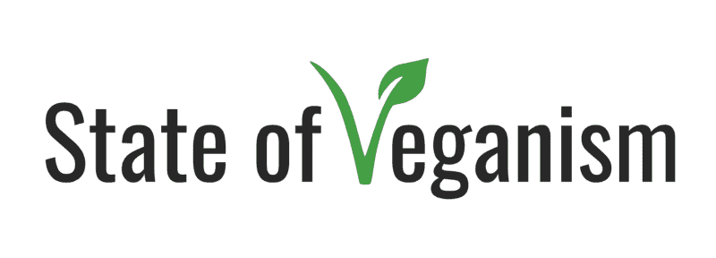

这就是整个项目的意义所在。它收集谈论或提及纯素食主义的新闻，找出它被提及的背景，并分析它是传播消极还是积极。

当然，如果作者只在交流信息方面做得很好，那么很大一部分被分析的文章应该被归类为“中性”，所以我们也应该记住这一点。

我意识到这是一个获得新工具集的绝佳机会，尤其是当我想到每天发布的文章数量时。
所以，我想建立一个可扩展的架构——一个在没有流量和只有几篇文章的时候便宜/免费的架构，但是一旦提及量或流量增加，就可以轻松地无限扩展。我听到云在召唤。

### 设计架构

规划就是一切，尤其是当我们想确保架构从一开始就能扩展时。

从纸上开始是一件好事，因为它使你能够非常粗略和快速地迭代。

你的初稿永远不会是你的最终稿，如果是，你可能已经忘记质疑你的决定了。

对我来说，提出一个合适的，甚至更重要的，合理的架构的过程是我想在这个项目中改进的关键。不同的组件看起来很“容易”实现和构建，但是提出正确的系统、正确的通信和漂亮、干净的数据管道才是真正有趣的部分。

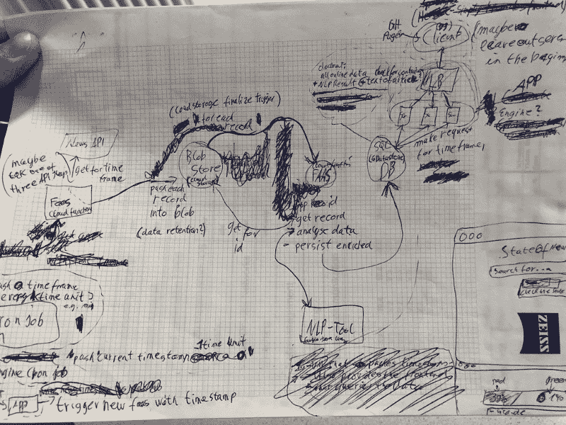

First Concept with removed components

一开始，我的设计中有一些瓶颈，在某一点上，会使我的整个系统瘫痪。在这种情况下，我考虑添加更多“可扩展”的服务，比如队列，来对负载进行排队并处理它。

当我最终有了一个可以处理大量负载并可动态扩展的设计时，我猜想，它是一个烂摊子:太多的服务，大量的开销，以及一个整体“肮脏”的结构。

几天后，当我看到这个架构时，我意识到我可以通过一些改变来优化很多东西。我开始移除所有队列，并考虑用 FAAS 组件替换实际的虚拟机。在那次会议之后，我有了一个更加清晰且可扩展的设计。

#### 考虑结构和技术，而不是实现

这是我在项目早期犯的错误之一。我从研究 IBM 的 BlueMix 能提供什么服务开始，并从那里继续下去。在我的设计中，哪些可以混合使用，哪些可以和触发器、队列等等一起工作？

最后，我可以通过简单地**离开 it，考虑我需要的整体结构和技术，而不是不同的实现**，来消除服务方面的大量开销。

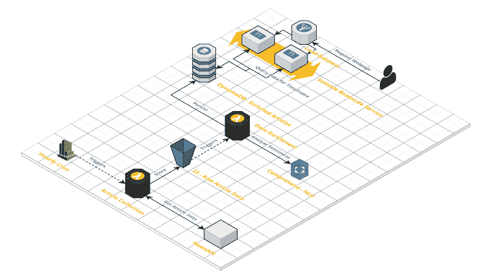

Final Architecture

**分解成几个不同的步骤**，项目应该:

*   每小时(开始时，因为那时只有几篇文章->可以每分钟甚至每秒钟)从 so [me News](http://newsapi.org/) API 获取新闻并存储。
*   处理每篇文章，分析其中的情感，并将其存储在数据库中以供查询。
*   访问网站后，获取所选范围的数据并显示条形/文章。

所以，我最终得到了一个 CloudWatch 触发器，它每小时触发一次 Lambda 函数。这个函数从 NewsAPI 获取最近一个小时的新闻数据。然后，它将每篇文章作为一个单独的 JSON 文件保存到 S3 桶中。

这个桶在 ObjectPut 上触发另一个 Lambda 函数。这将从 S3 加载 JSON，为部分词“vegan”的出现创建“上下文”，并将创建的上下文发送给 AWS 理解情感分析。一旦该函数获得了当前文章的情感信息，它就将它写入 DynamoDB 表。

该表是前端显示数据的根。它为用户提供了一些过滤器，让他们可以更深入地研究数据。

> 如果你对更深入的解释感兴趣，请直接跳到各个组件的描述。

### 谁是“唯一的”云提供商？

在我知道我要使用 AWS 之前，我尝试了另外两家云提供商。对于选择哪家提供商，这是一个非常基本且非常主观的观点，但也许这将有助于其他“云初学者”的选择。

我从 IBMs Bluemix Cloud 开始，转到 Google Cloud，最后用 AWS 结束。以下是我选择的一些“理由”。

这里列出的许多要点实际上只告诉了整体文档和社区有多好，我遇到的问题中有多少已经存在，以及哪些在 StackOverflow 上有答案。

#### 文档和社区是关键

尤其是对于初学者和从未接触过云技术的人来说，情况肯定是这样的。文档，更重要的是，有文档和解释的例子是 AWS 的最佳选择。

当然，您不必满足于单一提供商。在我的情况下，我可以很容易地使用谷歌的 NLU 工具，因为在我看来，他们带来了更好的结果。我只是想把我的整个系统放在一个平台上，如果我想的话，以后我还可以改变它。

所有提供商的入门包实际上都非常好。你将在谷歌云上获得 300 美元，这将使你能够做很多事情。然而，这也是一种危险，因为如果你用光了这笔钱，却忘记关闭和破坏所有增加成本的服务，你将被收费。

BlueMix 只能非常有限地访问免费层上的服务，如果你想测试完整的套件，这有点遗憾。

对我来说，Amazon 是最好的一个，因为他们也有一个免费层，允许你使用几乎所有的功能(有些只能使用最小的实例，如 EC2.micro)。

就像我已经提到的，这是一个关于选择哪一个的非常简单和主观的观点…对我来说，AWS 是最容易和最快的，不需要前期投入太多时间。

### 组件

整个项目基本上可以分为三个需要努力的主要部分。

**文章集合，**由每小时的 cron 作业、调用 NewsAPI 的 lambda 函数和存储所有文章的 S3 桶组成。

**数据丰富**部分，它从 S3 加载文章，创建上下文并使用 understand 对其进行分析，DynamoDB 存储丰富的数据供以后在前端使用。

以及当用户请求网页时显示的**前端**。该组件由一个图形用户界面、一个为网页提供服务的可伸缩服务器服务以及 DynamoDB 组成。


#### 文章收藏


Article Collection Part

整个项目的第一步，也可能是最容易的一步，就是收集所有包含关键词“纯素食者”的文章和新闻。幸运的是，有大量的 API 提供这样的服务。

其中一个是 NewsAPI.org。

有了他们的 API，这变得非常容易理解。它们有不同的端点。其中一个叫做“everything”，顾名思义，它只返回包含给定关键字的所有文章。

在这里使用 Node.js，看起来像这样:

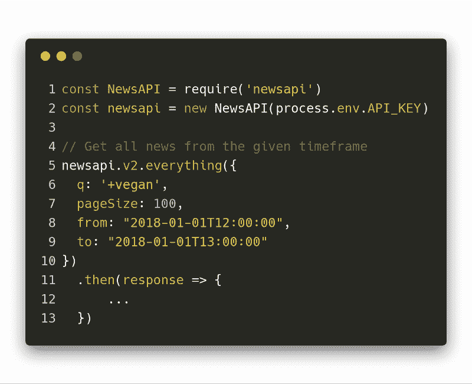

NewsAPI query for 1 hour of data from the beginning of the year

查询字符串“vegan”前面的+号仅仅意味着该单词必须出现。

页面大小定义了每个请求将返回多少文章。你一定要留意这一点。例如，如果您的系统内存极其有限，那么为了避免过大的响应导致实例崩溃，进行更多的请求(使用提供的游标)是有意义的。

NewsAPI.org 的回应是这样的。如果你有兴趣看更多的例子，去他们的[网站](https://newsapi.org)看看，那里有很多展示的例子。

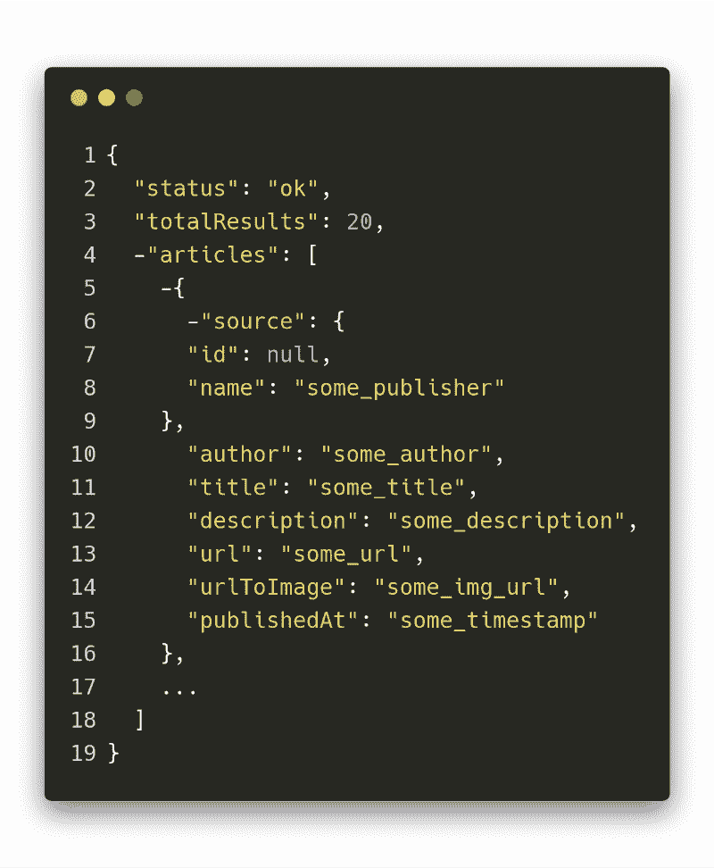

如你所见，那些文章记录仅仅给出了文章本身的一个非常基本的观点。像素食主义者这样的术语，出现在文章的某些上下文中，但不是文章的主题，在标题或描述中没有出现。因此，我们需要数据丰富组件，稍后我们会谈到它。然而，这正是存储在 S3 存储桶中的 JSON 数据类型，以备进一步处理。

在本地尝试一个 API 和在云中实际使用它非常相似。当然，有些时候你不想把 API 密匙粘贴到实际代码中，而是使用环境变量，但仅此而已。

AWS 的 Lambda 设置有一个非常简洁的 GUI。这确实有助于您理解组件的结构，并可视化哪些服务和元素连接到它。

在第一个组件的情况下，我们在“输入”端有 CloudWatch 每小时触发，在“输出”端有 CloudWatch 和作为存储系统的 S3 存储桶的日志记录。

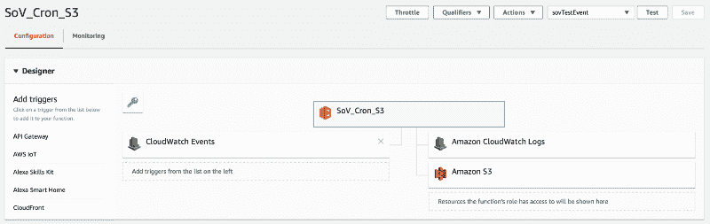

Lambda GUI on AWS

所以，在把所有东西放在一起之后，导入节点。JS SDK for AWS，并在本地测试整个脚本，我最终将它部署为 Lamdba 函数。

最终的脚本实际上非常简短易懂:

```
 const NewsAPI = require('newsapi')
const moment = require('moment')
const AWS = require('aws-sdk')

exports.handler = async (event) => {
  // Right now we only need to query the API every hour because there
  // are very few articles that contain the word veganism
  const toTS = moment().format('YYYY-MM-DDTHH:mm:ss')
  const fromTS = moment(toTS).subtract(1, 'hour').format('YYYY-MM-DDTHH:mm:ss')

  const newsapi = new NewsAPI(process.env.API_KEY)
  const s3 = new AWS.S3()
  const myBucket = process.env.S3_BUCKET

  // Get the news from the given timeframe
  return new Promise((resolve, reject) => {
    newsapi.v2.everything({
      q: '+vegan',
      pageSize: 100,
      from: fromTS,
      to: toTS
    })
      .then(response => {
        console.log(`Working with a total of ${response.articles.length} articles.`)

        // Write all the documents to the S3-bucket
        const promisedArticles = response.articles.map(article => {
          const myKey = `sov_${article.publishedAt}.json`

          const params = {Bucket: myBucket, Key: myKey, Body: JSON.stringify(article, null, 2)}

          // Saving the record for given key in S3
          return new Promise((res, rej) => {
            s3.putObject(params, (err, data) => {
              if (err) {
                console.error(`Problem with persisting article to S3... ${err}`)
                rej(err)
                return
              }

              console.log(`Successfully uploaded data to ${myBucket}/${myKey}`)
              res(`Successfully uploaded data to ${myBucket}/${myKey}`)
            })
          })
        })
    })
      .catch(err => {
        console.error(`Encountered a problem... ${err}`)
        reject(err)
      })
  })
}
view rawsov_article_collection.js hosted with ❤ by GitHub
```

sov_article_collection.js

GUI 有一些很好的测试特性，你可以用手简单地触发你的功能。

但是什么都没用…

在谷歌搜索了几秒钟后，我找到了“政策”这个词。我以前听说过他们，但是从来没有读过他们或者试图真正理解他们。

基本上，它们描述了什么服务/用户/组被允许做什么。这是缺失的部分:我必须允许我的 Lambda 函数向 S3 写一些东西。(我不会在这里详述，但是如果你想跳到政策，可以直接看文章的结尾。)

AWS 中的策略是一个简单的 JSON 风格的配置，在我的文章收集函数中，它看起来像这样:

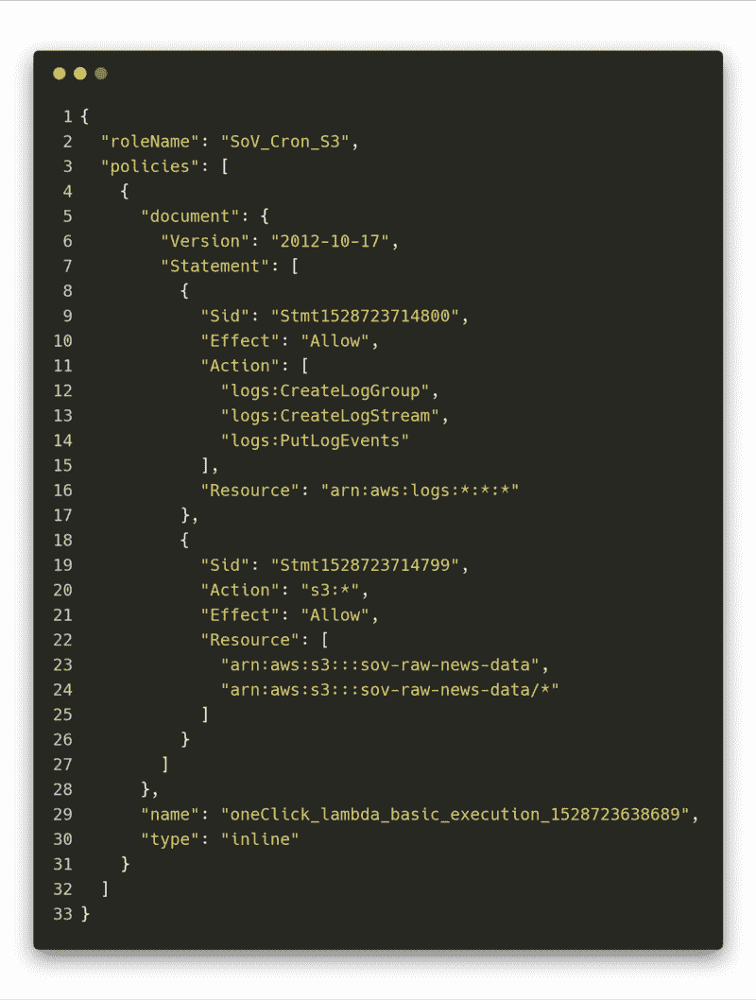

这是描述前面提到的函数的“输出”端的配置。在语句中，我们可以看到它获得了访问不同方法的测井工具和 S3。

为 S3 存储桶分配资源的奇怪之处在于，如果在 S3 存储桶的选项中没有另外说明，那么您必须将根和“下面的所有内容”作为两个单独的资源提供。

> 上面给出的例子允许 Lambda 函数对 S3 桶做任何事情，但是这不是你应该设置你的系统的方式！您的组件应该只被允许做它们被指定的事情。

一旦这个被输入，我终于可以看到记录被放进我的 S3 桶。

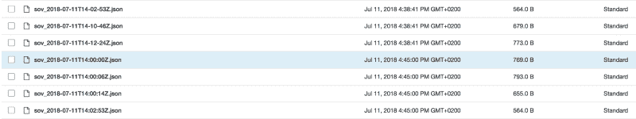

#### 特殊字符是邪恶的…

当我试图从 S3 桶中取回数据时，我遇到了一些问题。它就是不给我创建的键的 JSON 文件。我很难找到问题所在，直到有一次，我意识到，默认情况下，AWS 为您的服务启用日志记录。

这是金子！

当我查看日志时，问题马上就出现了:似乎 S3 触发器发送的键值做了一些 URL 编码。然而，这个问题是绝对看不到的，当只看 S3 键名时，一切都显示正确。

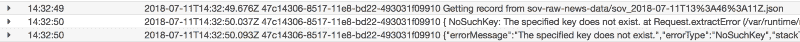

这个问题的解决非常简单。我只是用破折号替换了每个特殊字符，它不会被一些编码值替换。

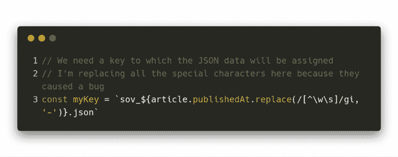

Solution to the URLEncoded key problem

因此，一定不要冒险在密钥中输入一些特殊字符。这可能会节省您大量的调试和工作。


#### 数据丰富

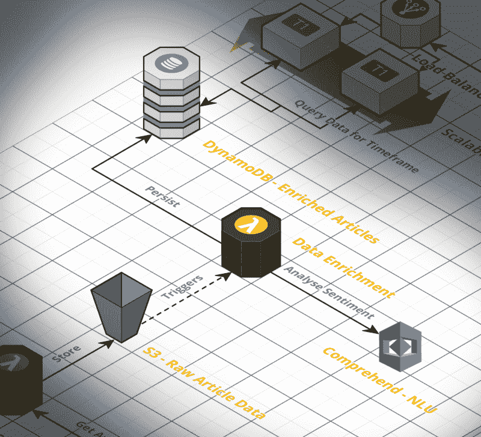

Data Enrichment Part

既然我们现在已经将所有的文章作为单个记录放在了我们的 S3 存储桶中，我们就可以考虑进行浓缩了。我们必须结合一些步骤来完成我们的渠道，回想一下，如下所示:

*   从 S3·巴特那里得到记录。
*   结合标题和描述，从实际文章中构建一个上下文。
*   分析创建的上下文并用结果丰富记录。
*   将丰富的文章记录写入我们的 DynamoDB 表。

关于 JavaScript 中的承诺，一个真正令人敬畏的事情是，您可以完全按照您在文本中描述管道的方式来建模管道。如果我们将代码与将要采取的步骤的解释进行比较，我们可以看到相似之处。

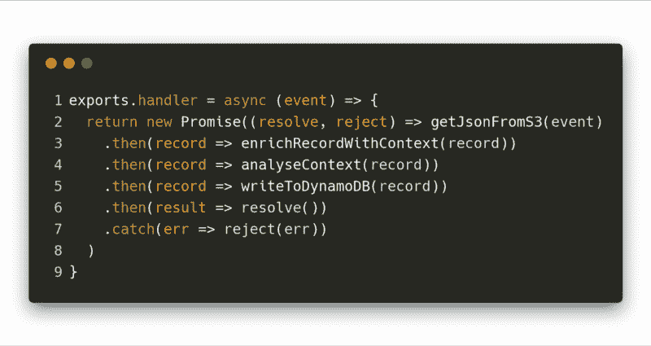

如果您仔细看看上面代码的第一行，您可以看到导出处理程序。这一行总是在 Lambda 函数中预定义的，以便知道调用哪个方法。这意味着您自己的代码属于异步块的花括号。

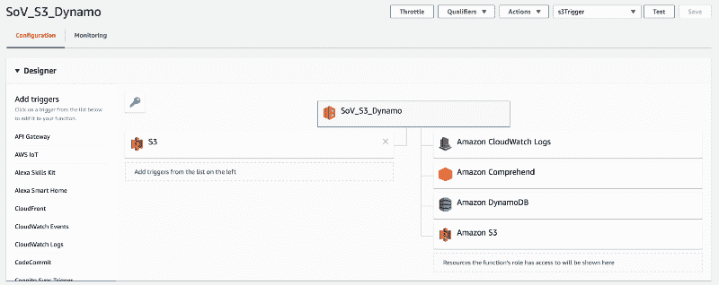

对于数据丰富部分，我们需要更多的服务。我们希望能够从理解情绪分析中发送和获取数据，将我们的最终记录写入 DynamoDB，并且也有日志记录。

你注意到“输出”端的 S3 服务了吗？**这就是为什么我总是将输出放在引号**中，即使我们只想在这里读取数据。它显示在右手边。我基本上只是列出了我们的函数与之交互的所有服务。

该策略看起来类似于文章收集组件的策略。它只是有更多的资源和规则来定义 Lambda 和其他服务之间的关系。

尽管在我看来，谷歌云拥有“更好的”NLU 组件，但我只是喜欢 AWS 服务的简单性和统一 API。如果你用过其中的一个，你会认为你知道所有的。例如，下面是如何从 S3 获取记录以及在 Node.js 中情感检测的工作方式:

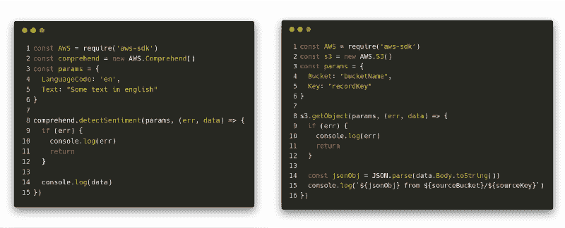

数据丰富组件最有趣的任务之一可能是创建文章中单词 vegan 的“上下文”。

提醒一下——我们需要这个上下文，因为很多文章只提到了“纯素食主义”这个词，而没有把“纯素食主义”作为主题。

那么，我们如何从文本中提取部分呢？我去找正则表达式。它们使用起来非常好，你可以使用像 [Regex101](http://regex101.com) 这样的游戏场来玩一玩，找到适合你的用例的正则表达式。

面临的挑战是提出一个正则表达式，可以找到包含单词“vegan”的句子。不知何故，这比我想象的要更难，因为整个文本段落都有换行符等等。

最终的正则表达式如下所示:

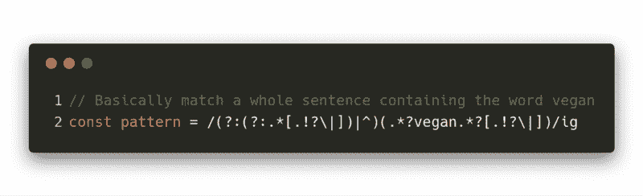

问题是，对于长文本，由于超时问题，这是行不通的。这种情况下的解决方案相当“简单”…我简单地抓取了文本并通过换行符将其拆分，这使得 RegEx 模块的处理更加容易。

最终，整个上下文“创建”是一个混合物，它包含了**拆分文本、过滤包含单词 vegan 的段落、从该段落中提取匹配的句子，并将其重新组合在一起**，以便可以在情感分析中使用。

此外，标题和描述也可能起作用，所以如果它们包含“纯素食者”这个词，我会将它们添加到上下文中。

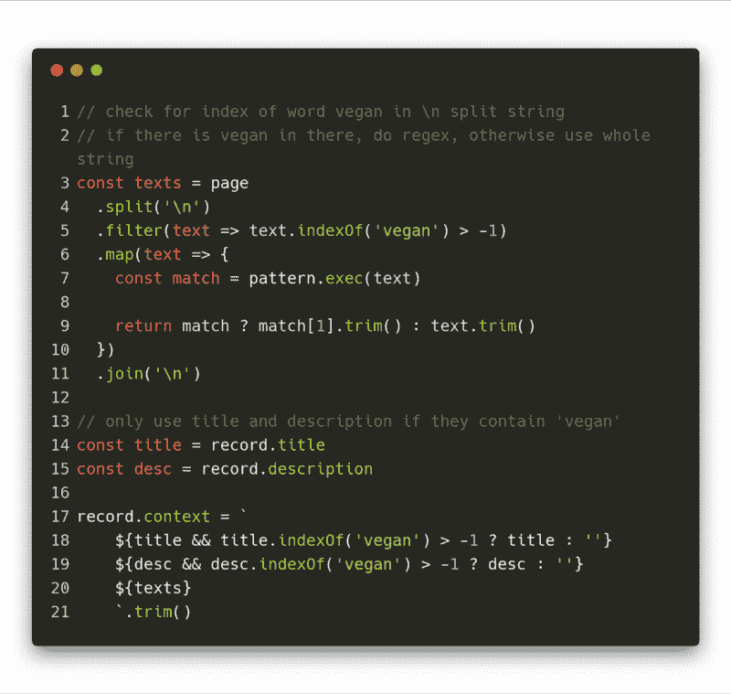

一旦不同步骤的所有代码就绪，我想我可以开始构建前端了。但是有些事情不对劲。有些记录没有出现在我的 DynamoDB 表中…

#### **dynamo db 中的空字符串也是邪恶的**

当检查我已经运行的系统的状态时，我意识到有些文章根本不会被转换成 DynamoDB 表条目。

检查完日志后，我发现了这个异常，这让我非常困惑…

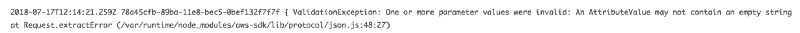

老实说，这确实是一种奇怪的行为，因为正如在[讨论](https://forums.aws.amazon.com/thread.jspa?threadID=90137)中所述，空字符串的语义和用法与空值完全不同。

然而，由于我无法改变 DynamoDB 的设计，我必须找到一个解决方案来避免出现空字符串错误。

对我来说，这真的很容易。我只是遍历了整个 JSON 对象，检查是否有空字符串。如果有，我只是用 null 替换了这个值。就是这样，工作起来很有魅力，不会引起任何问题。(不过，我需要检查它在前端是否有值，因为获取空值的长度会引发错误)。

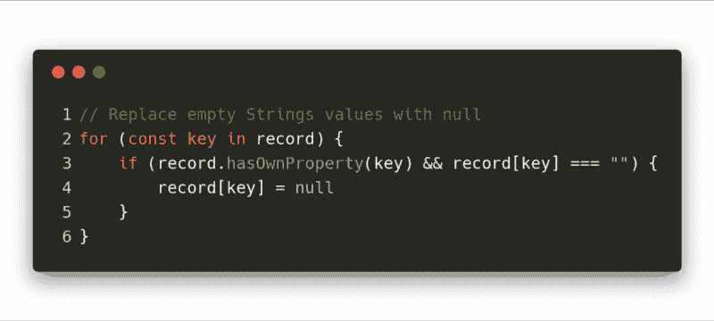

“Dirty” Fix for the empty String problem

#### 前端

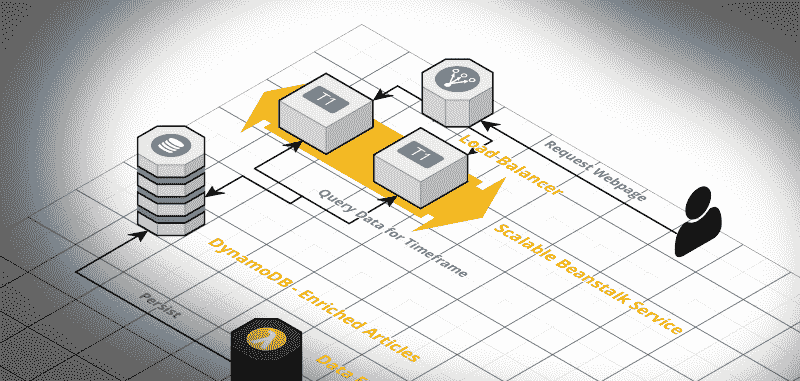

Frontend Part

最后一部分是实际创建一个前端并部署它，这样人们就可以访问页面并看到素食主义的状态。

当然，我在考虑是否应该使用 Angular、React 或 Vue.js 这样的前端框架……但是，我选择了绝对老派的、普通的 HTML、CSS 和 JavaScript。

我对前端的想法非常简约。基本上它只是一个分为三个部分的酒吧:积极，中立和消极。当点击其中任何一个时，它会显示一些标题和链接，链接到与这种情绪分类的文章。

最后，这正是它原来的样子。你可以在这里查看页面。我想过在 stateOfVeganism.com 现场直播，但我们会看到…

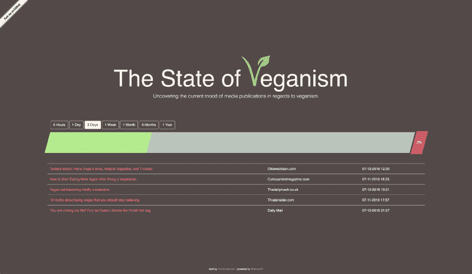

GUI of StateOfVegnsim

> *一定要注意已被归类为“负面”的文章的搞笑第三条；)*

在 AWS 的服务上部署前端是我必须考虑的另一件事。我肯定想要一个已经包含弹性伸缩的服务，所以我必须在弹性容器服务和弹性 Beanstalk(实际的 EC2 实例)之间做出决定。

最后，我选择了 Beanstalk，因为我非常喜欢这种简单的方法和难以置信的简单部署。你基本上可以把它和 Heroku 的设置方式进行比较。

附注:我的自动伸缩小组不被允许部署 EC2 实例，因为我在 AWS 上使用免费层，所以我遇到了一些问题。但是在 AWS 支持的几封电子邮件之后，一切都开箱即用了。

我刚刚部署了一个 Node.js Express 服务器应用程序，它在每条路径上为我的前端服务。

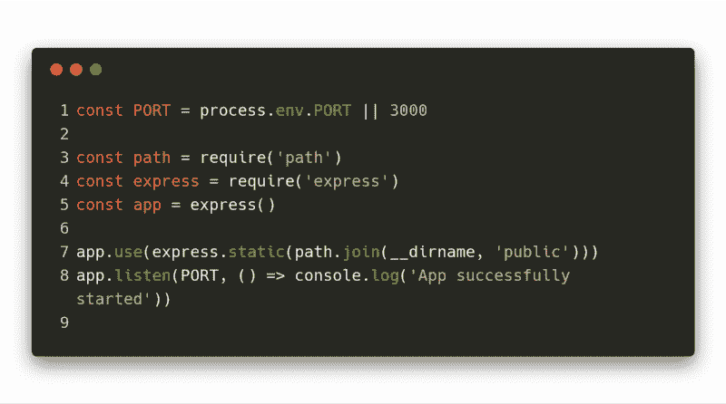

默认情况下，这个设置提供了驻留在“public”文件夹中的 index.html，这正是我想要的。

当然这是最基本的设置。对于大多数应用程序来说，这不是推荐的方式，因为您必须提供凭证才能访问 DynamoDB 表。最好进行一些服务器端呈现，并将凭证存储在环境变量中，这样就没有人能够访问它们。

#### 耍酷并在前端部署 AWS 键

这是你永远不应该做的事情。但是，由于我将这些凭证的访问权限限制为 DynamoDB 表的 scan 方法，如果您感兴趣，可以有机会更深入地研究我的数据。

我还限制了可以完成的请求的数量，以便一旦超过免费的每月限额，凭证将“停止工作”，只是为了确保这一点。

但是，如果您感兴趣的话，可以随意查看数据并尝试一下。只要确保不要过度，因为 API 会在某个时候停止向前端提供数据。

### 政策，政策？…政策！

当我开始使用云技术时，我意识到必须有一种方法来允许/限制对单个组件的访问并创建关系。这就是政策发挥作用的地方。它们还通过为您提供授予特定用户和组权限所需的工具来帮助您进行访问管理。在某一点上，你可能会纠结于这个话题，所以[稍微了解一下这个话题](https://docs.aws.amazon.com/IAM/latest/UserGuide/access_policies.html)是有意义的。

AWS 中基本上有两种类型的策略。两者都是简单的 JSON 风格的配置文件。但是，其中一个被分配给资源本身，例如 S3，另一个被分配给角色、用户或组。

下表显示了关于您可能希望为任务选择哪种策略的一些非常粗略的陈述。

那么，实际的区别是什么呢？当我们比较这两种政策类型的例子时，这一点可能会变得更加清楚。


IAM-Policy and Resource Policy

左边的策略是 IAM 策略(或基于身份的策略)。正确的是基于资源的政策。

如果我们开始逐行比较它们，我们看不出任何区别，直到我们到达定义与一些服务相关的一些规则的第一个语句。在这种情况下，它是 S3。

在 Resource-Policy 中，我们看到了 IAM-Policy 中缺少的一个名为“Principal”的属性。在资源策略的上下文中，这描述了“分配”给该规则的实体。在上面给出的例子中，这将是用户 Alice 和 root。

另一方面，为了用 IAM-Policies 实现完全相同的结果，我们必须将左边的策略分配给我们现有的用户 Alice 和 root。

根据您的用例，使用其中一种可能是有意义的。这也是一个你的“风格”或惯例或你的工作场所是什么的问题。

### 下一步是什么？

素食主义的状态已经开始了。然而，这并不意味着没有改进的余地。有一件事我必须努力去做，例如，Pinterest 上的食谱没有被归类为“积极的”，而是“中性的”。但是基本功能正常工作。数据管道工作得很好，如果出现任何问题，我将在启用 CloudWatch 的情况下进行良好的日志记录。

能够真正思考并建立这样一个系统真是太好了。质疑我的决定对优化整个架构非常有帮助。

下一次你考虑构建一个附带项目的时候，考虑与云提供商之一一起构建它。一开始可能会投入更多的时间，但是**学习如何使用 AWS 这样的基础设施来使用和构建系统确实会帮助你成长为一名开发人员**。

我很想听听你的项目和你建造的东西。[伸出手](mailto:contact.timgrossmann@gmail.com)跟我说说他们。

感谢您的阅读。请务必在 YouTube 上关注我，并在 GitHub 上关注 T2 的素食主义状况。

别忘了点击鼓掌按钮，在 [Twitter](https://twitter.com/timigrossmann) 、 [GitHub](https://github.com/timgrossmann) 、 [Youtube](https://www.youtube.com/channel/UC9_Bk9247GgJ3k9O7yxctFg) 和[脸书](https://www.facebook.com/profile.php?id=100000656212416)上关注我，跟随我的旅程。

我总是在寻找新的机会。
所以[请随时联系我](mailto:contact.timgrossmann@gmail.com)。我很想和你联系。

另外，我目前正计划从 2019 年 3 月开始在新加坡进行为期半年的实习。我想尽可能多地认识你们。如果你住在新加坡，请联系我们。我想边喝咖啡或吃午饭边聊天。