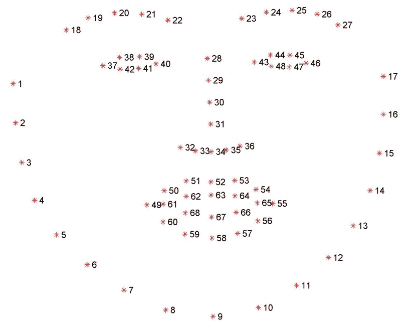
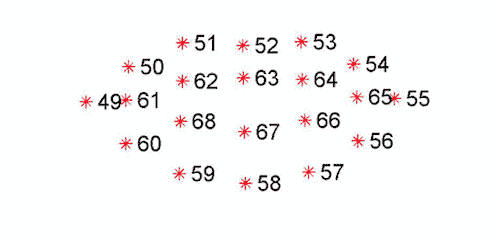
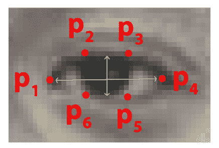
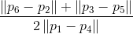
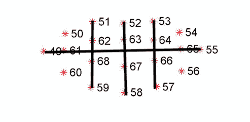
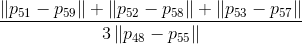
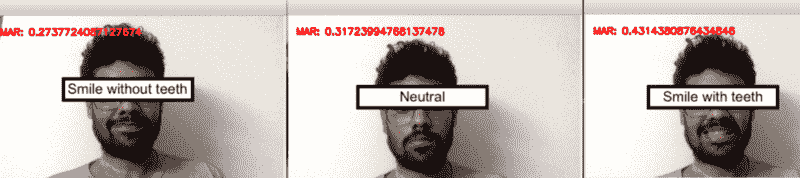
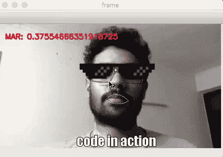

# Smilefie:如何通过检测微笑来自动捕捉自拍

> 原文：<https://www.freecodecamp.org/news/smilfie-auto-capture-selfies-by-detecting-a-smile-using-opencv-and-python-8c5cfb6ec197/>

作者里沙夫·阿加瓦尔

# Smilefie:如何通过检测微笑来自动捕捉自拍


Oppo doing some cool stuff!

十秒外卖:使用 Python 和 OpenCV 创建一个应用程序，在检测到微笑时自动捕捉自拍。现在让我们开始吧。:)

我看到了 Oppo 的这个[广告](https://www.youtube.com/watch?v=aTQK2o-eW1Y)——当美丽的女演员对着镜头微笑时，手机会自动捕捉自拍。鉴于 Python 中精彩的 **dlib** 库，这似乎是一个相当简单的挑战。

在这篇文章中，我将讨论如何创建一个类似的应用程序，在检测到微笑时从网络摄像头捕捉自拍。**全部在~50 行代码**中。

### 流程概述

1.  使用 dlib 中的面部标志检测器获得嘴部坐标
2.  使用嘴部长宽比(MAR)设置微笑阈值
3.  访问网络摄像头以设置实时流
4.  捕捉图像
5.  保存图像
6.  关闭凸轮进给

### 所需的库

*   **Numpy:** 用于快速矩阵计算和操作。
*   **dlib** :包含面部标志的库。
*   **Cv2** :打开的 Cv 库，用于图像处理和保存。
*   **Scipy.spatial** :用于计算面部点之间的欧氏距离。
*   **Imutils** :访问视频流的库。

所有库都可以使用 pip，**安装，除了** dlib。对于 dlib，我们必须安装 **CMake** 和 **boost** 。以下是如何使用 **brew** 在 macOS 上安装它们。

如果没有 brew，[下面介绍如何安装**家酿**](https://www.howtogeek.com/211541/homebrew-for-os-x-easily-installs-desktop-apps-and-terminal-utilities/) 。

#### **安装 CMake**

```
brew install cmake
```

#### **安装升压**

```
brew install boostbrew install boost-python --with-python3
```

第二个命令确保 boost 可用于 **Python 3** 。

#### 安装 dlib

在这之后，我们可以使用

```
pip install dlib
```

提示:我喜欢为每个独立的项目使用 **Anaconda、**虚拟环境。[这里的](https://medium.freecodecamp.org/why-you-need-python-environments-and-how-to-manage-them-with-conda-85f155f4353c)是一个关于 **conda** 环境的原因和方法的伟大博客。

#### **导入库**

```
from scipy.spatial import distance as distfrom imutils.video import VideoStream, FPSfrom imutils import face_utilsimport imutilsimport numpy as npimport timeimport dlibimport cv2
```

### **面部标志检测器**

面部标志检测器是 dlib **内部实现的 API。**产生 ***68 个 x- y 坐标*** 映射到特定的面部结构。

这可以想象为:



Facial landmarks index template taken from [PyImageSearch.com](https://www.pyimagesearch.com/2017/04/03/facial-landmarks-dlib-opencv-python/)

我们将重点关注可以通过点范围**【49，…，68】进入的口。**有二十个坐标。

使用 dlib，我们可以使用以下代码获得这些功能:

```
shape_predictor= “../shape_predictor_68_face_landmarks.dat”detector = dlib.get_frontal_face_detector()predictor = dlib.shape_predictor(shape_predictor)(mStart, mEnd) = face_utils.FACIAL_LANDMARKS_IDXS[“mouth”]
```

获取嘴巴的第一个和最后一个坐标。

你可以在这里下载预先训练好的地标文件[或者直接](http://dlib.net/files/shape_predictor_68_face_landmarks.dat.bz2)[发邮件](mailto:rra.iitk@gmail.com)给我，我会发给你的。记得提取。

### 微笑功能

下图只显示了二十个口的坐标:



Mouth part cropped from [PyImageSearch.com](https://www.pyimagesearch.com/2017/04/03/facial-landmarks-dlib-opencv-python/)

受两篇关于眨眼检测的文章的启发，我创建了一个嘴部长宽比(MAR)。这些是使用面部标志 *的[实时眨眼检测。](http://vision.fe.uni-lj.si/cvww2016/proceedings/papers/05.pdf)*和[使用 OpenCV、Python 和 dlib 进行眨眼检测](https://www.pyimagesearch.com/2017/04/24/eye-blink-detection-opencv-python-dlib/)。第二篇文章详述了第一篇文章。两者都讨论了纵横比，在这种情况下是眼睛(耳朵):



The six facial landmarks for the eye.

耳朵的公式是:

D =和 p4 之间的距离

L =和 p6 之间距离的平均值；p3 和 p5



EAR equation

```
EAR= L/D
```

在我们的例子中，MAR 被简单地定义为如下所示的点的关系



The mouth part extracted from figure above

我们将 p49 和 p55 之间的距离计算为 D，并对以下两者之间的距离进行平均:

p51 和 p59

p52 和 p58

p53 和 p57

让我们称它为 L，使用相同的命名结构:



MAR equation

```
MAR = L/D
```

这是计算 MAR 的函数。

```
def smile(mouth): A = dist.euclidean(mouth[3], mouth[9]) B = dist.euclidean(mouth[2], mouth[10]) C = dist.euclidean(mouth[4], mouth[8]) L = (A+B+C)/3 D = dist.euclidean(mouth[0], mouth[6]) mar=L/D return mar
```

**提示:**当我们拼接数组时，点 *49* 成为数组(0)的第一个元素，所有其他的索引也随之调整:

闭着嘴微笑增加了 p49 和 p55 之间的距离，减少了顶点和底点之间的距离。所以，L 会减少，D 会增加。

张嘴微笑导致 D 减少，L 增加。

看看当我改变嘴型时，标记是如何变化的:



MAR changes with facial features

基于此，我将微笑设定为 **<的 MAR . 3 或&**gt；.38.我可以只取 T2 D T3，因为当一个人微笑时，D 总是会增加。但是 D 不会对所有人都一样，因为人们有不同的口型。

这些都是粗略的估计，可能还包括其他情感，比如“敬畏”。为了克服这一点，您可以创建一个更高级的模型。你可以考虑更多的面部特征，或者简单地训练一个基于 CV 的情绪分类器。

现在我们有了一个微笑功能，我们可以实现视频捕捉。

### 视频捕捉

#### 访问网络摄像头

我们可以使用以下命令通过 imutils 库访问网络摄像头。`cv2.namedWindow`创建一个新窗口:

```
vs = VideoStream(src=0).start()fileStream = Falsetime.sleep(1.0)cv2.namedWindow('frame',cv2.WINDOW_NORMAL)
```

#### 人脸检测

现在，我们来到神奇发生的主循环。首先，我们捕捉一个单一的帧，并将其转换为灰度，以方便计算。我们用这个来检测面部。`cv2.convexHull(mouth)` 检测嘴部轮廓，`cv2.drawContours`在其周围绘制绿色轮廓。

```
while True: frame = vs.read() frame = imutils.resize(frame, width=450) gray = cv2.cvtColor(frame, cv2.COLOR_BGR2GRAY) rects = detector(gray, 0) for rect in rects:  shape = predictor(gray, rect)  shape = face_utils.shape_to_np(shape)  mouth= shape[mStart:mEnd]  mar= smile(mouth)  mouthHull = cv2.convexHull(mouth)  cv2.drawContours(frame, [mouthHull], -1, (0, 255, 0), 1)
```

**提示**:这个设置可以在一帧中检测到**多个**笑容。

#### 自动捕获

接下来，我们设置自动捕获条件:

```
if mar <= .3 or mar > .38 : COUNTER += 1 else:  if COUNTER >= 15:   TOTAL += 1   frame = vs.read()   time.sleep(0.3)   img_name = “opencv_frame_{}.png”.format(TOTAL)   cv2.imwrite(img_name, frame)   print(“{} written!”.format(img_name))   cv2.destroyWindow(“test”)  COUNTER = 0
```

在这里，我认为微笑是“值得自拍”的，如果这个人保持微笑半秒钟，或者 30 帧。

我们检查 MAR 是 **< .3 还是&g**t；. 38 至少 15 帧，然后保存第 16 帧。该文件保存在与代码相同的文件夹中，文件名为“opencv_frame_ < counter >。png”。

我增加了几个`time.sleep` 函数来平滑体验。手机通常通过使用动画或加载屏幕等技巧来解决这些硬件问题。

**提示:**这部分在 while 循环里面。

我们还使用`cv2.putText`功能在框架上打印标记:

```
cv2.putText(frame, “MAR: {}”.format(mar), (10, 30), cv2.FONT_HERSHEY_SIMPLEX, 0.5, (0, 0, 255), 2)
```

**提示**:我的 Mac 有一个 30 fps 的摄像头，所以我用 30 作为帧数。您可以相应地对此进行更改。找到 fps 的一个更简单的方法是使用 imutils 中的 fps 函数。

### 退出视频流

最后，输入一个退出命令，当按下“q”键时停止视频流。这是通过添加以下内容实现的:

```
key2 = cv2.waitKey(1) & 0xFF if key2 == ord(‘q’): break
```

最后，我们使用

```
cv2.destroyAllWindows()vs.stop()
```

我们完了。

运行中的整个代码:



Recorded using Quicktime

你可以在我的 GitHub 上找到完整的代码。

这是令人惊叹的 dlib 库的一个基本应用。从这里开始，你可以继续创造你自己的 [snapchat 过滤器](https://github.com/charlielito/snapchat-filters-opencv)、[高科技家庭监控](https://github.com/BrandonJoffe/home_surveillance)系统，甚至是后奥威尔时代的幸福探测器。

如果你最终用这个做了更酷的事情，或者找到了一个更好的微笑探测器，请发微博给我。另一个很酷的想法是对捕捉到的图像做一些后期处理(就像广告中那样)，使图片更漂亮。

感谢阅读。如果你喜欢你所读的，鼓掌，跟我来。这将意味着很多，并鼓励我写更多。让我们在 [Twitter](https://twitter.com/r15hav) 和 [Linkedin](https://www.linkedin.com/in/rragarwal/) 上联系:)