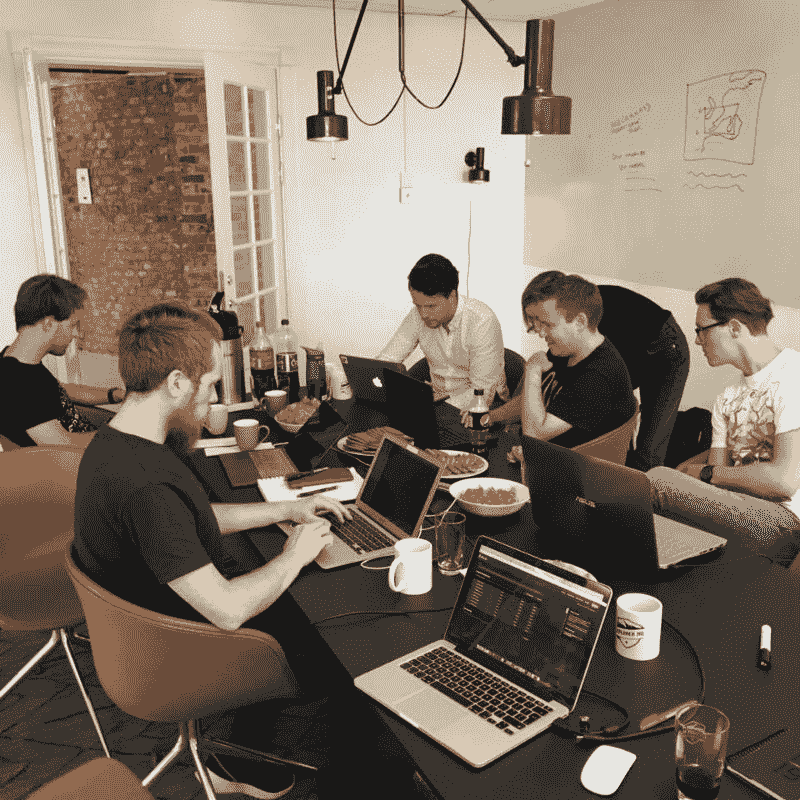
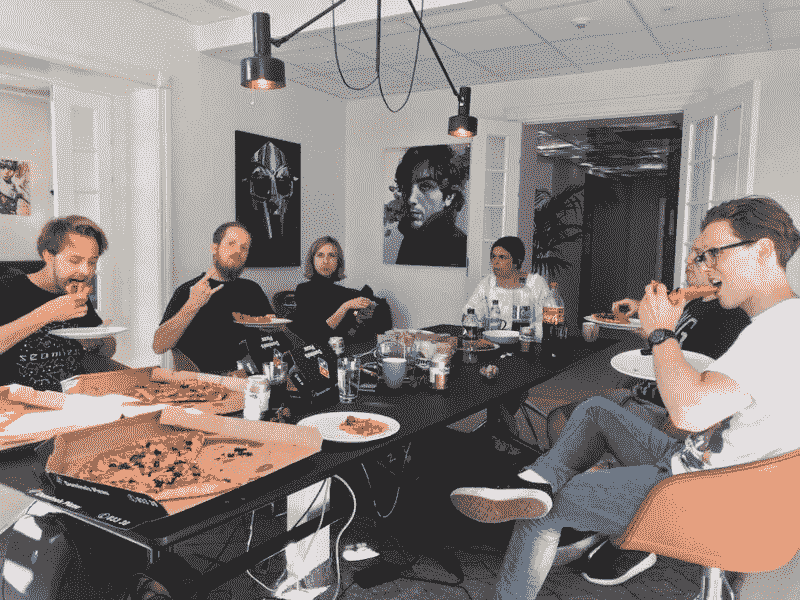
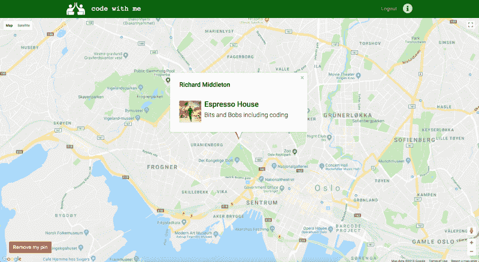
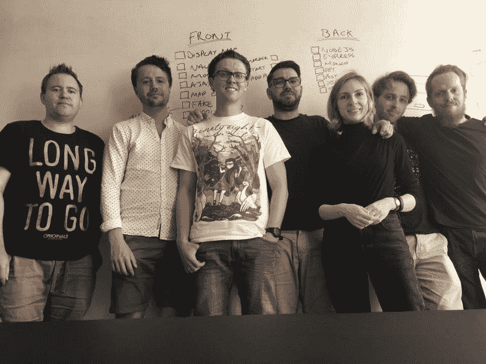

# 组织首次黑客马拉松的技巧

> 原文：<https://www.freecodecamp.org/news/tips-for-organising-your-first-hackathon-7d89b2d26a2b/>

理查德·米德尔顿

# 组织首次黑客马拉松的技巧

7 月 14 日星期六，奥斯陆自由代码营举办了我们的第一次黑客马拉松。本着团结的精神，我们决定将我们的黑客马拉松变成非竞争性的。我们有很多人对编码非常陌生，希望他们觉得他们可以参与进来，并在这个过程中学到一些东西。

在奥斯陆自由代码营，我们试图带来一种深深的社区和团结的感觉。

像许多 freeCodeCamp 团体一样，我们有许多外籍人士——他们远离朋友和家人，搬到了挪威。这个社区帮助很多人，包括我自己，走出去认识其他开发人员并建立关系。

fCC Oslo Meetup.

在黑客马拉松之前，我们根据团队的反馈决定了是举办一天还是两天的活动。

在神奇的[探索者总部](https://www.explorer-hq.com/)获得一个场地后(感谢我们的管理员之一 Marek)，我们决定向我们的营员征求这个项目的想法。

我们总共有七个想法，在活动前一周，我们在 12 个小时内观察了这些想法对我们的可行性。

我们最终决定开发一个 web 应用程序，让用户可以看到周围是否有学生在学习。我们在地图上添加了一个邀请，以欢迎合作，用户可以发布他们的位置，让其他人加入他们的学习会话。

从上午 10 点开始，我们做了一些介绍，并决定如何分配任务。

我们当中有很多网站开发的初学者。所有人都更乐意为前端做贡献，或者对学习前端感兴趣。这意味着后端的工作取决于我自己。

Courtesy of [richardCodes](https://instagram.com/richardcodes)

我们遇到的主要问题是无法使用 React 这样的框架来为我们的 API 调用保密。团队中的许多人以前没有使用过这样的框架。相反，我们决定使用 HTML & CSS 作为静态前端，使用 jQuery 来发出 AJAX 请求。

我们还使用了 Bootstrap 4，它允许快速原型制作。它强大的文档帮助前端走到一起。

我们的另一位管理员 Ekaterina 负责客户端 Javascript。她计划与 Marek 一起监督一般前端开发。

repo 是由 Howie 创建的，他是 freeCodeCamp Oslo 的另一名管理员，在获得许可后，我们开始工作。

前端团队深入到谷歌开发人员文档，并迅速在前端显示一个地图。

后端将在 MongoDB 和 Express 中使用 NodeJS，因此首先完成了 NPM 初始化，同时安装了 Express、Mongoose、Body Parser 和其他一些包。不到一个半小时，我们的 API 就开始工作了。

在等待前端的时候，我们可以使用 Postman 测试 API，从数据库中获取和发送数据。

Pizza Time, The Staple of any Hackathon.

午饭后(也是由探索者总部赞助的)，我们对数据库条目做了一些增量更改。但是大部分工作是在前端的 JavaScript，确保我们可以从那里发送我们的 GET 和 POST 请求。

很快，我们最小可行的产品完成了。

[https://studyfinderoslo.herokuapp.com](https://studyfinderoslo.herokuapp.com/)

在一个团队中工作感觉很棒，这是我们中没有人真正做到过的。

我们在 Heroku 上托管网站，数据库由 MLab 托管。经过漫长的一天，我们有了一个非常满意的可用产品。

虽然还有很多工作要做，但是我们的 MVP 已经实现了。第二天，我通过使用 Passport 添加脸书认证来修补我们的开放 API。

此外，我们还对网站做了一些修正。

总的来说，这次经历很棒。作为一个八人团队工作有助于环境友好，并把每个人聚集在一起——这是我们的目标。

我恳求你自己尝试一下，为你的小组设立一个非竞争性的黑客马拉松！

### 那么，你如何建立自己的黑客马拉松呢？

1.  保持一天——周末最好。将活动分散在几天进行意味着你可能不会让相同的人两天都参加，这可能会给连续性带来问题。我们发现最好用多个日期来调查我们的小组，然后选出最受欢迎的。
2.  **提前找到一个项目** —我们众包了我们的想法流程，要求用户提前一周提交他们的想法。这样，小组领导可以聚在一起，检查可行性。
3.  确保场地安全 —这可能是一个棘手的问题，因为你需要足够大的空间，有良好的无线网络和电力。理想情况下，你希望能够带来自己的零食等。也许你们组里有人的工作场所在周末是空闲的？不要害怕出去给技术社区的人发邮件。如果不行，让所有人都去你的地方。
4.  让它具有协作性，而不是竞争性 —我们都在学习，如果你让它具有竞争性，有些人可能会感到力不从心。把小组分成不同的部分。也许你有一个前端领导和一个后端领导，然后他们可以把人们分成处理导航条、模态、JavaScript、数据库等。即使你不知道自己在做什么，也不要害怕挺身而出——你可能会让自己大吃一惊！

你不需要以前参加过黑客马拉松——我以前从未参加过！整个经历让我们的团队更加团结。我们设法构建了一些可以放在我们的文件夹中的很酷的东西，我们都可以宣称赢得了奥斯陆自由代码营的夏季黑客马拉松！

你可以点击查看回购[。这里的托管站点是](https://github.com/howieandersen/FreeCodeCampHackathon001)。