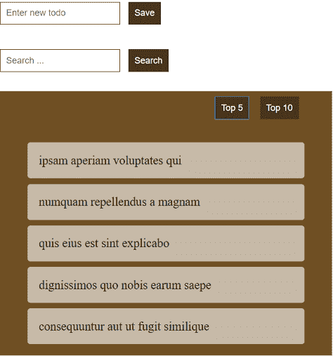
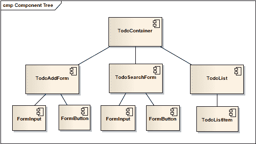

# 组件之间如何通信

> 原文：<https://www.freecodecamp.org/news/how-to-communicate-between-components-b48ef70bf913/>

[****发现函数式 JavaScript****](https://read.amazon.com/kp/embed?asin=B07PBQJYYG&preview=newtab&linkCode=kpe&ref_=cm_sw_r_kb_dp_cm5KCbE5BDJGE) 被 book authority****评为 [****最佳函数式编程新书之一！****](https://bookauthority.org/books/new-functional-programming-books?t=7p46zt&s=award&book=1095338781)****

组件是一种工具，用于将页面分割成更小的部分，以便于管理和重用。通过将页面分成更小的部分，我们使它们的实现更简单。

但同时这也带来了新的挑战:这些小部件之间的通信。

### 陈列柜

我将以管理待办事项列表的页面为例。用户可以查看、添加和搜索待办事项。

这是页面的外观:

### 识别组件

我们可以根据它们的职责将页面分成三个主要部分:

*   `TodoAddForm`:添加新待办事项的表单
*   `TodoSearchForm`:查找待办事项的表单
*   `TodoList`:显示待办事项的列表

我们可以更进一步，让列表中的每一项都有自己的组成部分:`TodoListItem`

为了便于分析，我将文本框和按钮封装在它们自己的组件中:`FormInput`、`FormButton`。

### 组件是树状结构

在分析组件之间如何通信之前，我们需要理解组件是以树形结构组织的。如果框架不强制根组件，那么我们将创建一个。

现在让我们创建树形结构:

Components’ Tree Structure

### 表示和容器组件

我们可以通过使用容器和表示模式来开始定义组件的职责。

该模式在[表示和容器组件](https://medium.com/@dan_abramov/smart-and-dumb-components-7ca2f9a7c7d0)和[容器组件](https://medium.com/@learnreact/container-components-c0e67432e005)中描述

表示组件只通过它们自己的属性、方法和事件进行通信。它们没有连接到外部通信对象。这使得表示组件更容易理解和重用，因为它们没有耦合到其他对象。

容器组件连接到外部对象。它们监听来自这些对象的事件并采取行动。它们向用户界面提供数据。

我将只从一个根容器组件开始:`TodoContainer`。所有其他的将是呈现组件:`TodoAddForm`、`TodoSearchForm`、`TodoList`、`TodoListItem`、`FormInput`和`FormButton`。

有许多通讯手段供我们使用。最后，我们需要选择一个适合我们情况的。

总而言之，这些沟通方式是:

*   父→子:属性，方法
*   子级→父级:事件、回调
*   子级→子级:通过父级、域存储、UI 存储或全局事件总线。简言之，两个子组件可以使用它们最近的父组件或共享的第三个对象进行通信。

您可以在[探索功能 JavaScript](https://www.amazon.com/dp/B07PBQJYYG) 一书中找到更多信息。

用 React 和 Redux 阅读 [****功能架构，学习如何以功能风格构建应用。****](https://read.amazon.com/kp/embed?asin=B0846NRJYR&preview=newtab&linkCode=kpe&ref_=cm_sw_r_kb_dp_o.hlEbDD02JB2)

[****发现函数式 JavaScript****](https://read.amazon.com/kp/embed?asin=B07PBQJYYG&preview=newtab&linkCode=kpe&ref_=cm_sw_r_kb_dp_cm5KCbE5BDJGE&source=post_page---------------------------) 被 book authority****评为[****最佳函数式编程新书之一！****](https://bookauthority.org/books/new-functional-programming-books?t=7p46zt&s=award&book=1095338781&source=post_page---------------------------)****

****关于在 React 中应用函数式编程技术的更多信息，请看一下**** [****函数式 React****](https://read.amazon.com/kp/embed?asin=B07S1NLFTS&preview=newtab&linkCode=kpe&ref_=cm_sw_r_kb_dp_Pko5CbA30383Y&source=post_page---------------------------) ****。****

你可以在[媒体](https://medium.com/@cristiansalcescu)和[推特](https://twitter.com/cristi_salcescu)上找到我。