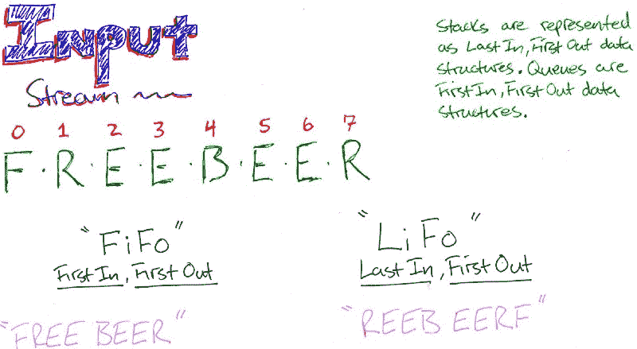
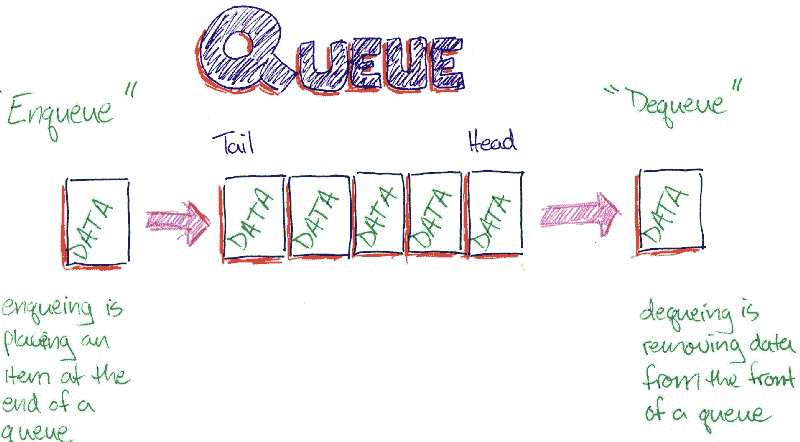

# 数据结构 101:队列

> 原文：<https://www.freecodecamp.org/news/data-structures-101-queues-a6960a3c98/>

凯文·特尼

# 数据结构 101:队列


credit: att systems group

### 从队列开始

当你去 Shake Shack 的时候，通常会有其他人在排队等候服务。顾客按先入先出的特定顺序排列。其他现实生活场景是拉斯维加斯的收费站或婚礼教堂。这种为服务排序数据的方法，在我们的例子中，就是人，就是队列的全部意义。

就接口而言，队列与堆栈非常相似，不同之处在于堆栈处理数据是后进先出。

所以我们在处理的顺序上有差异——为什么？我们需要一种不同的处理数据的方法来保持顺序。例如，假设我们在节点中有一个数据流。当它进来时，我们需要对它做些什么，然后把它写到一个文件中，以便以后读取。为了简单起见，假设我们需要大写每个字母流。如果我们使用 LIFO 或堆栈数据结构，会发生什么？



主要原因是队列公平地处理数据并保持集合的顺序。当我们使用 for 或 while 循环、forEach()或 map()方法迭代项目时，也会发生这种情况。数组中的每一项都按照插入的顺序进行处理，从索引 0 到 index . length-1。

在队列中，项目按照插入的顺序进行处理。

### 履行

使用数组的一个简单实现是用 shift()方法从前面移除，用 unshift()方法添加前面。

像我在 Stacks 上的[文章一样，我们将描述队列的 API。然后，我们将从使用伪经典方法和基本对象的实现开始。](https://medium.freecodecamp.org/data-structures-101-stacks-696b3282980)

当一个项目被插入到一个队列中时，它被称为**入队**。当一个项目被删除，它是**出列**。其他方法包括 peek、contains、until 和 count。



为了跟踪我们的项目，我们使用头部作为队列的前端，尾部作为后端。两者之差给出了队列大小。

我们的存储机制如下:

```
// _underscores indicate "private variables" to other engineers
```

```
const Queue = function(capacity) {  this.storage = {};  this.capacity = capacity || Infinity;  this._head = 0;  this._tail = 0}
```

```
let q = new Queue();q; // Queue { storage: {}, capacity: Infinity, _head: 0, _tail: 0 }
```

要排队:

```
Queue.prototype.enqueue = function(value) {  if (this.count() < capacity) {    this.storage[this._tail++] = value;    return this.count();  }  return "Max capacity reached, please remove a value before enqueuing"}
```

要出列:

```
Queue.prototype.dequeue = function() {    if (this.count() === 0) {      return "Nothing in the queue";    }    else {      let element = this.storage[this._head];      delete this.storage[this._head];      if (this._head < this._tail) {        this._head++;      }      return element;    }}
```

剩下的 API:

```
Queue.prototype.peek = function() {  return this.storage[this._head]}
```

```
Queue.prototype.contains = function(value) {  for (let i = this._head; i < this._tail; i++) {    if (this.storage[i] === value) {      return true;    }  }  return false;}
```

```
Queue.prototype.until = function(value) {  for (let i = this._head; i < this._tail; i++) {    if (this.storage[i] === value){      return i - this._head + 1;    }  }  return null;}
```

```
Queue.prototype.count = function() {  return this._tail - this._head;}
```

```
let q = new Queue();q.enqueue('ww');q.enqueue('aa');q; // Queue {capacity: Infinity, storage: { 0: 'ww', 1: 'aa' }, _head: 0, _tail: 2 }q.enqueue('bb');q.peek(); // 'ww'q.dequeue(); // 'ww'q; //Queue {capacity: Infinity, storage: { 1: 'aa', 2: 'bb' }, _head: 1, _tail: 3 }q.contains('bb'); // trueq; //Queue {capacity: Infinity,storage: { 1: 'aa', 2: 'bb' }, _head: 1, _tail: 3 }q.until('bb'); // 2q.count(); // 2
```

在幕后，我们在[我关于栈的文章](https://medium.freecodecamp.org/data-structures-101-stacks-696b3282980)中了解到，任何时候调用一个函数都会创建一个执行上下文，并在执行栈上分配一个栈帧。JavaSrcipt 中有没有类似的利用队列的东西？是:事件循环。

### 事件循环和队列

在我们了解什么是事件循环之前，我们需要先理解几个术语。

并发性(Concurrency)——在计算机科学中，计算机程序的某些部分可以乱序运行，但不会影响结果。在 JavaScript 的上下文中，它是指事件循环在完成其他工作后执行回调函数的能力。

**运行时间** —程序运行的时间。

**非阻塞与阻塞** —阻塞是指 JavaScript 程序的执行必须等到程序的另一部分完成，有时是非 JavaScript 操作。本质上，同步，一次做一件事

另一方面，非阻塞操作是异步工作的。它们采用允许操作继续的回调，当工作完成时，与特定函数或事件相关联的回调被触发。

**系统内核** —是操作系统的核心部分。它管理计算机、内存和硬件的操作，特别是 CPU。为了提高效率，事件循环将某些操作卸载到内核。

#### 现在来看事件循环。

JavaScript 是一种单线程语言。这意味着执行流程按顺序进行，一次只做一件事。Node.js 是建立在 Chrome V8 引擎之上的，它使用了一个不断旋转的循环来等待新的连接。

当异步函数执行时，它进入事件循环。与该功能相关的消息按照接收顺序进入**消息队列**。已经在循环中的其他函数正在执行或正在处理。当消息出队时，回调函数执行并被放在执行堆栈上。

自始至终，事件循环都在继续，等待更多的连接。这就是 JavaScript 在幕后使用队列的方式。

### 时间复杂度

队列操作非常高效。入队、出队、查看和计数是常量时间中最快的。包含并且直到随着我们的输入大小增加而花费更长的时间在线性时间 O(N)中操作；

入队 O(1)
出列 O(1)
偷看 O(1)
计数 O(1)
包含 O(N)
直到 O(N)

感谢阅读。如果你对栈不熟悉，请查看我的另一篇关于栈的文章。