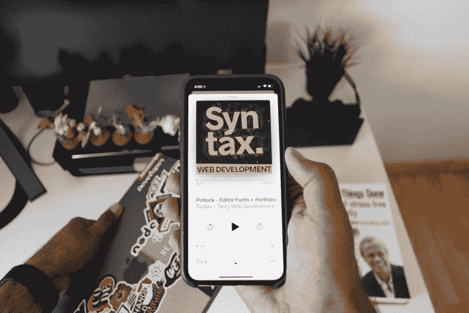

# 如何消除自己对做前端工程师的恐惧

> 原文：<https://www.freecodecamp.org/news/eliminate-your-fears-about-being-a-front-end-engineer-f987e20f5916/>

作者:亚赞·阿德

# 如何消除自己对做前端工程师的恐惧

*我想和你分享我的故事，关于做一名前端工程师的感受。我想告诉人们，编程很有趣，没有必要成为一个超人来创造东西。*

Photo By [Dhanish. For more images like this check his Instagram account](https://www.instagram.com/dhanishgajjar/)

我叫亚赞。我今年 24 岁。我喜欢和别人分享我的知识，并向他们学习。你可以在 twitter 上关注我，或者在我的网站 yaabed.com 上查看我的最新文章。另外，我在 blog.yaabed.com 媒体的[有我的出版物。](https://medium.com/yazanaabed)

作为一名程序员并不容易。需要日日夜夜的努力。然而，我并没有那么幸运在年轻的时候就开始编码。

#### 我是如何开始的

尽管我学的是计算机科学，但我不知道为什么这是一个幸运的选择。我完成了大学第一年的学业。我不知道为什么人们不能给我关于我下一步编程的有用信息。但是看起来我喜欢网络开发。

> [*肯特·c·多兹*](https://www.freecodecamp.org/news/eliminate-your-fears-about-being-a-front-end-engineer-f987e20f5916/undefined) *说如果你理解了你所学的东西，你可以很快地把它教给其他人。*

那时候，我决定以实习生的身份加入公司，向巴勒斯坦社区的人们学习。这是一个极好的选择，因为大学不会教你如何编码。我没有任何经验。我知道诸如算法、数据结构和操作系统之类的东西。

我意识到我是在自学东西，没有人给我他们所知道的知识。我不知道为什么人们害怕分享知识。但是，把自己学的东西教给别人，是一种美好的感觉。

你的第一份工作是前端工程师，需要努力。第一次仅仅通过阅读来学习编码并不是一个好主意。你需要接触任何编程语言。如果你正处于学习的第一阶段，我给你的建议是建造东西。我推荐尝试从这篇由[罗伊·德克斯](https://www.freecodecamp.org/news/eliminate-your-fears-about-being-a-front-end-engineer-f987e20f5916/undefined)撰写的[文章](https://medium.com/hackteam/5-examples-of-react-applications-build-on-open-source-media-apis-c5b9880d922d)中构建一个应用程序。

#### 第一份工作后

找不到学习东西的方法是一种不好的感觉。虽然我周围有相当多的信息，但我无法决定我的代码中什么是对的，什么是错的。但是我自己一直在努力。

我还在和安古拉杰一起工作。令人沮丧的是，我周围的人都在讨论 ReactJS 和新 Angular 有多棒。我开始阅读关于这些新技术的书籍。发生了巨大的变化。基于组件的架构概念的引入改变了一切。

我开始思考——如果我可以用 AngularJS 开始基于组件的架构工作会怎么样？我在一本名为《现代角度》的书中找到了完美的答案，这本书是由像[内特·默里](https://www.freecodecamp.org/news/eliminate-your-fears-about-being-a-front-end-engineer-f987e20f5916/undefined)这样了不起的人写的。

为你的团队引入基于组件的架构并不是一件容易的事情。但是，这种感觉很好。我通常会问我在 Twitter 上了解到了什么。有像肯特·c·多兹这样友好的人随时准备帮助你。你可以在 GitHub 上他所谓的[【问我任何问题】](https://github.com/kentcdodds/ama)中问他你的问题。

“A group of people brainstorming over a laptop and sheets of paper” by [Štefan Štefančík](https://unsplash.com/@cikstefan?utm_source=medium&utm_medium=referral) on [Unsplash](https://unsplash.com?utm_source=medium&utm_medium=referral)

#### 我的学习方式

总的来说，我非常喜欢阅读。我每天读很多东西。我看书。我读文章。我看推特。

贝娄，你可以找到我学习新事物的方式，以及我是如何巩固学习的。

试着先设定你的目标。不知道为什么要学东西就不要学东西。一开始，我试图学习一切，这不是一个好主意。不知道你怎么想，有时候深挖实现细节让我很头疼。我觉得我白白浪费了时间。

**试着把东西分解成小物品**。如果你想学习 ReactJS，不要去学习第一级的“高级反应模式”。首先尝试创建一个不起作用的小组件。然后尽量做到互动。然后尽量让它更可重用。我记得当我用“div”和“li”在一个组件中构建 react-tabs 时。然后我将它分解成多个组件，并学习如何在组件之间共享状态。

尝试阅读更多关于您编写的代码的内容。当我学习复合组件时，我从搜索什么是复合组件开始。然后我开始看到人们是如何使用它们的，我读了更多。

试着写下你所学到的东西。我从[肯特·c·多兹](https://www.freecodecamp.org/news/eliminate-your-fears-about-being-a-front-end-engineer-f987e20f5916/undefined)那里学到了这一步。这是巩固你对事物的理解的一种奇妙的方式。你不需要成为天才作家来写东西。我的主要语言是阿拉伯语，但我会尽可能地写作和分享知识。

试着在你的工作或项目中使用你学到的东西，看看你学到的东西是否有用。这一步越来越巩固你的理解。

尝试不同的方法来解决问题。一个程序员需要灵活并且相信别人的工作。每种代码模式的出现都是有原因的，而不仅仅是为了好玩。

即使你是一名前端工程师，也要努力学习 DevOps 的含义。如果你想扩展你的应用，并使用 micro fronts 分割东西，而你不知道你的服务器如何工作或在哪里部署你的工作，你不能增强它。

#### 我学习 JavaScript 的资源

[**Kent C. Dodds**](https://www.freecodecamp.org/news/eliminate-your-fears-about-being-a-front-end-engineer-f987e20f5916/undefined) 是我第一个了解 ReactJS 和 JavaScript 的人。我推荐大家在[推特](https://twitter.com/kentcdodds)上关注他。

[**《前端手册》**](https://frontendmasters.com/books/front-end-handbook/2018/) 是一本书，人们在里面写下你下一年成为一名前端工程师需要学习的东西。他们来自[前端大师](https://www.freecodecamp.org/news/eliminate-your-fears-about-being-a-front-end-engineer-f987e20f5916/undefined)，是很棒的人。

[**布拉德·弗罗斯特**](http://bradfrost.com/) 是一个很棒的人，他分享他的知识，喜欢分享事情。他的微博是“努力工作。不要成为一个混蛋。分享你所知道的。”他写了一本名为《原子设计》的书我读了，非常喜欢。你可以在这里找到他的博客。

[**托德格言**](https://toddmotto.com/) 是我从他身上学到的棱角分明的人。我还为 Angular 买了他的课程。[查看他的课程网站了解更多详情](https://ultimateangular.com/)。

[**dailyjs**](https://www.freecodecamp.org/news/eliminate-your-fears-about-being-a-front-end-engineer-f987e20f5916/undefined) 和 [**freeCodeCamp**](https://www.freecodecamp.org/news/eliminate-your-fears-about-being-a-front-end-engineer-f987e20f5916/undefined) 是我阅读人们的文章和检查人们写的关于 JavaScript 的东西的地方。它们都是分享你的想法的极好的出版物。

[**基茨**](https://www.freecodecamp.org/news/eliminate-your-fears-about-being-a-front-end-engineer-f987e20f5916/undefined)——我爱他。他对自己的工作充满热情，喜欢与社区分享他所知道的一切。他也是 [React 学院](https://www.reactacademy.io/)的创作者。

[**韦斯博斯**](https://www.freecodecamp.org/news/eliminate-your-fears-about-being-a-front-end-engineer-f987e20f5916/undefined) 他是我最喜欢的老师之一。我喜欢他的课程。他有很多免费课程，你可以在这里观看。

#### 不要评判

人们认为编程是一件容易的事情。他们不知道你一天 12 个小时以上的自学有多难。对代码上瘾并不容易。

尽管如此，**试着拥有自己的时间，不用编码—** 只是放松、玩耍、吃饭、看电影或见朋友。我在这方面还不擅长，但我仍然试图有时不编码。尽管如此，编码似乎是我们的生命。

### **结论**

最后，永远相信自己。你能做到的。希望能让你觉得自己是前端工程师或者全栈工程师更好。找到自己擅长的，并努力固化。**请不要低估别人的工作。**我听说在计算机科学其他领域工作的人，这激励了我。

> ***“编程是给任何热爱创造，热爱走出自己的舒适区，热爱提升自己的人的！”——[莉迪亚](https://www.freecodecamp.org/news/eliminate-your-fears-about-being-a-front-end-engineer-f987e20f5916/undefined)***

***我在 blog.yaabed.com[写作](https://medium.com/yazanaabed)。如果你喜欢这篇文章，请确保与其他人分享。不要忘了点击关注按钮获取更多类似的文章，还有[在 twitter 上关注我](https://twitter.com/YazanAabed)。***

> 嗨，我叫[亚赞·阿德](https://www.yaabed.com/)。我在巴勒斯坦长大。我的专业是计算机科学。我是前端工程师& JavaScript 爱好者？？‍?。主要使用前端框架，如(AngularJs，ReactJS)。你可以叫我#极客？。还有，我喜欢和别人分享我的知识，向他们学习？？？。你可以在 GitHub、 [Mediu](https://github.com/YazanAabeed) m、 [Twitt](https://medium.com/@yazanaabed) er [上找到我。](https://twitter.com/YazanAabed)

### [不容错过的事物](https://twitter.com/YazanAabed)

[**Portfolio &关于亚赞 A. Aabed**](https://www.yaabed.com/articles)
[*一个分享我的想法，写关于前端开发、javascript、数学、机器学习的地方。*www.yaabed.com](https://www.yaabed.com/articles)[**React-testing-library 有什么了不起的测试？**](https://medium.com/yazanaabed/react-testing-library-have-a-fantastic-testing-198b04699237)
[我*不知道什么是测试，以及为什么人们检查他们的实现。所以，我决定了解更多关于它的知识，并且……m*edium.com](https://medium.com/yazanaabed/react-testing-library-have-a-fantastic-testing-198b04699237)

### 最新推文