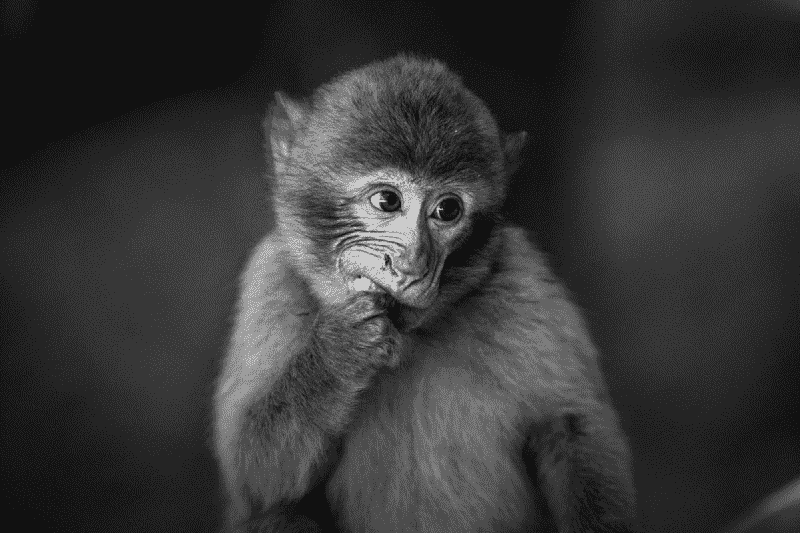
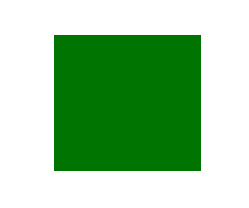
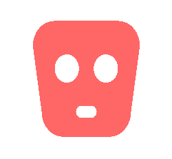
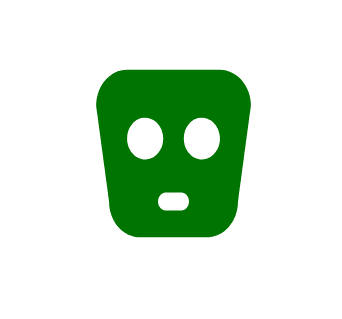
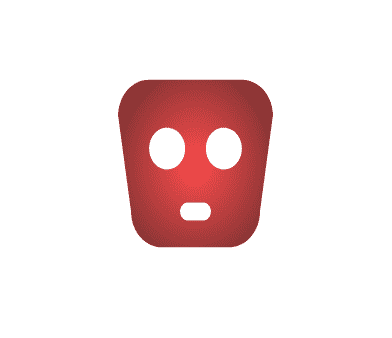
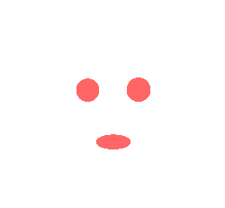
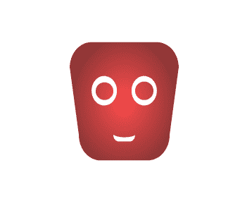
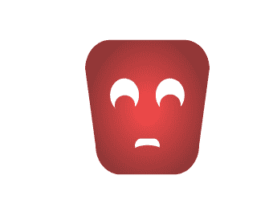
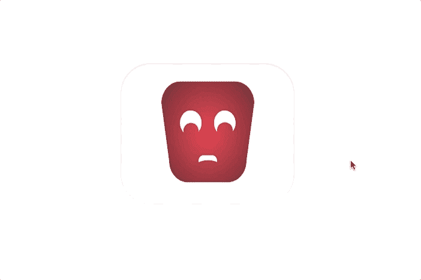

# 我如何使用 CSS 遮罩创建一个改变情绪的动画

> 原文：<https://www.freecodecamp.org/news/how-i-built-a-mood-changing-animation-using-css-masks-565b16ed051f/>

by Ankit Karnany

# 我如何使用 CSS 遮罩创建一个改变情绪的动画



“shallow focus photography of black monkey” by [Tobias Mrzyk](https://unsplash.com/@tobiasmrzyk?utm_source=medium&utm_medium=referral) on [Unsplash](https://unsplash.com?utm_source=medium&utm_medium=referral)

还记得我们小时候经常看的动画片吗？在那个时候，他们是动画的缩影。如今，动画不仅仅局限于卡通——当我们检查手机或查看任何有屏幕的设备时，我们几乎每天都会遇到它们。

如今，动画不仅用于吸引注意力，还用于增强用户体验和引导用户流动。在任何好的设计中，动画都是以这样的方式添加的，它们与普通流程融为一体，从而创造出无缝的用户体验。

因此，在这篇文章中，我们将建立一个简单的不同表情的脸的动画，在这个过程中，我们将学习一点 CSS。

### 入门指南

我们将使用一种 CSS 技术，这种技术在 web 开发人员中很少见，但是设计人员经常使用。叫做**屏蔽**。

那么当你听到“面具”时，你会想到什么？

你可能在想象某样东西上面的封面。这就是我们需要理解的。

等等——但是这篇文章是关于编码和使用 CSS 动画的…

放心吧！我们马上开始。

### 创建基本遮罩

假设我们有一个绿色的四号 T2。它看起来像这样:



现在，假设我有一个`face.svg`:



如果我们在`<d` iv >上应用一个 CSS 属性`mask-image: url(face.svg);`，你会惊讶地看到我们得到了什么:



你可能会觉得这里有些奇怪。`face.svg`号被放置在`<d` iv >号上面，但是它占据了`f the back`地面的颜色。这与你的预期相反。这是因为 o `f the mas` k-type 属性使得 svg 的不透明部分变得透明。这使得背景颜色可见。

我们现在不要深究这个问题。请记住，我们可以使用`background-color`来改变遮罩的颜色。如果你熟悉`background-color`的不同使用方式，我们也可以使用渐变，写一个简单的渐变，中间填充红色，径向向外扩散成黑色。其代码如下:

```
background-image: -webkit-radial-gradient( hsla(0, 100%, 50%, .7), hsla(0, 100%, 20%, .8), hsla(0, 100%, 10%, 1));
```

这导致了:



### 添加动画

现在让我们给这张空白的脸添加一些动画。为此，我有看起来像下图的`expression.svg`。为了简单起见，我用相同的宽度和高度创建了所有的 SVG，这样我们就避免了手动对齐面部和表情。



现在`mask-image`有了这个很酷的选项，允许多个图像被用作遮罩。所以我们可以这样做:`mask-image: url(face.svg), url(expression.svg);`。这就是我们现在所拥有的:



CSS 蒙版最重要的属性之一是`mask-position`，它从左上角相对于它的父蒙版定位蒙版。我可以使用属性`mask-position`定位多个遮罩，就像`mask-image`一样。

所以要让脸难过，我们可以用这样的东西:`mask-position: 0 0, 0 12px;`。结果是这样的:



第一个位置`0 0`是给`face.svg`的，第二个位置`0 12px`是给`expression.svg`的。这从上面推它 **12px** 并导致上面的表达式。

#### 应用功能

现在让我们在悬停时制作这些表情的动画。因此，应用 hover 伪类后，我们得到的完整代码如下:

```
i {  background-image: -webkit-radial-gradient(hsla(0, 100%, 50%, .7), hsla(0, 100%, 20%, .8) 60%, hsla(0, 100%, 10%, 1));    mask-image: url('face.svg'), url('expression.svg');  mask-position: 0 0, 0 12px; /* To make the sad expression */
```

```
 transition: mask-position .5s ease-out;}
```

```
i:hover {  background-image: -webkit-radial-gradient(hsla(120, 100%, 50%, .7), hsla(120, 100%, 20%, .8) 60%, hsla(120, 100%, 10%, 1));
```

```
 mask-position: 0 0, 0 0; /* To make the happy expression */
```

```
 transition: mask-position .1s linear;}
```

在更多地使用 CSS 之后，我们可以这样做:



这是我们可以用来制作那些我们几乎每天都会遇到的扣人心弦的动画的方法之一。

#### **一个重要提示**

屏蔽属性可能不适用于所有浏览器。因此，要让它们在所有的浏览器中都能工作，只需预先加上浏览器特有的标签，如`-webkit-`、`-moz-`、&、`-0-`。

你可以在 [github](https://github.com/nktkarnany/mask-css) 和 [codepen](https://codepen.io/nktkarnany/pen/bjmZOQ) 上查看完整的代码。

感谢阅读！我希望你学到了一些东西。