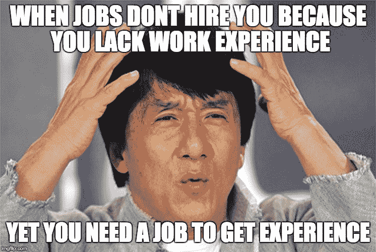
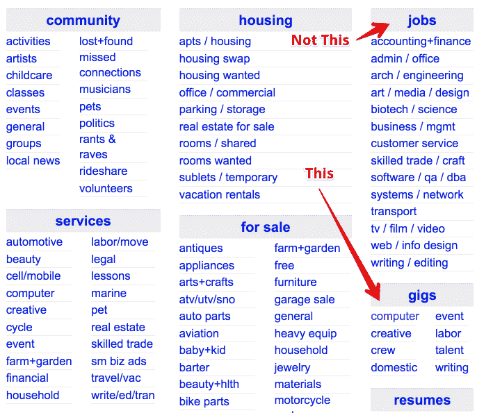

# 如何在几乎没有经验的情况下找到一份编码工作

> 原文：<https://www.freecodecamp.org/news/how-you-can-land-a-coding-job-with-very-little-experience-b96517e00da7/>

我走后门进入了硅谷的科技圈——通过简单、快捷的自由职业生涯。我强烈推荐这种方法。这不仅是快速学习许多不同编码技能的好方法，而且非常有趣！

### 悖论:你需要一份工作来获得经验，但你需要经验来获得一份工作…

前几天，一个即将大学毕业的朋友向我咨询如何找到一份开发人员的工作。他花了几个小时仔细阅读招聘信息，发出求职信，并收到了零家公司的回复。？

我完全理解他的痛苦。作为一家科技招聘公司的创始工程师之一，我曾在该公司从事数据科学方面的工作，我有机会看到实际的数字，而情况可能会相当令人沮丧。

这是老生常谈了。新毕业生和没有太多工作经验的人很难找到工作。当我们问雇主为什么不想雇用没有多少工作经验的人时，我们通常会听到同样的话，“我们在找有经验的人”。

糟透了。

你需要一份工作来获得经验，你需要经验来获得一份工作……这是一个古老的悖论。

幸运的是，在编程领域，这个难题有一个解决方案。

你要做的就是找到愿意雇佣经验稍微少一点的程序员的雇主。似乎不可能？不是的。信不信由你，像这样的雇主现在就在外面***。*他们拼命寻找**任何人**来解决他们的问题，他们会**高兴地**为你的帮助买单。**

**你要做的就是找到他们。**

****

### **请允许我介绍一下自由职业者 ***和‘Gig’***！**

**我知道你在想什么，自由职业者？如果没有人愿意雇佣我，为什么会有人雇佣我做自由职业者呢？自由职业到底有什么特别的？除了没有 W-2，福利和工作保障，不就是为一家公司工作吗？我继续找工作一段时间不是更好吗？**

**这些都是合理的担忧，自由职业并不总是容易的，但是在你离开并开始往深渊里邮寄更多简历之前，让我来解释一下。**

**自由职业者是一个术语，涵盖了你在没有正式雇佣关系的公司所做的任何工作。在开发者的世界里，我会(非常不科学地)把自由职业分成几个不同的类别。有**顾问**、**自由职业者**和**自由职业者**。**

**顾问通常是非常有经验的专家开发人员，他们被请来解决棘手的技术问题，并拥有独特的见解和专业知识。既然你刚学编程，我怀疑这不是你。**

**自由职业者通常和雇员非常相似，除了他们是通过职业介绍所找到工作，而不是被他们工作的公司直接雇佣。这通常是由于政治原因造成的，太无聊了，无法在本文中讨论。可以说你可能不属于这一类。**

**最后还有**零工自由职业者**。**

**零工自由职业者填补了软件工程世界的一个特殊空白。他们通常承担的工作规模太小、太专业或实验性太强，不值得雇佣全职员工。他们为之工作的雇主雇佣他们是因为他们需要完成**的临时**工作，而临时工**有空**并且**愿意**做这项工作。**

**雇佣临时工的雇主包括:**

*   ****企业家** -希望为一个想法建立一个概念证明**
*   **内部企业家 -在公司内部致力于创新的企业家，他们也希望建立概念的证明**
*   ****小型企业** -通常寻找“方便”的人来安装或设置一些东西**
*   **有编程问题的个人 -也许是一个在编程作业或其他方面需要帮助的人？**

**这些客户工作的共同特点是**小，定义明确，**和**临时**。**

**自由职业肯定有它的缺点，我会毫不犹豫地推荐它作为一个建立长期职业生涯的地方。但是对于刚开始编程之旅的人来说，这是同时建立**技能**、**关系、**和**可信度的最快方法之一。这也是一件非常有趣的事情。****

****

### **为什么当你第一次开始工作时，做零工是值得的**

#### **令人惊讶的是，零工相当容易找到。**

**演出通常很小——几个小时，一周…**

**他们通常不会付那么多钱，所以如果你知道去哪里找，竞争就不会那么激烈。**

**这项工作通常需要较少的经验来完成。这是“写一个简单的爬虫”而不是“建造下一个脸书”**

**对于雇主来说，风险要低得多。不需要做出长期承诺。不打印员工徽章。不涉及人力资源部门。如果你没有做好工作，损失很少。**

**所有这些意味着获得这些工作相当容易。要专业和迅速…不要很难共事，尽管你缺乏经验，你也应该能被录用。**

#### **发现适合你的工作类型**

**当你得到一份零工，你可以用它来发现什么样的编程适合你。**

**音乐会给你机会为许多不同的人工作，为许多不同的项目工作。这是一个很好的机会去探索自己喜欢的东西。**

**对数据好奇？接一份刮擦或数据处理的工作。**

**想学硬件？还有 Arduino a Raspberry pi 演唱会。**

**找到你喜欢的东西了吗？再找一份类似的工作。**

**我个人使用 gigs 来尝试各种编程领域。当我开始演奏时，我有机会尝试的一些项目类别包括:**

*   **网站**
*   **自定义视频播放器**
*   **音频播放器**
*   **微控制器编程**
*   **直播和视频会议**
*   **数据抓取和爬行**
*   **简单的游戏**

**这样的例子不胜枚举。**

**使用 gigs**找出作为程序员你喜欢什么和不喜欢什么**。这种学习非常有价值。也许比你**做一份你并不真正感兴趣的工作所能赚到的钱更有价值。****

#### **音乐会让你提高你的技能，磨练你的手艺。**

**当你处于编程生涯的早期，你可能还没有为大项目做好准备。它们太复杂了。它们涉及到你可能还没有掌握的技能(比如阅读别人的代码)。**

**您还需要磨练您的架构和选择的平台 API 印章。没有什么比真正的客户要求你完善一些 CSS 来让你学习 flex-box 如何工作更好的了。而且必须为四个不同的客户端构建单页面应用程序，这确实有助于你真正了解 React 应用程序如何处理路由。**

**此外，只需要自己做每件事将是有益的。你必须建立完整的系统。你别无选择。你**将**学习一切是如何运作的。**

#### **音乐会往往会带来更好的事情**

**当我开始做演出时，我从来没有真正期望他们为我敞开大门，但这就是最终发生的事情。**

**我会开出 2 个小时的单子(这个单子实际上花了我更多的时间)，我会准确地交付我的客户要求的东西。第二天，客户会问我是否有时间做另一个项目。**

**我创建的每个项目都是我可以添加到我的投资组合中的另一个项目。每个项目也扩大了我的网络。我遇到的人会把他们的朋友和同事介绍给我。这些年来，我最终为一些知名公司工作。**

**最终，我甚至真的不需要去找新工作。我突然想起来了。**

**这很有趣…虽然一开始很吓人，但随着时间的推移，就变得容易了。**

### **那你是怎么得到演出的呢？以下是我推荐的流程:**

#### **找到一个适合你情况的好的演出市场**

**你想通过找到一个“市场”来开始你的求职，在这个市场上，雇主会把你视为他们试图解决的问题的一个好的解决方案。他们通常会在网上的“市场”中寻找:求职板、邮件列表、slack 频道、论坛等等。当我说“市场”时，我指的是任何一个特定人群发布工作的社区。**

**找到合适的市场可能是求职过程中最重要的部分*，许多人不会战略性地接近求职的**。*****

*****事实是，每个市场都有不同的“客户组合”,有不同的需求、愿望和招聘标准。*****

*****如果你花时间在错误的市场上搜寻，你将很难找到工作。所以，花些时间四处寻找合适的市场是值得的。*****

*****那你想找什么？*****

*****首先，不言而喻:寻找一个以演出为中心的市场。这可能意味着一个创业型雇主发布小项目的地方。这意味着你会想避开全职工作公告板。任何需要你提交简历并经历一轮又一轮面试的职位可能都不是你想要的。*****

*****除了寻找以“演出”为重点的市场，你还会在“利基”市场中运气最好。*****

*****我说的“利基”是什么意思？好吧，你希望市场有某种你的技能或经验适合的焦点。*****

*****利基市场包括:*****

*   *******地理焦点:**有些市场是为当地社区而建的。当人们想和当地人一起工作时，他们经常通过这些网站招聘。*****
*   *****一些市场专注于特定的技术。如果你在某项技术上花了很多时间，这些主板将是你的优势所在。*****
*   *****问题空间焦点:一些市场并不针对技术本身，而是专注于特定的受众。软件项目存在于每个社区。如果你是一个社区的成员，你也许能够得到其他开发者得不到的机会。*****

*****选择一个好的利基市场将大大增加你得到一份工作的机会。*****

*****在一个利基市场，雇主将更加相关。你将比在一个更普通的自由职业网站面临更少的竞争。最重要的是**利基市场给了你一个机会，让你可以“堆砌”对自己有利的东西**，因为你将在竞争中获得优势，即使这种优势只是“我们住在同一个城市”。*****

*****如果我今天必须重新开始演奏，我可能会去的地方包括:*****

*   *****craigslist(gigs 版块)——它是以本地/地理为中心的，所以你有一些上面提到的内在优势。*****
*   *******面对面的聚会** —同样是本地的、小众的。根据我的经验，当你出现在这些活动中时，几乎总是有人在找人帮助他们的项目。你是本地人这一事实是一个巨大的优势。*****
*   *****专注于公共企业家的松散聊天群和**主题邮件列表**(它们也是小众的，不太主流)。你可以通过谷歌搜索“公共休闲频道”来找到这些——其中许多都有专门的工作板块，而企业家频道上的大多数工作都是基于演出的。*****
*   *****最后，**upwork.com**，**freelancer.com**，或者其他一些专注于自由职业的工作网站。这些网站上有很多雇主在招聘员工，但起步可能有点困难。你将与来自世界各地已经有很多平台评论的人竞争工作。当你最终得到一些五星评级时，事情会变得容易，但在此之前，这是一个数字游戏，所以要准备好很多拒绝。*****

#### *****申请这个职位*****

*****申请一份工作很简单。你将与一位雇主交谈，你想让他们相信你能解决他们的问题。*****

*****通常你会发送一封电子邮件。在某些情况下，你可能会填写表格或其他东西。不过，只要你能以某种方式进行对话，这并不重要。*****

*****你说什么？*****

*****你要让雇主知道你理解他们试图解决的问题，并且你认为你能为他们解决这个问题。*****

*****你要告诉他们你认为需要多长时间，并包括一点关于你自己的信息，解释为什么你特别适合。*****

*****如果你有的话，你希望包含一些你做过的工作的链接，这些链接与雇主正在寻找的相似。*****

*****你可能在想，我没有经验。这难道不会立即取消我的资格吗？'*****

*****不一定。你其实可以把你的弱点作为你的优势！这里有一些你可以如何做的例子。*****

*   *****让雇主知道你是自由职业的新手，但告诉他们你对他们的项目感兴趣，因为你需要优秀的作品。这意味着你很乐意根据需要修改和润色，创造出真正壮观的东西。*****
*   *****让雇主知道你是自由职业的新手，并且**知道**是你报价**如此之低**的原因——可能低于竞争对手。他们会得到很多。*****
*   *****让雇主知道，尽管你是编程新手，但你在他/她的特定行业有丰富的经验。你所拥有的知识使你有资格比一般的竞争对手做得更好。*****

*****事实上，你是刚刚起步的****在某些方面是一种优势**，因为你可以证明做那些更有经验的开发者不会接手的项目是有道理的，因为对你来说回报是不同的——**经验**和**投资组合证据**vs 金钱。有效地传达这一信息，你将毫无问题地获得一些你申请的工作。*******

#### *****追踪*****

*****很多求职的书和文章里经常说的都是真的！跟进真的很重要。*****

*****从雇主的角度考虑这个问题(我知道这一点，因为我以前雇佣过员工)。*****

*****你(作为雇主)发布了一份工作，并开始收到来自承包商的信息。很多留言都很可怕。信息写得不好，或者承包商要价太高，或者承包商似乎不明白你想要什么。一些申请人看起来很有希望，但你自然会想等一等，等更多的申请来。也许某个引人注目的人会出现。*****

*****最终你会转移到其他任务上，忘记你发布的工作。几天过去了，应用程序停止出现。你很忙……然后你从为数不多的有希望的申请者中收到了一封跟进邮件。这个人看起来能完成工作，而且他们看起来很专业(毕竟他们跟进了)。你已经做了决定。*****

*****作为承包商，你希望成为那种**看起来有前途并跟进**的人。你会惊讶地发现，申请工作时很少有人跟进。这真的很重要。*****

*****那么，你是怎么做的呢？*****

*****在你发出第一封邮件后，你等一两天，然后发一封简短的邮件说:*****

> *****嘿，我没收到你的回复，所以我想我应该跟进一下。你找到能帮你演出的人了吗？如果你仍然需要，我仍然是可用的。*****

*****根据我的经验，这是你得到工作的时候。试一试，看看它是否对你有用。*****

#### *****不要气馁*****

*****一开始找工作可能有点像数字游戏。不要把拒绝当成是针对你个人的。一开始，你不会建立起声誉，所以人们会小心翼翼地雇佣你，这是很自然的。*****

*****继续申请职位，不要气馁！我建议将成功视为“申请”而不是实际“得到”工作。这将有助于正确看待事物。最终你会得到你的第一份工作。*****

*****你得到的第一份工作非常值得努力。在第一次演出后，当有人问你是做什么工作的，你会有新的话要对他们说:*****

*****我是**职业**程序员？*****

### *****我希望我已经说服了你*****

*****我希望我已经说服了你，音乐会是开始编程生涯的一个很好的方式。*****

*****如果你能编写基本程序，你可以用 gigs 来开始你的编程生涯。*****

*****随着时间的推移，演出是通向更大更好的东西的垫脚石，所以出去找一两次演出吧。如果你尝试一下，你会惊讶于你能做什么。*****

*****感谢您花时间阅读我的文章。*****

*****你也可以在我的个人博客[https://wildnotion.com](https://wildnotion.com)上阅读我的其他文章*****

*****你可以在我发表关于编程、创业和数据的文章的 Medium 上找到我。你也可以在推特上关注我。*****

*****如果你觉得这篇文章有帮助，请告诉我。？？。*****

********************