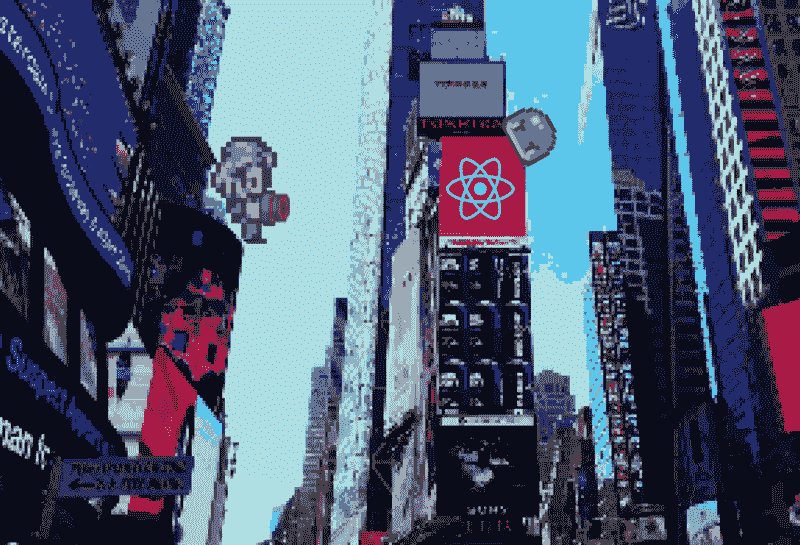
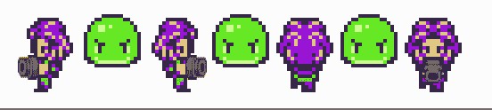
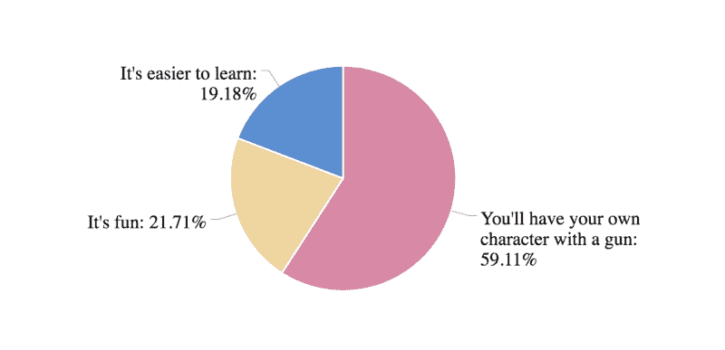
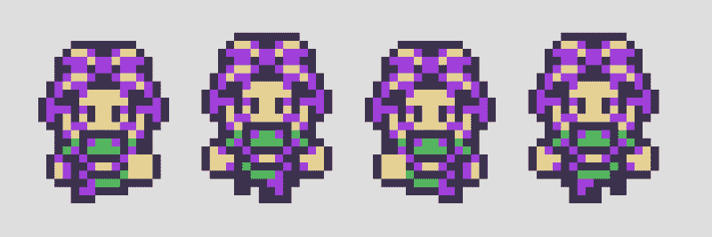
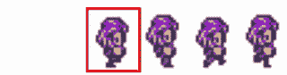
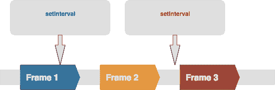
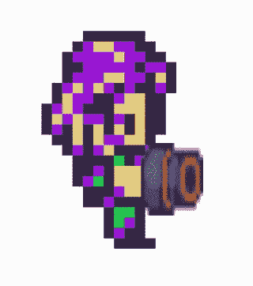

# 通过开发带有精灵动画的游戏来学习高级反应模式

> 原文：<https://www.freecodecamp.org/news/learn-advanced-react-patterns-by-developing-a-game-with-sprite-animation-5dc072886975/>

作者:帕维尔·弗拉索夫

# 通过开发带有精灵动画的游戏来学习高级反应模式

Check out my ultimate design skills

你曾经想要学习一些高级的反应模式吗？还是自建游戏引擎？如果至少有一个答案是肯定的，那么这篇文章就适合你。

在本教程中，你将学习如何使用 [**React**](https://reactjs.org/) **， [styles-components](https://www.styled-components.com/) ，**和 **requestAnimationFrame** 构建基本的精灵动画。最后，你将能够创建这样的角色:

你可能会问我*为什么我不能用另一种方式学习*？嗯……有三个原因:

所以，让我们开始吧！？

### **让我们从一点理论开始**

什么是精灵动画？维基百科上说

> 在计算机图形学中，**子画面**是集成到更大场景中的二维位图。

所以基本上精灵动画是一个反复变化的二维位图。

Sprite 通常表示为 png 图像，具有不同的动画状态:

Bitmap image

我们将首先创建一个 tile 组件，它将一次显示一个帧，并允许我们使用**状态**属性来更改帧:

基本上，我们需要一次显示图像的一部分，隐藏其余部分。很简单。

### 瓷砖

首先，我们将创建一个容器组件来创建框架的形状:

`width`和`height`代表故事的大小，`scale`增加图像的大小。`overflow: hidden`将隐藏图像未使用的部分，而`transform-origin`将制作一个容器，当我们缩放它时，它的顶部和左侧保持不变。

现在我们需要调整内部图像的位置。为此，我们将使用`transform: translate` CSS 属性:

现在，让我们将所有内容组合到图块组件中:

*   `src`属性包含一个到图像的链接
*   `tile`是带有`width`和`height`字段的对象，代表图块的大小
*   `state`帧索引
*   `scale`属性来增加图像的大小(例如，`scale = 2`是 2x 图像)

在下一步，我们将添加一些运动到我们的形象。

### 鬼怪；雪碧

为此，我们将使用 **requestAnimationFrame** 。你可能会问为什么我们不使用 **setTimeout** 或 **setInterval。**超时的问题是回调将在帧之间的某个地方触发，这可能导致笨拙的动画。

requestAnimationFrame vs setInterval

另外， **requestAnimationFrame** 允许我们同步屏幕上不同对象的动画。在游戏中你会有很多！

让我们组装一个 Sprite 组件:

在`animate`函数中，我们应该改变帧的`state`并请求一个新的动画帧:

我们使用 e `framesPerStep`属性来控制每帧的状态数，所以我们的动画不会太快。

### 一把枪呢？？

现在我们唯一需要做的就是将我们的精灵和枪的图像结合起来:

您应该会得到以下结果:

学习东西的最好方法是靠你自己去创造。所以我鼓励你使用这个 [codesandbox](https://codesandbox.io/s/github/react-dev-camp/react-game-dev-course/tree/master/lessons/1_sprites/javascript?autoresize=1&hidenavigation=1) :

这里也有 TypeScript 版本。

另外，您可以使用资源文件夹中的文件实现不同的动画。

你可以在这里找到源代码[。我使用了由](https://github.com/react-dev-camp/react-game-dev-course) [finalbossblues](https://finalbossblues.itch.io/pixel-shooter-towers-asset-pack) 制作的游戏资源。

希望你喜欢这篇文章！？

在 [Medium](https://medium.com/@pvlasov) 和 [Twitter](https://twitter.com/pvl4sov) 上关注我，获取更多新文章的更新。还有，分享这篇文章，帮助别人了解一下。分享就是关爱？

如果你想要更多，就毁掉这个拍手按钮。

**最多可以鼓掌 50 次！**？

关于该主题的更多资源:

[**了解 JavaScript 的 requestAnimationFrame()方法用于平滑动画**](http://www.javascriptkit.com/javatutors/requestanimationframe.shtml)
[*request animation frame()是一种 JavaScript 方法，用于创建更平滑、资源消耗更少的 JavaScript 动画……*www.javascriptkit.com](http://www.javascriptkit.com/javatutors/requestanimationframe.shtml)

*最初发表于 [react.camp](http://react.camp/posts/advanced-react-patterns-game-engine-1-sprites/) 。*