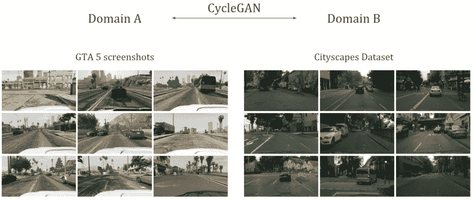
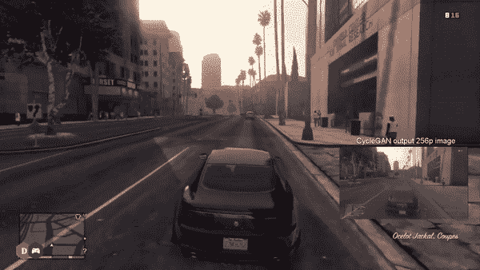
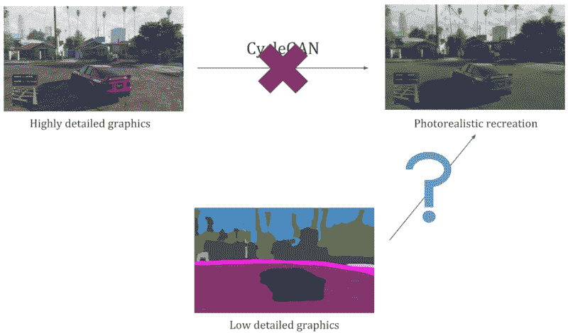
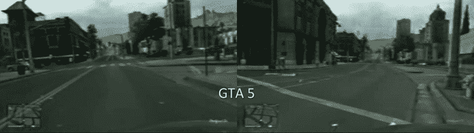
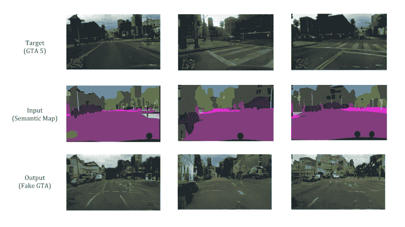
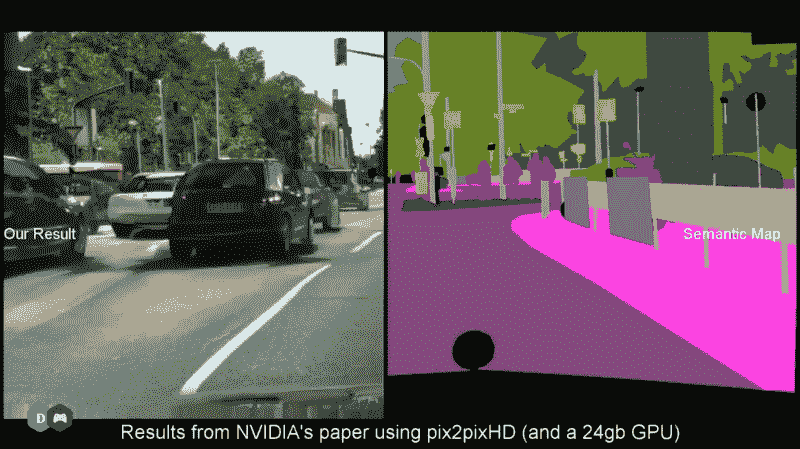

# 如何用深度学习创建逼真的侠盗猎车手 5 图形

> 原文：<https://www.freecodecamp.org/news/how-to-create-realistic-grand-theft-auto-5-graphics-with-deep-learning-cc092c4a69f0/>

钦坦·特里维迪

# 如何用深度学习创建逼真的侠盗猎车手 5 图形

Before you judge me, let’s admit it, we have all done this in GTA.

这个项目是我[上一篇文章](https://towardsdatascience.com/turning-fortnite-into-pubg-with-deep-learning-cyclegan-2f9d339dcdb0)的延续。在这篇文章中，我解释了如何使用 CycleGANs 进行图像风格转换，并应用它来转换堡垒之夜图形，使其看起来像 PUBG。

CycleGAN 是一种生成性对抗网络，能够模仿一个图像的视觉风格并将其转移到另一个图像上。我们可以用它来使一个游戏的图形看起来像另一个游戏或真实世界的图形。

在这篇文章中，我想分享一些使用相同的 [CycleGAN 算法](https://junyanz.github.io/CycleGAN/)的更多结果，我在之前的工作中已经介绍过了。首先，我会尝试改进 GTA 5 的图形，让它们看起来更像真实世界。接下来，我将介绍我们如何实现同样的照片级逼真效果，而不必首先渲染高细节的 GTA 图形。

Both the datasets that I’ve used for this are available at [this link](https://junyanz.github.io/CycleGAN/) on the original author’s project page.

对于第一个任务，我已经把游戏的截图作为我们的源域，我们想把它转换成照片级的东西。目标域来自代表真实世界的 cityscapes 数据集(我们的目标是让我们的游戏与之相似)。

### CycleGAN 结果

基于大约三天大约 100 个纪元的训练，Cyclegan 模型似乎在使 GTA 适应真实世界领域方面做得非常好。我真的很喜欢这种翻译中较小的细节没有丢失，图像即使在如此低的分辨率下也保持了清晰度。

主要的缺点是，这个神经网络被证明是相当唯物主义的:它到处都产生了奔驰标志的幻觉，破坏了从 GTA 到现实世界的几乎完美的转换。(因为 cityscapes 数据集是由一位奔驰车主收集的。)

### 如何以更少的努力实现相同的照片级逼真图形

虽然这种方法在改善游戏画面方面看起来很有前途，但我不认为真正的潜力在于遵循这种管道。我的意思是，渲染这样一个高度细节化的图像，然后把它转换成其他东西，这似乎是不切实际的。

在一开始设计游戏的时候，用少得多的时间和精力合成一个类似质量的图像不是更好吗？我认为真正的潜力在于渲染低细节的物体，并让神经网络从这种渲染中合成最终的图像。

因此，基于 cityscapes 数据集中可用的语义标签，我在 GTA 的截图中分割了对象，给了我们一个低细节图形的表示。把这看作是一个游戏渲染，只渲染了一些物体，比如道路、汽车、房屋、天空等等，而没有详细设计它们。这将作为我们的图像风格转换模型的输入，而不是来自游戏的非常详细的截图。

让我们看看使用 CycleGANs 从这样的低细节语义地图中可以生成什么质量的最终图像。

### 从语义图合成图像的结果

Recreating photo-realistic scenes from the semantic maps of GTA 5.

这里有几个例子，展示了当我们从语义地图中重新创建 GTA 图形时，它是什么样子。请注意，我没有手工创建这些地图。这看起来真的很乏味，所以我简单地让另一个 CycleGAN 模型来做这件事(它被训练使用 cityscapes 数据集来执行图像分割)。

从远处看，这似乎是一个很好的转换，但仔细看，很明显，图像是假的，缺乏任何细节。

现在，这些结果是 256p 的，并且是在 8 GB 内存的 GPU 上生成的。然而，原始论文的作者已经表明，使用超过 24 GB 内存的 GPU 可以创建更详细的 2048 x 1024p 图像。它使用 CycleGAN 的监督学习版本，称为 [pix2pixHD](https://github.com/NVIDIA/pix2pixHD) ，它经过训练可以执行相同的任务。好家伙，假图像看起来相当令人信服！

[Here’s the full video](https://www.youtube.com/watch?v=3AIpPlzM_qs&t=23s) uploaded by the authors of this paper.

### 结论

GANs 有很大的潜力改变娱乐业未来制作内容的方式。他们能够在更短的时间内产生比人类更好的结果。

这同样适用于游戏行业。我相信在几年内，这将彻底改变游戏图形的生成方式。简单地模仿真实世界比从头开始重建一切要容易得多。

一旦我们做到了这一点，推出新游戏的速度也会更快。随着深度学习的进步，激动人心的时代即将到来！

#### 视频格式的更多结果

以上所有结果和更多信息可以在我的 YouTube 频道和下面的视频中找到。如果你喜欢它，请随意在[订阅](http://www.youtube.com/subscription_center?add_user=DeepGamingAI)我的频道来关注我更多的作品。

感谢您的阅读！如果你喜欢这篇文章，请在[媒体](https://medium.com/@chintan.t93)、 [GitHub](https://github.com/ChintanTrivedi) 上关注我，或者订阅我的 [YouTube 频道](http://youtube.com/c/DeepGamingAI)。