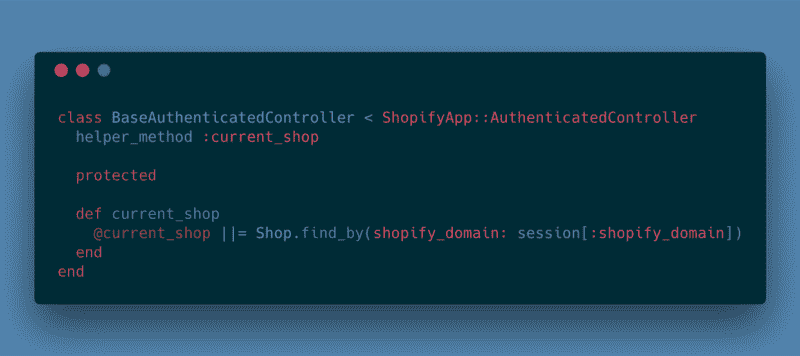
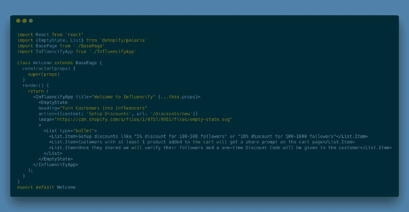

# 如何构建您的第一个 Shopify 应用程序

> 原文：<https://www.freecodecamp.org/news/how-to-build-your-first-shopify-app-bc4edef32974/>

伊戈尔·彼得罗夫

# 如何构建您的第一个 Shopify 应用程序


### 为什么要建立一个 Shopify 应用？

我一直对电子商务市场的增长感到兴奋，并做了各种尝试来潜入这个世界。大约五年前，我和一个合伙人建立了一个电子商务网站，销售和递送鲜花、毛绒玩具和作为礼物包装在一起的贺卡。这是一个验证想法的尝试，我们没有认真对待。所以很快就结束了。

后来，我们试着卖地砖(和一个在那个领域工作了几年的家伙合作)，也不太顺利。大多数情况下，原因是一样的:这是我们的副业，我们对地砖市场一无所知。

但是，在此期间，我们为代理公司的客户开发了许多电子商务网站。这些网站中的大多数都是使用 Ruby on Rails 和 T2 Spree 构建的。这个方向是成功的——我们学到了很多关于电子商务网站开发和典型开发问题(以及营销、运输和不同的业务问题)的知识。

今年，我和一个新的合作伙伴一起工作，他对 Shopify 平台有很好的体验。我们谈了很多，最后产生了一个想法，开发一个 [**Shopify** app](https://apps.shopify.com/influencify) 。这个平台正在快速发展，市场上对扩展平台的可能性有很大的需求。

构建一个产品，而不是为某人做定制开发，对我来说也是令人兴奋的。所以这两件事——电子商务和产品开发——自然地结合成了一个 [**Shopify** app](https://apps.shopify.com/influencify) 的想法。

### 了解应用程序构建的复杂性

你已经为你的应用想出了一个主意。现在你需要决定你的应用程序是否会通过扩展模板或注入一些脚本来与商家的店面进行交互。或者你可能需要使用一些第三方 API 并将其集成到你的应用中，或者扩展一个 **Shopify** Admin。

每个部分都可以足够复杂。因此，如果你只需要用 **Shopify** 存储数据并在管理部分输出一些东西，你就在处理 1 种类型或 1 点复杂性。如果您需要使用外部 API，并且仍然有一些管理部分，那么您有两点复杂性。诸如此类。

### 从样板文件开始开发

嗯，我们可以看到我们的应用程序非常复杂(尽管对客户来说它看起来很简单)。自从我们就 app 想法和最初的 **MVP** 达成一致后，我开始研究，发现 **Shopify** 有一颗很棒的`shopify_app` **Ruby** 宝石。

这是一个非常酷的东西，可以节省你很多时间:它为你生成一个 **Shopify** 应用框架，而不需要手动设置 **OAuth** 流程。其他需要注意的事项:

*   生成的车间模型
*   简单的 Webhooks 和脚本标签注册
*   认证方法
*   应用程序代理验证(针对您的店面定制)

我已经在几分钟内启动了一个空白应用程序，而不是几个小时。

### 使用推荐的工具

接下来，我研究了如何在你的应用中使用管理界面。我发现, **Shopify** 为你简化了这项任务，同时他们的设计框架 [**Shopify Polaris**](https://polaris.shopify.com/) 也很强大。

[**北极星**](https://polaris.shopify.com/) 是一个 **React.js** 组件库，这是扩展 **Shopify** Admin 部分的推荐方式。你的应用看起来会像一个本地的 **Shopify** 应用，带有管理部分，如“产品”或“订单”( **Shopify** 也使用它，我猜)。

您应该使用它而不是一些定制的主题，因为它有很好的文档记录、支持，并且有指导原则。

### 扩展 Shopify 管理

在**网页打包器**或**纱线**的帮助下，成功地将 **Shopify Polaris** 安装到项目中后，您将能够扩展 **Shopify** 管理部分。

对于欢迎页面(商家将在应用程序安装后看到，尚未设置数据)，您需要做以下事情:

*   添加路线:

```
get ‘/welcome’ => ‘home#index’
```

*   创建一个**轨道**控制器:

```
class HomeController < BaseAuthenticatedController def index endend
```

*   添加一个视图模板，借助`react-rails` gem 来渲染 **React** 组件；

```
# home/index.html.erb<%= react_component("Welcome", {  apiKey: ShopifyApp.configuration.api_key,  shopOrigin: "https://#{ @shop_session&.url }",  debug: Rails.env.development?,  forceRedirect: !Rails.env.development? && !Rails.env.test?}) %>
```

*   创建一个 **React** 组件来呈现一些 **Shopify Polaris** 组件(比如`EmptyState`)。

对于曾经使用过 **Ruby on Rails** 的每个人来说，第一步是非常清楚的。第二步应该也是，除了你需要从`ShopifyApp::AuthenticatedController`继承你的管理控制器，这样每个请求都会被授权。我已经为所有未来的管理控制器类创建了这个类的一个子类。



第三步是关于渲染。我安装了带有漂亮的`react_component`助手的`react-rails` gem，并添加了一个传递所有必要属性的欢迎组件的渲染。对于嵌入式应用(那些扩展了 **Shopify** Admin 的应用)，你至少应该通过`apiKey`和`shopOrigin`选项来利用 **Shopify Polaris** 附带的[嵌入式组件](https://polaris.shopify.com/components/get-started#using-embedded-components)。这些[嵌入式组件](https://polaris.shopify.com/components/get-started#using-embedded-components)只是围绕 **Shopify** 嵌入式应用 SDK 的**反应**包装器。

最后，我写了一个`Welcome`组件，并根据`config/webpacker.yml`把它放到了`app/javascript/components`文件夹中。



注意，我已经提取了一些样板文件，比如对`shopOrigin`和`apiKey`属性的定义，到`BasePage`组件中，该组件将成为每个应用程序页面的父组件。`InfluencifyApp`是一个呈现北极星`AppProvider`组件`Page`的组件，以及`Page`中带有`{this.props.children}`的子组件。

通过这个设置，我已经创建了其他组件，并将`InfluencifyApp`作为每个应用程序页面的根组件。

### 店面定制

在 **Shopify** 中有一个很好的选项，可以让你定制商家的店面:脚本标签。它们是将被注入到店面模板中的 JavaScript 文件。

您可以使用`shopify_app` gem 轻松注册它们。下面是我如何为[影响](https://apps.shopify.com/influencify)应用程序注册脚本(在`config/initializers/shopify_app.rb`):

```
# to include asset_url helperinclude ActionView::Helpers::AssetUrlHelper...config.scripttags = [    {event: 'onload', src: -> (domain) { asset_url('influencify.js', host: ENV['APP_DOMAIN']) } }]
```

请注意，您的脚本应该对任何部署中的所有商家公开。我的意思是就 Rails 而言，你不应该在你的脚本文件名中有一个像`influencify-dd432js....js`这样的摘要，而是将编译后的版本放在一个`public`文件夹中或者上传到 CDN。

第二种选择是，你可以让你的应用程序服务整个页面或部分页面。也就是说，如果您需要显示一些东西或从注入的脚本中获取一些数据，您可以注册哪些商家的 URL 将由您的应用程序服务。这个特性被称为[应用程序代理](https://help.shopify.com/en/api/guides/application-proxies)。同样，在`shopify_app` gem 的帮助下，在你的应用中实现这一点要容易得多——只需遵循他们的[指南](https://github.com/Shopify/shopify_app#app-proxy-controller-generator)。

### 测试

测试一个 **Shopify** 应用可能有点棘手，但是对于任何曾经使用过第三方 API 并通过`localtunnel`或`ngrok`等工具进行测试的人来说，这都是熟悉的。因此，每次你要测试你的应用程序时，只需启动你最喜欢的隧道工具，并在你的应用程序设置页面上更新“白名单重定向 URL”字段，使用一个类似于`[https://myapp.localtunnel.me/auth/shopify/callback](https://myapp.localtunnel.me/auth/shopify/callback)`的验证回调 URL。

要测试您的应用程序代理端点的店面定制，您需要在“扩展”部分更新此 URL 设置。

当然，要测试一个应用程序，你还需要一个测试开发商店。

### 部署

部署没有什么特别的，因为这只是一个普通的 **Ruby on Rails** 应用程序。我已经将我的应用程序部署到了 **Heroku** 平台，通过 Procfile 指定了 **Puma** 和 **Sidekiq** 流程。

此外，您需要通过`ENV['SOMETHING']`设置将要在应用程序中使用的环境变量。

还有一点需要注意的是，我已经添加了一个 **Node.js** buildpack，因为通过 **Webpack** 构建有问题:

```
git:(master) heroku buildpacks     === influencify Buildpack URLs1\. https://github.com/heroku/heroku-buildpack-ruby2\. https://github.com/heroku/heroku-buildpack-nodejs
```

### 更进一步

嗯，正如你所看到的，按照 **Shopify** 推荐的方式构建一个应用程序包括许多不同的步骤，对于没有经验的开发者来说，这可能是一项复杂的任务。

当然，搭建一个 app 只是冰山一角。Shopify 应用开发项目的下一步是制作好的推广材料，在获得批准后提交给应用商店、营销和客户支持/开发部门。

*如果你喜欢这篇文章，请点击* ✋ *来传播这个消息。*