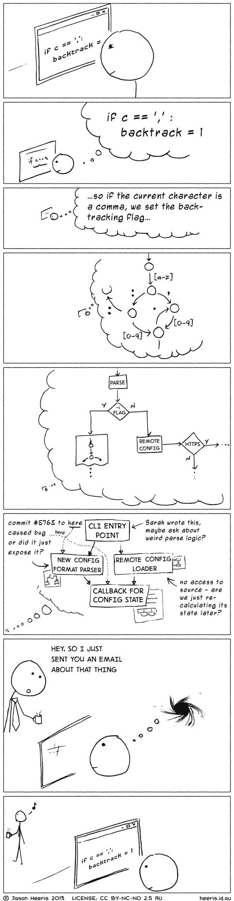

# 作为一名开发人员，如何培养良好的沟通技巧并戒除坏习惯

> 原文：<https://www.freecodecamp.org/news/how-to-cultivate-great-communication-skills-as-a-dev-and-kick-bad-habits-to-the-curb-d62a075700f5/>

作者:余伟

# 作为一名开发人员，如何培养良好的沟通技巧并戒除坏习惯

Photo by [Hitesh Choudhary](https://unsplash.com/@hiteshchoudhary?utm_source=medium&utm_medium=referral) on [Unsplash](https://unsplash.com?utm_source=medium&utm_medium=referral)

当有人在简历上写“善于沟通”时，我总是会停下来。

我有理由怀疑你的沟通能力吗？还是给我一个怀疑他们的理由？

把我的自负放在一边，我一直在思考为什么开发人员会有难以沟通的坏名声。

我反思了我自己的经历，确实有几次我说的话没有意义。在这篇文章中，我将分享一些我“失去”沟通技巧的场景，以及我用来帮助找到它们的解决方案。

### 问题:通宵写代码

编码需要高度的专注和逻辑思维。

研究表明，睡眠不足等同于喝几杯啤酒。

以前晚上写代码的时候，我很享受夜晚的宁静。没有人打扰你，只有你和你的想法。

在一个特殊的例子中，我们必须第一次向客户演示一个原型。我们在深夜发现了一个漏洞，所以我别无选择，只能熬夜修补它。

第二天早上，软件是好的，但我不是。我一直在口吃。谢天谢地，我让我的队友接替了我。

#### 解决方法

好吧，简单的解决办法是避免在晚上编码。

但是如果你的老板设定了一个不切实际的截止日期，而你的工作岌岌可危，该怎么办呢？你可以早点醒来。我知道这很糟糕，但也很安静。

随着时间的推移，我学会了给测试和调试留出更多的空间。

在[艾特金坦克](https://www.freecodecamp.org/news/how-to-cultivate-great-communication-skills-as-a-dev-and-kick-bad-habits-to-the-curb-d62a075700f5/undefined)的[文章](https://medium.com/swlh/all-about-sleep-a-complete-guide-for-getting-the-rest-you-need-8ad338834682)中，这里有一些我觉得有用的睡眠技巧:

1.  下午不要摄入咖啡因
2.  每天锻炼
3.  保持室温凉爽
4.  睡前两小时不要看屏幕

### 问题:长时间独自工作

我在学习如何编码之前就注意到了这一点。

当我在有 90 名员工的服装店工作时，在他们面前说话不成问题。

如果我坐在电脑前，几个小时不和任何人说话，我的公共演讲技能几乎退化为零。我说话结巴，用了太多的专业术语。

最糟糕的感觉莫过于你做了一件很棒的东西，但你无法解释它的作用。

#### 解决方法

设定有限的工作时间。

当你工作时，只做你面前的工作。

关掉手机，藏在某个地方。这将迫使你把注意力集中在手头的任务上。

休息的时候唱首歌。这听起来很奇怪，但对我很有效。如果你是一个人在工作，你不必担心自己是否足够优秀。它温暖了你的声带，这样你就可以用外面的声音说话了。

### 问题:在对话中思考代码

当你的大脑在思考一个未解决的问题时，它会从你的潜意识到你的意识来回跳跃。

如果你正在想办法，而你的同事说，“嘿，为什么 __(插入新功能)不起作用？”你可能不会很容易做出反应。

具有讽刺意味的是，你同时在你的大脑中编码这个新特性。

#### 解决方法

建立收集和记录问题的流程。

使用类似特雷罗的软件或 T2 的便利贴。然后，您可以清楚地看到剩余的任务及其优先级。

提前安排会议，这样就少了一些突兀的“讨论”。

这张图片来自 [Amando Abreu](https://www.freecodecamp.org/news/how-to-cultivate-great-communication-skills-as-a-dev-and-kick-bad-habits-to-the-curb-d62a075700f5/undefined) 的这篇[文章](https://medium.com/@amandoabreu/you-dont-understand-your-software-engineers-53442ca0805a)。在文章中，他的话引起了我的共鸣:

> 在一个不允许你太长时间专注的环境中工作后，你的大脑会变得习惯于不专注，这会影响你的认知和创造能力，导致工作更差，并让你的雇主损失很多钱。

合适的工作环境对开发人员和组织的生产力非常重要。确保你有一个。

### 问题:缩写不能节省时间

> 过度使用自创的首字母缩略词是沟通的一大障碍，随着我们的成长，保持良好的沟通非常重要。

> — [埃隆·马斯克:特斯拉、SpaceX 和对美好未来的追求](https://amzn.to/2JYbqPE)

当你把一群具有不同专业知识的人混在一起时，肯定会有一个人不理解某个缩写词或行话，比如:

KOL、TDD、KPI、CTA、SPA、SPF、WTF

我们最终会花更多的时间来解释它。这里有一个来自办公室的搞笑片段来证明这一点。

#### 解决方法

使用每个人都能理解的词汇。

交流既是一种特权，也是一种责任。倾听和被倾听是一种特权。但是确保你的话被理解也是你的责任。

要倾听，你需要给对方你的全部注意力。很难，但是值得。

### 问题:中途打断谈话

也许你在编码的时候戴着耳机。突然，你的老板想听听你的意见，“你觉得怎么样？”

“呃……我们刚才在说什么？”

然后他们不得不追溯他们的谈话。

你能做的最糟糕的事情是在你理解对话的背景之前给出一个答案。

#### 解决方法

总是先了解对话的上下文。提问。了解原因。

### 结论

能够与你的同事、老板和你生活中的其他人交流不仅会让你更有效率，而且你会对自己的工作感觉更好。

为开发人员建立正确的公司文化是组织的责任。但是，开发人员有责任照顾他们的健康，并大声说出什么对他们的生产力有好处。大声说！

#### 感谢阅读

如果你喜欢这个作品，你可以把它拍下来，这样更多的人可以从中受益。