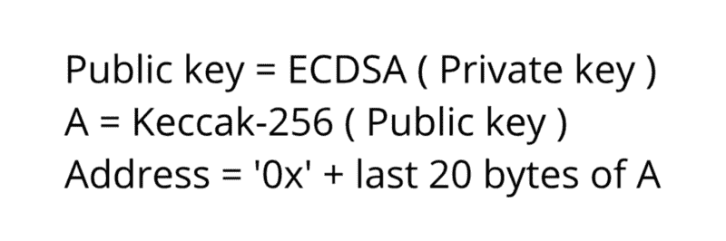

# 如何从私钥创建以太坊钱包地址

> 原文：<https://www.freecodecamp.org/news/how-to-create-an-ethereum-wallet-address-from-a-private-key-ae72b0eee27b/>

在本系列第一篇的[中，我们生成了一个比特币私钥:`60cf347dbc59d31c1358c8e5cf5e45b822ab85b79cb32a9f3d98184779a9efc2`。](https://www.freecodecamp.org/news/how-to-generate-your-very-own-bitcoin-private-key-7ad0f4936e6c/)

这里，我们将使用该密钥获取公共地址，然后获取该私钥的以太坊钱包地址。

从私钥创建比特币钱包地址有点复杂。在这里，流程会简单很多。我们需要应用一个散列函数来获取公钥，应用另一个散列函数来获取地址。

所以让我们开始吧。

### 公开密钥

这一部分几乎与我们在[比特币文章](https://www.freecodecamp.org/news/how-to-create-a-bitcoin-wallet-address-from-a-private-key-eca3ddd9c05f/)中讨论的内容相同，所以如果你读了那一篇，你可以跳过它(除非你需要复习)。

我们需要做的第一件事是对我们的私钥应用 ECDSA，即椭圆曲线数字签名算法。椭圆曲线是由方程`y² = x³ + ax + b`定义的曲线，其中选择了`a`和`b`。有一系列这样的曲线广为人知并被广泛使用。比特币使用的是 **secp256k1** 曲线。如果你想了解更多关于椭圆曲线密码的知识，我会推荐你参考[这篇文章](https://hackernoon.com/what-is-the-math-behind-elliptic-curve-cryptography-f61b25253da3)。

以太坊使用相同的椭圆曲线， **secp256k1** ，所以在两种加密货币中获取公钥的过程是相同的。

通过将 ECDSA 应用于私钥，我们得到一个 64 字节的整数，这是两个 32 字节的整数，表示椭圆曲线上的点的 X 和 Y，连接在一起。

对于我们的例子，我们得到了`1e7bcc70c72770dbb72fea022e8a6d07f814d2ebe4de9ae3f7af75bf706902a7b73ff919898c836396a6b0c96812c3213b99372050853bd1678da0ead14487d7`。

在 Python 中，它看起来像这样:

```
private_key_bytes = codecs.decode(private_key, ‘hex’)
# Get ECDSA public key
key = ecdsa.SigningKey.from_string(private_key_bytes, curve=ecdsa.SECP256k1).verifying_key
key_bytes = key.to_string()
key_hex = codecs.encode(key_bytes, ‘hex’)
```

注意:从上面的代码中可以看出，我使用了来自`ecdsa`模块的一个方法，并使用`codecs`解码了私钥。这与 Python 关系更大，与算法本身关系更小，但是我将解释我们在这里做什么来消除可能的混淆。

在 Python 中，至少有两个类可以保存私钥和公钥:“str”和“bytes”。第一个是字符串，第二个是字节数组。Python 中的加密方法使用“bytes”类，将其作为输入并作为结果返回。

现在，有一个小问题:一个字符串，比如说，`4f3c`不等于字节数组`4f3c`。相反，它等于包含两个元素的字节数组，`O&`lt；。这就是 t `he codecs.dec` ode 方法所做的:它将一个字符串转换成一个字节数组。这对于我们将在本文中进行的所有加密操作都是一样的。

### 钱包地址

一旦我们得到了公钥，我们就可以计算出地址。现在，与比特币不同，以太坊在主网络和所有测试网络上都有相同的地址。当用户进行和签署交易时，他们指定他们稍后在该过程中想要使用的网络。

要从公钥创建地址，我们需要做的就是对密钥应用 Keccak-256，然后获取结果的最后 20 个字节。仅此而已。没有其他哈希函数，没有 Base58 或任何其他转换。你唯一需要做的就是在地址的开头加上“0x”。

以下是 Python 代码:

```
public_key_bytes = codecs.decode(public_key, ‘hex’)
keccak_hash = keccak.new(digest_bits=256)
keccak_hash.update(public_key_bytes)
keccak_digest = keccak_hash.hexdigest()
# Take the last 20 bytes
wallet_len = 40
wallet = ‘0x’ + keccak_digest[-wallet_len:]
```

### 校验和

现在，您可能还记得，比特币通过对公钥进行哈希运算并取结果的前 4 个字节来创建校验和。所有的比特币地址都是这样，不加校验和字节就无法得到有效地址。

在以太坊，事情不是这样的。最初，没有校验和机制来验证密钥的完整性。然而，在 2016 年，Vitalik Buterin [引入了](https://github.com/ethereum/EIPs/blob/master/EIPS/eip-55.md)一种校验和机制，此后被钱包和交易所采用。

为以太坊钱包地址添加校验和使其区分大小写。

首先，您需要获得地址的 Keccak-256 哈希。注意，这个地址应该被传递给哈希函数，而不包含`0x`部分。

其次，迭代初始地址的字符。如果散列的第 *i* 个字节大于或等于 8，则将第 *i* 个地址的字符转换成大写，否则保持小写。

最后，在结果字符串的开头添加`0x`。如果忽略大小写，校验和地址与初始地址相同。但是大写字母可以让任何人检查地址是否有效。你可以在链接到的[页面找到校验和验证的算法。](https://github.com/ethereum/EIPs/blob/master/EIPS/eip-55.md)

正如您将在提案中看到的，对于这种校验和方案，

> 平均每个地址有 15 个校验位，如果输入错误，随机生成的地址意外通过检查的净概率为 0.0247%

下面是将校验和添加到以太坊地址的代码:

```
checksum = ‘0x’
# Remove ‘0x’ from the address
address = address[2:]
address_byte_array = address.encode(‘utf-8’)
keccak_hash = keccak.new(digest_bits=256)
keccak_hash.update(address_byte_array)
keccak_digest = keccak_hash.hexdigest()
for i in range(len(address)):
    address_char = address[i]
    keccak_char = keccak_digest[i]
    if int(keccak_char, 16) >= 8:
        checksum += address_char.upper()
    else:
        checksum += str(address_char)
```

### 结论

如你所见，为以太坊创建地址比比特币简单得多。我们所要做的就是将 ECDSA 应用于公钥，然后应用 Keccak-256，最后获取该散列的最后 20 个字节。



如果你想玩代码，我把它发布到了 [GitHub 库](https://github.com/Destiner/blocksmith)。

我正在 freeCodeCamp News 上开设一门关于加密货币的课程。第一部分是对区块链的详细描述。

我还在 Twitter 上发表了一些关于加密的随机想法，所以你可能想看看。