# 亚马逊网络服务(AWS)通过运营一家啤酒厂来解释

> 原文：<https://www.freecodecamp.org/news/amazon-web-services-aws-explained-by-operating-a-brewery-8f1e91eacc40/>

凯文·科诺年科

# 亚马逊网络服务(AWS)通过运营一家啤酒厂来解释

#### 如果你明白酿酒厂是如何运作的，那么你就能理解亚马逊网络服务(AWS)。

Photo by [Elevate](https://unsplash.com/photos/5sAzXev5-jA?utm_source=unsplash&utm_medium=referral&utm_content=creditCopyText) on [Unsplash](https://unsplash.com/search/photos/brewery?utm_source=unsplash&utm_medium=referral&utm_content=creditCopyText)

当你正在开发你的第一个 web 应用程序时，你总是会听到与过去相比推出一个新产品变得容易了。

人们会说这样的话，*“在我那个时代，你必须自己买服务器，自己配置！”*

或者，*“我们会通宵调试我们服务器基础设施的最新问题。”*

好在那些日子早就过去了。如果你知道你在做什么，你可以在一个小时内部署你的新网络应用，每月 10 美元。

但是，有一个小问题。像亚马逊网络服务(AWS)这样的标准工具可能相当复杂，至少对新手来说是这样。尽管它们提供了从第一批用户扩展到数亿用户的惊人能力，但它们也需要一些配置。

我想了解 AWS 提供的所有主要选项。思考了几个小时后，我意识到 AWS 生态系统类似于一个大型啤酒厂的所有不同部分。

这里有一个快速预览:

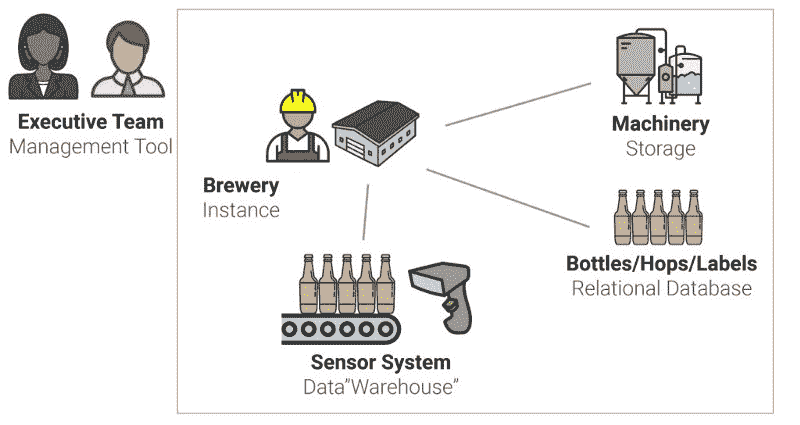

所以，这里是 5 个流行的 AWS 工具如何在 web 应用程序的幕后工作。我还将解释一下 Heroku，这是一个流行的部署 web 应用程序的工具，它提供了较少的灵活性，但是更容易上手。

来自 AWS 的官方视频给出了我们将要讨论的工具的一些背景信息:

为了理解本教程，你只需要理解[客户机-服务器模型](https://blog.codeanalogies.com/2018/02/02/localhost-explained-by-trying-to-start-a-microbrewery/)的概念，你可以[在这里](https://blog.codeanalogies.com/2018/02/02/localhost-explained-by-trying-to-start-a-microbrewery/)了解更多。

#### 亚马逊网络服务的背景

让我们想象一下，你热衷于酿造啤酒。你从厨房开始，为自己和朋友酿造。很快，关于你的美味工作的消息就传开了。为了满足日益增长的需求，你决定在一个仓库里租用一些设备和空间，看看你是否能创建一个成熟的公司。你将接受分销商、餐馆和独立企业的订单。

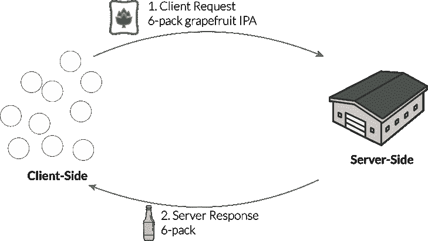

在上面的例子中，一个订单来自一个客户**—**一家餐馆或经销商。那叫做**请求**。您的啤酒厂将提供订单，并通过发票收取款项。这就是所谓的**反应**。****

****类似地，web 浏览器基于用户采取的动作向服务器发送请求。服务器通过响应返回所需的信息。****

****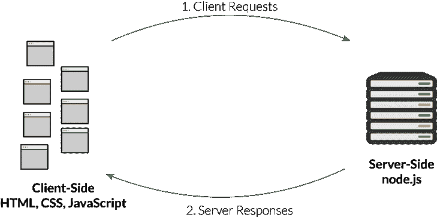****

****当然，这只是一个高层次的观点。在我们对 AWS 的探索中，我们将深入研究发生在**服务器端**的所有不同过程。在我们的啤酒厂类比中，我们假设订单已经从左边和右边进来。现在我们的工作是组织整个酿酒厂，这样我们就能可靠地交付订单。****

### ****Heroku 解释说 AWS 的一个简单得多的替代方案****

****在我们进入 AWS 的 5 个部分之前，您可能应该知道更简单的选择。Heroku 为你管理许多这样的系统。事实上，它建立在 AWS 基础设施之上。****

****Heroku 允许你使用 *git push heroku master* 直接从命令行部署新版本的应用。它还有一个[丰富的附加组件库](https://elements.heroku.com/addons)，允许你给你的 *dynos* 或者虚拟服务器添加新功能。****

****Heroku 有点像雇佣第三方承包商来管理你的酿酒厂。你所需要做的就是提供配方，这个承包商将利用他们在酿酒厂运营方面的专业知识来生产啤酒。他们提供团队、设备和与供应商的关系。****

****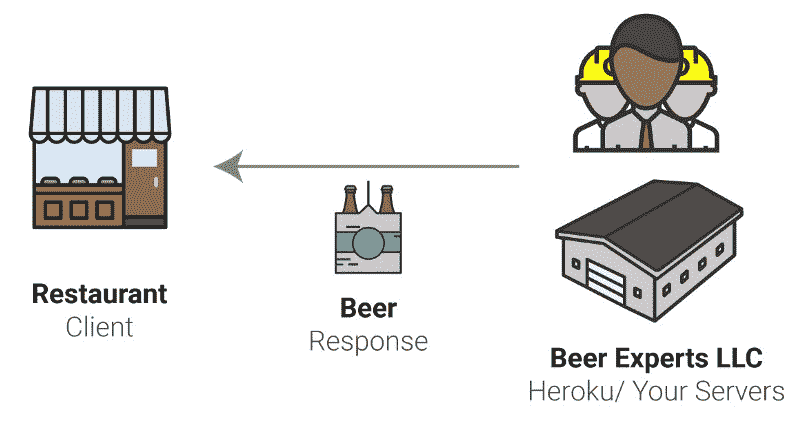********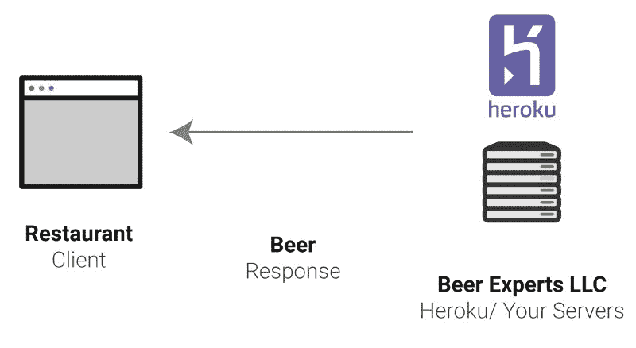****

****这可能感觉不可思议。现在你可以跳过那些你需要花费在学习如何经营酿酒厂的痛苦的时间和精力！但有两个理由需要谨慎。****

1.  ****这种方法成本会更高。除了工资、原材料等成本，你还要向公司支付他们的专业知识。****
2.  ****它们可能不会像您希望的那样纵向扩展。让我们想象一下，你开始收到数百万美元的订单，你需要扩大你的业务。他们可能没有准备好像您一样快速扩展。****

****Heroku 也有同样的利弊。它稍微贵一点，但是允许你立即开始。如果您扩大规模，您可能需要将您的服务迁移到 AWS，这意味着您无论如何都需要学习 AWS 系统。****

****至此，我们来了解一下 AWS 中的不同工具。****

### ****AWS 存储工具****

****这是看起来相似的三个类别中的第一个，所以系好安全带！在我们的啤酒厂内，有大量的静态资产不会改变，但对任何类型的酿造都是必要的。想想工人们使用的机器、装配线或电动工具。您不能将这些项目拆开并重新组合。但是，它们可以反复使用，仍然有用。****

****这有点像亚马逊 S3。S3 是一种云服务，允许你存储静态资产，比如图像。它代表简单存储服务。****

****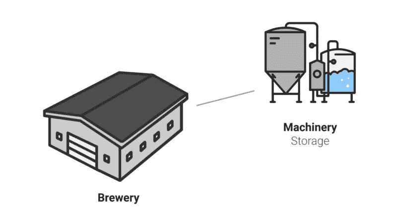********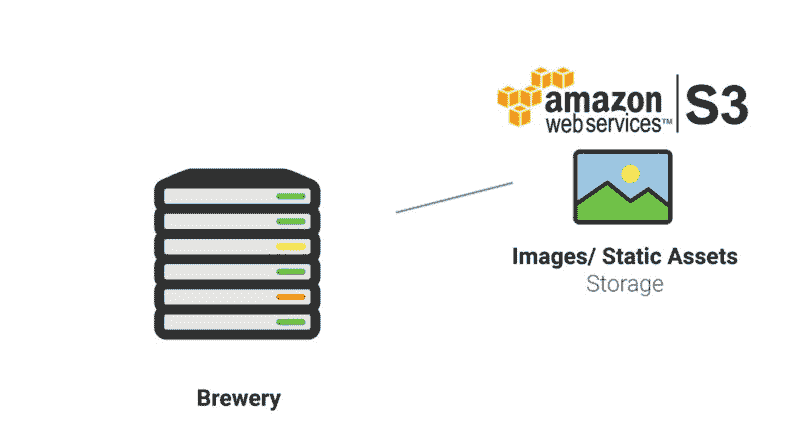****

****在这种情况下，“静态资产存储”的概念与您在现实生活中可能会想到的略有不同。在现实生活中，储存静态物品可能意味着把东西放在阁楼上，然后忘记它。但对于云服务来说，这意味着在几毫秒内准备好要使用的对象或图像。****

****这不同于数据库存储，因为数据库中的数据可以被查询。静态资产只能是**要求的**。****

### ****AWS 数据库服务****

****Amazon 关系数据库服务(RDS)允许您在 AWS 中设置和操作关系数据库。一些常见的例子包括 MySQL、PostGreSQL 和 Microsoft SQL Server。****

****在我们的啤酒厂的例子中，这有点像啤酒厂的一部分，储存瓶子、标签、啤酒花、麦芽和任何其他酿造啤酒所需的原料。我猜它还包括你公司的银行账户，因为这是一种动态存储的形式。****

****您可能想知道为什么在上一节之后我们又要讨论存储。这是因为所有这些元素都更加动态——它们被不断地组合或修改，以处理来自用户/客户的请求。****

****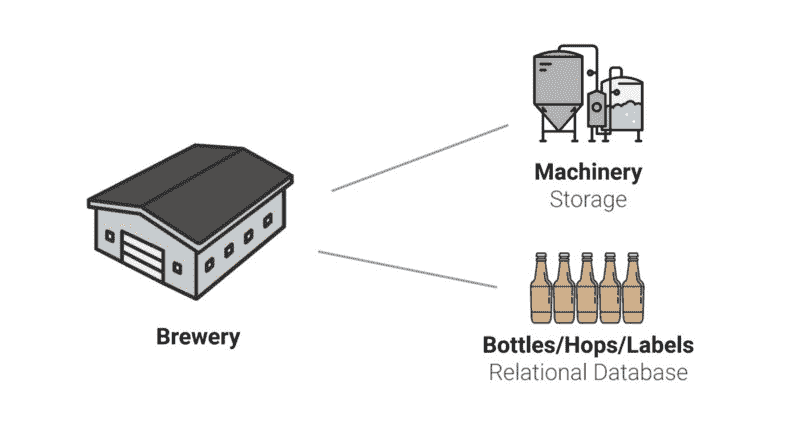********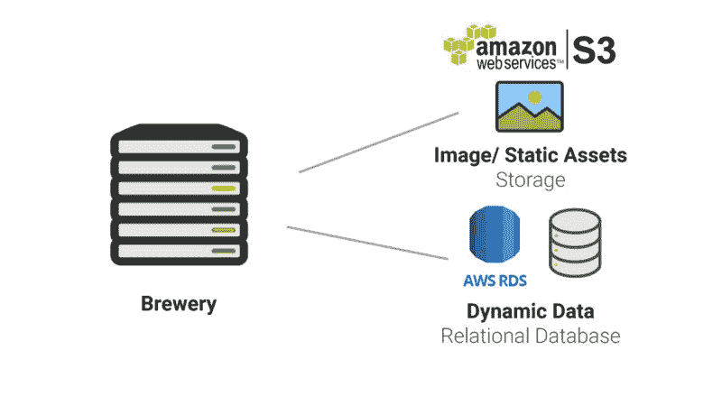****

****这是您将**查询**的数据类型，而不是像前面的例子那样请求。例如，如果您正在管理脸书的数据库，这将是用户数据和帖子，这些数据和帖子随后将包含在新闻提要中。****

****最后一点:这些数据(或啤酒花/麦芽/瓶子)只对向用户发送响应有用。如果您想衡量啤酒厂的绩效，您需要为您的运营团队建立一个新的流程。****

****想象一下，如果您的运营团队在您的啤酒厂疯狂地跑来跑去，试图跟踪您的绩效，而普通工人则试图生产和装瓶尽可能多的啤酒。这两个队有不同的兴趣。****

****这就是数据仓库发挥作用的地方。****

### ****AWS 数据仓库工具****

****这里先说清楚一点:“数据仓库”对于云服务来说是一个很可怕的名字。好吧，当然，对于一个有多年经验的开发人员来说，这可能是有意义的，但是对于一个新手来说……在 web 开发中有多少东西类似于仓库呢？很多。****

****数据仓库产品的一个常见例子是[红移](https://en.wikipedia.org/wiki/Amazon_Redshift)。这些类型的工具使开发人员能够轻松地分析他们的数据。它们包括来自关系数据库的数据，以及 ERP、CRM 和营销自动化数据。****

****让我们回到我们的啤酒厂类比。到目前为止，在我们的啤酒厂，我们所有的“数据”都不是很容易获取的形式。它以瓶子、啤酒花袋和任何其他原料的形式躺在工厂周围。如果分析师想要分析工厂的效率，他们需要手动计算所有这些物理项目。****

****您需要一种方法来将物理数据转换为机器可读的数据，您的运营团队可以使用这些数据来提高啤酒厂的效率。把它想象成设施周围的传感器系统。传感器将原材料的物理运动转换成机器可读的数据，这些数据可以在以后进行分析。****

************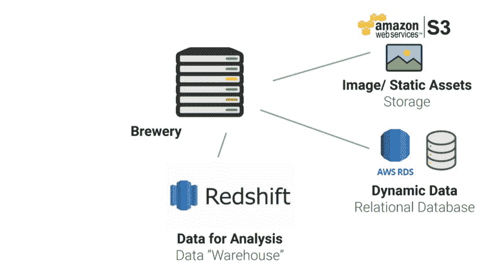****

****现在，随着我们工厂的运营，数据会自动收集并与工厂运营团队共享，以便他们可以分析效率。****

****看看这是如何减轻工厂和生产团队的压力的？生产团队可以专注于生产啤酒，而运营团队可以在办公室进行分析。这也是使用数据仓库工具的一个好理由。它减少了对数据库的查询次数，这可能会降低性能。****

****希望您能明白为什么“数据仓库”工具会有些许误导。是的，这确实创建了一个严格用于分析的新数据集。但是，很难说为什么它比系统的其他部分更像“仓库”。****

### ****AWS 计算工具****

****在迄今为止的所有图表中，您是否注意到“brewery”位于中间，而不管图表显示的是实际的酿酒厂还是云计算环境？****

****这是因为我们还没有涵盖将所有这些联系在一起的服务: [EC2，或弹性计算云](https://docs.aws.amazon.com/AWSEC2/latest/UserGuide/concepts.html)。EC2 允许您启动虚拟实例，这有点像这个比喻中的酿酒厂。****

****实例是**虚拟服务器**。与以前的技术不同，在以前的技术中，您的代码被绑定到一个物理服务器上，虚拟服务器允许您在云中启动自己的环境，它由许多连接的服务器组成。这是将所有其他 AWS 服务联系在一起的部分。****

****这有点像通过复制你现有的酿酒厂，就可以在世界上任何地方随时启动或关闭一个新的酿酒厂。这在现实生活中可能是不可能的，但在 AWS 生态系统中是可能的。EC2 为啤酒厂的物理空间和工人提供了类似的功能。****

****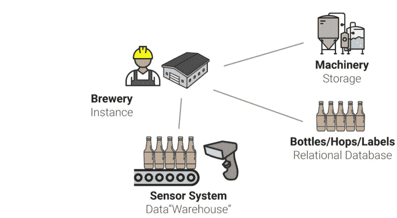********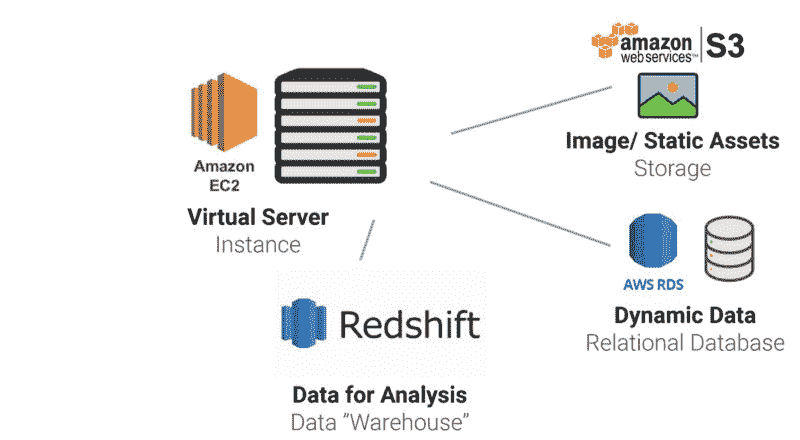****

****该图可能会稍有误导，因为虚拟服务器不会占用整个服务器。它存在于服务器网络中。但这太复杂了，无法在一个小图表中显示出来。所以我留着它。****

### ****AWS 管理工具****

****最后一类工具是管理工具，比如 Elastic Beanstalk 或 CloudWatch。这些工具可以:****

1.  ****监控上面列出的其他工具****
2.  ****设置流程以帮助多个类别的工具协同工作****

****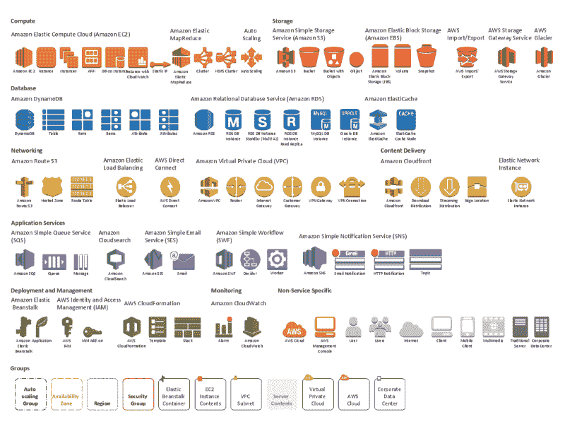

*Image Cred: FreeCodeCamp***** 

****在上图中，您可以看到有多少工具可以帮助部署和维护您的应用程序。这就是为什么这些工具类似于公司的管理团队。他们不是亲自为你的公司生产啤酒，而是帮助所有部门一起工作。****

****管理类别中有各种各样的工具，所以我不打算深入讨论任何一个。它们位于所讨论的其他工具之上。****

****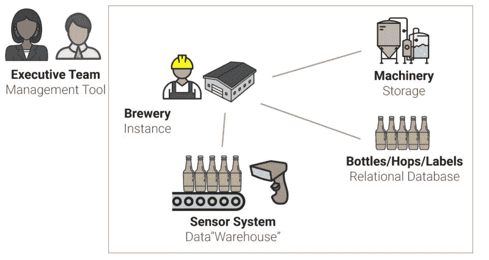********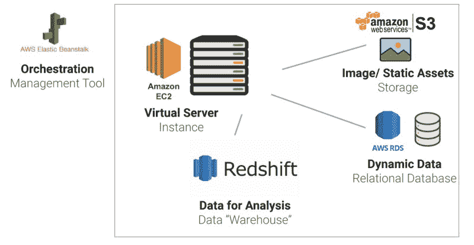****

### ****获取最新的可视化教程****

****你喜欢这个教程吗？给它一个“掌声”，或者在这里注册获得我最新的 web 开发解释。****