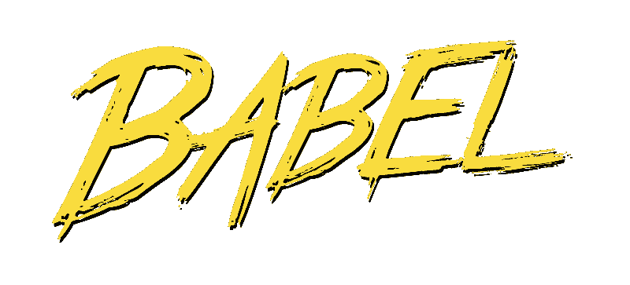

# 为什么我们删除了巴别塔的舞台预设:实验提案的明确选择

> 原文：<https://www.freecodecamp.org/news/why-we-removed-babels-stage-presets-explicit-opt-in-of-experimental-proposals-cd038c69115a/>

作者亨利·朱

# 为什么我们删除了巴别塔的舞台预设:实验提案的明确选择

随着 v7 的发展，我们决定最好停止在 Babel 中发布舞台预设(例如，`@babel/preset-stage-0`)。

我们并不是轻易做出这个决定的，我们想展示 TC39、巴别塔和社区之间相互作用背后的背景。

### 一些历史

巴别预设是一个可共享的插件列表。

[官方巴别塔舞台预设](https://babeljs.io/docs/en/next/presets)追踪了 [TC39 的登台过程](https://tc39.github.io/process-document/)为 JavaScript 中的新[语法提议](https://github.com/tc39/proposals)。

每个预设(例如`stage-3`、`stage-2`等等)包含了该特定阶段及其之上的所有插件。例如，`stage-2`收录了`stage-3`，等等。

这允许想要使用实验语法的用户简单地添加预置，而不是需要配置/安装每个单独的插件。

我们实际上在 Babel 的 v6 版本发布后不久[就添加了](https://github.com/babel/babel/pull/2649)Stage presets(之前在 v5 中它是一个配置标志)。下面显示的是一个旧的例子。

### 问题

这些预置是一种使用我们都想要的东西的便捷方式:新的、闪亮的、“尚未确定的”JavaScript 未来。

回想起来，效果真的很好！(也许太熟了？)

### 太好的工作？

像 CoffeeScript 这样的语言和像 T2 这样的工具帮助建立了编译 JavaScript 的想法。Babel 使得使用新的/未来的语法以及与现有工具的集成变得更加容易。人们的期望从怀疑和担心变成了完全接受实验。

如果没有 Babel 等编译器的广泛采用，我们可能不会有今天的成就:它加速了 ES2015 在更大范围内的使用(和教学)。React 的发展进一步推动了它的使用，因为它的 JSX 语法、类属性和对象 rest/spread 使人们对这些语法建议有了更多的了解。

巴别塔成了人们的一次性装置，再也不会被想起。它成为底层基础设施，隐藏在其他工具之后，直到出现`SyntaxError`、依赖性问题或集成问题。简单用`stage-0`。

从某些方面来看，这很棒，因为这意味着这些想法正在野外被测试，甚至是在生产环境中。然而，这也意味着，如果一个提议发生了重大的改变(或者甚至被完全放弃)，许多公司、工具和人员将会遇到一些麻烦。

### 来回地

多年来，我们提出了许多问题来讨论如何处理 [#4914](https://github.com/babel/babel/issues/4914) 、 [#4955](https://github.com/babel/babel/issues/4955) 、 [#7770](https://github.com/babel/babel/issues/7770) 中的舞台预设。我甚至在一篇关于巴别塔 7.0 的旧帖子中写道，我们**没有** [移除它们](https://babeljs.io/blog/2017/12/27/nearing-the-7.0-release)？。

然而，我们发现保留舞台预设甚至会给巴别塔本身带来问题:

*   人们经常会问这样的问题:[“使用异步功能需要什么预置？”人们可能不清楚`stage-0`到底是什么意思，也很少有人会去看它的`package.json`或出处。](https://github.com/babel/babel/issues/2948)
*   在第三阶段(一旦进入第四阶段)移除一个提议插件实际上是一个突破性的改变。当您试图使用`@babel/preset-env`不编译本地支持的提议时，这个问题会变得更加严重。

### “ES7 装饰工”

这个问题的一部分恰恰是关于事物的命名，正如我们经常听到的，命名事物是困难的。

ES6 本身有很多名字:Harmony、ES Next、ES6、ES2015。当人们听到新的想法时，选择一个最新的数字并附上它的名字是有意义的。

这种情况发生而没有意识到是完全可以理解的，但是继续这样做会对语言的发展产生不同的期望。没什么好内疚的——我们作为一个社区学习，并互相提醒 JavaScript 是如何工作的。

关于这个话题，杰伊·菲尔普斯写了一篇不错的[文章](https://medium.com/@jayphelps/please-stop-referring-to-proposed-javascript-features-as-es7-cad29f9dcc4b)。他解释说，最好按照他们目前所处的“阶段”来称呼他们:“第二阶段装修工”，或者简称为“装修工提案”。

原因是说“ES7 Decorators”假设 Decorators 应该在 ES7 中。我在关于编译 node_modules 的上一篇文章[中提到了这一点，但是处于一个特定的阶段并不能保证什么:一个提议可能会停滞、倒退或者被完全删除。](https://babeljs.io/blog/2018/06/26/on-consuming-and-publishing-es2015+-packages#staging-process)

当我们决定[将提议插件的名称](https://babeljs.io/docs/en/next/v7-migration#switch-to-proposal-for-tc39-proposals-blog-2017-12-27-nearing-the-70-releasehtml-renames-proposal)从`@babel/plugin-transform-`改为`@babel/plugin-proposal-`时，我们想要强调这个事实。

### BabelScript

在过程的早期就对提案进行预设可能意味着这些提案被保证向前推进或者有一个稳定的实现。

[TC39](https://tc39.github.io/process-document/) 呼吁在使用第二阶段或更低阶段的提案时要谨慎，因为这可能会导致社区无意中施加压力，要求保持实现原样，而不是对其进行改进，以免破坏现有代码或生态系统碎片(例如，使用不同的符号，如`#`而不是装饰者的`@`)。

人们开玩笑说，使用 Babel 的开发人员使用的是“BabelScript”而不是 JavaScript，这意味着一旦某个 Babel 插件是为某个特性开发的，那就意味着它已经是“固定的”或正式成为语言的一部分(这是不正确的)。对于一些人来说，当他们看到一个新的语法/思想(阶段“-1”)时，他们的第一个想法是是否有一个巴别塔插件。

### 设定期望

在像 Babel 这样的编译器让人们编写 ES2015 成为普遍做法之后，开发人员很自然地想要尝试更新更具实验性的“功能”。这在 Babel 中的工作方式是使用以前版本中的`stage`标志或`stage-x`预设。

作为选择任何新特性的最方便的方式，它很快成为人们在配置 Babel 时的默认选项(尽管在 Babel v6 中它变成了默认不做任何事情，这引起了很多抱怨)。

几年前就有很多很好的讨论，但这并不是最容易操作的事情:我们不想惩罚那些理解权衡的用户，在使用它的时候加上`console.warn` s，而且没有这个选项在当时看起来是不合理的。

盲目地选择进入阶段 0(不管我们是否默认了它)或者人们选择这样做似乎是危险的，但是也不使用任何提议是过度谨慎的。理想情况下，每个人都应该能够对他们认为合理的特性做出明智的决定，并明智地使用它们，不管他们处于哪个阶段。关于这些担忧，Mike Pennisi 写了一篇很棒的文章给 T2。

我们的目的不是威胁、催促或强迫特定的东西进入生态系统或 JavaScript，而是忠实地维护围绕新思想的实现/讨论。

### 其他考虑

我们也可以尝试:

*   [重命名预置](https://github.com/babel/babel/issues/4914)以更好地表示稳定性级别(不解决版本问题)
*   更好的版本控制策略:独立地控制预置版本，并在需要时立即更新，也许可以使用`0.x`
*   预设的旧版本出现警告/错误

最后，如果我们保持阶段不变，人们仍然必须查看哪些提议处于哪个阶段，才能知道使用哪些提议。

### 为什么不

为什么不早点去掉？多年来，舞台预设一直是巴别塔的一部分，有人担心使用巴别塔会增加更多的“复杂性”。许多工具、文档、文章和知识都是围绕舞台预设构建的。早些时候，我们认为最好是正式维护预置，因为其他人将不可避免地创建它们。

我们试图确定正确的反馈水平:如果只有委员会决定语言中包含什么，这可能会导致不需要的明确指定的功能。但是，如果社区期望正在进行的实验性提议被认为是稳定的，或者可以在生产中使用而没有后果，那么我们就会有其他问题。我们都想前进，并有目的地前进:不要匆忙，但也不要过于谨慎。巴别塔是做这个实验的合适地方，但是知道边界在哪里是必要的。

移除预设将被视为一项“功能”，因为这意味着某人必须做出明确的决定来使用每个建议。这对于任何提议都是合理的，因为它们都有不同程度的不稳定性、有用性和复杂性。

我们完全预料到最初会有一些反弹，但最终觉得从长远来看，移除舞台预设对我们所有人来说都是一个更好的决定。但是，删除以前的默认设置或删除 Stage 预设并不意味着我们不关心易用性、新用户或文档。我们尽我们所能保持项目稳定，提供工具使事情变得更好，并记录我们所知道的。

### 迁移

> *为了更加自动化的迁移，我们已经更新了 [babel-upgrade](https://github.com/babel/babel-upgrade) 来为你做这件事(你可以运行`npx babel-upgrade`)。*

TL；我们正在移除舞台预设。在某种程度上，人们将不得不选择加入并知道正在使用哪种提议，而不是假设人们应该使用什么，特别是考虑到这些提议中的一些提议的不稳定性。如果你使用另一个预置或工具链，(例如 [create-react-app](https://github.com/facebook/create-react-app) )这个改变可能不会直接影响你。

自`7.0.0-beta.52`起，我们已弃用舞台预设。如果你现在不想改变你的配置，我们建议你**将**的版本固定到`beta.54`直到你可以升级。在`beta.54`之后，我们将抛出一个错误消息，说明如何迁移。并检查预发行版中的所有版本是否相同。

或者，你可以自由制作包含相同插件的预置，并随意升级。在未来，我们可能想要开发一个`babel-init`来帮助你交互地设置插件或者更新`babel-upgrade`本身来列出和添加当前阶段的插件。也许巴别塔应该保持低级工具的地位，依靠其他高级/框架工具如`create-react-app`来为人们处理这些选择。

### 防止方案锁定

[詹姆斯·迪吉亚](https://twitter.com/JamesDiGioia)最近写了一篇[帖子](https://babeljs.io/blog/2018/07/19/whats-happening-with-the-pipeline-proposal)关于使用管道操作符(`|&`gt；).

这篇文章的主要观点是，提案本身是不断变化的，有几个可供探索的选项。因为我们希望将当前的三种可能性都实现为规范反馈和用户反馈的巴别塔插件，所以我们认为插件的使用方式也应该改变。这对于 TC39 和巴别塔来说是比较新的做法！

以前，我们会将建议插件添加到配置中，就这样。现在，我们移除默认行为，并要求用户选择一个标志来显示选择了哪个提议。我们明确表示，目前没有一个固定的(甚至是偏好的)选项。

这是我们希望继续做下去的事情，也是这些提议对我们所有人的改变和反馈持开放态度的另一个标志。舞台预设的删除使这变得更加容易，因为以前我们必须传递这些选项，即使您不使用语法。

### 生态系统维护负担

一种语言的“语法预算”不仅适用于语言本身的复杂性，还可以延伸到工具。每一个新的语法增加都会给其他 JavaScript 项目的维护者带来新的负担。

一旦提出了新的语法，许多东西都需要更新:解析器(`babylon`)、语法突出显示(`language-babel`)、linter(`babel-eslint`)、测试框架(`jest` / `ava`)、格式化器(`prettier`)、代码覆盖率(`istanbul`)、缩小器(`babel-minify`)，等等。

像`acorn`、`eslint`、`jshint`、`typescript`等项目已经提出了许多问题来支持 0 阶段提案，因为它们还处于巴别塔阶段。没有多少项目会坚持要求他们支持任何提议的政策，因为维护起来会非常费力。在许多方面，令人惊讶的是，我们甚至试图在巴别塔本身处理它，因为不断更新和流失。

谁在做这项工作，确保一切正常运转是我们的责任吗？这些项目中的每一个(大部分是志愿者)几乎在每个方面都缺乏帮助，然而我们不断收到关于这方面的抱怨。作为一个社区，我们如何承担处理我们的基础设施的责任(与整个开源没有什么不同)？

Babel 承担了支持这些实验特性的不寻常的负担。同时，其他项目采取更保守的政策也是合理的。如果您希望看到新的语言特性在整个生态系统中得到支持，[请为 TC39](https://github.com/tc39/ecma262/blob/master/CONTRIBUTING.md) 和这个项目做出贡献，将这些提议带入第 4 阶段。

### 未来

这个项目的目的是作为 TC39 流程的一部分:作为一种资源，既用于实现较新的(阶段 0-2)提案，又用于接收用户的反馈，同时还支持旧版本的 JavaScript。我们希望这篇文章能让我们更好地了解我们是如何尽最大努力在 JavaScript 生态系统中更好地调整这个项目的。我们将很快发布 v7 的 RC 版本！

如果你欣赏这篇文章和我们在巴别塔上所做的工作，你可以在 [Patreon](https://www.patreon.com/henryzhu) 上支持我，要求你的公司赞助我们在[Open collection](https://opencollective.com/babel)上，或者更好的是让你的公司参与巴别塔作为你工作的一部分。我们会感谢集体所有制。

感谢所有的[评审](https://github.com/babel/website/pull/1735)！请随时在[推特](https://twitter.com/left_pad/status/1022877618348146693?s=20)上给出反馈。

*最初发布于*[https://babel js . io/blog/2018/07/27/removaling-babels-stage-presets](https://babeljs.io/blog/2018/07/27/removing-babels-stage-presets)*。*