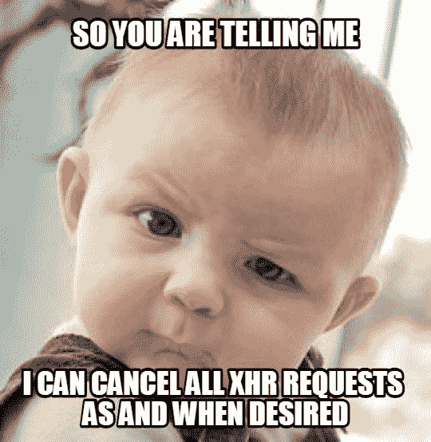

# 如何以正确的方式工作，以避免一些常见的陷阱

> 原文：<https://www.freecodecamp.org/news/how-to-work-with-react-the-right-way-to-avoid-some-common-pitfalls-fc9eb5e34d9e/>


Photo by [Alexander Sinn](https://unsplash.com/@swimstaralex?utm_source=ghost&utm_medium=referral&utm_campaign=api-credit) / [Unsplash](https://unsplash.com/?utm_source=ghost&utm_medium=referral&utm_campaign=api-credit)

在我们新的 React 应用程序中，我经常听到的一句话是“**让我们去 Redux** ”。它有助于您进行扩展，并且应用程序数据不应该处于 React local 状态，因为这是低效的。或者，当您调用一个 API 时，在承诺未决的情况下，组件被卸载，您会得到下面这个漂亮的错误。

> 警告:无法对已卸载的组件调用 setState(或 forceUpdate)。这是不可行的，但它表明您的应用程序中存在内存泄漏。要修复此问题，请取消 componentWillUnmount 方法中的所有订阅和异步任务。

所以人们通常得出的解决方案是使用 **Redux** 。我喜欢 Redux 和 [**丹阿布拉莫夫**](https://twitter.com/dan_abramov) 正在做的工作简直**不可思议！那家伙很棒——我希望我有他一半的才华。**

但是我确信当丹制作 Redux 的时候，他只是在我们的工具箱里给了我们一个工具作为助手。它不是万能的。当你能用螺丝刀拧紧螺栓时，你就不用锤子了。

[**丹连同意**](https://twitter.com/dan_abramov) **。**

我喜欢 React，我已经在这上面工作了将近两年。到目前为止，不后悔。有史以来最好的决定。我喜欢 Vue 和所有很酷的库/框架。但是 React 在我心中占有特殊的位置。它帮助我专注于我应该做的工作，而不是占用我所有的时间在 DOM 操作上。它尽可能以最好和最有效的方式做到这一点。与其[有效对账](https://github.com/acdlite/react-fiber-architecture)。

在过去的几年里，我学到了很多东西，我注意到新的和有经验的 React 开发人员都有一个共同的问题:在处理订阅或异步任务时没有正确使用 React。我觉得现有的文档在这种情况下没有很好地展示出来，所以我决定写这篇文章。

我将首先谈论订阅，然后我们将继续处理异步任务取消，以避免 React 中的内存泄漏(本文的主要目的)。如果不处理，这将降低我们的应用程序的速度。


Let’s clear all subsciptions/async tasks, and as a reminder don’t go in the direction of Mordor

现在让我们回到我们最初谈到的那个漂亮的错误消息:

> 警告:无法对已卸载的组件调用 setState(或 forceUpdate)。这是不可行的，但它表明您的应用程序中存在内存泄漏。要修复此问题，请取消 componentWillUnmount 方法中的所有订阅和异步任务。

我写这篇文章的目的是确保没有人不得不面对这个错误，并且不知道如何处理它。

### 我们将涵盖的内容

*   清除订阅，如 setTimeout/setInterval
*   使用`fetch`或类似`axios`的库调用 XHR 请求时，清除异步动作
*   替代方法，一些固执己见的其他人不赞成。

在我开始之前，我要大声喊一声 [**肯特·C·多兹**](https://twitter.com/kentcdodds) ，现在互联网上最酷的人。感谢您抽出时间&回馈社区。他的 [Youtube **播客**](https://www.youtube.com/user/kentdoddsfamily) 和关于 [**高级 React 组件模式**](https://egghead.io/courses/advanced-react-component-patterns) 的 egghead 课程令人惊叹。如果你想在反应技能上更进一步，请查阅这些资源。

我向 Kent 询问了一种更好的方法来避免组件卸载时的 setState，这样我可以更好地优化 React 的性能。他做得更好，还制作了一个视频。如果你是一个视频类型的人，看看下面。它会给你一步一步的详细解释。

[https://www.youtube.com/embed/8BNdxFzMeVg?feature=oembed](https://www.youtube.com/embed/8BNdxFzMeVg?feature=oembed)

所以现在让我们开始吧。

### 1:清除订阅

让我们从这个例子开始:

[https://codesandbox.io/embed/m3rn84m7y9?from-embed](https://codesandbox.io/embed/m3rn84m7y9?from-embed)

让我们谈谈刚刚发生的事情。我想让你关注的是`counter.js`文件，它基本上在 3 秒钟后递增计数器。

这在 5 秒钟内给出了一个错误，因为我没有清除它就卸载了一个订阅。如果您想再次看到错误，只需点击 CodeSandbox 编辑器中的刷新按钮即可在控制台中看到错误。

我有我的容器文件`index.js`,它只是在第一个五秒后切换计数器组件。

因此

> — — — →Index.js

> — — — → Counter.js

在我的 Index.js 中，我调用 Counter.js 并简单地在我的 render 中这样做:

```
{showCounter ? <Counter /> : null}
```

`showCounter`是一个布尔状态，组件一挂载(componentDidMount)，它就在第一个 5 秒后将自身设置为假。

真正能说明我们问题的是每 3 秒钟增加一次计数的`counter.js`文件。所以在第一个 3 秒后，计数器更新。但是当第二次更新发生在第 6 个秒时，`index.js`文件已经在第 5 个秒卸载了计数器组件。当计数器组件到达第 6 个秒时，它第二次更新计数器。

它会更新它的状态，但问题就在这里。没有 DOM 可供 counter 组件更新状态，这就是 React 抛出错误的原因。我们上面讨论的那个美丽的错误:

> 警告:无法对已卸载的组件调用 setState(或 forceUpdate)。这是不可行的，但它表明您的应用程序中存在内存泄漏。要修复此问题，请取消 componentWillUnmount 方法中的所有订阅和异步任务。

现在，如果你是个新手，你可能会说，“嗯 **Adeel …** 是的，但是我们不是刚刚在第 5 秒卸载了计数器组件吗？如果没有 counter 的组件，它的状态怎么可能在第六秒还在更新？”

是的，你是对的。但是当我们在 React 组件中做类似于`setTimeout`或`setInterval`的事情时，它并不像你所想的那样依赖于或链接于 React 类。它将在指定条件后继续运行，除非或直到您取消它的订阅。

现在，当你的条件得到满足时，你可能已经在这样做了。但是，如果您的条件还没有得到满足，而用户决定在这个动作仍然发生的地方改变页面，该怎么办呢？

清除这些订阅的最好方法是在你的生命周期中。这里有一个你可以如何做的例子。检查 counter.js 文件的 componentWillUnmount 方法:

[https://codesandbox.io/embed/xr7j5507qp?from-embed](https://codesandbox.io/embed/xr7j5507qp?from-embed)

这差不多就是`setTimout` & `setInterval`。

### 2: API (XHR)中止

*   丑陋的老方法(不赞成)
*   良好的新方法(本文的主要目的)

我们已经讨论了订阅。但是如果你提出一个异步请求呢？你怎么取消它？

#### 老办法

在我谈论这个之前，我想谈谈 React 中一个不推荐使用的方法`isMounted()`

2015 年 12 月之前，React 里有一个叫`isMounted`的方法。你可以在 React [**博客**](https://reactjs.org/blog/2015/12/16/ismounted-antipattern.html) **了解更多。**它是这样做的:

```
import React from 'react'
import ReactDOM from 'react-dom'
import axios from 'axios'

class RandomUser extends React.Component {
  state = {user: null}
  _isMounted = false
  handleButtonClick = async () => {
    const response = await axios.get('https://randomuser.me/api/')
    if (this._isMounted) {
      this.setState({ user: response.data })
    }
  }
  componentDidMount() {
    this._isMounted = true
  }
  componentWillUnmount() {
    this._isMounted = false
  }
  render() {
    return (
      <div>
        <button onClick={this.handleButtonClick}>Click Me</button>
        <pre>{JSON.stringify(this.state.user, null, 2)}</pre>
      </div>
    )
  }
} 
```

出于这个例子的目的，我使用一个名为`axios`的库来发出一个 XHR 请求。

让我们过一遍。我最初将`this_isMounted`设置为`false`，就在我初始化状态的地方。一旦生命周期`componentDidMount`被调用，我就设置`this._isMounted`为真。在此期间，如果最终用户单击该按钮，就会发出 XHR 请求。我用的是`randomuser.me`。一旦承诺得到解决，我会检查组件是否仍然安装有`this_isMounted`。如果是真的，我更新我的状态，否则我忽略它。

在解决异步调用时，用户可能单击了按钮。这将导致用户切换页面。因此，为了避免不必要的状态更新，我们可以简单地在我们的生命周期方法`componentWillUnmount`中处理它。我简单地将`this._isMounted`设置为 false。因此，每当异步 API 调用得到解决，它将检查是否`this_isMounted`为假，然后它不会更新状态。

这种方法确实能完成工作，但是正如 React 医生所说:

> `isMounted()`的主要用例是避免在组件卸载后调用`setState()`，因为在组件卸载后调用`setState()`会发出警告。“setState warning”的存在是为了帮助您捕获 bug，因为在一个未安装的组件上调用`setState()`表明您的应用程序/组件不知何故未能正确清理。具体来说，在一个卸载的组件中调用`setState()`意味着在该组件被卸载后，你的应用程序仍然持有对该组件的引用——这通常表明存在内存泄漏！[阅读更多…](https://reactjs.org/blog/2015/12/16/ismounted-antipattern.html)

这意味着尽管我们已经避免了不必要的 setState，内存仍然没有被清空。仍然有一个异步动作在发生，它不知道组件生命周期已经结束，不再需要它了。

#### 我们来谈谈正确的方法

这里拯救这一天的是[](https://developer.mozilla.org/en-US/docs/Web/API/AbortController)**。根据 [MDN](https://developer.mozilla.org/en-US/docs/Web/API/AbortController) 文件规定:**

> **`**AbortController**`接口代表一个控制器对象，允许您在需要时中止一个或多个 DOM 请求。[阅读更多..](https://developer.mozilla.org/en-US/docs/Web/API/AbortController)**

****

**让我们在这里看得更深入一些。当然是用代码，因为每个人都用❤代码。**

```
`var myController = new AbortController();
var mySignal = myController.signal;

var downloadBtn = document.querySelector('.download');
var abortBtn = document.querySelector('.abort');

downloadBtn.addEventListener('click', fetchVideo);

abortBtn.addEventListener('click', function() {
  myController.abort();
  console.log('Download aborted');
});

function fetchVideo() {
  ...
  fetch(url, { signal: mySignal }).then(function(response) {
    ...
  }).catch(function(e) {
    reports.textContent = 'Download error: ' + e.message;
  })
}` 
```

 **首先我们创建一个**新的堕胎控制器**，并将其赋给一个名为`myController`的变量。然后我们给人工控制员发一个**信号**。可以把这个信号看作是一个指示器，告诉我们的 XHR 请求什么时候应该中止请求。

假设我们有两个按钮，`Download`和`Abort`。下载按钮下载视频，但是如果在下载过程中，我们想取消下载请求，该怎么办？我们只需要打电话给`myController.abort()`。现在这个控制器将中止所有与之相关的请求。

你可能会问，怎么做？

在我们做了`var myController = new AbortController()`之后，我们做了这个`var mySignal = myController.signal`。现在，在我的获取请求中，我告诉它 URL 和有效载荷，我只需要传入`mySignal`来链接/通知那个`FETCh`请求和我的`AbortController`。

如果你想阅读一个关于`AbortController`的更广泛的例子，MDN 的酷人们在他们的 Github 上有这个非常好和优雅的例子。你可以在这里查看[。](https://github.com/mdn/dom-examples/blob/master/abort-api/index.htm)

我想谈谈这些中止请求是因为没有多少人知道它们。2015 年开始请求中止获取。这里是 Abort 上的[原 GitHub 问题——它终于在 2017 年 10 月左右获得支持。这是两年的差距。哇！有一些像 **axios** 这样的库为 AbortController 提供支持。我将讨论如何在 axios 上使用它，但我首先想展示 AbortController 如何工作的深入版本。](https://github.com/whatwg/fetch/issues/27)

### **中止 Axios 中的 XHR 请求**

> “做，还是不做。没有尝试。”—尤达

我上面谈到的实现并不特定于 React，但这正是我们在这里要讨论的。本文的主要目的是向您展示当发出 XHR 请求并且在请求处于挂起状态时组件被卸载时，如何在 React 中清除不必要的 DOM 操作。咻！

所以事不宜迟，我们开始吧。

```
import React, { Component } from 'react';
import axios from 'axios';

class Example extends Component {
  signal = axios.CancelToken.source();

  state = {
    isLoading: false,
    user: {},
  }

  componentDidMount() {
    this.onLoadUser();
  }

  componentWillUnmount() {
    this.signal.cancel('Api is being canceled');
  }

  onLoadUser = async () => {
    try {
      this.setState({ isLoading: true });
      const response = await axios.get('https://randomuser.me/api/', {
        cancelToken: this.signal.token,
      })
      this.setState({ user: response.data, isLoading: true });
    } catch (err) {
      if (axios.isCancel(err)) {
        console.log('Error: ', err.message); // => prints: Api is being canceled
      } else {
        this.setState({ isLoading: false });
      }
    }
   } 

    render() {
      return (
        <div>
          <pre>{JSON.stringify(this.state.user, null, 2)}</pre>
        </div>
      )
    }

} 
```

让我们浏览一下这段代码

我将`this.signal`设置为`axios.CancelToken.source()`，这基本上实例化了一个新的`AbortController`，并将那个`AbortController`的信号分配给`this.signal`。接下来，我在`componentDidMount`中调用一个名为`this.onLoadUser()`的方法，该方法从第三方 API `randomuser.me`中调用随机用户信息。当我调用那个 API 时，我也将信号传递给 axios 中一个名为`cancelToken`的属性

我做的下一件事是在我的`componentWillUnmount`中调用与那个`signal`链接的 abort 方法。现在让我们假设组件一加载，就调用了 API 和`XHR request went in a pending state`。

现在，请求被挂起(也就是说，它没有被解决或拒绝，但是用户决定转到另一个页面。一旦生命周期方法`componentWillUnmount`被调用，我们将中止我们的 API 请求。一旦 API get 被中止/取消，该承诺将被拒绝，并且将落在那个`try/catch`语句的`catch`块中，特别是在`if (axios.isCancel(err) {}`块中。

现在我们清楚地知道 API 被中止了，因为组件被卸载了，因此记录了一个错误。但是我们知道我们不再需要更新那个状态，因为不再需要它了。

您可以使用相同的信号，并在您的组件中传递任意多的 XHR 请求。当组件被卸载时，当调用 componentWillUnmount 时，所有处于挂起状态的 XHR 请求都将被取消。

### 最终细节

恭喜你！:)如果你读到这里，你已经学会了如何用自己的方式中止一个 XHR 请求。

让我们再坚持一会儿。通常，您的 XHR 请求在一个文件中，而您的主容器组件在另一个文件中(从该文件中调用 API 方法)。如何将该信号传递给另一个文件，同时仍然取消 XHR 请求？

以下是您的操作方法:

```
import React, { Component } from 'react';
import axios from 'axios';

// API
import { onLoadUser } from './UserAPI';

class Example extends Component {
  signal = axios.CancelToken.source();

  state = {
    isLoading: false,
    user: {},
  }

  componentDidMount() {
    this.onLoadUser();
  }

  componentWillUnmount() {
    this.signal.cancel('Api is being canceled');
  }

  onLoadUser = async () => {
    try {
      this.setState({ isLoading: true });
      const data = await onLoadUser(this.signal.token);
      this.setState({ user: data, isLoading: true });
    } catch (error) {
      if (axios.isCancel(err)) {
        console.log('Error: ', err.message); // => prints: Api is being canceled
      } else {
        this.setState({ isLoading: false });
      }
    }
  }

    render() {
      return (
        <div>
          <pre>{JSON.stringify(this.state.user, null, 2)}</pre>
        </div>
      )
    }
  };

} 
```

```
export const onLoadUser = async myCancelToken => {
  try {
    const { data } = await axios.get('https://randomuser.me/api/', {
      cancelToken: myCancelToken,
    })
    return data;
  } catch (error) {
    throw error;
  }
}; 
```

我希望这对你有所帮助，也希望你学到了一些东西。如果你喜欢它，请给它一些掌声。

感谢您抽出时间阅读。向我非常有才华的同事 [**Kinan**](http://kazmi@facebook.com) 大声欢呼，感谢他们帮助我校对了这篇文章。感谢**K[ent C Dodds](https://twitter.com/kentcdodds)成为 JavaScript OSS 社区的灵感源泉。**

同样，我很乐意听到你的反馈。你可以在推特[](http://twitter.com/adeelibr)****上随时联系我。****

**此外，我通过 **MDN** 文档中的**杰克·阿奇博尔德**发现了**中止控制器**上的[另一个惊人的读数](https://developers.google.com/web/updates/2017/09/abortable-fetch)。如果你像我一样有好奇心，我建议你读一读。****