# 所有开发人员都应该牢记的设计技巧

> 原文：<https://www.freecodecamp.org/news/design-tips-for-developers-84239ca00bfe/>

按键 Wiki

# **所有开发人员都应牢记的设计技巧**

#### 在理想的情况下，面向消费者的产品开发团队中，每四至六名工程师中应该有一名设计师。实际上这很少发生。所以我写了一些任何工程师在团队设计短缺时都可以遵循的技巧。

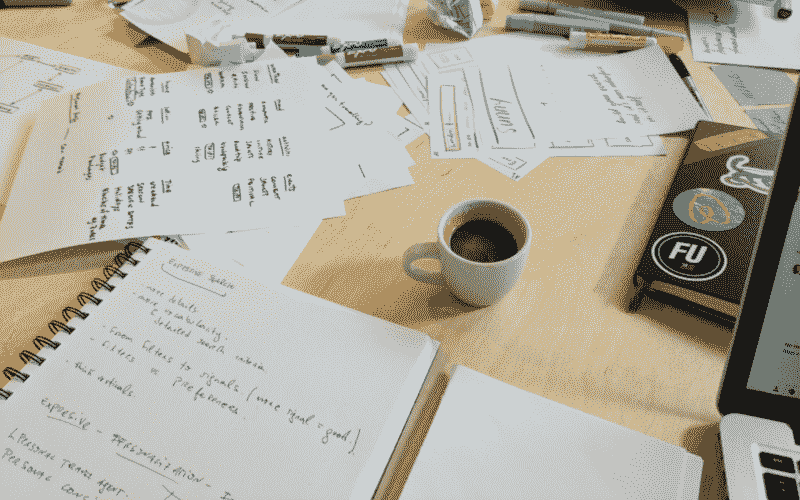

Brainstorming at Airbnb

### **语境**

我是一名产品设计师，有着[不同的背景](https://www.linkedin.com/in/wikichaves)。我在不同的行业工作过，从教育、广告到零售和技术。

我一直认为角色是我的职责和他们的职责之间的严格界限。作为一名设计师，我负责设计，工程师负责编码。这帮助我定义了我的角色，也对我的职责有了一定的控制。

去年，当我在一家以设计文化闻名的科技公司 *—* 工作的时候，我面临了一个巨大的挑战。入职一周后，我加入了一个由 12 名工程师、一名项目经理、一名数据科学家、一名研究人员组成的团队，只有我一名设计师。我有点吓坏了。我将如何满足我的团队的需求？

我考虑了三种可能的解决方案。

1.  **工作时间更长**。那是我的第一直觉。如果我必须为超过理想数量两倍的工程师交付设计，我将不得不工作更多的时间。那会严重影响我的生活/工作平衡，最终让我精疲力尽。
2.  **减速**。如果我想继续以我通常的速度工作，我最终会成为人类的瓶颈。设计请求将开始积累，我将永远没有时间赶上(这将对我们的团队目标产生严重的负面影响)。
3.  **放手**。作为设计师，很难释怀。我们很自豪成为有经验的专家。让整个团队设计感觉我没有做好我的工作，当然，这对我的自尊心有影响。但是随着时间的推移，这被证明是最好的方法。

### **每个人都是设计师**

关于这个话题我想了很多，我找到了丹尼尔·伯克的一篇很棒的文章，这篇文章最终让我相信这是一个正确的方法。每个人都可以成为设计师。

放手并不意味着我不再关心我们的设计。但是我必须鼓励团队中的其他人使用他们的设计思维，为用户问题或商业目标提出解决方案。最终，使用你的产品的用户并不关心某个特定的屏幕或流程是否是由设计师设计的。他们关心自己的体验，这不是一个人的责任。

为了做好这件事，我给了我们的团队一些设计技巧和工具，并安排了每周一次的设计办公时间。这提供了一个固定的地方，每个人都可以带着他们的设计想法来讨论和分享反馈。

Photo by [rawpixel](https://unsplash.com/photos/3BK_DyRVf90)

这个过程最终有了惊人的结果。在短短几周内，我们见证了其中一些想法是如何付诸实施并取得积极成果的。我们的进度比以前更快了，团队非常兴奋地看到他们的设计理念在生产中展现出来！

### **可能的场景**

在跳到开发人员的设计技巧之前，我想先提一下您可能面临的场景。这在很大程度上取决于你处于项目的哪个阶段。

#### 场景 1——没有设计师。

这可能是早期创业或学生项目中最常见的情况。你的团队中没有设计师意味着你就是设计师！不要害怕，利用这个机会学习。我确信，如果你遵循一些简单的规则，你就能产生一个有凝聚力的 MVP。

在这个阶段，你们很可能是一个非常小的团队。不要花太多时间去做一些漂亮、时髦或吸引眼球的东西。专注于用一个体面的用户界面建立一个伟大的体验。你以后会有时间改进的。

#### 场景 2——大约 10 个开发人员只有一个设计师。

去年我也遇到过这种情况，你的设计师肯定需要帮助。你能帮什么忙？提出想法——不要期望一切都会得到解决。和你的设计师坐下来，向他们展示你的想法。他们一定会很感激的。加入他们的头脑风暴会议，并给予反馈。如果设计没有完全符合规格，向你的设计师要源文件，自己看一下，这样可以节省他们一些时间。

#### 场景 3 -每 4 到 6 个开发人员中就有一个设计师。

你很幸运，因为这是一个理想的场景！这并不意味着你可以完全忘记设计，但它不再是首要关注的问题。我仍然建议你参加头脑风暴会议，从工程师的角度提出想法并给出早期反馈。

### **开发人员的设计技巧**

如果你发现自己处于没有设计师的情况下，这里有一个设计技巧的列表会对你有所帮助。但是它们也可以适用于任何其他情况。

#### **设计师心态**

如果你打算做设计，作为一名设计师来思考是非常重要的。你在设计的时候，不要考虑工程问题，要考虑如何解决用户问题。

用户第一。

比方说，你必须建立一个照片上传功能。在设计阶段，你不应该考虑性能、代码优化或平台限制。想想用户上传照片最有效、最直观的方式是什么？想想用户上传一张图片的动机。这个过程如何才能简单明了，甚至令人愉快呢？

然后，当你完成你的设计，戴上你的工程师帽，用你的工程师视角回顾你刚刚做的事情。这在技术上可行吗？按照您的设计，构建这个功能需要多长时间？你有时间建造它吗？如果没有，你能不能缩小一点范围，这样你就能在截止日期前完成任务？

Photo by [William Iven](https://unsplash.com/photos/gcsNOsPEXfs?utm_source=unsplash&utm_medium=referral&utm_content=creditCopyText)

不要跨越角色之间的界限，这一点非常重要，否则你最终会因为工程约束而限制你的设计，反之亦然。如果有帮助的话，你可以试着把上午的时间用于设计，下午的时间用于工程。或者，您可以使用工作空间中的一个区域来完成所有的设计工作，然后移动到另一个区域来完成您的工程工作。

#### **制定计划**

如果你有一个想法，在直接跳到代码之前，建立一个计划。你可以做线框，使用便利贴，白板，或在记事本上画草图——这取决于你。即使你认为你已经记住了所有的细节，也不要跳过这一步。当你完成你的线框图后，检查一下，你可能会发现你遗漏了一些东西。

Photo by [rawpixel](https://unsplash.com/photos/u5XiXcOq2Tw)

Balsamic 是快速线框化的好工具。你也可以使用[草图](https://www.sketchapp.com/)或[图马](https://www.figma.com/)来完成从线框到生产的整个设计过程。

#### **从一个框架开始**

团队中没有设计师并不意味着你必须从头开始设计一切。有许多已经构建好的框架可以作为起点，并按照自己的方式定制它们。Bootstrap 和 [Foundation](https://foundation.zurb.com/) 是我最喜欢的，但是根据你想要构建的应用程序的类型，它们也有很多。

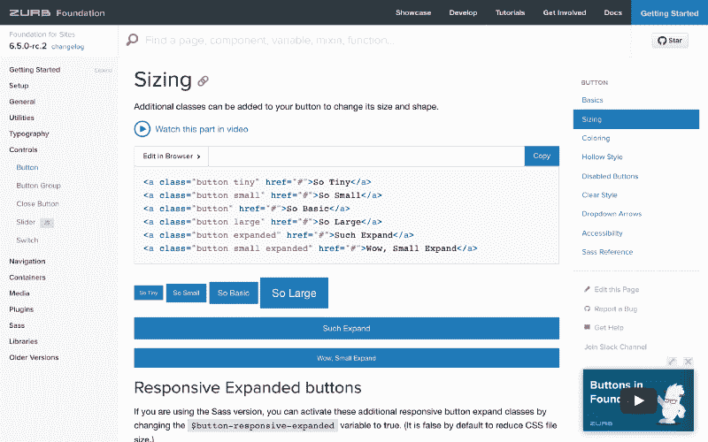

[Foundation](https://foundation.zurb.com/) documentation

如果你正在开发一个原生应用，我强烈建议你遵循 Android 的 [Material Design 的指南](https://material.io/design/)和 iOS 的 [Human Interface 的指南](https://developer.apple.com/design/human-interface-guidelines/ios/overview/themes/)。从尽可能接近原生模式开始，除非你明确想要构建一个独特的 UI，比如 Snapchat 或游戏。只有在您控制了默认模式和组件之后，您才能开始定制。

#### **设计系统**

如果你很幸运，你的团队中至少有一个设计师，你可以考虑建立自己的设计系统。

小心！

这可能非常耗时，只有当您快速扩展并且必须用相同的可视化语言维护多个应用程序时，这才是值得的。构建设计系统的一个很好的工具是[模式实验室](http://patternlab.io/)。

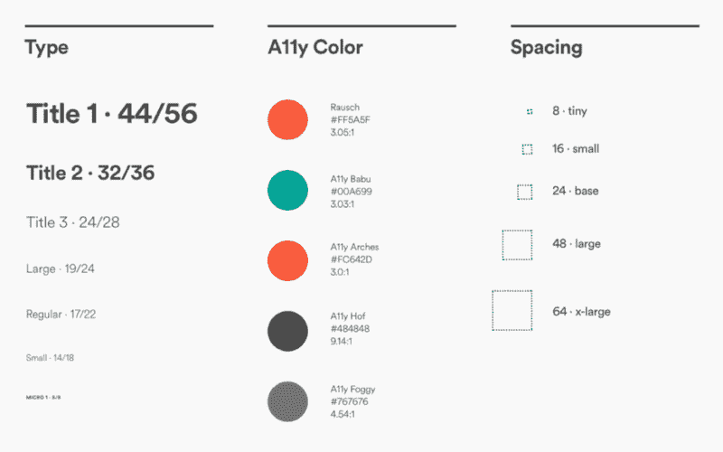

Airbnb’s [Design Language System](https://airbnb.design/building-a-visual-language/)

#### **品牌化**

当你建立你的框架时，你可能会开始做决定来定义你的品牌。不要被这个吓倒！品牌是一项有趣的练习，你一定可以做。你最终创建的品牌不会一成不变，如果你的 MVP 成功或你获得了更多资源，你可能会聘请一名设计师。我的朋友马克写了一篇关于 T2 如何在 5 分钟内制作一个商标的有趣文章。

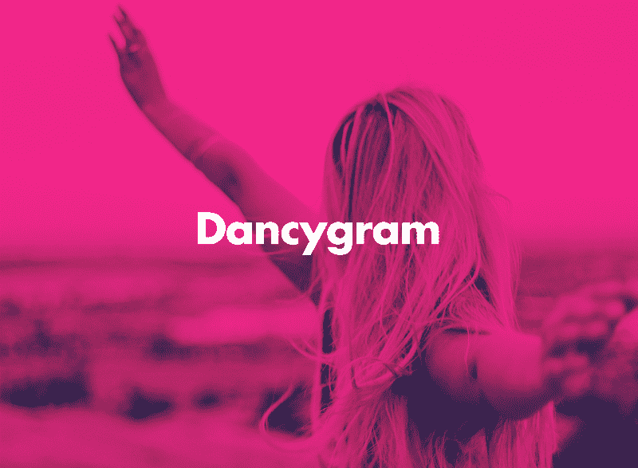

[5-minute logo by Marc Hemeon](https://journal.designinc.com/how-to-make-a-logo-for-free-in-about-5-minutes-a4f409176a8e)

#### **排版**

构建完徽标后，您可能需要为应用程序的其余部分选择一个字体系列。谷歌有一个很好的[选择网页字体的初学者指南](https://design.google/library/choosing-web-fonts-beginners-guide/)。

你当然可以使用和你的 logo 一样的字体，但是要确保你的字体有很好的可读性，尤其是当你的产品有大量的文本时。我建议您保持简单，将字体系列的数量限制在最多一个或两个。这里有一个流行字体的列表。

[Futura PT](https://www.myfonts.com/fonts/paratype/futura-book/) my often weapon of choice for branding

一种常见的技术是对标题使用独特的字体，对较大的文本块使用可读性更好的字体。你可以从这些例子中得到启发。我经常使用的一个识别网页字体的便利工具是 [WhatFont chrome 扩展](https://chrome.google.com/webstore/detail/whatfont/jabopobgcpjmedljpbcaablpmlmfcogm?hl=en)。

在构建框架时，要注意你使用的不同字体大小的数量。再次强调，保持简单。如果可能，使用最小的变化量。对于大量文本，尽量避免低于 16 磅。很多人和我一样，在那种尺寸下阅读会有困难！

如果您的产品需要，请使用支持多种语言的合适字体。例如，Noto 是谷歌开发的一种字体，旨在支持所有语言。

#### **颜色**

类似于排版，保持简单。一种常见的方法是选择一种在你的应用程序中最常显示的主色和一种提供更多方式来强调和区分你的产品的辅色。为了获得灵感，你可以使用由[托比亚斯·范·施耐德](https://medium.com/@vanschneider)制作的这个[色彩组合页面](http://www.vanschneider.com/colors)，或者使用[材料设计公司的色彩工具](https://material.io/tools/color/#!/?view.left=0&view.right=0)来玩色彩组合。对于更复杂的组合，您可以使用 [Adobe 色轮](https://color.adobe.com/create/color-wheel/)。

选择两种颜色时，避免**振动**颜色组合。当相邻的颜色出现融合、模糊和发光时，就会发生这种情况，从而产生运动的错觉。在本文中了解更多[。如果您创建渐变，请小心这种不良效果。](https://webdesign.tutsplus.com/articles/why-you-should-avoid-vibrating-color-combinations--cms-25621)

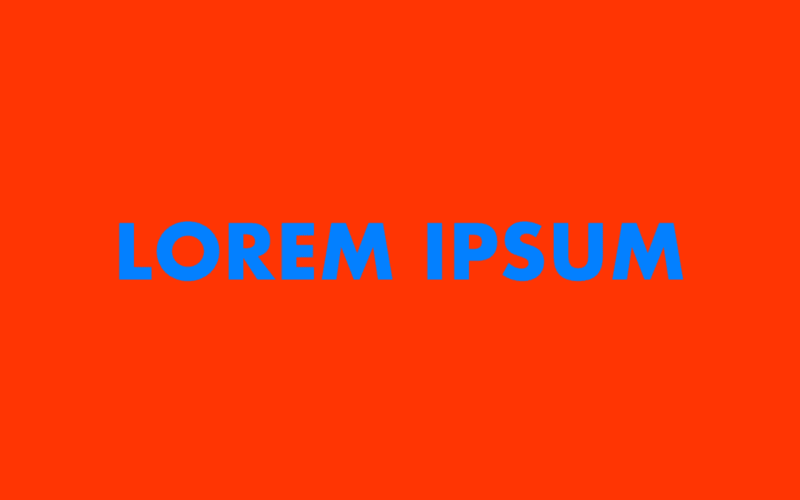

Unpleasant [color vibration](https://webdesign.tutsplus.com/articles/why-you-should-avoid-vibrating-color-combinations--cms-25621)

最后，考虑颜色对比和可访问性。对于一个 MVP 来说，你不必完全遵从 WCAG。但是只要稍加注意，你就可以达到某种最低程度的遵从。有很多工具可以检查你的色彩对比度[，比如这个](https://webaim.org/resources/contrastchecker/)。

#### **图标**

图标绝对可以给你的用户界面增添一些特色，在你需要综合复杂概念的时候会给你帮助。它们还占用更少的空间，避免了长字符串和国际化问题。然而，如果你最终使用一个不清楚的图标来传达一个重要的动作，你就会有一个严重的问题。如果对图标有疑问，请仅使用文本或带有标签的图标。

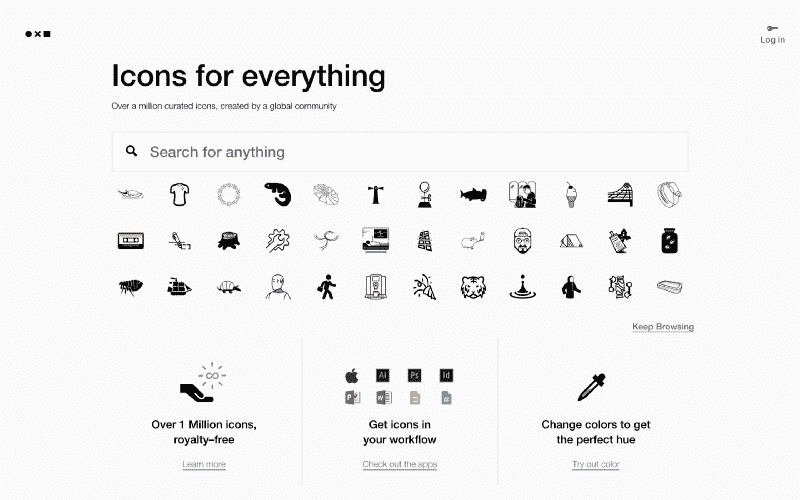

[Noun Project](https://thenounproject.com/), with over a million icons

图标的好来源是[名词项目](https://thenounproject.com/)、[材质设计图标](https://material.io/tools/icons/?style=baseline)和[流线图标](http://www.streamlineicons.com/)。

#### **插图**

插图可以帮助你支持你不想丢失的重要信息。平均来说，[用户最多阅读了文本](https://www.nngroup.com/articles/how-little-do-users-read/)的 28%。有一个插图和减少文字量可以帮助用户消化这些信息。一个小小的动画可以让那个时刻更加令人愉悦。

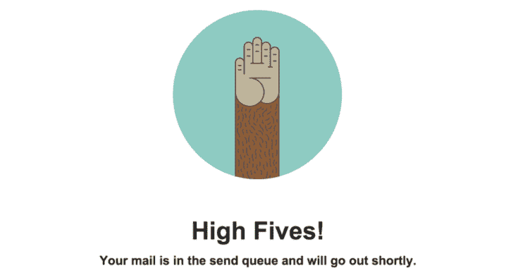

High Five delightful moment by [MailChimp](https://blog.mailchimp.com/designing-the-freddie-high-five-animation-for-facebook-ads/)

很难找到合适的插图来满足你的需求，所以我的建议是聘请一位插画师按需绘制。另外，如果你没有足够的资源，你可以随时[寻找免费的插图](https://dribbble.com/search?q=free+illustration)，也许会找到你需要的。记得给学分就行了。

#### **摄影**

当我制作一个新产品时，我总是喜欢创建一组照片，我称之为使用中的**产品**。这些展示了用户使用你的产品或享受使用你的产品后带来的好处的不同场景。

例如，如果你正在创建一个帮助你减少花在手机上的时间的应用程序，也许你想要一组人们参加户外活动或与家人共度时光的照片。

一旦你有了这组照片，你就可以用它来围绕你的产品建立故事和商品。在入职培训、登录页面、社交媒体页面或新闻稿中使用这些照片。与你使用的图片、风格、语气和年龄组保持一致。这将影响人们如何看待你的品牌。

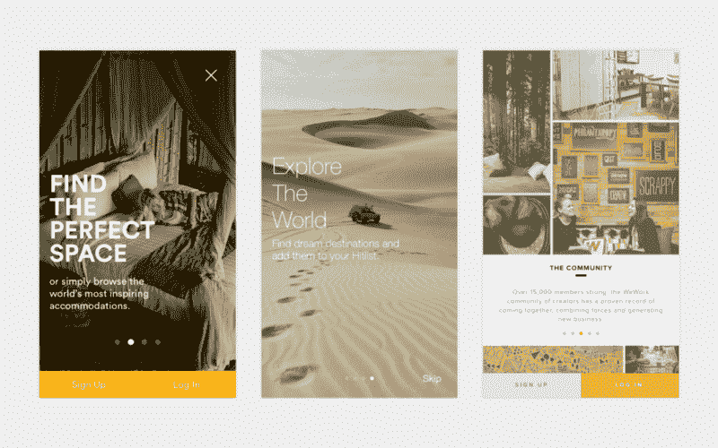

Usage of photography in onboarding tours can help convey value

免费图片的一个惊人来源是 [Unsplash](https://unsplash.com/) 。如果你想把你的产品放在环境中，一个实惠的选择是 [Placeit](https://placeit.net/) 。

#### **原型制作**

在某些时候，您可能想要构建一个原型来测试一个想法或流程。你甚至可以在线框阶段测试一个原型！

构建原型的一个非常简单的工具是 [InVision](https://www.invisionapp.com/) ，因为它允许你链接一系列静态图像，并构建一个带有过渡的流程，使其看起来像一个成品。 [Framer](https://framer.com/) 是另一个伟大的原型开发工具，它每天都在扩展原型开发之外的功能。

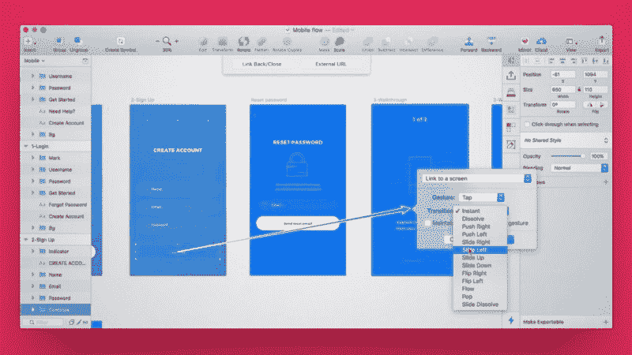

Prototyping with [Craft](https://www.invisionapp.com/craft), a Sketch to InVision integration

不要太执着于这些不断变化的工具。任何对你测试你的想法有用的东西(甚至是[纸上原型](https://www.nngroup.com/reports/paper-prototyping-training-video/))都可以。

#### **用户测试**

到现在为止，你可能已经有了一个产品或者原型，你很想测试它。只用 5 个用户测试你的产品会让你很早就知道什么是有效的，什么是无效的。

如果你有预算，你可以使用像 [UserTesting](https://www.usertesting.com/) 这样的工具。但是如果你没有，你可以[做你自己的用户测试](https://medium.com/swlh/how-to-do-user-testing-on-a-budget-bc4000d4387)招募家人或朋友，只要你保持客观。在开始你的测试之前，花一些时间来确定你试图通过用户测试来回答什么问题。

一种简单又便宜的测试方法是[大声思考测试](https://www.nngroup.com/articles/thinking-aloud-the-1-usability-tool/)。这包括当你给测试人员一个任务后，当他们在用户界面中移动时，让他们简单地说出他们的想法。重要的是你要保持安静，不要帮助测试人员完成他们的任务。

例如，如果他们问你“如果我按下这个按钮会发生什么”，你可以回答“你预计会发生什么？”否则，你给了他们答案，就不会学习他们的经验。

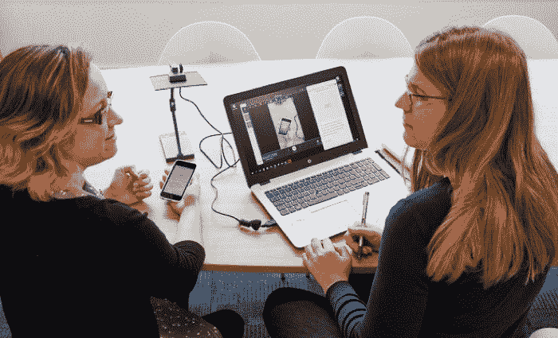

User testing with recording device. Photo credit [StartUX](http://www.startux.co.uk/services/snapshot-user-testing/)

让第三个人来记录会议会有所帮助。既要当主持人，又要做笔记，很难。如果你找不到第三个人帮忙，你可以对你的谈话进行录像。

#### **迭代**

推出你的产品后，记住:设计永远不会结束！

在推出 MVP 的第一个版本后，你可能会学到很多东西。带着这些知识，回到线框化→原型化→用户测试的循环。

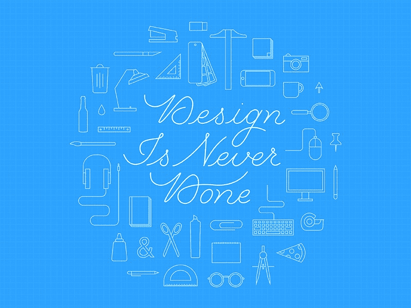

Design is Never Done by [Kari Neuberger](https://dribbble.com/shots/2900760-Design-Is-Never-Done)

### **开启对话**

我希望这些建议对你的日常工作有用。

Photo by [Agustina Perretta](http://agustinaperretta.com/)