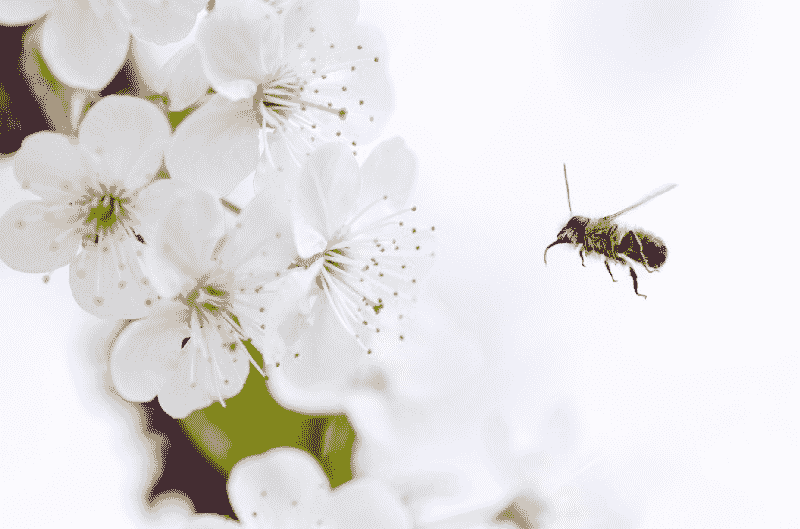
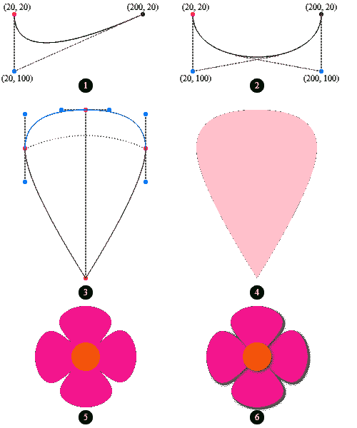
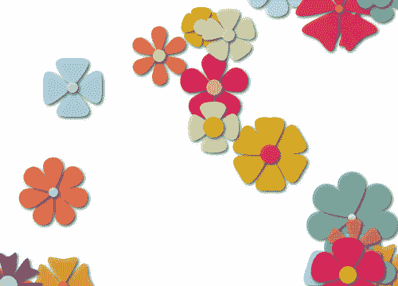
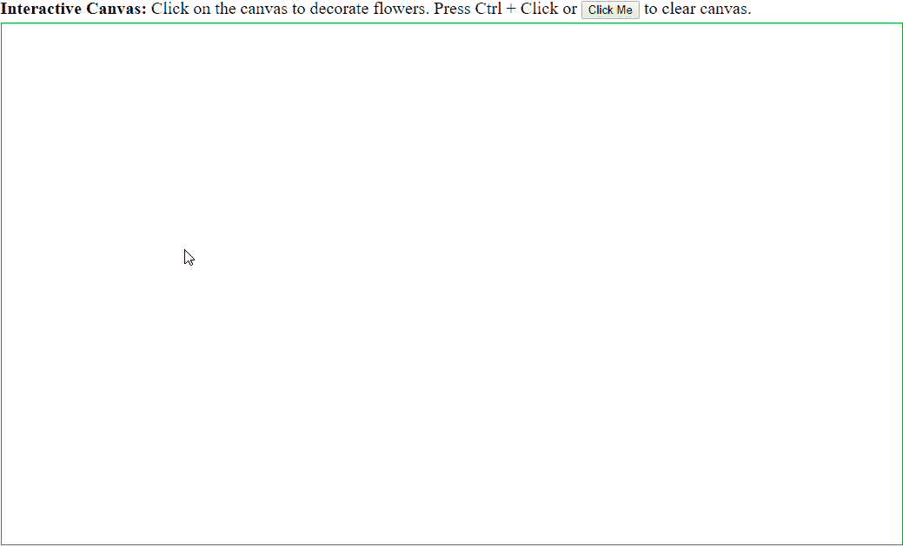

# 如何在 TypeScript 中创作画布动画

> 原文：<https://www.freecodecamp.org/news/how-to-compose-canvas-animations-in-typescript-9368dfa29028/>

许昌辉

# 如何在 TypeScript 中创作画布动画

今天我们要制作一个画布动画，一步一步的**。你可以在这篇博文中播放 StackBlitz 项目，也欢迎在[这个 GitHub repo](https://github.com/changhuixu/canvas-animation-step-by-step) 中查看源代码。**



“A close-up photo of a bee pollinating flowers” by [Lukas Blazek](https://unsplash.com/@goumbik?utm_source=medium&utm_medium=referral) on [Unsplash](https://unsplash.com?utm_source=medium&utm_medium=referral)

在我最近的[博客文章](https://codeburst.io/canvas-animations-in-typescript-97ba0163cb19)中，我描述了使用 TypeScript 创作画布动画的高级视图。在这里，我将介绍一个如何建模对象以及如何在画布上制作动画的详细过程。

#### 目录

*   [画花](https://www.freecodecamp.org/news/how-to-compose-canvas-animations-in-typescript-9368dfa29028/#draw-flowers)
*   [给花做动画](https://www.freecodecamp.org/news/how-to-compose-canvas-animations-in-typescript-9368dfa29028/#animate-flowers)
*   [将互动添加到动画中](https://www.freecodecamp.org/news/how-to-compose-canvas-animations-in-typescript-9368dfa29028/#add-interactions-to-animation)

### 画花

首先，我们需要有一个在画布上画花的功能。我们可以将**花的各个部分**分解成**花瓣**和**中心**(雌蕊和雄蕊)。花心可以抽象为一个填充了某种颜色的圆。花瓣是围绕中心生长的，可以通过旋转画布来绘制，具有一定的对称性。

请注意，代码中的粗体名词(**花**、**花瓣**、**中心**)暗示着**型号**。我们将通过识别它们的属性来定义这些模型。

我们先着重用一些抽象来画一个花瓣。受[这篇教程](https://www.html5canvastutorials.com/advanced/html5-canvas-blooming-flowers-effect/)的启发，我们知道花瓣形状可以用两条[二次曲线](https://www.w3schools.com/tags/canvas_quadraticcurveto.asp)和两条[贝塞尔曲线](https://www.w3schools.com/tags/canvas_beziercurveto.asp)来表示。我们可以使用 HTML canvas API 中的`quadraticCurveTo()`和`bezierCurveTo()`方法来绘制这些曲线。

如图 1 (1)所示，二次曲线有一个起点、一个终点和一个决定曲线曲率的控制点。在图 1 (2)中，贝塞尔曲线有一个起点、一个终点和两个控制点。

为了**平滑地连接**两条曲线(任意两条曲线，可以是二次曲线或贝塞尔曲线，也可以是其他曲线)，我们需要确保连接点和附近的两个控制点在同一条直线上，这样这些**两条曲线在连接点**处具有相同的曲率。



**Figure 1.** Draw a flower step by step. (1) Quadratic curve; (2) Bézier curve; (3) Petal shape formed by two quadratic curved (green) and two Bézier curves (blue). Red dots are petal vertices. Blue dots are petal curve control points. (4) Petal shape filled with color. (5) A flower shape generated by a centered circle and rotated petals. (6) A flower shape with shadow.

图 1 (3)显示了由两条二次曲线(绿色)和两条贝塞尔曲线(蓝色)组成的基本花瓣形状。有 4 个红色点代表花瓣顶点，6 个蓝色点代表曲线的控制点。

底部的红色顶点是花的中心点，顶部的红色顶点是花瓣的尖端。中间的两个红色顶点代表花瓣的半径。这两个顶点相对于中心点的角度称为花瓣角度跨度。你可以和[一起玩这个 StackBlitz 项目](https://stackblitz.com/edit/petal-shape)关于花瓣形状。

[https://stackblitz.com/edit/petal-shape?embed=1&file=index.ts](https://stackblitz.com/edit/petal-shape?embed=1&file=index.ts)

定义好花瓣形状后，我们可以用颜色填充形状，得到一个花瓣，如图 1 (4)所示。有了上面的信息，我们就可以编写我们的第一个对象模型了:**花瓣**。

```
export class Petal {
  private readonly vertices: Point[];
  private readonly controlPoints: Point[][];

  constructor(
    public readonly centerPoint: Point,
    public readonly radius: number,
    public readonly tipSkewRatio: number,
    public readonly angleSpan: number,
    public readonly color: string
  ) {
    this.vertices = this.getVertices();
    this.controlPoints = this.getControlPoints(this.vertices);
  }

  draw(context: CanvasRenderingContext2D) {
    // draw curves using vertices and controlPoints  
  }

  private getVertices() {
    // compute vertices' coordinates 
  }
  private getControlPoints(vertices: Point[]): Point[][] {
    // compute control points' coordinates
  }
}
```

`Petal`中的辅助`Point`类定义如下。坐标使用整数(通过`Math.floor()`)来节省一些计算能力。

```
export class Point {
  constructor(public readonly x = 0, public readonly y = 0) {
    this.x = Math.floor(this.x);
    this.y = Math.floor(this.y);
  }
}
```

花中心的表示可以通过其中心点、圆半径和颜色来参数化。因此，`FlowerCenter`类的框架如下:

```
export class FlowerCenter {
  constructor(
    private readonly centerPoint: Point,
    private readonly centerRadius: number,
    private readonly centerColor: string
  ) {}

  draw(context: CanvasRenderingContext2D) {
    // draw the circle
  }
}
```

既然我们有了一个花瓣和一个花的中心，我们就准备向前移动来画一朵花，它包含一个中心圆和几个形状相同的花瓣。

从面向对象的角度来看，`Flower`可以被构造成`new Flower(center: FlowerCenter, petals: Petal[])`或`new Flower(center: FlowerCenter, numberOfPetals: number, petal: Petal)`。我使用第二种方法，因为这个场景不需要数组。

在构造函数中，您可以添加一些验证来确保数据完整性。例如，如果`center.centerPoint`与`petal.centerPoint`不匹配，则抛出一个错误。

```
export class Flower {
  constructor(
    private readonly flowerCenter: FlowerCenter,
    private readonly numberOfPetals: number,
    private petal: Petal
  ) {}

  draw(context: CanvasRenderingContext2D) {
    this.drawPetals(context);
    this.flowerCenter.draw(context);
  }

  private drawPetals(context: CanvasRenderingContext2D) {
    context.save();
    const cx = this.petal.centerPoint.x;
    const cy = this.petal.centerPoint.y;
    const rotateAngle = (2 * Math.PI) / this.numberOfPetals;
    for (let i = 0; i < this.numberOfPetals; i++) {
      context.translate(cx, cy);
      context.rotate(rotateAngle);
      context.translate(-cx, -cy);
      this.petal.draw(context);
    }
    context.restore();
  }
}
```

注意`drawPetals(context)`法。由于旋转是围绕花的中心点，我们需要首先平移画布，将原点移动到花的中心，然后旋转画布。旋转后，我们需要将画布平移回来，这样原点就是之前的(0，0)。

使用这些模型(`Flower`、`FlowerCenter`、`Petal`，我们能够获得看起来像图 1 (5)的花。为了使花更具体，我们添加了一些阴影效果，使花看起来像图 1 (6)中的花。还可以玩下面的[stack blitz 项目。](https://stackblitz.com/edit/canvas-flower)

[https://stackblitz.com/edit/canvas-flower?embed=1&file=index.ts](https://stackblitz.com/edit/canvas-flower?embed=1&file=index.ts)

### 使花生气勃勃

在这一部分，我们将制作开花过程的动画。我们将模拟开花过程增加花瓣半径久而久之。图 2 显示了最终的动画，其中花的花瓣在每一帧都展开。



**Figure 2.** Blooming flowers on canvas.

在我们做实际的动画之前，我们可能想给花添加一些品种，这样它们就不会无聊了。例如，我们可以在画布上生成随机的点来散布花朵，我们可以生成随机形状/大小的花朵，我们可以为它们绘制随机的颜色。为了集中逻辑和重用代码，这种工作通常在特定的服务中完成。然后，我们将随机化逻辑放入`FlowerRandomizationService`类。

```
export class FlowerRandomizationService {
  constructor(){}
  getFlowerAt(point: Point): Flower {
    ... // randomization
  }
  ...  // other helper methods
}
```

然后我们创建一个`BloomingFlowers`类来存储一个由`FlowerRandomizationService`生成的花的数组。

为了制作动画，我们在`Flower`类中定义了一个方法`increasePetalRadius()`来更新 flower 对象。然后通过调用`window.requestAnimationFrame(() => this.animateFlowers(`))；ers 类，我们计划在每一帧在画布上重绘。还有鲜花更新 v`ia flower.increasePetalRadius`()；每次重画时。下面的代码片段展示了一个最简单的动画类。

```
export class BloomingFlowers {
  private readonly context: CanvasRenderingContext2D;
  private readonly canvasW: number;
  private readonly canvasH: number;
  private readonly flowers: Flower[] = [];

  constructor(
    private readonly canvas: HTMLCanvasElement,
    private readonly nFlowers: number = 30
  ) {
    this.context = this.canvas.getContext('2d');
    this.canvasWidth = this.canvas.width;
    this.canvasHeight = this.canvas.height;
    this.getFlowers();
  }

  bloom() {
    window.requestAnimationFrame(() => this.animateFlowers());
  }

  private animateFlowers() {
    this.context.clearRect(0, 0, this.canvasW, this.canvasH);
    this.flowers.forEach(flower => {
      flower.increasePetalRadius();
      flower.draw(this.context);
    });
    window.requestAnimationFrame(() => this.animateFlowers());
  }

  private getFlowers() {
    for (let i = 0; i < this.nFlowers; i++) {
      const flower = ... // get a randomized flower
      this.flowers.push(flower);
    }
  }
}
```

注意，`window.requestAnimationFrame(() => this.animateFlowers());`中的回调函数使用了箭头函数语法，这是保存当前对象类的`this`上下文所需要的。

上面的代码片段会导致花瓣长度不断增加，因为它没有停止动画的机制。在演示代码中，我使用一个`setTimeout()`回调函数在 5 秒后终止动画。想递归播放一个动画怎么办？在下面的[stack blitz 项目中演示了一个简单的解决方案，它利用一个`setInterval()`回调每 8 秒重播一次动画。](https://stackblitz.com/edit/canvas-flower-blooming)

[https://stackblitz.com/edit/canvas-flower-blooming?embed=1&file=index.ts](https://stackblitz.com/edit/canvas-flower-blooming?embed=1&file=index.ts)

太酷了。在画布动画上我们还能做什么？

### 向动画添加交互

我们希望画布能够响应键盘事件、鼠标事件或触摸事件。怎么会？对，添加事件监听器。

在这个演示中，我们将创建一个交互式画布。当鼠标点击画布时，一朵鲜花盛开。当你点击画布上的另一个点时，另一朵花就会绽放。按住 CTRL 键并单击时，画布将被清除。图 3 显示了最终的画布动画。



**Figure 3.** Interactive Canvas.

像往常一样，我们创建一个类`InteractiveFlowers`来保存一组花。`InteractiveFlowers`类的代码片段如下。

```
export class InteractiveFlowers {
  private readonly context: CanvasRenderingContext2D;
  private readonly canvasW: number;
  private readonly canvasH: number;
  private flowers: Flower[] = [];
  private readonly randomizationService = 
               new FlowerRandomizationService();
  private ctrlIsPressed = false;
  private mousePosition = new Point(-100, -100);

  constructor(private readonly canvas: HTMLCanvasElement) {
    this.context = this.canvas.getContext('2d');
    this.canvasW = this.canvas.width;
    this.canvasH = this.canvas.height;

    this.addInteractions();
  }

  clearCanvas() {
    this.flowers = [];
    this.context.clearRect(0, 0, this.canvasW, this.canvasH);
  }

  private animateFlowers() {
    if (this.flowers.every(f => f.stopChanging)) {
      return;
    }
    this.context.clearRect(0, 0, this.canvasW, this.canvasH);
    this.flowers.forEach(flower => {
      flower.increasePetalRadiusWithLimit();
      flower.draw(this.context);
    });
    window.requestAnimationFrame(() => this.animateFlowers());
  }

  private addInteractions() {
    this.canvas.addEventListener('click', e => {
      if (this.ctrlIsPressed) {
        this.clearCanvas();
        return;
      }
      this.calculateMouseRelativePositionInCanvas(e);
      const flower = this.randomizationService
                         .getFlowerAt(this.mousePosition);
      this.flowers.push(flower);
      this.animateFlowers();
    });

    window.addEventListener('keydown', (e: KeyboardEvent) => {
      if (e.which === 17 || e.keyCode === 17) {
        this.ctrlIsPressed = true;
      }
    });
    window.addEventListener('keyup', () => {
      this.ctrlIsPressed = false;
    });
  }

  private calculateMouseRelativePositionInCanvas(e: MouseEvent) {
    this.mousePosition = new Point(
      e.clientX +
        (document.documentElement.scrollLeft || 
         document.body.scrollLeft) -
        this.canvas.offsetLeft,
      e.clientY +
        (document.documentElement.scrollTop || 
         document.body.scrollTop) -
        this.canvas.offsetTop
    );
  }
}
```

我们添加了一个事件监听器来跟踪鼠标点击事件和鼠标位置。每一次点击都会向 flowers 数组中添加一朵花。由于我们不想让花朵无限扩展，我们在`Flower`类中定义了一个方法`increasePetalRadiusWithLimit()`来增加花瓣半径，直到增量为 20。这样，每朵花会自己开花，在其花瓣半径增加 20 个单位后停止开花。

我在 flower 中设置了一个私有成员`stopChanging`来优化动画，这样当所有的花都开完了，动画就会停止。

我们还可以监听`keyup` / `keydown`事件，并在画布上添加键盘控件。在这个演示中，当用户按住 CTRL 键并单击鼠标时，画布内容将被清除。按键情况由`ctrlIsPressed`字段跟踪。类似地，您可以添加其他字段来跟踪其他键盘事件，以促进画布上的粒度控制。

当然，可以使用 Observables 优化事件侦听器，尤其是在使用 Angular 时。可以玩下面的 StackBlitz 项目[。](https://stackblitz.com/edit/canvas-interactive-flowers)

[https://stackblitz.com/edit/canvas-interactive-flowers?embed=1&file=index.ts](https://stackblitz.com/edit/canvas-interactive-flowers?embed=1&file=index.ts)

下一步是什么？我们可以通过添加一些声音效果和一些动画精灵来更新交互式花卉演示。我们可以研究如何让它在所有平台上流畅运行，并从中制作一个 PWA 或移动应用程序。

我希望这篇文章能为画布动画这个话题增加一些价值。同样，源代码在[这个 GitHub repo](https://github.com/changhuixu/canvas-animation-step-by-step) 中，你也可以玩[这个 StackBlitz 项目](https://stackblitz.com/edit/canvas-interactive-flowers)并访问一个[演示站点](https://flowerscanvas.firebaseapp.com)。欢迎在下面留下评论。谢谢你。

干杯！