# Airbnb 的数据驱动故事

> 原文：<https://www.freecodecamp.org/news/a-data-driven-story-of-airbnb-25e6c5be8973/>

阿克沙伊·维尔马

# Airbnb 的数据驱动故事


AirBnB [Image [0] Image courtesy: [https://iacs.seas.harvard.edu/negotiation-tool-airbnb](https://iacs.seas.harvard.edu/negotiation-tool-airbnb)]

AirBnB 的用户可以在 190 多个国家的 34，000 多个城市预订住宿。这篇博文的目标是分析数据，发现问题和机会，并提出见解以增加收入。这个数据取自 [Kaggle](https://www.kaggle.com/c/airbnb-recruiting-new-user-bookings/data) 。如果你对类似的项目感兴趣，看看我的其他博客[这里](https://medium.com/@akshajverma.oo7)。

为什么选择 AirBnB 呢？

嗯，我想在一个真实世界的数据集上工作，这个数据集通过一点点预处理就有真实世界的含义。AirBnB 是我发现的最有趣的数据集。所以，我们开始吧。

导入库。

导入数据集。

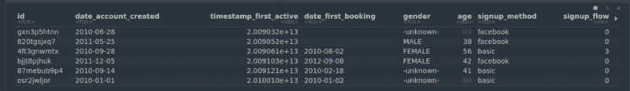

Data frame [Image[1]]

### 预处理

使用 lubridate 转换为日期时间格式。将性别替换为不适用。

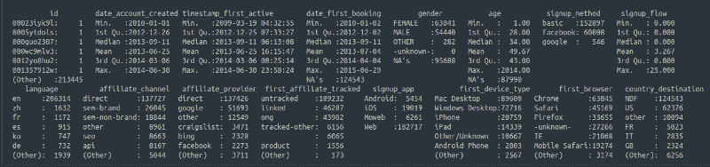

Summary of df [Image [2]]

*   `date_first_booking`列中的 NA 值表示用户没有预订任何房间。
*   `age`列中的 NA 值意味着用户没有指定他们的年龄。我们可以在`age`列中填充虚拟值。
*   `gender`列中的 NA 值意味着用户没有指定他们的性别。

**注意**在性别栏中有 95，688 个 NA 值和 117，763 个填充值。因此，我们基于性别人口统计的分析在现实世界中可能不完全正确。

数据框每列中 NA 值的数量。

```
colSums(is.na(train_users_2))
```

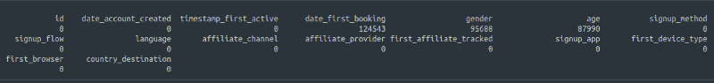

Number of NAs [Image [3]]

`age`列包含小于 18 且大于 80 的值。实际上，`age`包含的数值大到 104 和 2014。我们将为它们分配 NA 值。

为了在`age`列中填入 NA 值，我们将计算`age`列的平均值和标准偏差。然后，我们将生成 *n 个*数，作为平均值和标准偏差之间的随机整数，以填充 NA 值。 *n* 是`age`列中 NA 值的个数。

创建名为`age_brackets`的新列，并将其添加到数据框中。

最后，我们将向数据框添加 2 个新列。

*   第一列是`time_first_active_to_booking`，等于`date_first_booking`和`timestamp_first_active`之间的**天数**。
*   第二列是`time_signup_to_booking`，等于`date_first_booking`和`date_account_created`之间的**天数**

查看每列的 NAs 数量。

```
colSums(is.na(train_users_2))
```

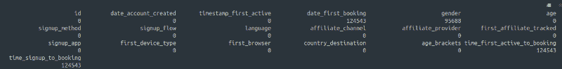

Number of NAs [Image [4]]

*   如上表所示，只有`date_first_booking`、`time_first_active_to_booking`和`gender`列有 NA 值。这完全没问题。
*   `date_first_booking`列中的 NA 值意味着用户还没有预订任何酒店。
*   `gender`列中的 NA 值意味着用户没有指定他们的性别。`time_first_active_to_booking`来源于`date_first_booking`，所以会有 NA 值。

重置`gender`水平。如果你不这样做，`-unknown-`等级仍然会出现在`levels(train_users_2$gender)`中。我们不希望这样，因为我们已经将所有的`-unknown-`性别值设置为 NA。

```
train_users_2$gender <- factor(train_users_2$gender)
```

我们完成了预处理。咻。:P

### 探索性数据分析

#### 年龄、性别和语言


Age, gender, and language [Image [5]]

1.  我们可以看到性别有很多缺失的价值。大多数用户没有在平台上填写他们的性别信息。
2.  在第二个图中，我们观察到大多数用户的年龄组在 25 到 47 岁之间，大多数用户在 30 岁左右。这告诉我们，中青年用户占主导地位。
3.  对于一家总部位于美国的公司来说，在其门户网站/应用程序上使用最多的语言是英语并不奇怪。
4.  如果我们将英语从情节中移除，中文(zh)是 AirBnB 上第二受欢迎的语言，其次是法语和西班牙语。这表明，继美国之后，AirBnB 在法语和西班牙语国家/社区真的很受欢迎。法国人主要讲法语，所以我们知道这款应用在法国很受欢迎。但我们不能对西班牙语这么说，因为西班牙语在很多国家都有使用，包括西班牙、哥伦比亚、美国等。

这些数据以及用户的位置可以用来识别哪些地区(国家内部)使用什么语言。然后，也许我们可以向这些社区展示有针对性的广告。

#### 年龄与性别

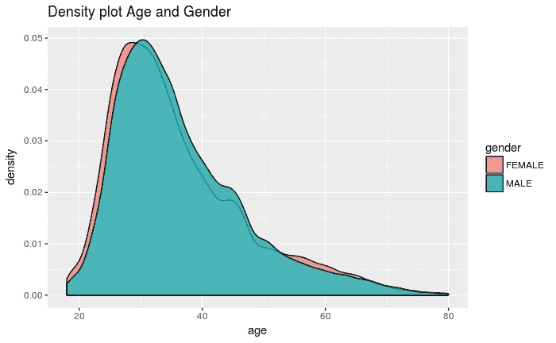

Distribution of Age vs Gender [Image [6]]

从年龄来看，使用 AirBnB 的男女人数几乎没有区别。30 多岁的男女是 AirBnB 最突出的用户。

#### 联盟营销又称广告

在我们开始分析图表之前，让我们先了解什么是联盟营销。

代销商营销是一种基于绩效的营销，企业通过代销商自身的营销努力为每个访问者或客户奖励一个或多个代销商。联盟营销正迅速成为增加销售的一种强有力的方式。

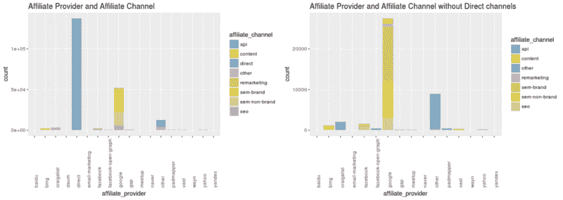

Affiliate Provider and Channel [Image [7]]

这两个图显示了不同联盟提供商使用的联盟渠道的分布。

AirBnB 自己进行的直接营销在营销方面具有最大的影响力。直接营销是一种广告形式，组织通过各种媒体直接与客户沟通，包括短信、电子邮件、网站、在线广告、促销信函和有针对性的电视。

谷歌是第二大联盟提供商，半品牌是其最受欢迎的联盟渠道。必应、脸书和 Craigslist 是其他的“主要”贡献者。


Direct Marketing — Cable Car [Image [8]]

#### **基于年龄的针对性营销**

这些图表显示了基于年龄统计的 AirBnB 平台使用情况的对比。

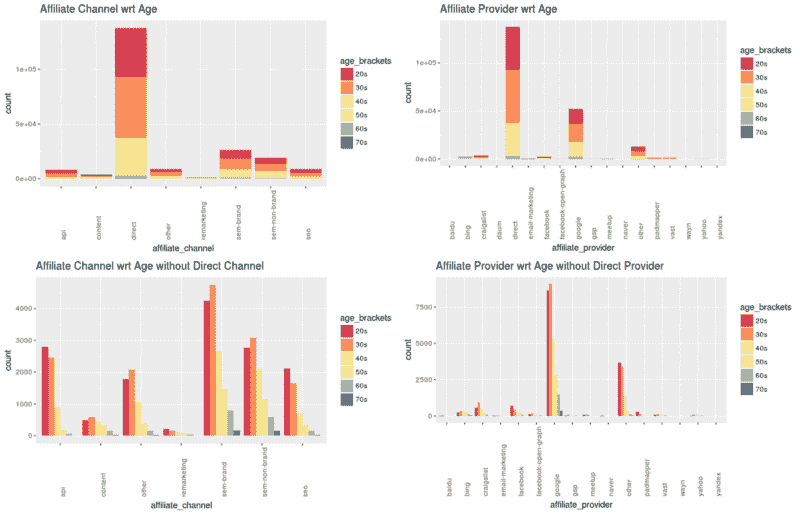

Targeted Marketing by Age [Image [9]]

#### **基于性别的针对性营销**

这些图表显示了基于性别统计的 AirBnB 平台使用情况的对比。

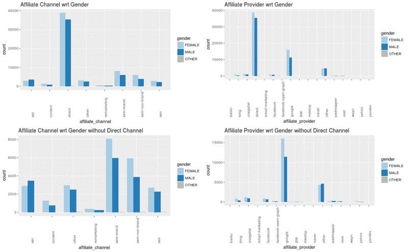

Targeted Marketing by Gender [Image [10]]

1.  直销渠道瞄准的女性多于男性。
2.  这同样适用于直接会员提供商。
3.  如果我们去除`direct`附属渠道，我们观察到半品牌和半非品牌是两个最受欢迎的渠道，其次是 API 和 SEO(搜索引擎优化)。除了 API 频道之外，所有其他频道都是女性多于男性。
4.  谷歌作为代销商在女性中比在男性中更常见。

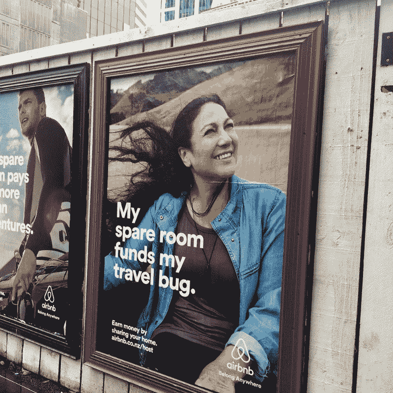

Targeted Marketing [Image [11]]

#### 注册应用程序和注册方法

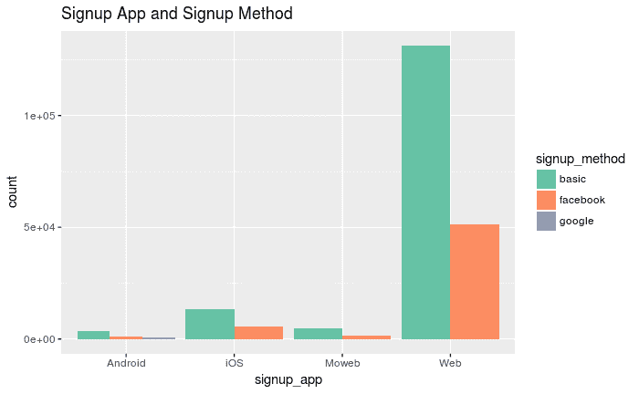

Signup App and Method [Image [12]]

1.  使用电子邮件注册是最受欢迎的选择，其次是使用脸书注册。没有人喜欢把自己的谷歌账户和 Airbnb 账户联系起来。
2.  绝大多数人在电脑上使用浏览器，然后使用 iOS 应用程序访问 AirBnB 平台。Android 用户少于 iOS 用户的事实可能看起来很奇怪，但请记住，AirBnB 是一家美国公司，其最大的用户群是美国人。在美国，iOS 比 Android 更受欢迎。
3.  人们可能不会经常使用这个应用程序。这可能是因为他们不喜欢 Android/iOS 应用的用户界面或功能。也许网页版提供了更多的功能，更容易使用。或者人们不知道 AirBnB 应用程序。

#### 基于年龄和性别的注册应用和方法

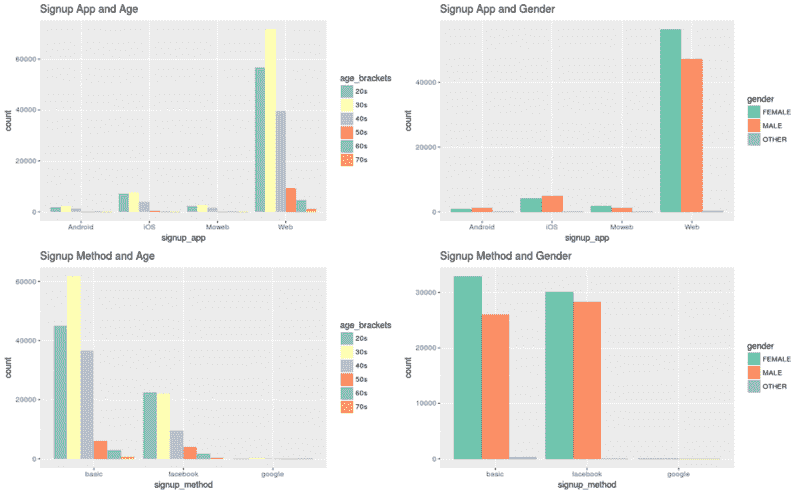

Signup Age and Gender [Image [13]]

1.  不出所料，老年人根本不用智能手机来使用 AirBnB。大量 20 多岁、30 多岁、40 多岁的人用电脑访问 AirBnB 平台。人们可能会认为“精通技术”的青少年和 20 岁的年轻人会更多地使用智能手机，但事实并非如此。(注意，30 岁年龄段的人要多得多。这种假设可能是错误的。)
2.  更多的女性更喜欢用电脑注册，而更多的男性更喜欢 iOS/Android 应用。
3.  与脸书相比，30 多岁的人更喜欢用电子邮件注册。20 多岁和 30 多岁的人更喜欢用脸书注册，人数几乎惊人地相等。
4.  女性比男性更喜欢使用脸书和电子邮件注册方式。相比其他 2 个，谷歌注册方法就像一个 404 错误，并不存在。

#### 第一种设备类型与年龄和性别

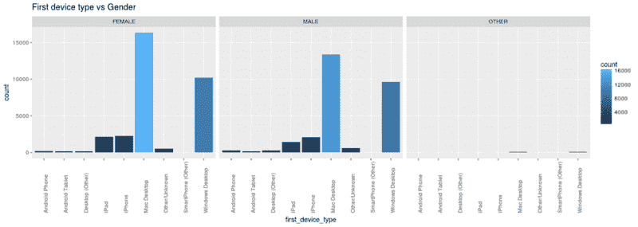

First Device Type -Gender[Image [14]]

1.  MAC 是访问 AirBnB 平台的最受欢迎的笔记本电脑，其次是 Windows 桌面。再说一次，苹果在美国非常受欢迎。
2.  iPhones 和 iPads 是使用 AirBnB 平台第二广泛的设备。

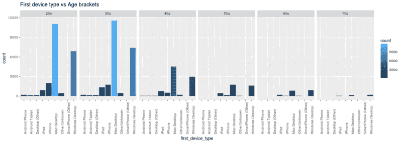

First Device Type-Age[Image[15]]

1.  Mac 桌面在 20 多岁和 30 多岁的人群中非常受欢迎，他们访问 AirBnB 平台，然后是 Windows 桌面。
2.  随着年龄的增长，我们发现苹果电脑的使用率呈下降趋势。对于 60 多岁的人来说，Mac 桌面和 Windows 桌面没有区别。
3.  然而，随着年龄的增长，智能手机变得不受欢迎。

#### 历年的预订和账户

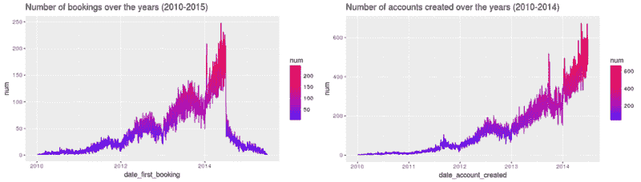

Bookings and Accounts [Image [16]]

1.  预订数量每年都在快速增长。
2.  2015 年预订量的大幅下降是因为我们只有 2015 年 6 月 29 日之前的数据。`filter(train_users_2, date_first_booking >= "2015-06-2` 9”)
3.  对于创建的账户数量，我们只有截至 2014 年 6 月 30 日的数据。`filter(train_users_2, date_account_created >= "2014-06-3` 0”)

#### 每年首次预订的数量

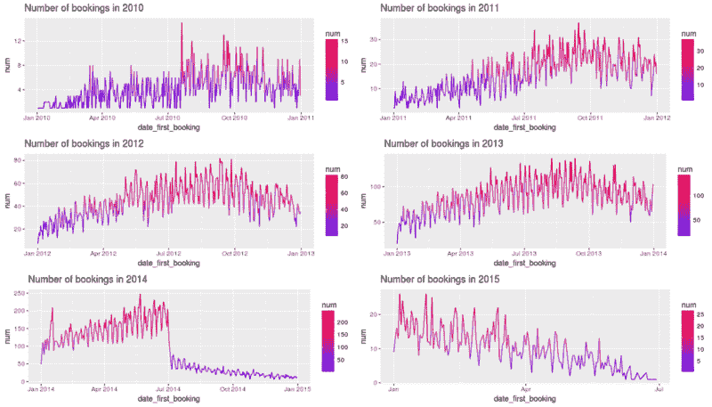

First Bookings [Image [17]]

1.  第一次预订的数量在一月份左右处于最低点。这可能是因为一年刚刚结束，所以人们不会这么快就去任何地方旅行。还有，外面冷得厉害吗？
2.  首次预订的数量总是在 7 月和 10 月之间激增。这可能是对感恩节和啤酒节(或暑假)等节日的预期。
3.  然而，我们发现从 2014 年 7 月到 2015 年 7 月，预订量急剧下降。

> “2014 年 7 月，Airbnb 公布了对网站和手机应用程序的设计修改，并推出了新的标志。一些人认为新标志在视觉上类似于生殖器，但 Survata 的一项消费者调查显示，只有少数受访者认为事实如此。

谷歌“AirBnB 2014”寻找 2014 年预订量骤降的原因。

#### 每年创建的账户数量

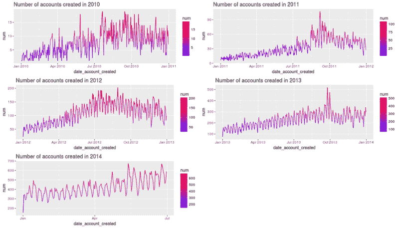

First Account [Image [18]]

1.  该图遵循与上述图相似的趋势。
2.  新(第一个)账户的数量在 1 月左右较少，在 9 月和 10 月左右达到峰值。
3.  人们可能会创建新的账户来预订和比较其他服务的价格。

AirBnB 可能会在 8 月、9 月和 10 月期间降价或提供更多折扣和优惠，以便更多人预订房间。

#### 基于年龄和性别的注册和首次预订之间的时间

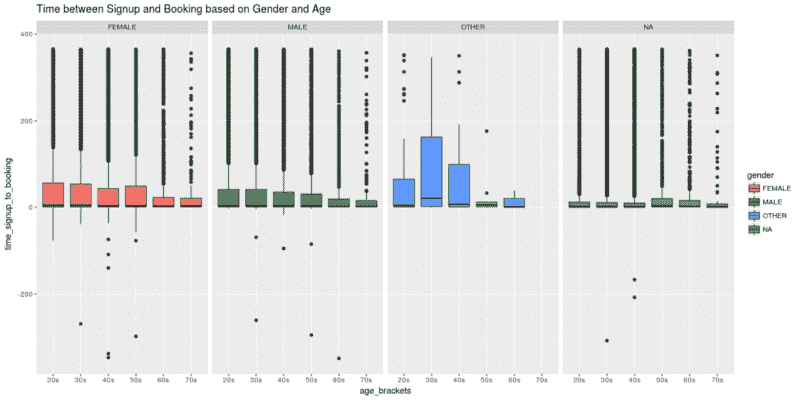

Booking — Signup [Image[19]]

彩色框表示代表中间 50%数据的四分位数范围。胡须从盒子的两边延伸出来。晶须代表数据值的底部 25%和顶部 25%的范围，不包括异常值。

1.  不管年龄和性别，绝大多数人在注册当天就预订了房间。中值为 0。
2.  在平台上注册 1000 天后，你可以看到更多“离群值”的预订房间。
3.  每个年龄段的中间 50%用户的“等待时间”通常会随着年龄的增长而减少。

#### 首次预订和首次活动之间的时间

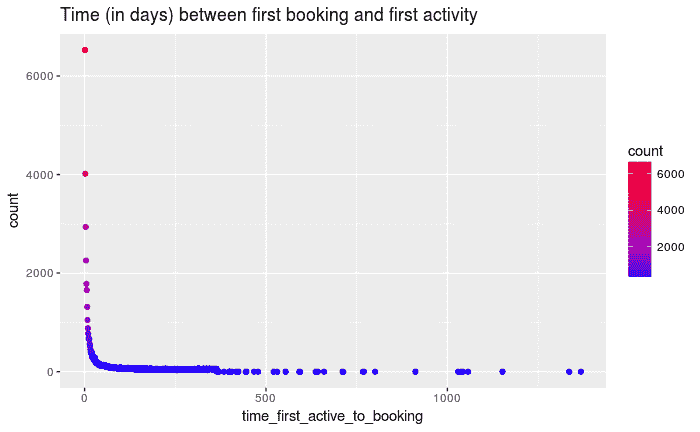

Booking — Active [Image [20]]

1.  对于许多人来说，用户第一次预订和第一次活动之间的时间为 0 或接近 0。
2.  有人在 AirBnB 平台上的第一次活动后 100 多天就预订了第一个房间。该死的。

#### 首次预订和注册之间的时间

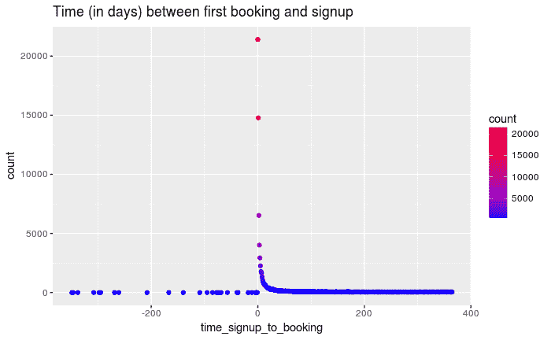

Booking — Signup [Image [21]]

1.  在这里，我们看到相当多的人的天数是负数。人们在创建账户之前已经预订了长达一年的房间。除此之外，数据似乎与上面的图相似。
2.  很多人在 AirBnB 平台注册的当天就预订了房间。

我们来分析一下负值。有多少个负值？

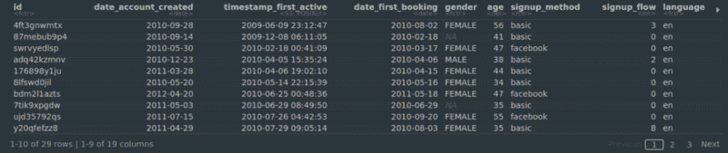

Negative Time [Image [22]]

我们看到只有 29 个负值。这意味着有 29 个用户无需创建帐户就可以预订房间！

让我们来看看这发生在哪一年。在过滤掉负值的`time_signup_to_booking`之后，也就是那些在注册之前预订房间的人，我们绘制了下面的图表。这个图表告诉我们，从 2010 年到 2013 年，用户可以在 AirBnB 平台上预订之前注册。

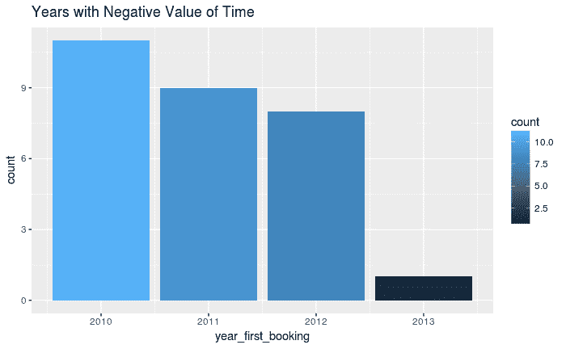

Count per year of booking before signing up [Image [23]]

以下声明由 AirBnB 发布。

> “直到 2013 年初，用户还能在完全创建账户(根据我们今天使用的账户创建定义)之前预订的流量屈指可数。2013 年初以后，这就不再可能了。”

### 结果

#### 预订与未预订

`NDF`表示没有预订。

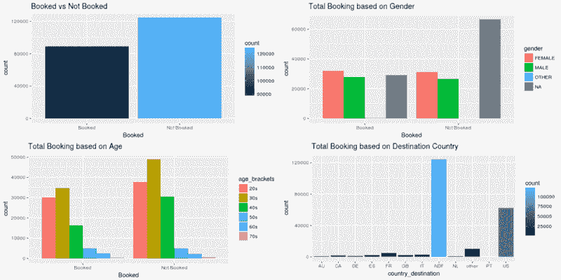

Booked vs Not Booked [Image [24]]

1.  惰性用户明显比活跃用户多。
2.  预订和不预订的用户的男女比例基本相同。然而，NA 值不同。有很多用户不提供他们的性别，也不预订任何房间。
3.  30 多岁的人预订和不预订房间的比例都是最高的。20 多岁、30 多岁、40 多岁的人，**已预订:未预订**的比例小于 1。而对于 50 多岁、60 多岁和 70 多岁的人来说，这个比例基本不变。
4.  如你所见，很多人最终没有预订房间。之后美国的预订量最多。这些预订中有很大一部分必须是国内的，因为公司本身就位于美国。

图表显示，20 多岁、30 多岁和 40 多岁的人是 AirBnB 的基础客户。

#### 目的地国家的频率

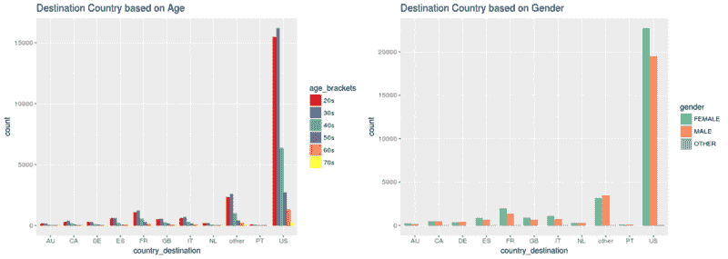

Freq of Destination Country [Image [25]]

1.  30 多岁的非活跃用户(没有预订房间的人)数量最多。
2.  女性使用 AirBnB 旅行的次数略多于男性。
3.  在美国和“其他”国家之后，法国是下一个最受欢迎的目的地。
4.  与男性相比，更多的女性去法国旅游，而更多的男性去加拿大旅游。

请注意，旅行不一定只是国际性的。它可以是国内的，也可以是国际的，因为数据集中没有提供用户的原籍国。

#### 加盟渠道对目的地国家的影响

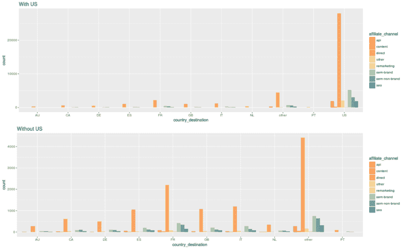

Effect of Affiliate Channels on Destination [Image [24]]

1.  直销渠道在确认预订方面发挥了重要作用。
2.  半品牌联盟渠道在确认预订方面发挥着重要作用，尤其是在美国。

#### 代销商对目的地国家的影响

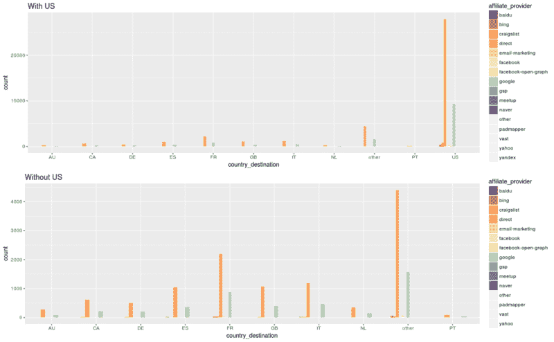

Effect of Affiliate Providers on Destination [Image [25]]

除了直接会员提供商，谷歌在确认预订方面发挥着重要作用。

#### 基于性别的每月预订统计

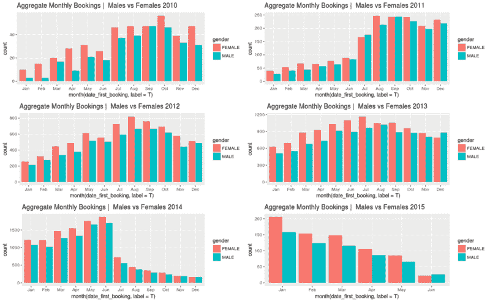

Monthly Bookings vs Gender [Image [26]]

1.  女性在 AirBnB 上预订的酒店总是比男性多，只有一个月例外——2013 年 12 月。
2.  我们可以看到，除了 2014 年和 2015 年，预订总数在 7 月份左右达到峰值。

#### 基于性别的每周预订统计

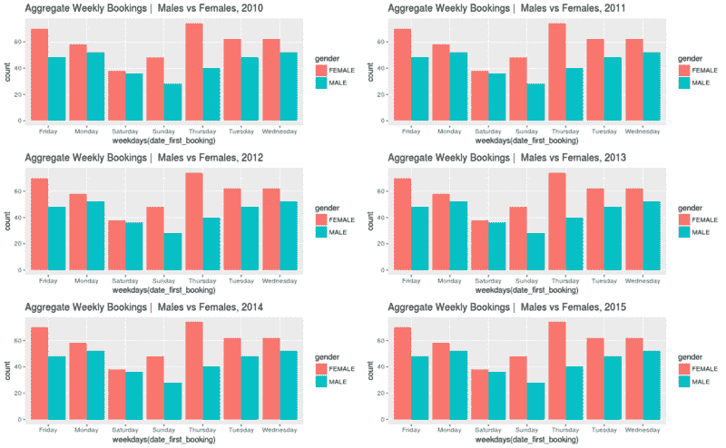

Weekly Booking vs Gender [Image [27]]

1.  周末的预订量总是最少的。周六和周日。
2.  预订的数量总是在星期四和星期五达到高峰。人们可能会在周四和周五预订周末的房间。
3.  与周六相比，男性在周日的酒店预订量大幅下降，但女性的情况则相反。
4.  从周一到周五，预订量持续增加，但在周末有所下降。

#### 预订数量的每日变化

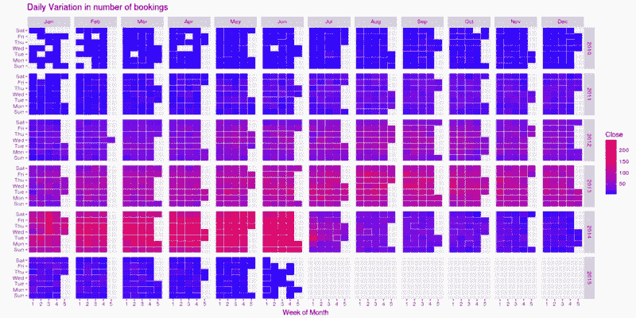

Daily Booking vs Gender [Image [28]]

我们观察到，AirBnB 从 2010 年的每天 0-50 个预订增加到 2014 年前几个月的每天近 200 个预订。此后，这个数字下降到每天 100 个左右。

### 结论

在我开始研究这个之前，我对我将得到的结果有一些先入为主的想法。例如，我没想到 iOS 会大受欢迎。比安卓更是如此。

在 2016 年第四季度售出的 4.32 亿部智能手机中，3.52 亿部运行安卓系统(81.7%)，7700 万部运行 iOS 系统(17.9%)。

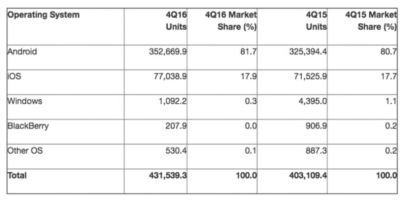

*Worldwide smartphone sales in the fourth quarter of 2016\. (Thousands of units) [Image [29] credits: [Gartner](https://www.gartner.com/newsroom/id/3609817)]*

2014 年 7 月左右用户数量的急剧下降也有点出乎意料。我的意思是，在那之前，公司有着惊人的增长率。从那以后一切都开始走下坡路了。尽管我们只有截至 2015 年年中的数据，但谁知道预订量可能会在那之后回升。

谁会料到周末的预订量会下降呢？当然不是我。但事实证明，如果你想在周末外出，你必须在那之前预订酒店。我的错。:P

在创建帐户之前预订房间？这部分我花了很长时间才搞清楚。我认为我错了。但当我最终谷歌了一下，发现这在 2013 年初之前是可能的。AirBnB 不久后修复了这个 bug。

另一件突出的事情是，与 20 多岁的人相比，30 多岁的人在 AirBnB 上更活跃。*如何？*我当然没想到 70 多岁的人会去旅行，更不用说使用 AirBnB 了。*_*

感谢您的阅读。欢迎提出建议和建设性的批评。:)你可以在 [LinkedIn](https://www.linkedin.com/in/akshajverma7/) *上找到我。*你可以在这里查看完整代码[。](https://rpubs.com/scarecrow21/airbnb-exploratory-analysis)

你也可以查看我的其他博客文章[使用 R](https://towardsdatascience.com/exploratory-analysis-of-fifa-18-dataset-using-r-ba09aa4a2d3c) 、[蜂巢入门、](https://towardsdatascience.com/getting-started-with-hive-ad8a93862f1a)和 [GgPlot 'Em All | Pokemon on R](https://towardsdatascience.com/exploratory-analysis-of-pokemons-using-r-8600229346fb) 对 FIFA 18 数据集的探索性分析。