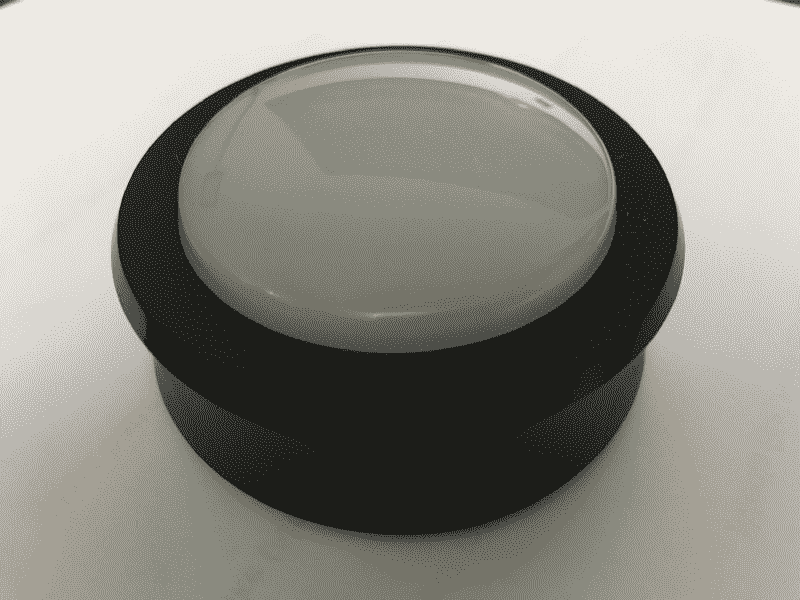
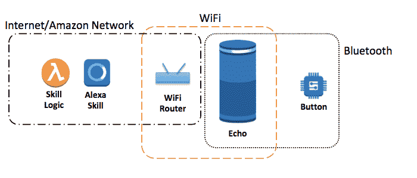
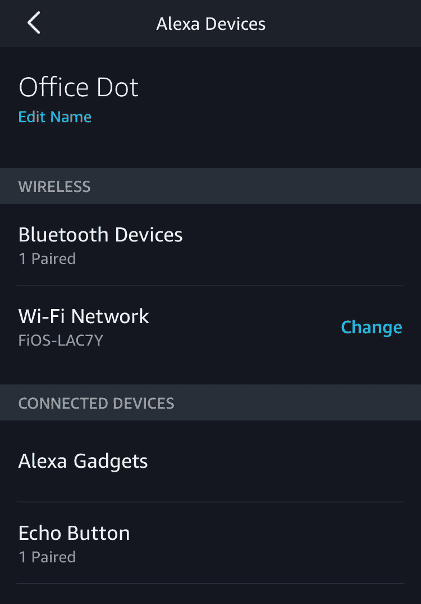
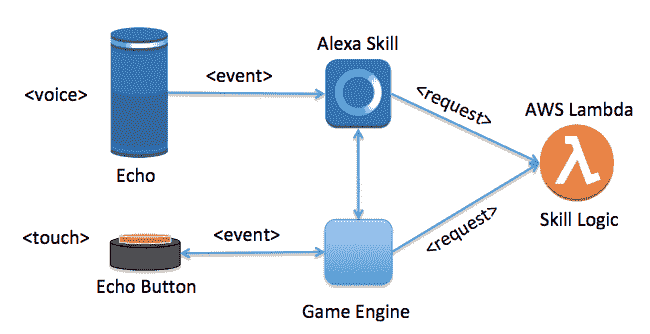
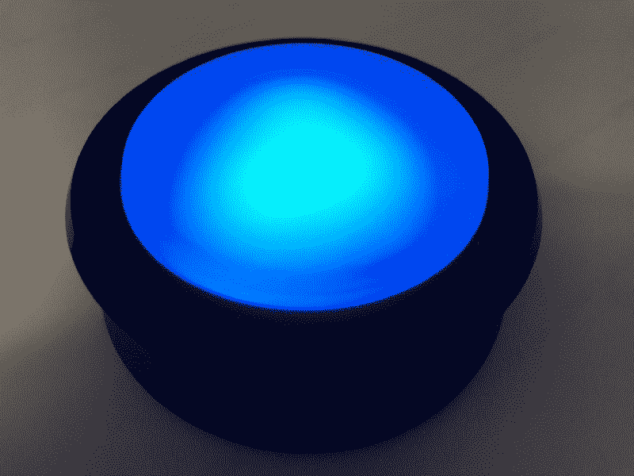
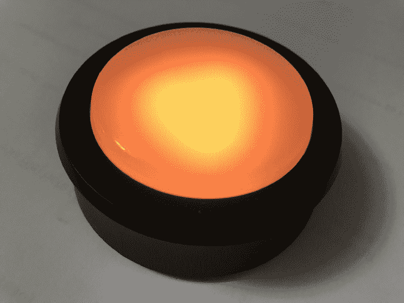
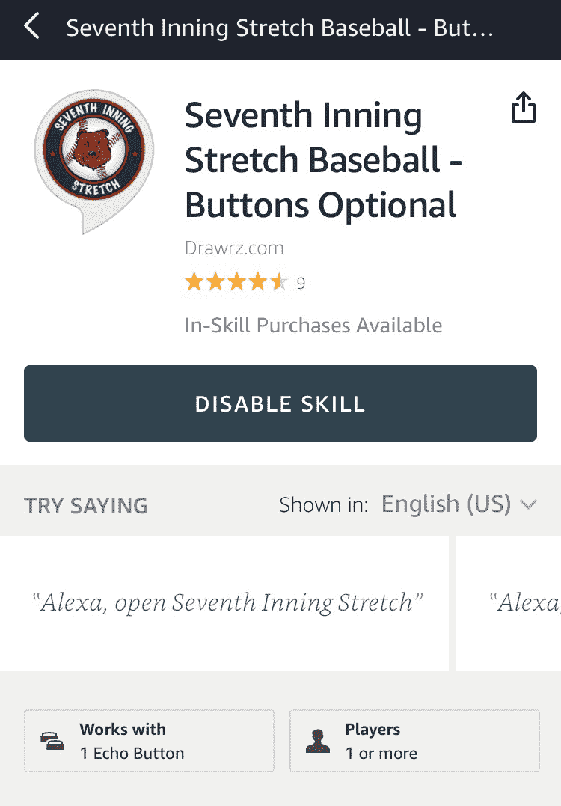

# 回声按钮如何将亚马逊 Alexa 技能提升到一个新的水平

> 原文：<https://www.freecodecamp.org/news/how-echo-buttons-take-amazon-alexa-skills-to-a-new-level-d4c489853b1f/>

特伦·彼得森

# 回声按钮如何将亚马逊 Alexa 技能提升到一个新的水平


Image via [Pixabay](https://pixabay.com/en/blocks-bricks-toy-game-education-252602/)

我被公认为亚马逊 [Alexa 冠军](https://developer.amazon.com/alexa/champions/terren-peterson)，并在平台上发布了二十多个自定义技能。我继续寻找新的方法来扩展这项技术，创造更强大的技能，并与社区分享。

去年九月，亚马逊为 Alexa 发布了一款名为 Echo Buttons 的新产品。这些硬件设备为已经拥有 Alexa 的数百万客户扩展了功能。它们相对便宜，现在的价格是 [$20/2 包](https://www.amazon.com/dp/B072C4KCQH/)。

今年四月，亚马逊为像我这样的开发者开放了平台，让他们开始将这些技能融入到定制技能中。这是我迄今为止用它们编程的经验。



Echo Button in inactive state.

### 开始使用回显按钮



Network connectivity of Echo Buttons

按钮通过蓝牙连接与 Alexa 设备配对，成为扬声器的物理扩展。从按钮到使用亚马逊服务的所有网络流量都要通过配对的设备。如果你还没有 Alexa，就不要买按钮，因为它们自己不会做任何事情。

如果您的帐户与多个扬声器相关联，则该按钮仅适用于当前与之配对的设备。只需在手机上执行几个步骤，就可以取消配对。要解除设备配对，只需使用 Alexa companion 应用程序并进入设置部分。选择已经配对的按钮，它将释放它。然后，返回这些步骤，修复另一台设备。



Screenshot of Alexa App on a Mobile Device

这使得按钮对于 Alexa 爱好者来说很容易添加，对于那些有多个设备的人来说也很灵活。

### 按钮如何与自定义技能交互

Alexa 是一个事件驱动的架构。事件是由进入扬声器的声音创建的，这些声音通过基于云的服务进行翻译。通常，这些事件是在麦克风阵列收到用户的命令后启动的。然后，ASR(自动语音识别)模型根据所使用的定制技能来翻译这些命令。

使用按钮，可以创建一种新的事件类型，它遵循类似的模式。当按钮被按下时，一个事件被创建并发送给运行在云中的技能。释放按钮时，会创建一个单独的事件。这些事件是独立于 Echo 扬声器上的麦克风拾取的任何东西而创建的，并通过一种名为游戏引擎的云服务流动。



Alexa Event Architecture including Buttons

包含定制技能逻辑的 Lambda 函数需要处理这些事件以及现有的语音触发事件。Lambda 函数中安装的 Alexa SDK 有助于翻译请求对象。在 [Alexa repo](https://github.com/alexa/skill-sample-nodejs-buttons-hellobuttons) 中提供了这种工作方式的示例。

这为游戏开辟了新的可能性，因为用户可以利用他们的声音和手来与技能互动。加入更多感官可以拓宽体验，并实现更复杂的游戏。例如，在[第七局伸展技能](https://www.amazon.com/Seventh-Inning-Stretch-Baseball-Game/dp/B071FF8WCN)中，用户可以一边听着他们的扬声器一边玩棒球游戏，同时按下按钮来挥动球棒。

### 技能如何使用小工具 API

在自定义技能中使用按钮需要 Gadgets API。文档目前在这个[网站](https://developer.amazon.com/docs/gadget-skills/understand-gadgets-skill-api.html)上，请注意它仍处于测试阶段。按钮只是一种小工具，让我们可以一窥硬件的潜力。

系统之间的连接通过互联网接口来实现。按钮需要的 API 是通过向标准的 Alexa 响应对象添加指令属性来调用的。这使得 SDK 能够处理 HTTPS 调用的显式细节(即编码报头、设置属性、错误处理等)。)

下面的示例添加了一个指令，在回显扬声器向用户朗读介绍的同时设置按钮上的灯。

```
"response": {               "shouldEndSession": false,               "outputSpeech": {                     "type": "SSML",                     "ssml": "<speak> Welcome back to Seventh Inning Stretch.<break time=\"1s\"/>We found an prior game in progress. Would you like to resume? </speak>"                 },               "reprompt": {                     "outputSpeech": {                           "type": "SSML",                           "ssml": "<speak> Say yes to resume the in-progress game, or no to delete it.  </speak>"                     }               },               "directives": [    {                           "type": "GadgetController.SetLight",                            "version": 1,                           "targetGadgets": [],                           "parameters": {                      "animations": [               {                         "repeat": 1,                            "targetLights": ["1"],              "sequence": [                          {                    "durationMs": 30000,                                                               "color": "FFFF00",                  "blend": false                                                     }              ]                      }           ],      "triggerEvent": "buttonDown",                                "triggerEventTimeMs": 0    }}
```

游戏引擎就像回声扬声器一样创建事件。使用相同的分类法，请求中的属性标识事件细节。下面是一个请求的例子，表明一个按钮被按下。

```
“request”: {   “type”: “GameEngine.InputHandlerEvent”,   “requestId”: “amzn1.echo-api.request.xxx”,   “timestamp”: “2018–07–21T21:33:25Z”,   “locale”: “en-US”,   “originatingRequestId”: “amzn1.echo-api.request.xxx”,   “events”: [     {       “name”: “button_down_event”,       “inputEvents”: [ {         “gadgetId”: “amzn1.ask.gadget.xxxx”,         “timestamp”: “2018–07–21T21:33:25.374Z”,         “color”: “000DD6”,         “feature”: “press”,         “action”: “down”       } ]     }   ] }
```

### 通过点名节省电池寿命

Echo 按钮由电池供电，因此能源管理非常重要。当自定义技能需要一个按钮时，它必须启动一个连接并唤醒按钮。这是通过自定义技能中的“点名”过程完成的。

要在自定义技能中启动点名，请向响应对象添加一个指令，提供执行任务的参数。同时，音频指令需要包含在响应对象中。这将鼓励用户用按钮做一些事情。例如，要求用户按下每个按钮开始。

关于指令看起来像什么的细节，这里是我在第七局拉伸技巧中使用的点名指令。它是一个大型 JSON 对象中的一系列属性。这将设置按钮在不使用时可以返回睡眠状态的超时参数(300，000 的值以毫秒为单位，相当于五分钟)，并只查找按钮按下事件。

```
"directives": [  {     “type”: “GameEngine.StartInputHandler”,     “timeout”: 300000,     “recognizers”: {       “button_down_recognizer”: {         “type”: “match”,         “fuzzy”: false,         “anchor”: “end”,         “pattern”: [{ “action”: “down” }]       }    },     “events”: {       “button_down_event”: {         “meets”: [“button_down_recognizer”],         “reports”: “matches”,         “shouldEndInputHandler”: false       },       “timeout”: {         “meets”: [“timed out”],         “reports”: “history”,         “shouldEndInputHandler”: true       }     }  }]
```

这些按钮控制何时关闭定时器。当用户结束他们的会话时，这最小化了电池耗尽的风险。如果技能退出，使用按钮的技能也应该请求关闭设备。

### 翻译游戏引擎事件

游戏引擎可以像说话者一样在清醒后创建事件。请求使用相同的分类法，属性标识事件的细节。这是一个请求的例子，表明一个按钮被按下。

```
“request”: {   “type”: “GameEngine.InputHandlerEvent”,   “requestId”: “amzn1.echo-api.request.xxx”,   “timestamp”: “2018–07–21T21:33:25Z”,   “locale”: “en-US”,   “originatingRequestId”: “amzn1.echo-api.request.xxx”,   “events”: [     {       “name”: “button_down_event”,       “inputEvents”: [ {         “gadgetId”: “amzn1.ask.gadget.xxxx”,         “timestamp”: “2018–07–21T21:33:25.374Z”,         “color”: “000DD6”,         “feature”: “press”,         “action”: “down”       } ]     }   ] }
```

技能的 Lambda 函数中的逻辑需要响应这些事件，并相应地处理功能。

### 按钮可以改变颜色

按钮内部是一系列可以开关的 LED。它们很亮，颜色很丰富。



按钮还可以通过改变不同 LED 的发光方式来改变颜色。



按钮的颜色变化也是在响应对象的指令中完成的。如果你使用按钮的 [repo 开始你的技能，有助手功能可以使它很容易地集成到你的技能中。](https://github.com/alexa/skill-sample-nodejs-buttons-hellobuttons)

### 关闭

如果你有兴趣尝试使用它们的游戏，请在 Alexa 上测试我的棒球模拟游戏。它被称为“第七局拉伸”，试图重现 80 年代旧掌上游戏的乐趣。这是一个很好的例子，说明了使用这些新配件的可能性。



Example of Alexa Skill that uses Buttons