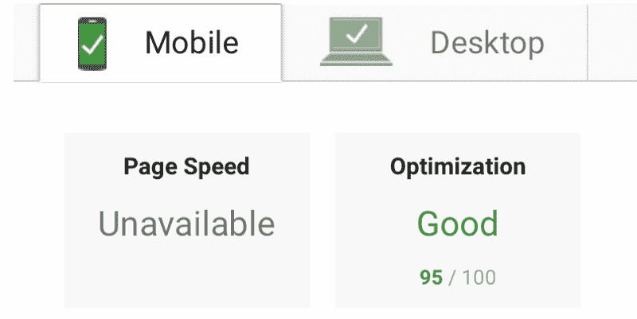
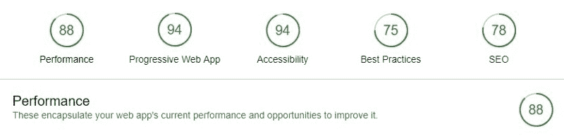
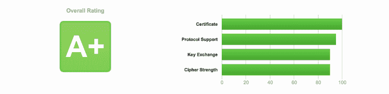
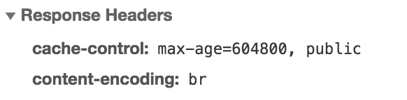

# 增强 NGINX 服务器并提高其性能的强大方法

> 原文：<https://www.freecodecamp.org/news/powerful-ways-to-supercharge-your-nginx-server-and-improve-its-performance-a8afdbfde64d/>

按头发

# 增强 NGINX 服务器并提高其性能的强大方法


supercharge your NGINX

NGINX 它还可以做其他重要的事情，如负载平衡、HTTP 缓存，并可以用作反向代理。

这些年来，我们已经看到了这么多的配置，它们提高了安全性并提高了 web 应用程序的整体性能，使您能够跟上最新的趋势。

我将分享我发现最优化的极简 NGINX 配置，这是我在新工具 [VisaList](https://visalist.io) 中使用的。为了提高我网站的最后一英里性能，我不得不做了大量的搜索和研究，我认为这个过程至少可以帮助其他一些人——所以我在这里分享它。

### 为什么？

通过这些更改，我的新 web 应用程序获得了如下结果:

**页面速度评分:** [页面速度洞察](https://developers.google.com/speed/pagespeed/insights/)



**灯塔评分:** [Chrome Dev Tools 灯塔](https://developers.google.com/web/tools/lighthouse/)



**服务器评分:** [Qualys SSL 服务器测试](https://www.ssllabs.com/ssltest/index.html)



您也可以轻松获得这些性能优势。你不需要成为 DevOps 专家来进行这些优化。因此，任何不熟悉 web 应用程序并且正在使用 NGINX 的人都会发现这非常有用。

如果你是专家，那么你可以在评论中留下你的意见，这样像我这样的新开发者就可以学习并在我们周围建立一个强大而积极的网络社区。✨ **去做网络开发者吧！** *✨*

本文假设您已经有了一个 Ubuntu 16.04 (Xenial)服务器和一个服务器渲染的 WebApp Vue.js(或任何其他 js 框架)应用程序，可以通过 NGINX 和 API 服务器提供服务。如果你还没有安装 NGINX 并且需要帮助，你可以看看这篇文章[](https://www.digitalocean.com/community/tutorials/how-to-install-nginx-on-ubuntu-16-04)**。**

**那么我所说的这些优化是什么呢？让我们看看代码！**

### **优化**

**好消息是你只需要为两个文件而烦恼。一个是您的整体 NGINX 配置，它适用于所有的 web 应用程序(您可以有多个 web 应用程序，如网站、API、静态服务器等)。另一个是特定于你的领域的，比如说是`example.com`。用自己的域名替换`example.com`。这里我只使用没有`www`的裸域。我很快会谈到这一点。**

**使用以下命令打开 NGINX 配置文件或特定于域的配置文件:**

```
`sudo nano /etc/nginx/nginx.conf

sudo nano /etc/nginx/sites-available/example.com`
```

#### ****内容压缩****

****Brotli** 比 **GZip** 好吗？是也不是，当浏览器请求一个网页时，服务器不会直接一个字节一个字节地发送。相反，它根据浏览器接受的编码以压缩状态发送它。现在大多数人都使用 Gzip，你可能会问为什么？因为它已经存在了十多年了。**

**所以 Brotli 来了，这是 Google 开发的最新编码算法。Brotli 的效率比 Gzip 高 20%。请记住，您应该在不支持 Brotli 的地方发送 Gzip 内容。Brotli 最适合处理静态文件，而不是动态内容。**

**还要确保只有当客户端 HTTP 库支持 Brotli 类型时，才为 API JSON 数据启用 brot Li 类型。比如 Axios 库还不支持 Brotli 编码。**

```
`http {

... 

    # Gzip Settings
    gzip on;
    gzip_disable "msie6";
    gzip_vary on;
    gzip_proxied any;
    gzip_comp_level 6;
    gzip_buffers 32 16k;
    gzip_http_version 1.1;
    gzip_min_length 250;
    gzip_types image/jpeg image/bmp image/svg+xml text/plain text/css application/json application/javascript application/x-javascript text/xml application/xml application/xml+rss text/javascript image/x-icon;

    # Brotli Settings
    brotli on;
    brotli_comp_level 4;
    brotli_buffers 32 8k;
    brotli_min_length 100;
    brotli_static on;
    brotli_types image/jpeg image/bmp image/svg+xml text/plain text/css application/json application/javascript application/x-javascript text/xml application/xml application/xml+rss text/javascript image/x-icon;
...

}`
```

**/etc/nginx/nginx.conf**

**添加这些更改后，您可以在 Chrome 开发工具的响应标题中检查内容编码是否显示了`br`:**

****

#### ****提高安全性****

**默认情况下，你的 NGINX 没有所有需要的重要安全头，这实际上很简单。这可以防止点击劫持攻击、跨站点脚本攻击和其他代码注入攻击。**

**`Strict-Transport-Security`报头用于 **HTTP 严格传输安全** (HSTS)，它还保护免受协议[降级攻击](https://en.wikipedia.org/wiki/Downgrade_attack)。**

```
`http {

...
   # security headers
   add_header X-Frame-Options "SAMEORIGIN" always;
   add_header X-XSS-Protection "1; mode=block" always;
   add_header X-Content-Type-Options "nosniff" always;
   add_header Referrer-Policy "no-referrer-when-downgrade" always;
   add_header Content-Security-Policy "default-src * data: 'unsafe-eval' 'unsafe-inline'" always;

   add_header Strict-Transport-Security "max-age=31536000; includeSubDomains; preload" always;
...

}`
```

**/etc/nginx/nginx.conf**

#### ****优化 SSL 和会话****

**SSL:在 TLS 上使用并禁用 SSL (SSL 已经很老了，过时了，有很多漏洞)。优化密码套件，因为它们是 TLS 的核心。这就是加密发生的地方。**

**会话缓存:创建 TLS 连接参数的缓存可以减少握手的次数，从而提高应用程序的性能。使用`ssl_session_cache`指令配置缓存。**

**会话票证:会话票证是会话缓存的替代方案。在会话缓存的情况下，关于会话的信息存储在服务器上。**

**OSCP:为了安全地连接到服务器，客户端需要验证服务器提供的证书。为了验证证书没有被吊销，客户端(浏览器)将联系证书的颁发者。这给连接初始化增加了一点额外的开销(从而增加了我们的页面加载时间)。**

**在 NGINX 配置中使用这些指令，就可以进行 SSL 优化了。**

```
`http {

...  
   # SSL Settings
   ssl_protocols TLSv1 TLSv1.1 TLSv1.2;
   ssl_prefer_server_ciphers on;
   ssl_ciphers ECDHE-ECDSA-CHACHA20-POLY1305:ECDHE-RSA-CHACHA20-POLY1305:ECDHE-ECDSA-AES128-GCM-SHA256:ECDHE-RSA-AES128-GCM-SHA256:ECDHE-ECDSA-AES256-GCM-SHA384:ECDHE-RSA-AES256-GCM-SHA384:DHE-RSA-AES128-GCM-SHA256:DHE-RSA-AES256-GC$

   # Optimize session cache
   ssl_session_cache shared:SSL:50m;
   ssl_session_timeout 1d;

   # Enable session tickets
   ssl_session_tickets on;

   # OCSP Stapling
   ssl_stapling on;
   ssl_stapling_verify on;
   resolver 8.8.8.8 8.8.4.4 208.67.222.222 208.67.220.220 valid=60s;
   resolver_timeout 2s;
...

}`
```

**/etc/nginx/nginx.conf**

#### ****提升性能:HTTP/2 支持****

**HTTP/2 比 HTTP 有很多好处，比如允许浏览器并行下载文件，允许服务器推送资源等等。您所要做的就是在您的默认服务器块中用`http2`替换`http`。就是这样，你会得到很多很多的好处。**

```
`server{

...

listen 443 http2 default_server;
    listen [::]:443 http2 default_server;
    server_name example.com;
...

}`
```

**/etc/nginx/sites-available/example.com**

**键入此命令`curl -I -L https://example.com`并验证响应。**

```
`HTTP/2 200
server: nginx
date: Wed, 18 Jul 2018 02:13:32 GMT
content-type: text/html; charset=utf-8
content-length: 216641
vary: Accept-Encoding
....`
```

#### ****减少报废/攻击****

**限制对服务器的请求是至关重要的，因为这很容易耗尽资源并导致巨额账单。这对于抵御那些想要攻击我们服务器的人也很重要。基本上有三种类型的指令:**

*   **请求限制`**limit_req**` **:** 限制每个 IP 的请求数量**
*   **连接数限制`**limit_conn**` **:** 限制每个 IP 的连接数**
*   **带宽/速率限制`**limit_rate**` **:** 限制发送数据的带宽速率**

**使用以下指令，您可以高枕无忧:**

```
`http {

...
   # Limits
   limit_req_log_level warn;
   limit_req_zone $binary_remote_addr zone=reqlimit:10m rate=10r/m;

   limit_conn_zone $binary_remote_addr zone=connlimit:100m;
   limit_conn servers 1000; # Simultaneous Connections
...

}`
```

**/etc/nginx/nginx.conf**

```
`...
server {
...
   location /api/ {
      # Rate Limiting
      limit_req zone=reqlimit burst=20; # Max burst of request
      limit_req_status 460; # Status to send

      # Connections Limiting
      limit_conn connlimit 20; # Number of downloads per IP       

      # Bandwidth Limiting
      limit_rate 4096k; # Speed limit (here is on kb/s)
   }
...
}`
```

**/etc/nginx/sites-available/example.com**

#### ****客户端缓存****

**在浏览器上缓存静态文件是很容易的，它节省了对服务器的大量请求。您所要做的就是添加这两个代码块，并随意指定到期时间。您可以包含您认为值得缓存的任何其他静态文件扩展名。**

```
`server {

...
    location / {
       ...
       ...
    }
    ...
    ...
    location ~* \.(jpg|jpeg|png|gif|ico)$ {
       expires 30d;
    }
    location ~* \.(css|js)$ {
       expires 7d;
    }
...

}`
```

**/etc/nginx/sites-available/example.com**

#### ****微缓存****

**如果你到现在才听说这件事，那么你今天很幸运！**微缓存**是一种缓存技术，内容缓存的时间非常短，可能只有 1 秒钟。这实际上意味着站点更新延迟不超过一秒，这在许多情况下是完全可以接受的。这对于对所有用户都一样的 API 响应特别有用。**

**使用这些指令设置微缓存，路径为`/tmp/cacheapi`，100MB 缓存，最大缓存文件夹大小为 1GB，在后台更新缓存。详细了解 [**这里**](https://www.nginx.com/blog/benefits-of-microcaching-nginx/) 和 [**这里**](https://www.nginx.com/blog/nginx-caching-guide/) 。**

```
`proxy_cache_path /tmp/cacheapi levels=1:2 keys_zone=microcacheapi:100m max_size=1g inactive=1d use_temp_path=off;
...

server {

...
   location /api/ {

      # Micro caching
      proxy_cache microcacheapi;
      proxy_cache_valid 200 1s;
      proxy_cache_use_stale updating;
      proxy_cache_background_update on;
      proxy_cache_lock on;
      ...
      ...

   }
...

}`
```

**/etc/nginx/sites-available/example.com**

```
`http {

...
   add_header X-Cache-Status $upstream_cache_status;
...

}`
```

**/etc/nginx/nginx.conf**

#### ****SSL 证书****

****让我们加密**是一个证书颁发机构(CA ),它提供了一种获取和安装免费 TLS/SSL 证书的简单方法。这将在 web 服务器上启用加密 HTTPS。它通过提供一个软件客户端 Certbot 来简化这个过程，该客户端试图自动化大多数(如果不是全部)所需的步骤。**

**安装 [LetsEnctypt](https://letsencrypt.org) :**

```
`sudo add-apt-repository ppa:certbot/certbot
sudo apt-get update
sudo apt-get install python-certbot-nginx`
```

**使用以下命令创建 LetsEncrypt SSL 证书:**

```
`sudo certbot --nginx -d example.com -d www.example.com`
```

**然后将这些证书添加到域配置文件中，如下所示:**

```
`server {

    listen 443 ssl http2 default_server;
    listen [::]:443 ssl http2 default_server;
...
    ssl_certificate /etc/letsencrypt/live/example.com/fullchain.pem;
    ssl_certificate_key /etc/letsencrypt/live/example.com/privkey.pem;
...

}`
```

**/etc/nginx/sites-available/example.com**

#### ****重定向 WWW****

**谷歌更喜欢你选择一个带`www`的域名，而不是不带。最好选择裸域，因为它更小，并且去掉了多余的`www`。您现在可以通过添加以下指令将所有`www`用户重定向到您的裸域。**

```
`server {
...
...
}
server {
    listen 80;
    listen [::]:80;
    server_name example.com;
    return 301 https://$server_name$request_uri;
}
server {
    listen 80;
    listen [::]:80;
    listen 443 ssl http2;
    listen [::]:443 ssl http2;
    server_name www.example.com;
    return 301 https://example.com$request_uri;
}`
```

**/etc/nginx/sites-available/example.com**

#### **页面速度模块**

**Pagespeed 模块是许多人都不知道的宝石。它最初是谷歌的一个项目，现在是 Apache 孵化器的一部分。Pagespeed 可以自动处理几乎所有已知的提高网站性能的方法。**

**[**安装**](https://www.digitalocean.com/community/tutorials/how-to-add-ngx_pagespeed-to-nginx-on-ubuntu-14-04) 或 **[用 Pagespeed 升级](https://www.digitalocean.com/community/questions/how-to-add-pagespeed-on-existent-nginx-ubuntu-server)** NGINX。这不是一项容易的任务，这就是为什么我把它留到了最后。按照这些说明去做，你应该能毫不费力地做到。完成后，您需要做的就是启用它，瞧！**

```
`server{

...  
    # Pagespeed Module
    pagespeed on;

    pagespeed FileCachePath /var/cache/ngx_pagespeed_cache;
    location ~ "\.pagespeed\.([a-z]\.)?[a-z]{2}\.[^.]{10}\.[^.]+" {
    add_header "" "";
    }
    location ~ "^/pagespeed_static/" { }
    location ~ "^/ngx_pagespeed_beacon$" { }

    pagespeed RewriteLevel PassThrough;
    pagespeed EnableCachePurge on;
    pagespeed PurgeMethod PURGE;

    pagespeed EnableFilters prioritize_critical_css;
...
}`
```

**您可以启用这么多过滤器，但请记住，大多数现代框架(如(Nuxt.js、Angular、Next.js 等)在其构建过程中都有一些这样的优化，所以这可能是违反直觉的。选择您需要的过滤器，并仅启用它们。这绝不是一套详尽的过滤器，但肯定会让你的网站在页面速度上达到 100/100。**

```
`pagespeed EnableFilters rewrite_css;
pagespeed EnableFilters collapse_whitespace,remove_comments;
pagespeed EnableFilters flatten_css_imports;
pagespeed EnableFilters combine_css;
pagespeed EnableFilters combine_javascript;
pagespeed EnableFilters defer_javascript;
pagespeed EnableFilters extend_cache;
pagespeed EnableFilters pedantic;
pagespeed EnableFilters inline_google_font_css;
pagespeed FetchHttps enable;
pagespeed EnableFilters inline_css,move_css_above_scripts;
pagespeed EnableFilters inline_javascript;
pagespeed EnableFilters inline_import_to_link;
pagespeed EnableFilters lazyload_images;
pagespeed EnableFilters insert_dns_prefetch;
pagespeed EnableFilters inline_preview_images;
pagespeed EnableFilters resize_mobile_images;
pagespeed EnableFilters rewrite_images;
pagespeed EnableFilters responsive_images,resize_images;
pagespeed EnableFilters responsive_images_zoom;
pagespeed EnableFilters rewrite_javascript;
pagespeed EnableFilters rewrite_style_attributes,convert_meta_tags;`
```

**你可以在这里 **阅读更多关于不同类型的过滤器 [**。**](https://modpagespeed.com/doc/filters)****

 **[https://giphy.com/embed/ely3apij36BJhoZ234](https://giphy.com/embed/ely3apij36BJhoZ234)

因此，最终的 NGINX 配置和域配置如下所示:

[https://gist . github . com/1 haker/01 CB 00 dfce 8 c92 至 15c 0 d9 FAE 9052042](https://gist.github.com/1hakr/01cb00dfce8c92a15c0d9faee9052042)

现在你所要做的就是通过输入下面的命令来重新加载你的 NGINX 配置文件，你已经给你的 NGINX 服务器增压了:

```
sudo nginx -t

sudo systemctl restart nginx
```

专业提示:如果你觉得这篇文章遥不可及，那么有一个简单的网站可以帮你得到最终的配置文件:查看 [**NGINX Config**](https://nginxconfig.io/) **。**

我希望你喜欢这个 NGINX 配置，并能够增压你的网络应用程序。你已经用过类似的东西了吗？还是有完全不同的看法？请在评论中告诉我。

这是我新的微启动， [VisaList](https://visalist.io) ，我已经应用了这些优化。它可以帮助您以简单而有用的方式找到世界上所有国家的签证要求。

[](https://visalist.io) **[*从您可以免签证、落地签证和其他要求的国家列表中搜索全球各地的旅游目的地……*](https://visalist.io)
[Visa list . io](https://visalist.io)**

**所有人！这里是 [**HaKr**](https://1hakr.com) 结束通话。感谢您的阅读，如果您发现这很有用，请点击？向其他人推荐这篇文章，让他们也能找到它。**

**当我可以的时候，我在旅行的时候建造 [**微型创业公司**](https://dworks.io) 。如果你觉得这类东西有趣，你可以在 [Twitter](https://twitter.com/1hakr) 上关注我，并在 [GitHub](https://github.com/1hakr) 上查看我的开源作品。****