# 优势演员评论方法介绍:让我们玩刺猬索尼克！

> 原文：<https://www.freecodecamp.org/news/an-intro-to-advantage-actor-critic-methods-lets-play-sonic-the-hedgehog-86d6240171d/>

托马斯·西蒙尼尼

# 优势演员评论方法介绍:让我们玩刺猬索尼克！

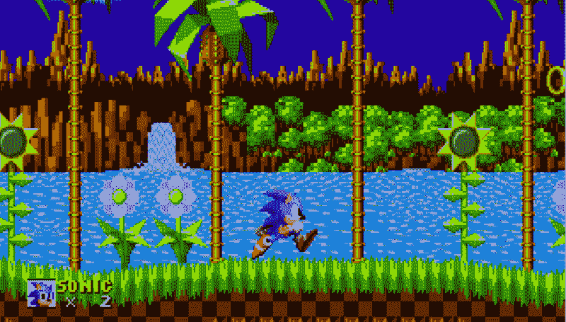

从本课程的[开始，我们已经学习了两种不同的强化学习方法:](https://simoninithomas.github.io/Deep_reinforcement_learning_Course/)

*   **基于值的方法** (Q 学习，深度 Q 学习):我们学习一个值函数**，它将每个状态动作对映射到一个值。**得益于这些方法，我们找到了针对每种状态的最佳行动——具有最大价值的行动。当您有一组有限的动作时，这种方法很有效。
*   **基于策略的方法**(用策略梯度加强):我们直接优化策略，而不使用价值函数。当动作空间是连续的或随机的时，这是有用的。主要问题是找到一个好的评分函数来计算一项政策有多好。我们**使用剧集的总奖励。**

但是这两种方法都有很大的缺点。这就是为什么，今天，我们将学习一种新的强化学习方法，我们可以称之为“混合方法”:**演员评论家**。我们将使用两个神经网络:

*   衡量所采取的行动有多好的评论家(基于价值)
*   控制代理行为的参与者(基于策略)

掌握这种架构对于理解最先进的算法至关重要，例如**近似策略优化(又名 PPO)。PPO 是基于优势演员评论家。**

您将实现一个优势演员评论家(A2C)代理，学习扮演刺猬索尼克！

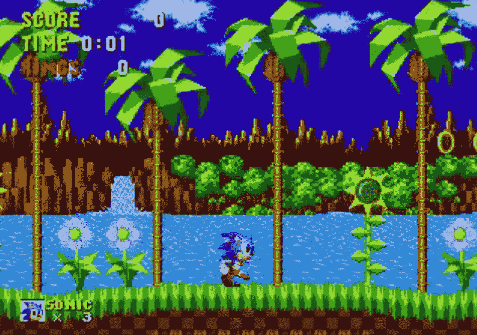

Excerpt of our agent playing Sonic after 10h of training on GPU.

### 寻求更好的学习模式

#### 政策梯度的问题在于

[政策梯度法](https://medium.freecodecamp.org/an-introduction-to-policy-gradients-with-cartpole-and-doom-495b5ef2207f)问题很大。我们在蒙特卡洛的情况下，等到一集结束计算奖励。我们可以得出结论，如果我们有一个高回报( **R(t)** ，我们采取的所有行动都是好的，即使有些真的不好。

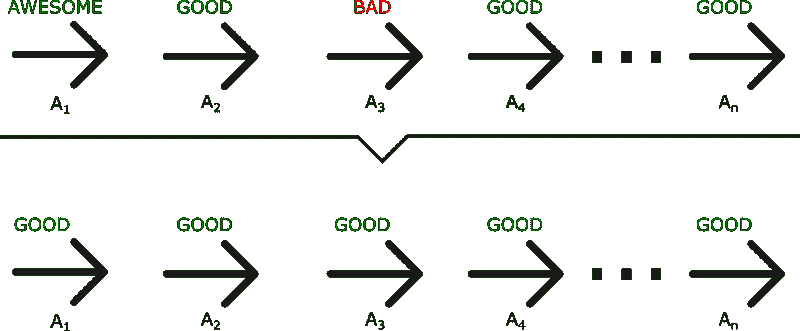

正如我们在这个例子中看到的，即使 A3 是一个不好的行为(导致了负面的奖励)，所有的行为都会被平均为好，因为总的奖励是重要的。

因此，要有一个最优策略，我们需要大量的样本。这导致学习缓慢，因为收敛需要很多时间。

相反，如果我们可以在每个时间步进行更新，会怎么样？

### 介绍演员评论家

演员评论家模型是一个更好的评分函数。我们不是像蒙特卡洛强化那样等到一集结束，而是在每一步都进行更新(TD 学习)。

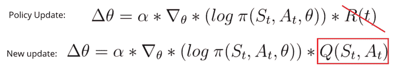

因为我们在每个时间步进行更新，所以我们不能使用总报酬 R(t)。相反，我们需要训练一个接近价值函数的批判模型**(记住，价值函数计算给定一个状态和一个动作的最大预期未来回报)。该价值函数取代了策略梯度中仅在剧集结束时计算奖励的奖励函数。**

#### 演员评论家如何工作

想象一下，你和一个朋友一起玩视频游戏，这个游戏给了你一些反馈。你是演员，你的朋友是评论家。

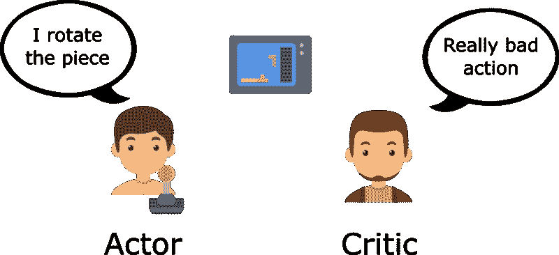

刚开始的时候，你不知道怎么玩，就随便尝试一些动作。批评家观察你的行为并提供反馈。

从这个反馈中学习，你将会更新你的政策，并且更擅长玩这个游戏。

另一方面，你的朋友(评论家)也会更新他们自己提供反馈的方式，这样下次会更好。

我们可以看到，演员评论家的想法是有两个神经网络。我们估计两者:

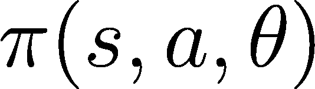

**ACTOR** : A policy function, controls how our agent acts.

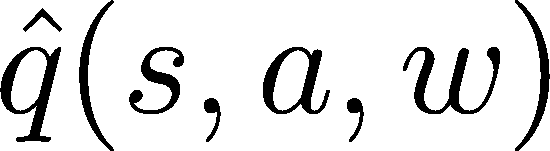

**CRITIC** :A value function, measures how good these actions are.

两者并行运行。

因为我们有两个必须训练的模型(演员和评论家)，这意味着我们有两套权重(？对于我们的行动和 w 对于我们的评论家)t **哪些必须单独优化:**

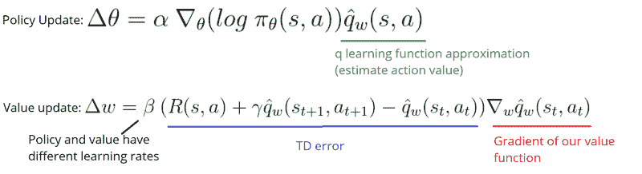

#### 演员评论流程

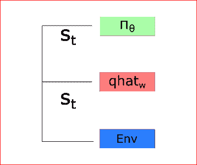

在每个时间步长 t，我们从环境中获取当前状态(St ),并将其作为输入通过我们的演员和评论家传递。

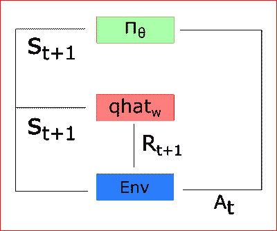

我们的策略取状态，输出一个动作(At)，接收一个新的状态(St+1)和一个奖励(Rt+1)。

由于这一点:

*   批评家计算在那个状态下采取那个行动的价值
*   参与者使用这个 q 值更新其策略参数(权重)

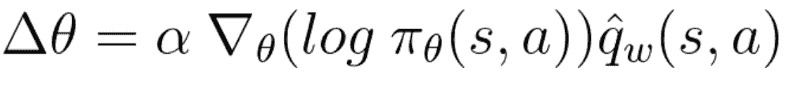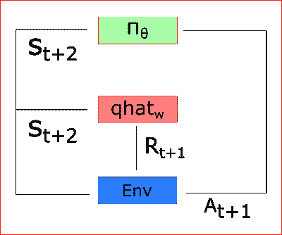

由于其更新的参数，演员产生在+1 **采取的下一个动作，给定**新的状态 St+1。批评家然后更新它的值参数:

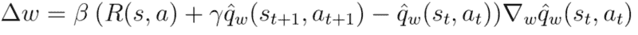

### A2C 和 A3C

#### 引入优势函数稳定学习

正如我们在关于深度 Q 学习的[改进的文章](https://medium.freecodecamp.org/improvements-in-deep-q-learning-dueling-double-dqn-prioritized-experience-replay-and-fixed-58b130cc5682)中看到的，基于价值的方法具有**高可变性。**

为了减少这个问题，我们谈到了使用优势函数而不是价值函数。

优势函数是这样定义的:

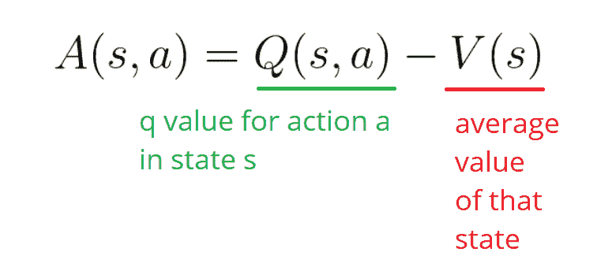

该函数将告诉我们**与在该状态下采取的措施的平均值相比的改进。**换句话说，这个函数计算了如果我采取这个行动，我得到的额外奖励。额外的回报是超出那个状态的期望值。

如果 A(s，a) > 0:我们的梯度被推向那个方向。

如果 A(s，a) < 0(我们的动作比那个状态的平均值差)，我们的梯度被推向相反的方向。

实现这个优势函数的问题是它需要两个值函数— Q(s，a)和 V(s)。幸运的是，我们可以使用 TD 误差作为优势函数的良好估计。

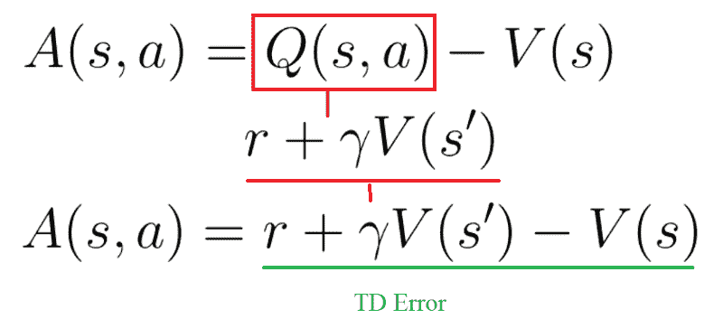

#### 两种不同的策略:异步或同步

我们有两种不同的策略来实现演员评论家代理:

*   A2C(又名优势演员评论家)
*   A3C(又名异步优势演员评论家)

因为这个原因，我们将和 A2C 合作，而不是 A3C。如果你想看到 A3C 的完整实现，请查看优秀的[亚瑟·朱利安尼](https://www.freecodecamp.org/news/an-intro-to-advantage-actor-critic-methods-lets-play-sonic-the-hedgehog-86d6240171d/undefined)的 [A3C 文章](https://medium.com/emergent-future/simple-reinforcement-learning-with-tensorflow-part-8-asynchronous-actor-critic-agents-a3c-c88f72a5e9f2)和[厄运实现。](https://github.com/awjuliani/DeepRL-Agents/blob/master/A3C-Doom.ipynb)

在 A3C 中，我们不使用经验回放，因为这需要大量的内存。相反，我们在环境的多个实例上异步地并行执行不同的代理。每个工作者(网络的副本)将异步更新全局网络。

另一方面，在 A2C 的唯一区别是我们同步更新全球网络。我们一直等到所有工人都完成了培训，并计算出他们的梯度，然后进行平均，以更新我们的全球网络。

#### 选择 A2C 还是 A3C？

A3C 的问题在[这篇牛逼的文章](https://lilianweng.github.io/lil-log/2018/04/08/policy-gradient-algorithms.html#a2c)里有解释。由于 A3C 的异步特性，一些工作人员(代理的副本)将使用旧版本的参数。因此，聚集更新将不是最佳的。

这就是为什么 A2C 在更新全局参数之前会等待每个演员完成他们的经历。然后，我们重新开始一段新的经历，所有平行角色都有相同的新参数。

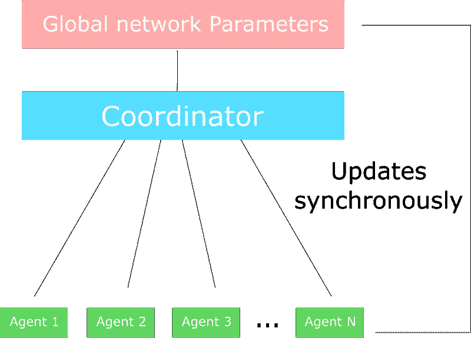

This schema is inspired by [this article](https://lilianweng.github.io/lil-log/2018/04/08/policy-gradient-algorithms.html#a2c).

因此，培训将更有凝聚力，速度也更快。

### 实现一个扮演刺猬索尼克的 A2C 代理

#### 实践中的 A2C

实际上，正如 Reddit 帖子中所解释的，A2C 的同步性意味着**我们不需要 A2C 的不同版本(不同的工人)。**

A2C 的每个工人都有相同的重量，因为与 A3C 相反，A2C 同时更新他们所有的工人。

事实上，我们创建**多个版本的环境**(假设八个)，然后并行执行它们。

该过程如下:

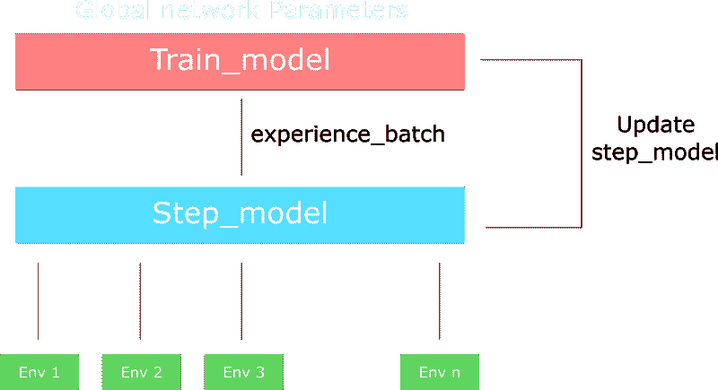

*   使用多重处理库创建 n 个环境的向量
*   创建一个处理不同环境的 runner 对象，并行执行。
*   有两个版本的网络:

1.  步骤模型:从环境中产生经验
2.  train_model:训练经验。

当跑步者迈出一步(单步模式)时，这为 n 个环境中的每一个执行一步。这就输出了一批经验。

然后，我们使用 train_model 和我们的批量经验一次性计算梯度。

最后，我们用新的权重更新步骤模型。

请记住，一次性计算梯度与收集数据、计算每个工人的梯度，然后求平均值是一回事。为什么？**因为对导数求和(梯度求和)和对和**求导是一回事。但是第二个更优雅，也是更好的使用 GPU 的方式。

#### A2C 和刺猬索尼克

所以现在我们了解了 A2C 是如何工作的，我们可以实现我们的 A2C 代理玩索尼克！此视频显示了我们的代理在 10 分钟培训(左)和 10 小时培训(右)之间的行为差异。

实现在 GitHub repo [这里](https://github.com/simoninithomas/Deep_reinforcement_learning_Course/tree/master/A2C%20with%20Sonic%20the%20Hedgehog)，笔记本解释了实现。我给你保存的模型在 GPU 上训练了大约 10h+。

这个实现比以前的实现复杂得多。我们开始实现最先进的算法，所以我们需要越来越高效地使用我们的代码。这就是为什么在这个实现中，我们将代码分离到不同的对象和文件中。

仅此而已！您刚刚创建了一个学习扮演刺猬索尼克的代理。太棒了。例如，我们可以看到，经过 10 小时的培训，我们的代理并不理解循环，所以我们需要使用更稳定的架构:PPO。

**花点时间思考一下自本课程第[章](https://medium.com/free-code-camp/an-introduction-to-reinforcement-learning-4339519de419) :** 我们从简单的文本游戏(OpenAI taxi-v2)发展到复杂的游戏，如使用越来越强大的架构的《毁灭战士》和《刺猬索尼克》。这太棒了！

下一次我们将学习近似策略梯度，赢得了 [OpenAI 复古竞赛](https://contest.openai.com/2018-1/)的架构。我们将训练我们的代理玩刺猬索尼克 2 和 3，这一次，它将完成整个水平！

不要忘记自己实现代码的每一部分。尝试修改我给你的代码真的很重要。尝试添加纪元、改变架构、改变学习速度等等。实验是最好的学习方法，所以玩得开心点！

如果你喜欢我的文章，请点击？下面是你喜欢文章的次数，所以其他人会在媒体上看到它。别忘了跟着我！

本文是我用 TensorFlow 做的深度强化学习课程的一部分？️.查看这里的教学大纲。

如果你有任何想法，评论，问题，欢迎在下面评论或者给我发邮件:你好[at] simoninithomas [dot] com，或者发推特给我[@ thomasmonini](https://twitter.com/ThomasSimonini)。

#### 深度强化学习课程:

> 我们正在用 Tensorflow 制作深度强化学习课程的**视频版？在这里，我们将重点放在 tensorflow h [ere 的实现部分。](https://youtu.be/q2ZOEFAaaI0)**

*第一部分:[强化学习简介](https://medium.com/p/4339519de419/edit)*

*第二部分:[用 Q-Learning](https://medium.freecodecamp.org/diving-deeper-into-reinforcement-learning-with-q-learning-c18d0db58efe)* 深入强化学习

*第三部分:[深度 Q-Learning 入门:来玩毁灭战士](https://medium.freecodecamp.org/an-introduction-to-deep-q-learning-lets-play-doom-54d02d8017d8)*

第 3 部分+: [深度 Q 学习的改进:决斗双 DQN，优先体验重放，固定 Q 目标](https://medium.freecodecamp.org/improvements-in-deep-q-learning-dueling-double-dqn-prioritized-experience-replay-and-fixed-58b130cc5682)

第 4 部分:[关于厄运和翻转的政策梯度的介绍](https://medium.freecodecamp.org/an-introduction-to-policy-gradients-with-cartpole-and-doom-495b5ef2207f)

第 6 部分:[刺猬索尼克 2 和 3 的近似策略优化(PPO)](https://towardsdatascience.com/proximal-policy-optimization-ppo-with-sonic-the-hedgehog-2-and-3-c9c21dbed5e)

第七部分:[好奇心驱动的学习变得简单第一部分](https://towardsdatascience.com/curiosity-driven-learning-made-easy-part-i-d3e5a2263359)