# 我是如何在 LinkedIn 上添加 bot 联系人的——并实际上获得了一些面试机会

> 原文：<https://www.freecodecamp.org/news/how-i-made-a-linkedin-contact-adding-bot-and-actually-got-a-few-interviews-with-it-37a6f5f85d4d/>

作者 YK·杉

# 我是如何在 LinkedIn 上添加 bot 联系人的——并自动获得一些面试机会的

在 LinkedIn 上，有一个部分的标题是“你可能认识的人”它在**我的网络**选项卡下。

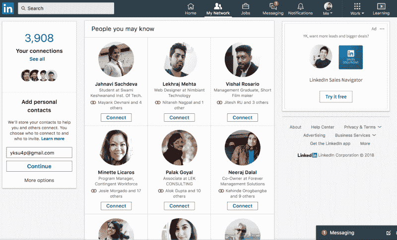

这是建议你可能想联系的人的页面。

您可以点击这些**连接**按钮向列表中的人发送连接请求。

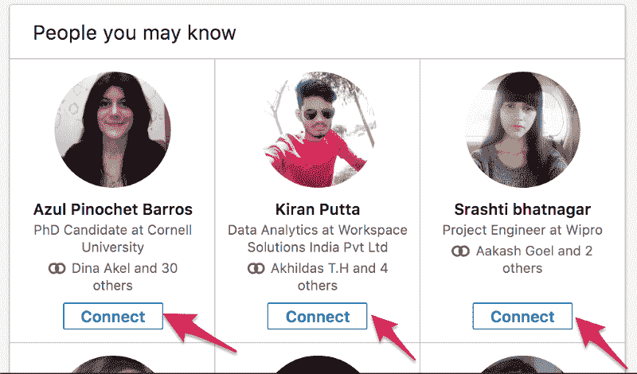

几年前，我发现了这个页面，我开始在那里随机添加人。我会点击我在这个页面上找到的每个人的连接按钮。

我只是觉得在 LinkedIn 上有很多关系可能会有助于获得我想要的工作，例如，软件工程师实习。

但是过了一段时间，手动点击这些连接按钮变得有点麻烦。

所以，我决定做一个小机器人来帮我点击这些按钮。

这是一篇关于我如何制作这个机器人的文章，结果是什么，以及我从中学到了什么。

### 我是如何制造机器人的

#### 我使用的工具

我制作了这个简单的机器人，用 **JavaScript** 和[grease monkey在 LinkedIn 上添加随机的人。](https://addons.mozilla.org/en-US/firefox/addon/greasemonkey/)

Greasemonkey 是 Firefox 的一个插件，可以帮助你管理定制的 JavaScript 代码。

有了它，你可以设置一些东西，这样当你打开一个特定的 URL 时，一组特定的代码就会自动运行。

还可以在 Greasemonkey 中存储一些数据。我用这个功能来跟踪我用这个机器人添加的人数。这样，即使当我关闭浏览器或刷新页面时，我也能够始终如一地跟踪这个数字。

#### 我用的代码

不幸的是，我没有保存我用来创建我的机器人的代码。

因此，在这篇文章中，我将尽我所能尽可能地再现它。

最初，为了创建这段代码，我使用了谷歌浏览器。后来换成火狐用 Greasemonkey，前面提到过。我最初选择使用 Chrome 只是因为我更习惯它。

现在，让我们一起来看看今天我将如何重新创建这段代码。在本文中，为了简单起见，我只向您展示这个机器人的核心功能——添加人。所以，我这里就跳过用 Greasemonkey 持久存储数据的部分。

如果你想让我在另一篇文章中讨论这一部分，请在评论中告诉我。

#### 步骤 0: JavaScript 基础知识

如果您对 JavaScript 不太熟悉，让我们在这里快速浏览一些 JavaScript 基础知识。

我们将在这里使用谷歌浏览器，但你可以使用任何你想使用的浏览器。

首先，打开任何一个网站，比如说，Google.com。

然后，您需要在那里打开浏览器的 JavaScript 控制台。

在谷歌 Chrome 上，你可以用几种不同的方式来实现。

我通常是这样做的:

*   右键单击页面上的任意位置。
*   然后，在弹出的菜单中点击**检查**。

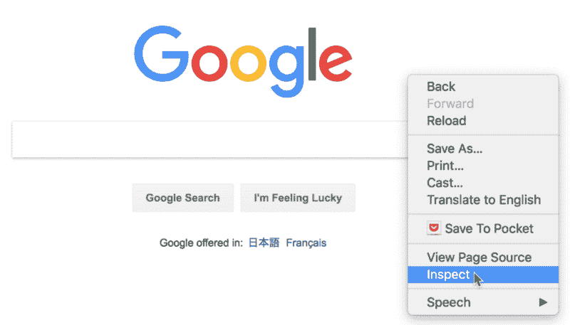

*   当您单击它时，应该会出现如下所示的窗口。

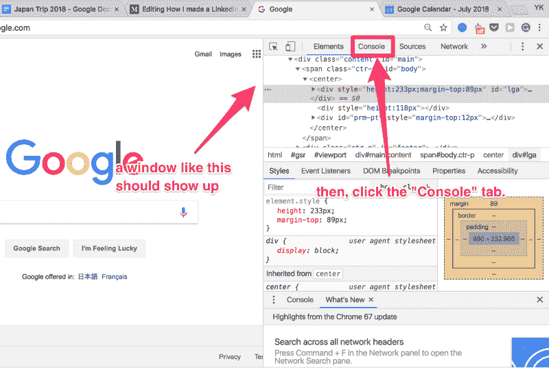

*   然后，单击那里的**控制台**选项卡，显示 JavaScript 控制台。
*   单击**控制台**选项卡后，您应该会看到 JavaScript 控制台。

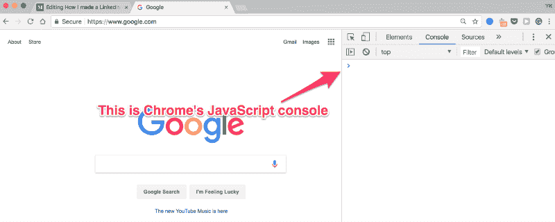

您可以在这里输入任何 JavaScript 代码进行测试。您可以使用输入的代码与浏览器中打开的页面进行交互。

例如，尝试在控制台中键入以下代码，然后按 Enter 键。

```
selected = document.querySelector('body');
```

这将选择浏览器上打开的页面中的 **body** 标签。然后，它将它赋给一个名为**的新变量 selected】。**

在 Chrome 和 Firefox 中，有一个简写:

```
selected = document.querySelector('body');
```

相反，你可以写:

```
selected = $('body');
```

这个代码相当于上面的代码。

我将在整篇文章中使用这种带有美元符号的简写符号，以使我们的代码简短。

另外，如果你还不了解 HTML 和 JavaScript 的基础知识，也不用担心。我会尽力写好这篇文章，这样即使对初学者来说也很容易理解。

如果您对我将要向您展示的代码不感兴趣，您也可以直接跳到关于发生了什么以及我在最后从这次经历中学到了什么的部分。

现在，让我们一步一步地浏览我们的机器人代码。

#### 步骤 1:找到目标元素

首先，您需要编写一段代码来找到您想要单击的按钮。

首先，登录 LinkedIn。然后，转到我的网络选项卡。目前在[https://www.linkedin.com/mynetwork/](https://www.linkedin.com/mynetwork/)(2018 年 7 月)。

你应该可以在那里找到你可能认识的**人的**版块。

然后，在 Chrome 上，右键点击其中一个推荐人的“连接”按钮。然后，点击**检查**。

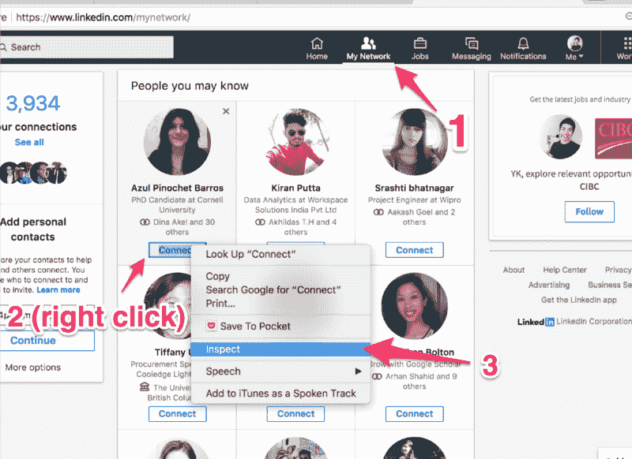

一旦你这样做了，你刚才点击的元素将会在开发者窗口中高亮显示。

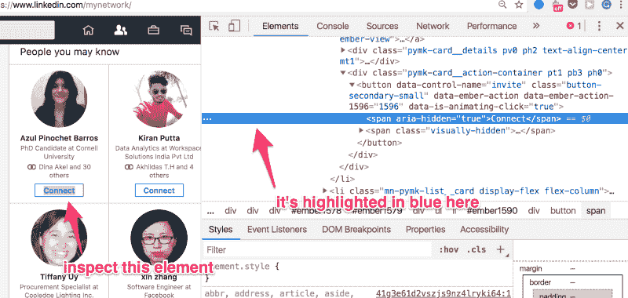

这是这里用蓝色突出显示的 HTML 代码:

```
<span aria-hidden=”true”>Connect</span>
```

这是一个 **span** 选项卡，显示文本:**连接**。我们真正要点击的不是这个，而是它的父元素，是一个按钮。

你可以在我们选择的 span lemon 上面找到它。

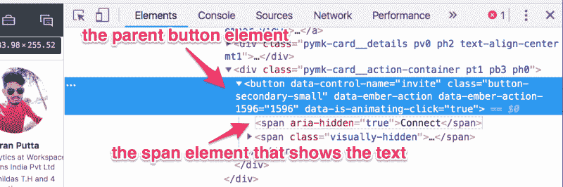

现在让我们检查一下这个按钮元素:

```
<button data-control-name=”invite” class=”button-secondary-small” data-ember-action=”” data-ember-action-1596=”1596" data-is-animating-click=”true”> <span aria-hidden=”true”>Connect</span> <span class=”visually-hidden”> Invite Azul Pinochet Barros to connect </span></button>
```

这里有一堆东西，但这里是最重要的部分:

```
<button data-control-name=”invite” ...> <span aria-hidden=”true”>Connect</span> ...</button>
```

基本上，这是一个按钮元素，其属性 **data-control-name** 是“invite”。

在我们的脚本中，我们需要做的就是像这样选择元素并单击它们。

您可以用这段代码选择这些元素:

```
selected = $(“button[data-control-name=invite]”);
```

这表示选择所有数据控件名为“invite”的按钮元素。

> *注:看起来 LinkedIn 的网站用的是 jQuery。所以，上面的符号实际上是一个 jQuery 选择器，[而不是 Chrome](https://stackoverflow.com/questions/22244823/what-is-the-dollar-sign-in-javascript-if-not-jquery) 定义的助手函数。令人困惑的是，他们的行为略有不同？*

无论如何，一旦你在 Chrome 控制台上运行了这段代码，你应该能够看到已经选择了正确的元素。

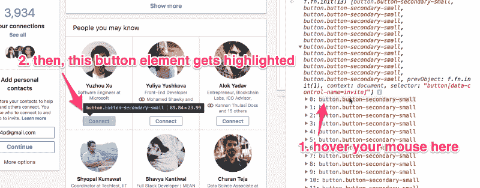

This is how you can make sure that the correct elements have been selected.

现在，使用这段代码- `selected = $("button[data-control-name=invite]");` -您的浏览器找到多个按钮元素，并将它们放入一个数组中。要选择第一个元素，只需选择数组中的第一个元素，如下所示:

```
toClick = $("button[data-control-name=invite]")[0];
```

然后，你可以用这个点击它:

```
toClick.click();
```

如果通过，您应该会看到一个确认窗口弹出。

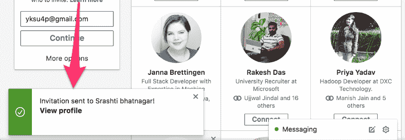

A confirmation window that shows up when you click one of the ***connect*** buttons

#### 步骤 2:遍历多个目标元素

现在，下一步是遍历多个目标元素来单击，这样我们就可以添加多个人。

经过一些实验后，我意识到有一种比我之前展示的方法更简单的方法来选择多个按钮并遍历它们。

我会这样做。

首先，使用 Inspect 元素进一步分析这个页面的结构。那么，你应该能看出，你可能认识的**人** 只是一个无序列表。

您应该能够找到如下所示的代码:

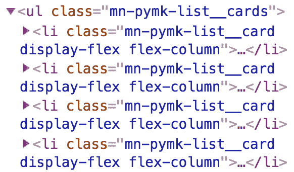

父元素是一个`ul`(无序列表)元素。它的子元素是`li`(列表项)元素。

每个`li`元素代表你在屏幕上看到的卡片上的**个你可能认识的人。**

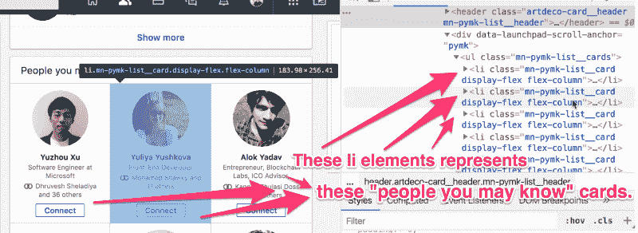

通过选择这些`li`元素，而不是直接选择按钮，实际上通过多人变得更容易。

您可以选择这个`ul`元素，它是`li`元素的父元素，如下所示:

```
ul = $('ul.mn-pymk-list__cards')[0];
```

也就是说，选择带有类`ul.mn-pymk-list__cards`的`ul`元素。我们需要在末尾添加`[0]`,因为原始结果是一个包含单个元素的数组。

然后，您可以像这样选择`ul`元素下的第一个`li`元素(第一个人的卡片):

```
firstLi = ul.querySelector('li');
```

我们不需要在这个语句的末尾添加`[0]`，因为 querySelector()函数只返回一个元素。

然后，在`firstLi`中，您可以选择我们需要点击的按钮，如下所示:

```
buttonToClick = firstLi.querySelector("button[data-control-name=invite]");
```

用`buttonToClick.click()`点击这个按钮后，我们应该移除这个`li`元素，这样我们就可以去下一个`li`元素(下一个人的卡)。我们可以这样做:

```
ul.removeChild(firstLi);
```

把它们放在一起，并把所有东西放在一个 while 循环中，你会得到这样的结果:

```
ul = $('ul.mn-pymk-list__cards')[0];firstLi = ul.querySelector('li');while(firstLi){ // do this while firstLi still exists.  buttonToClick = firstLi.querySelector("button[data-control-name=invite]");  ul.removeChild(firstLi);  firstLi = ul.querySelector('li');}
```

这段代码应该可以工作，但是它有几个问题。

1.  我们添加人员的速度非常快，所以当你运行这段代码时，很难知道会发生什么。
2.  我们没有记录我们添加了多少人。
3.  我们假设`buttonToClick`总是可以点击的正确按钮。有时这个按钮会显示“邀请”而不是“连接”。我们不想点击太多的“邀请”按钮。

#### 步骤 3:精炼我们的代码

我已经解决了上面提到的所有问题，并在下面编写了一段相对简单的代码。

这里的[也是](https://gist.github.com/ykdojo/aea4cf27fec4bbb5a175e11bae39cb2d)上的要义。也许在那里更容易阅读。

```
// this function allows us to stop our code for |ms| milliseconds.function sleep(ms) {  return new Promise(resolve => setTimeout(resolve, ms));}
```

```
// I've put our main code into this function.async function addPeople() {  ul = $('ul.mn-pymk-list__cards')[0];  firstLi = ul.querySelector('li');  count = 0; // this is the count of how many people you've added  while(firstLi && count < 100){ // stop after adding 100 people    buttonToClick = firstLi.querySelector("button[data-control-name=invite]");    // make sure that this button contains the text "Connect"    if (buttonToClick.innerText.includes("Connect")){      buttonToClick.click();      count += 1;      console.log("I have added " + count + " people so far.");    }    ul.removeChild(firstLi);    await sleep(1000); // stop this function for 1 second here.    firstLi = ul.querySelector('li');  }}
```

```
addPeople();
```

如果您仔细检查这段代码，您应该能够注意到我所做的几处更改:

1.  我已经把我们的代码放到了一个名为 addPeople()的*异步*函数中。在这个函数中，我们每添加一个人，就用 sleep()函数暂停 1 秒。关于这种模式的更多信息[在这里](https://stackoverflow.com/questions/951021/what-is-the-javascript-version-of-sleep)。
2.  我添加了一个`count`变量来记录我们添加了多少人。
3.  我加了这个 if 语句:`if (buttonToClick.innerText.includes("Connect"){...}`。这样，我们可以确保我们点击的按钮中包含单词“Connect”。

经过这些修改，当我运行这段代码时，它看起来像这样:

#### 第四步:进一步改进！

在我上面展示的基础上，当我实际使用我的机器人在 LinkedIn 上添加一群人时，我有了更多的功能。

首先，我使用了之前提到的 Greasemonkey 来记录我添加的总人数。

此外，为了避免被 LinkedIn 检测为机器人，我添加了一些东西:

1.  我把我加人的顺序随机化了。
2.  我随机分配了每次添加新成员时等待的时间。

我会把这些都作为练习题留给你们来解决，以防你们有兴趣解决？

### 发生了什么

通过我的脚本，我最终添加了 2000+个连接。然后，如果我没记错的话，大概有 400 个加我回来了。

结果一周左右我就从 300 左右的连接到 700+的连接！

然后，过了一段时间，我被 LinkedIn 禁止添加任何人。我不知道我会被禁赛！我有点害怕，但大约两个月后禁令解除了。

更重要的是，我能够从这 400 多个新关系中获得一些采访。其中一次采访是在一家名为 Palantir 的公司。

下面是我从他们那里收到的信息截图:

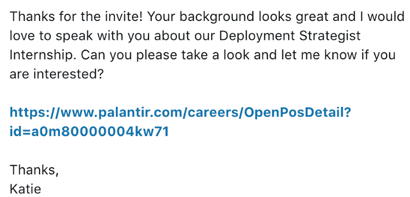

### 我从这次经历中学到了什么

我当时认为我所做的事情非常愚蠢，但我最终从这次经历中学到了很多。

#### 外卖#1

首先，通过这次经历，我意识到 LinkedIn 其实是为了找工作。毕竟，我可以用我的机器人得到一些工作面试。

然后，过了一段时间，我也意识到，添加几千个随机的人并不是使用 LinkedIn 最高效的方式。使用那种方法，你最终会添加很多你不需要添加的人。

所以，在那次经历之后，我改变了我的方法，变得更加专注。

按照我的新方法，我只会添加我想去的公司的招聘人员。然后，我只会给加我回来的人发消息。

事实证明，使用 LinkedIn 是一个更专注、更有效的策略。有了这个新策略，我能够获得多家科技公司的更多面试机会，包括 Yelp 和 Xamarin。这一次，我没有添加成千上万的新连接来达到这个结果？

注意:我在本文的[中更多地谈到了这个策略，以防你对此感到好奇。](https://medium.freecodecamp.org/here-are-4-best-ways-to-apply-for-software-engineer-jobs-and-exactly-how-to-use-them-a644a88b2241)

#### 外卖#2

享受乐趣是磨练编程技能的最佳方式！

通过这个特别的项目，我能够磨练我的 JavaScript 技能。我了解到的情况包括:

*   如何设置功能执行之间的时间间隔
*   如何用 JavaScript 选择某些 HTML 元素
*   如何用 Greasemonkey 在本地存储数据

我通过这个项目学到了这些东西，感觉一点都不像学习，因为太好玩了。

#### 外卖#3

从这次经历中，我明白了有时候做一些奇怪的事情是值得的。所以，如果你有任何这样做的倾向，不要害怕有点淘气和冒险。

即使在这个小实验之后，我仍然继续做一些奇怪的事情来取乐。

例如，当我在微软实习时，我做了一个小实验，我“偷”了一堆员工密码。我通过发送一封钓鱼邮件做到了这一点。这应该是一个巨大的抽奖活动，奖品包括 Xbox 和 Surface 笔记本电脑。那是我的黑客马拉松项目。

我还在 YouTube 上开了一个编程教育频道，并最终决定让 T2 全职工作，并辞去全职软件工程师的工作。

也许所有这些事情对其他人来说都有点奇怪。但是每次我经历这些经历时，我都学到了一些新的东西，并且一路上我获得了很多乐趣。我想说最后一个甚至成就了我的事业。

所以，不要害怕尝试一些奇怪的东西，只是为了好玩！你可能会学到一些有价值的东西。

#### 好了，这篇文章就到这里。

这应该是一篇有趣的文章，但我通常写更严肃的东西。

例如，我有关于[写软件工程师简历的文章](https://medium.freecodecamp.org/heres-the-resume-i-used-to-get-a-job-at-google-as-a-software-engineer-26516526f29a)、[申请软件工程师工作的最佳方法](https://medium.freecodecamp.org/here-are-4-best-ways-to-apply-for-software-engineer-jobs-and-exactly-how-to-use-them-a644a88b2241)、[如何在顶级科技公司找到工作](https://medium.freecodecamp.org/how-to-get-a-software-engineer-job-at-google-and-other-top-tech-companies-efa235a33a6d)。

请随意查看。他们都在这里。

同样，一如既往地，如果你对这个或其他任何事情有任何问题，请随时在下面的评论中或者在 [Instagram](https://www.instagram.com/ykdojo/) 或 [Twitter](https://twitter.com/ykdojo) 上告诉我。

感谢您阅读本文！