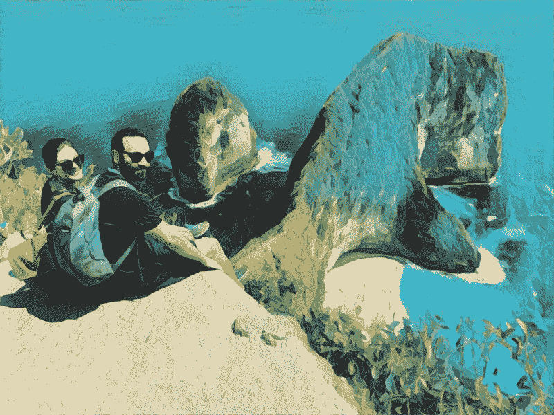

# 作为远程开发者的思考

> 原文：<https://www.freecodecamp.org/news/reflections-on-being-a-remote-developer-757465ed1e9e/>

作者:蒂格兰·哈科比安

# 作为远程开发者的思考

My wife and I in Nusa Penida (Indonesia) a couple of months ago.

### 介绍

打开手机看到 [Buffer](https://buffer.com/) 发来的工作邀约，已经是 2016 年的冬天了。我记得我和妻子坐在一辆优步里，从 JFK 机场开车回家。

从那以后，很多事情都变了。作为一个人和一名工程师，我成长了。在这篇文章中，我公开分享了我作为一名软件工程师在远程工作的旅程中所经历的所有教训和挑战。

### 一些背景

我叫 Tigran，是 Buffer 的一名软件工程师。我也是 Cronhub 的创造者，这是一个帮助开发者监控 cron 任务的工具。过去，我也创建过其他的[副业](https://tigranhakobyan.com/projects)，也写过[的文章](https://blog.cronhub.io/index/)，讲述我一边全职工作一边创建副业的经历。

我在 Twitter 上收到了很多关于我在 Buffer 的经历以及远程工作感觉如何的问题。大多数问题都是关于时间管理、工作和日程安排，以及我每天用来保持高效率的工具。尽管这些都是非常好的问题，但我还是决定后退一点，从头开始分享我的故事——我是何时以及如何开始远程工作的。

我希望分享我经历中所有好的和有挑战性的部分。我知道远程工作文化正在世界范围内迅速发展，所以我希望这对那些考虑远程办公的初学者来说是一个有用的资源。

我老实告诉你，我也是想写这篇文章给自己回顾和反思的。这就是为什么我可能感觉像是在写日记。我希望你不介意那种风格。

### 启动远程作业

有意思的是，我从未想过要去找一份远程工作。在 2016 年 2 月我申请新工作的时候，这并不重要。我住在新泽西州的泽西城，离曼哈顿很近。我知道，如果我在纽约有一份工作，通勤就不是问题(尤其是有声读物)。

然而，当时我最想去的公司是 Buffer。它过去是，现在仍然是一个完全远程的公司，员工遍布世界各地。在加入这个团队之前，我听说并使用了 Buffer，也了解了很多他们的文化。我也非常钦佩 Joel Gascoigne(Buffer 的创始人)，喜欢阅读他的 Buffer 故事和他在博客上分享的所有经验。

我申请了一个后端工程师的职位。对我来说幸运的是，这个职位当时是空缺的，它非常符合我以前从事后端技术和服务的背景。

我知道 Buffer 有很多人申请同一个职位(如果我没弄错的话，我们有大约 1500 人申请这个职位)，所以我的希望很小。但就在申请几周后，我收到了 Leo(Buffer 的联合创始人，现已离职)的一封电子邮件，提出要和我聊聊。他写道，他真的很喜欢我的背景，想在一次通话中更好地了解我。对于这个机会，我非常高兴和激动，而且真的很惊讶——因为，坦率地说，我并不期望收到他们的回复。

在我和 Leo 聊天之后，我开始了面试过程。Buffer 确保加入团队的人都非常合适。因此，除了技术方面，采访还侧重于文化。当我加入 Buffer 时，我必须经历 45 天的新兵训练营。

新兵训练营就像一次约会，你们两个都花时间来判断你们是否适合对方。在新兵训练营，你被认为是一名合同工，直到你成为一名全职员工。然而，这时已经没有新兵训练营了。

正如我所说，我不一定要寻找遥远的机会。碰巧的是，我成为了一名远程工作者，因为我真的很想在 Buffer 工作，我很想探索远程工作能提供什么。

### 远程工作的最初挑战

远程工作和在办公室工作有很大的不同。我认为直到你真正开始变得冷漠，你才会完全理解其中的区别。对于像我这样从未在远程环境中工作过的人来说，开始并不顺利，而且伴随着挑战。最终，我在这些事情上大部分都变得更好了，但是现在回顾和反思我早期的日子是值得的。

我清楚地记得我在 Buffer 的第一天。我醒来，吃了早餐，喝了咖啡，然后带着这个问题开始了我的一天:“那么现在怎么办，我该怎么办？”这是一个合理的问题，真的。没有任何我必须去的办公室，我过去常常把我一天工作的开始与到达办公室联系在一起。有那么一会儿，我感到困惑和孤独。

#### 沟通

在以办公室为基础的环境中，我们如此依赖面对面的交流，以至于不再拥有这种商品感觉真的很奇怪。

远程环境则完全相反，因为它主要基于异步通信。实际上，当前的远程工作空间更多的是同步和异步通信的结合，两者相辅相成。

对于某些任务来说，同步通信更省时。稍后，你开始学习在每种情况下什么时候什么类型的交流更好。

在远程团队中，沟通仍然是一个大问题，但我认为在 Buffer，我们已经在过去几年中找到了良好的平衡。

#### 工作结构

回到我最初的挑战，我面临的最大挑战是对工作如何完成和组织的困惑。当我加入 Buffer 的时候，我被分配了一个角色，我的文化伙伴们在我整个训练营都支持我。有他们在我身边对我帮助很大。我利用一切机会提问，这对我理解工作流程帮助很大。

一开始，我主要是在家工作，以便更有效地管理我的时间。此外，由于噪音和 wifi 信号差，我对在咖啡店进行视频通话感到紧张。Wifi 速度已经成为我流量的一个如此大的部分，以至于我在我的浏览器上标记了 [FAST](https://fast.com/) (网飞开发的一种网络速度测量工具)，并将其移动到所有书签的开头，以便于访问。

在家工作一开始真的很适合我，因为我可以不受干扰地完成很多事情。但最终这让我感到更加孤立。

#### 时机

我一开始面临的另一个挑战是无法将自己从工作中解脱出来。我一直在线。我会在早上 8 点开始一天的工作，晚上 8 点或 9 点左右下班。这并没有持续很长时间，但是长时间的工作确实成了问题。

你必须对你的工作时间非常严格，否则精神疲惫很容易接管。你不想那样。你想设定你的工作时间并坚持下去。

当然，你可以根据自己的生活方式灵活安排工作时间和方式，但时间管理是关键。想想一天中什么时候你最有效率，并据此安排你的一天。

例如，我是一个早起的人，所以我在早上首先做最重要的事情。没有分心和 2 到 3 个小时的专注工作，我可以完成很多事情。我试着把我的电话安排在下午，那时我的精神状态不是很好，但是我仍然可以集中精力和谈话。

稍后我会继续谈论我的日常工作。与此同时，让我们来谈谈在经历了最初的挑战后，我是如何变得更擅长远程工作的。

### 越来越擅长远程工作

远程工作的头几个月对我来说是最具挑战性的。但是在 Buffer 工作很棒，我认为他们帮助我找到了克服这些挑战的方法。

在我的队友的帮助和建议下，以及我的经验教训，我已经变得更擅长远程工作了。我变得更有效率，也找到了自己的位置。

现在当我回顾过去，我认为有几件事真正促成了这一成功:

#### 共同工作

在加入 Buffer 两个月后，我和我的同事 Dan Farrelly 决定在纽约找一个共同工作的地方，在那里我们可以每周通勤几次。我非常兴奋，也很幸运有一位同事和我在同一个地区工作。Dan 现在是 Buffer 的工程总监，他已经成为我最好的朋友，他的建议和帮助让我成为了一名开发人员和远程工作者。

我很幸运地找到了一个也在远程工作的朋友和同事，他在远程环境中有足够的背景来理解我的挑战。我们开始每周一起工作几次，一起吃午饭，讨论各种话题，包括我们在 Buffer 的工作。现在，我们每周在纽约合作 2-3 次，其余时间我们在家工作。

#### 去聚会

找一个可以一起工作的人是保持社交的好方法。我尝试过的另一件非常有用的事情是参加纽约的聚会，讨论我感兴趣的话题。我遇到了志趣相投的人，他们有很多共同之处。

在线社区也很有帮助，你可以加入许多远程工作社区。

#### 致力于时间管理

我开始更好地管理我的时间。每天，我都通过设定具体目标来安排第二天任务的优先顺序。我通常为一天设定 3-4 个任务，通常不会超过这个数字。

优先排序真的帮助我管理时间，也让我更专注于重要的事情。远程工作的棘手之处在于，你可以完全控制自己的时间，而且你必须非常谨慎地对待时间的使用方式和用途。

当然，分心会发生。但是找到提高注意力的方法是高效远程工作的一个关键因素。

#### 升级沟通游戏

我们在缓冲区使用松弛。我过去听说过 Slack，知道它在科技公司中非常受欢迎。我认为这是一个很棒的工具，它对工作场所有很多好处，包括将团队团结在一起。

然而，它侧重于同步通信。对于一些像 Buffer 这样的远程团队来说，异步通信非常重要，它已经成为我们 DNA 和文化的一部分。

我们非常在意队友的时间，所以我们希望以一种至少有一部分可以异步处理的方式来组织我们的交流。

#### 异步工作

我们倾向于异步交流的另一个原因是队友之间的时区差异。我们分布在世界各地，并不总是有可能在接到电话时立即回复您的直接信息。Buffer 也非常支持每个团队成员的生活方式，我们尊重团队中每个人的工作时间。

更好地安排我的时间帮助我更好地进行异步交流。我已经开始更多地依赖于支持异步通信的工具，比如电子邮件或 Dropbox Paper。

#### 保持健康

我开始把关注心理健康作为头等大事。当我压力小的时候，我工作得更好。我很幸运，Buffer 是一个神奇的地方，以各种可能的方式支持心理健康。

我开始在早上锻炼，踢足球，记录我的工作时间，这极大地改善了我的情绪和动力。我不再工作到很晚，并试图每晚睡足 8 小时。

#### 过着我最好的远程生活

我终于开始利用我的远程工作生活方式。我开始有更多的旅行，去缓冲静修和拜访我在亚美尼亚的家人，进行为期一个月的旅行。真的很不可思议，可以灵活地和家人朋友在亚美尼亚度过一个月。

我认为能够在任何地方工作是远程工作最大的优势。今年年初以来，我去了加拿大、墨西哥、巴厘岛和新加坡，一个月后我将飞往亚美尼亚。我们计划将来去更多的目的地。

### 我典型的工作日

人们在 Twitter 上经常问我这个问题，所以我决定用一个单独的部分来写我典型的工作日是什么样子的。

我每天早上 7:05 醒来。我有一个闹钟，但很少需要它。我的身体有自己非常精确的警报。我醒来，做的第一件事就是做我的早餐咖啡，和我的运动前餐一起喝。在夏天，我通常会喝一杯加冰块的浓缩咖啡，这样会让咖啡更提神。

早上 8 点 10 分，我在体育馆锻炼。我已经做了一年的重量训练，严格地遵循[更大更瘦更强壮:建立终极男性身体的简单科学](https://www.amazon.com/Bigger-Leaner-Stronger-Building-Ultimate-ebook/dp/B006XF5BTG)计划来增加肌肉和减少脂肪。这对我来说效果很好，我看到了我的身体和总体健康状况的不同。如果你不确定应该遵循什么锻炼计划，我强烈推荐这本书。这是一本特别适合初学者的好书。我使用 [Strong](http://www.strong.app) 追踪我的锻炼，最近达到了我的第 100 次锻炼。

我在健身房锻炼一个小时，之后，我试着吃富含蛋白质的早餐。通常，它由鸡蛋、农家干酪和一片全麦面包组成。

早饭后，我准备开始一天的工作。我通常由平丹来决定从那天起我们要在哪里工作。我们使用[羊角面包](https://www.getcroissant.com/)来寻找和预订一个合作空间。这是一个很棒的应用程序，在纽约市有许多可用的空间。我们通常坚持住在金融区的，因为它离我们两个都比较近。我挨家挨户去那里需要 12-15 分钟。上午 10-10:30 左右，我在共同工作区。

我通常在下午 6:30 左右完成工作。我一周有几次晚上有足球比赛，所以如果是这样的话，我会尽量早一点回家，在比赛前吃一顿简单的晚餐。踢足球可能是我在宇宙中最喜欢的活动。

我是一个超级足球迷，尽管我妻子不太喜欢我花 140 美元买正版球衣。然而，去年她在伦敦安排了一次与亨里克·姆希塔良的会面，让我大吃一惊。他是我最喜欢的运动员。

除非我精神上非常疲惫，否则我晚上大部分时间都在研究 Cronhub 并试图让它成长。过去，我在[写了几篇关于 Cronhub 的博文](https://blog.cronhub.io/index/)，以及我如何试图将它变成一项在线业务。我很幸运，我的妻子非常支持我，她为我加油。我是兼职收入的忠实信徒，这就是为什么我每天至少花两个小时做我的兼职项目。

如果我很累，我就和妻子一起睡在沙发上看网飞秀。在周末，我大部分时间都在休息，和我的妻子和朋友一起做些事情。周末我会在 Cronhub 上工作，但不经常。我知道剩下的部分有多重要。

### 远程工具

我们使用和依赖的工具在我们的生产力和工作生活中起着巨大的作用。在 Buffer，我们通常以开放的态度尝试我们认为对团队有益的不同工具。

以下是我们在 Buffer 日常使用的一些工具。

*   G 套件 —在 G 套件家族中，我们使用 Gmail 和谷歌日历。我们经常使用电子邮件，这就是为什么我有自动过滤和标签设置，这样我就可以很容易地查看我的收件箱。设置过滤器和标签并不那么有趣，但是花一次时间，然后忘记它是值得的。
*   [Slack](http://slack.com/) —我们将 Slack 用于同步通信和直接消息。我们有通用频道、工程等。我喜欢懈怠，而且我认为在某些情况下它非常有益。
*   [Zoom](https://zoom.us/) —我们使用 Zoom 进行视频通话。我们非常依赖 Zoom，它是将整个团队凝聚在一起的绝佳工具。它很好地处理了许多团队成员的电话，这发生在我们所有人的手中。
*   [收纳盒纸](https://paper.dropbox.com/)——可能是我最喜欢的工具之一。甚至现在我还在用它来写这篇博文的草稿。我们使用纸张进行协作和记笔记。这是我们异步通信的一大部分。
*   [话语](http://www.discourse.com) —我们在团队中使用话语进行公告、晋升或分享一般知识。我喜欢使用话语，我发现它非常直观。

除了这些工具，我还有自己的工具来帮助我提高效率。我是一个快乐的 [Todoist](http://www.todoist.com) 用户，我在那里记录我所有的日常任务，并在完成后查看它们。

我用[救援时间](https://www.rescuetime.com/)跟踪我的工作时间。这是一个很好的工具，可以帮助我了解我是如何度过大部分时间的，以及在哪里度过的。它还监控社交媒体的使用，我正在努力减少社交媒体的使用。

在远程团队中，你通常会创建并分享截屏或截屏，向你的队友展示一些东西。为此，我们使用了 [CloudApp](https://www.getcloudapp.com/) ,这是非常值得的。强烈推荐。

### 寻找远程工作

如果你正在寻找你的第一份远程工作，那么这一小段可能会对你有用。远程工作现在相当流行，许多公司将远程工作作为员工的一种选择。

你可以在完全远程的公司工作，也可以在有办公室但也有远程同事的公司工作。也有自由职业者也可以被认为是远程工作者，但我认为这有点不同。我的经验只是基于在一个完全远程的没有办公室的公司工作。

如果你现在不在偏远地区，但正在考虑切换到偏远地区，这样你就可以旅行或花更多时间与家人在一起，那么有一个好消息:找到偏远地区的机会越来越容易了。该领域正在发展，公司开始意识到走向远程的好处。偏远地区的公司有一个很大的优势，那就是从大量的候选人中招聘人才，因为地点不再重要。

除了 Buffer 之外，我知道有几家公司是完全远程的。他们是[自动控制](https://automattic.com/work-with-us/)、 [GitLab](https://about.gitlab.com/jobs/) 、[视觉](https://www.invisionapp.com/company#jobs)、 [Doist](https://doist.com/jobs/) 和[扎皮尔](https://zapier.com/jobs/)。

你可以随时去他们的职业页面看看他们是否有空缺的工作机会。另一个值得考虑的资源是[remove](https://remotive.io/)。Remotive 是一个帮助你找到远程工作的社区。如果您已经有了一份远程工作，那么您可以与其他远程工作人员联系，获得提示，或者就任何话题展开讨论。另一个很棒的网站是[远程 OK](https://remoteok.io/) ，它更专注于帮助你找到远程工作。

### 远程与非远程

在加入 Buffer 并在一家完全远程的公司工作之前，我曾在一些基于办公室的公司工作。当我在罗切斯特理工学院攻读硕士学位时，我在参数技术公司实习了 7 个月，在 Twitter 实习了 3 个月。毕业后，我加入了 YCharts，并在那里呆了一年。我经历过远程工作和办公室工作。我认为两种工作空间都有取舍。

在远程工作中，你不受地点的限制，所以你可以住在一个便宜的地方，赚足够的钱过上好日子。事实上，我有几个 Twitter 上的朋友，他们目前住在巴厘岛，在一家偏远的公司工作，或者试图开创自己的事业。与我在纽约市的花费相比，他们的花费是相当低的。几个月前，当我在巴厘岛的一个合作空间时，我看到许多数字游牧者在那里生活和工作。游牧现在感觉像一场运动。

远程工作时，您还可以选择自己的工作时间。因此，如果你有一个家庭，你可以在家工作，花更多的时间和他们在一起。然而，你必须是一个自我激励的人，渴望大多数时间保持专注。

孤独也是一个问题，所以寻找不同的方式来保持社交是有帮助的。当然也要看你的性格。

在基于办公室的工作中，你被束缚在一个特定的位置。你必须通勤上班，这有时会花很多时间。但我认为，当你们都在同一个空间时，面对面地与同事发展个人关系会更容易一些。

在 Buffer，我们有一年一度的务虚会，整个团队会聚在一起一周。这可能是我一年中最喜欢的时光之一，因为我可以见到我的同事，和他们在一起。这非常重要，因为它让我们走到一起，帮助我们发展更好的关系。

### 结论

总而言之，作为一名开发人员，远程工作近 3 年对我来说是一段不可思议的旅程。充满专业学习、旅行、联系和新经历的几年。这种反映完全是基于我自己的经验，所以它可能与其他远程工作的人不同。

我经常被问到——但我还没有答案——我是否会回到非远程状态。我也不好说，因为真的要看机会。我喜欢我的生活方式和自由，但它可能会在未来改变。

现在，我正专注于我在 Buffer 的工作，并将 Cronhub 作为副业发展。我的最终目标是经济独立，这样我就可以把精力花在我真正关心的事情上。它成了指引我前进，给我动力的北极星。我看到了实现这个目标的途径，我正在尽我最大的努力。

如果你是远程工作的新手或者正在寻找，请随时向我提出你的问题。我总是乐于帮助和分享更多。

如果你喜欢我的作品，那么你可能想[订阅我的个人时事通讯](http://eepurl.com/dBe2lf)，这样当我写新文章时，我会给你发电子邮件。我计划至少每个月做一次。感谢阅读。

如果你想打招呼，我也活跃在 Twitter 上。