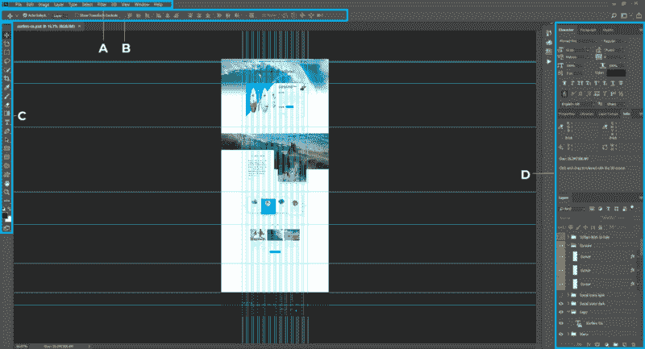
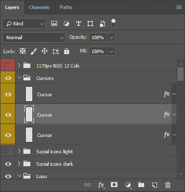
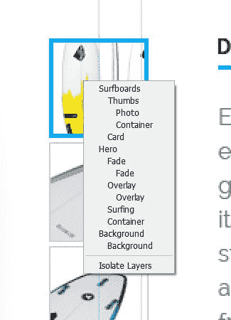
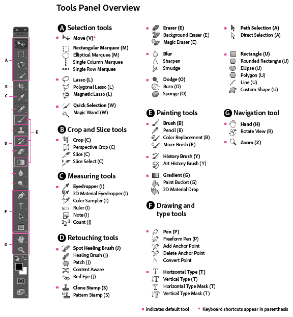
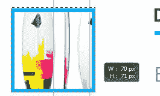
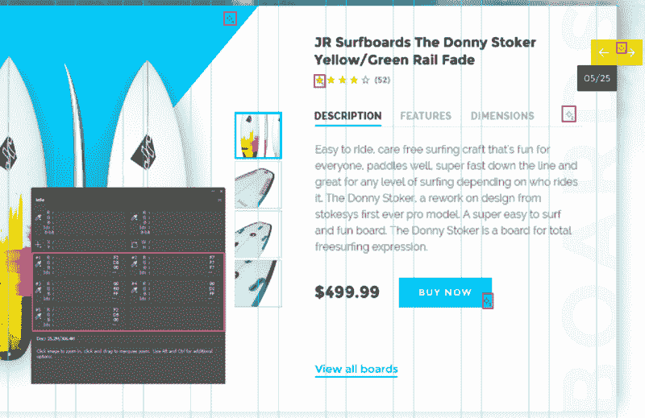
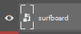
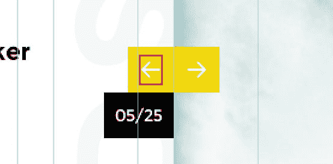

# Photoshop 101:网络开发者入门

> 原文：<https://www.freecodecamp.org/news/photoshop-101-introduction-for-web-developers-62d55232e62b/>

### 介绍

通常，当作为 web 开发人员工作时，我们需要集成模板。它们可以来自 Photoshop 或其他软件。在这篇文章中，我们将为 web 开发人员介绍 Photoshop 的基础知识。

这些内容最初是为伦敦 DAMDigital】的一个研讨会编写的。

Adobe Photoshop 是一个光栅图形编辑器软件，这意味着它是一个允许用户创建和编辑图像的程序。

Image [source](https://www.adobe.com/products/photoshop.html#hero-featured-video)

它于 1988 年发布，现已成为图形软件的行业标准。

你可以在 Adobe 网站上下载 Photoshop 的免费试用版。

### 工作空间

Photoshop 的工作空间是模块化的，所以你可以根据你正在做的工作来调整它。Photoshop 中已经设置了一些默认工作空间。在本文中，我使用的是`Graphic and Web`这个。要切换到此工作区，请进入`Window/workspace/Graphic and Web`。

让我们看看我们的工作空间:

Photoshop

*   菜单栏:这是你可以找到大多数 photoshop 选项的地方。
*   **B——选项栏**:该选项栏将为您提供当前所选工具的所有选项。
*   **C —工具箱**:这个面板包含了 photoshop 中所有可用的工具。相关的工具被分组在一起，你可以长时间点击其中一个来查看所有的工具。
*   **D —面板**:是你打开基本面板的区域，比如`Layers`、`History`等等。要打开面板，只需进入`Window/(Panel that you want to open)`

### 创建新文件

在 Photoshop 中创建一个新文件时，你首先需要知道该设计将用于什么媒体——也就是说，它是用于屏幕(网页、电影或视频)还是用于打印？

根据这个问题的答案，您将需要更改 PPI(每英寸像素)值。

> 每英寸像素(PPI)是一种用于定义计算机显示器分辨率的度量标准。此指标评估特定计算或输出显示设备能够显示的图片/图像质量。每英寸像素数也称为像素密度。 [Techopedia](https://www.techopedia.com/definition/2741/pixels-per-inch-ppi)

对于打印，您通常需要 300PPI，但这实际上取决于打印机和打印文档的大小。你也应该把你的颜色转换成 CMYK，但是这同样取决于你如何打印你的文档。如果你想了解更多关于 RGB 和 CMYK 颜色的知识，请查看这篇文章。

用于屏幕和网络？，您需要 72PPI 和 RGB 颜色。然后你需要指定你的屏幕尺寸。我建议首先为移动设备设计，然后是平板电脑和台式机。

作为 web 开发人员，您可能不需要创建新文件。你可能需要使用网页设计师提供的设计。

我们现在将查看现有的`.psd`模板，并使用它来浏览 Photoshop。

你可以从[路易斯·科斯塔](http://lucaal.co/)下载并打开这个 [PSD 模板](https://shibbythemes.com/psd-freebies/surfersco-psd-template/)。

### 层

Photoshop 的核心功能之一就是**图层**。图层就像一叠纸张，您可以透过透明区域或低不透明度区域(部分透明)进行查看。

您可以在`Window/Layers`中打开图层面板。

此面板中的顶层将被放置在下面的所有其他层之上。图层也可以在文件夹中进行组织。正确命名层和文件夹非常重要。这将有助于整合。

在每个文件夹和层旁边，都有一个眼睛图标。这允许您切换它们的可见性。

你的 PSD 可能有很多层和文档。快速找到图层的一种方法是选择`move tool (v)`。右键单击画布上你想找到你的层。你将得到你右击的区域中的所有层。通过点击一个，它会在你的图层面板中选择这个图层。

### 工具箱

Photoshop 附带了很多工具。我给你看几个有用的，对你有帮助的？。

首先，如果你只是安装 Photoshop CC 2018，你将需要恢复所有的工具。因此，转到`Edit > Tool`栏，点击恢复默认值按钮。

[*Image from Adobe*](https://helpx.adobe.com/photoshop/using/tools.html "https://helpx.adobe.com/photoshop/using/tools.html")

我们将看到一些用于集成模板的最有用的工具:

#### A —选择工具

*   **移动**:允许用户在画布上移动一层。正如我们前面看到的，如果你右击你的画布，它也可以用来查找一个层。
*   **矩形选框**:该工具用于选择画布的一个区域进行复制粘贴、填充等操作。它也可以用来测量。选择完成后，您可以在`Window/Info`中找到所选区域的大小。您可能需要在 photoshop `Edit/preferences/general/Unit & Rulers`中更改默认单位，然后将单位设置为像素。

#### b-裁剪和切片工具

*   **裁剪**:这个工具可以……裁剪图像？。在工具设置(选项栏)中，您可以设置想要保持的纵横比。

#### C —测量工具

*   **滴管**:滴管可以让你在设计中快速得到一个颜色参考。只需点击你想要的颜色。然后在你的工具箱底部，前景色会变成选中的颜色。如果你点击前景色，它将打开`color picker window`。从那里你可以得到你的颜色的价值。
*   **颜色取样器**:当整合你的设计时，你可能需要选择多种颜色。我们将再次使用信息窗口`Window/Info`。这个工具允许我们创建一个颜色采样器。只需点击你想获取颜色的图像区域。你将在信息面板中得到每种颜色。您可以通过单击数字下方的滴管图标将颜色类型更改为 web。

*   **尺子**:帮助你测量你的模板。所有信息将出现在你的信息窗口。测量时保持`Shift`,这样你的尺子就能保持笔直。你也可以得到角度。

#### g-导航工具

*   **手**:这个工具帮助你在画布上四处游走。您可以通过按住空格键并用鼠标拖动来随时访问该工具。
*   **缩放**:可以放大缩小(可以`Ctrl` + `+`，也可以`Ctrl` + `-`)。

### 指导

正如你可能已经注意到的，当打开我们的 PSD 文件时，我们的模板上有一些绿线。他们是向导。它们基本上是帮助你在画布上构建或测量事物的助手。

您可以使用`move tool` (v)移动现有的导轨。

要创建新的参考线，您需要打开标尺:`View/Ruler`或`Ctrl` + `R`。标尺将出现在您的工作区中。然后，您可以从标尺中拖动一个新的向导到画布中。

要移除导轨，使用`move tool` (v)并将导轨放回标尺中。

要隐藏和显示您的所有指南，您只需使用`Ctrl` + `H`，或者转到`View/Extras`。

### 智能对象

什么是智能对象？

> 智能对象是包含来自光栅或矢量图像的图像数据的层，例如 Photoshop 或 Illustrator 文件。智能对象保留图像的源内容及其所有原始特征，使您能够对图层执行非破坏性编辑。 [土坯](https://helpx.adobe.com/photoshop/using/create-smart-objects.html)

当智能对象的缩略图中有以下图标时，可以在图层中识别智能对象:

如果您处理矢量类型的图像(SVG、EPS、AI ),智能对象确实很方便，但对于其他复杂的光栅文件也很有用。

让我们尝试导入一个智能对象到我们的 PSD。从 [flaticon](https://www.flaticon.com/free-icon/surfboard_930944#term=surf&page=1&position=10) 下载一个 SVG 文件。要在画布中导入我们的 SVG，只需将文件拖到画布中。我们现在可以在 illustrator 或任何其他矢量软件中编辑我们的 SVG，方法是双击缩略图或我们的智能对象。变化将出现在我们的 PSD。

然而，智能物体能做的远不止这些。如果你想了解更多关于它们的知识，请查看 Photoshop 中关于智能对象你需要知道的 10 件事。

### 出口资产

首先，提醒一下，photoshop 是一个光栅软件，而不是 T2 矢量软件。这意味着我们“不能”从 photoshop 中导出 SVG 文件。为此，例如，您需要从 Illustrator 或 Inkscape 中导出这些类型的文件。

在网络上，我们希望有浅色的图像文件。对于摄影，我们将使用压缩的`.jpg`文件。如果你需要使用透明度(阿尔法通道),我们将使用`.png`文件。对于动画图像，我们将使用`.gif`。如果你需要一个矢量图像(例如图标)，最好是将你的文件导出为`.svg`。如果你想了解 Photoshop 中所有可用文件的更多信息，你可以在 Adobe 网站查看[“文件格式”。](https://helpx.adobe.com/photoshop/using/file-formats.html)

#### 导出我们的画布

要导出画布，只需遵循以下步骤:

1.  转到`File/Export/Save for Web`
2.  选择文件格式
3.  选择图像大小
4.  挑选质量
5.  救援

#### 仅从画布中导出资源

您可能需要导出模板的一些资产。

让我们导出产品传送带中的左箭头:

使用移动工具，我们将找到我们的层。右键点击箭头，选择图层`Arrow Left`。现在只需在图层面板中右键单击该图层。选择`export as`并选择您需要的文件类型。

我们还可以导出文件夹。

### 行动

Photoshop 里的一个动作是什么？

> *动作是在单个文件或一批文件上回放的一系列任务——菜单命令、面板选项、工具动作等等。例如，您可以创建一个动作来更改图像的大小，对图像应用效果，然后以所需的格式存储文件。* [土坯](https://helpx.adobe.com/photoshop/using/actions-actions-panel.html)

如果你想为网页调整一批图片的大小，这个特性真的很方便！

让我们创建一个新动作来裁剪图像并导出此图像:

1.  从 https://unsplash.com/下载一堆图片
2.  打开其中一张图片
3.  打开`Actions`面板，`Window/Actions`，
4.  点击图标**创建一个新动作**创建一个新动作(bin 图标左边的那个)。让我们将这个操作命名为 **Export for web — client name。**
5.  我们现在正在记录我们的行动。录制按钮将为红色，您可以通过单击停止图标(左侧的方形图标)来停止录制/
6.  选择裁剪图标，并将比率设置为 1x1，然后裁剪图像/
7.  现在我们要导出我们的图像，`File/Export/Save for Web`，选择`JPG`，质量 50%，宽度 500 像素。
8.  单击保存并选择您的目标文件夹。
9.  关闭图像，但不保存。
10.  要停止录制，请单击停止图标(左侧的方形图标)。

我们现在有了我们的动作，所以我们可以打开一个图像，只需通过单击 play 按钮来“播放”我们的动作。

如果我们想将我们的操作应用于一批图像，只需遵循以下步骤:

1.  转到`File/Automate/Batch`
2.  选择`Source`文件夹。
3.  选择我们的行动
4.  点击`Ok`

瞧！您的所有图像都在导出文件夹中。

我希望你已经喜欢这个为网页开发者准备的 Photoshop 101 小介绍？。如果你想有一个 102 版本，让我知道你想知道或阅读更多关于？。

*   [Vincent-humau . com](http://vincent-humeau.com/)