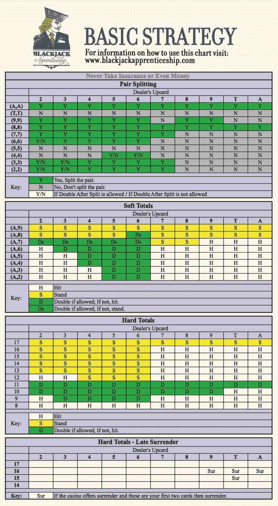
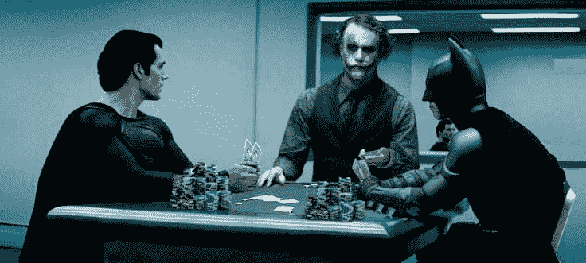

# 我用编程来弄清楚算牌到底是如何工作的

> 原文：<https://www.freecodecamp.org/news/i-used-programming-to-figure-out-how-card-counting-really-works-7ecefdb1b8d4/>

作者:马尔钦·莫斯卡拉

# 我用编程来弄清楚算牌到底是如何工作的


年轻的时候，我喜欢电影 [21](https://en.wikipedia.org/wiki/21_(2008_film)) 。伟大的故事，演技，显然这内心的梦想赢得巨大的，击败赌场。我从未学过算牌，也从未玩过 21 点。但我总是想核实一下这种算牌是真的，还是只是赌场因为赚大钱和有大梦想而在网上设置的诱饵。

今天我是程序员。由于我在研讨会准备和项目开发之间有一些额外的时间，我决定最终揭示真相。所以我写了一个模拟算牌游戏的最小程序。

我是怎么做的，结果如何？让我们看看。


### 模型

这应该是一个最小的实现。小到我甚至没有引入卡的概念。卡由它们评估的点数来表示。例如，a 是 11 或 1。

deck 是一个整数列表，我们可以如下所示生成它。读作“四个 10，数字从 2 到 9 和单个 11，一切 4 次”:

```
fun generateDeck(): List<Int> = (List(4) { 10 } + (2..9) + 11) * 4
```

我们定义下面的函数，让我们乘以`List`的内容:

```
private operator fun <E> List<E>.times(num: Int) = (1..num).flatMap { this }
```

在大多数赌场中，庄家的牌不过是 6 副洗牌的牌:

```
fun generateDealerDeck() = (generateDeck() * 6).shuffled() 
```

### 卡片计数

不同的算牌技巧提示了不同的算牌方法。我们将使用最流行的一种方法，当牌小于 7 时，该方法将牌评估为 1，10 和 a 为-1，否则为 0。

这是这些规则的[科特林](https://kotlinlang.org/)实现:

```
fun cardValue(card: Int) = when (card) {
    in 2..6 -> 1
    10, 11 -> -1
    else -> 0
}
```

我们需要清点所有用过的卡片。在大多数赌场，我们可以看到所有使用过的牌。

在我们的实现中，对我们来说，从剩下的牌中计数点数并从 0 中减去这个数会更容易。所以实现可以是`0 — this.sumBy { card -> cardValue(card` ) }，这是一个等价的`of -this.sumBy { cardValue(it` ) } `o*r -su*mBy(::cardVal` ue)。这是所有用过的卡的积分总和。

我们感兴趣的是所谓的“真实点数”，即计算出来的点数除以剩下的牌数。通常玩家需要估计这个数字。

在我们的实现中，我们可以使用一个更精确的数字，并以这种方式计算`trueCount`:

```
fun List<Int>.trueCount(): Int = -sumBy(::cardValue) * 52 / size 
```

#### 下注策略

玩家总是要在游戏前决定他们要下多少钱。基于[这篇文章](http://www.instructables.com/id/Card-Counting-and-Ranging-Bet-Sizes/)，我决定使用玩家计算他们的下注单位的规则——等于他们剩余资金的 1/1000。然后，他们将赌注计算为一个下注单位乘以真实计数减 1。我还发现赌注需要在 25 到 1000 之间。

下面是函数:

```
fun getBetSize(trueCount: Int, bankroll: Double): Double {
    val bettingUnit = bankroll / 1000
    return (bettingUnit * (trueCount - 1)).coerceIn(25.0, 1000.0)
}
```

#### 下一步做什么？

我们的球员还有最后一个决定。在每一个游戏中，玩家需要做一些动作。为了做出决定，玩家需要根据他们手中的牌和庄家的可见牌来做出决定。

我们需要以某种方式代表玩家和庄家的手。从数学的角度来看，手牌无非是一串牌。从玩家的角度来看，它由点数、未使用的 a 数(如果可以拆分)以及是否是 21 点来表示。从优化的角度来看，我更喜欢一次性计算所有这些属性并重用这些值，因为它们会被反复检查。

所以我这样代表这只手:

```
class Hand private constructor(val cards: List<Int>) {
    val points = cards.sum()
    val unusedAces = cards.count { it == 11 }
    val canSplit = cards.size == 2 && cards[0] == cards[1]
    val blackjack get() = cards.size == 2 && points == 21
}
```

#### 发球得分

这个函数有一个缺陷:如果我们传递了 21，而我们还有一个未使用的 Ace 怎么办？只要可能，我们需要将 Ace 从 11 改为 1。但是这应该在哪里进行呢？这可以在构造函数中完成，但是如果有人将牌 11 和 11 的手牌设置为有牌 11 和 1，这将是非常误导人的。

这种行为应该在工厂方法中完成。经过一番考虑后，我是这样实现的(还实现了加号运算符):

```
class Hand private constructor(val cards: List<Int>) {
    val points = cards.sum()
    val unusedAces = cards.count { it == 11 }
    val canSplit = cards.size == 2 && cards[0] == cards[1]
    val blackjack get() = cards.size == 2 && points == 21

    operator fun plus(card: Int) = Hand.fromCards(cards + card)

    companion object {
        fun fromCards(cards: List<Int>): Hand {
            var hand = Hand(cards)
            while (hand.unusedAces >= 1 && hand.points > 21) {
                hand = Hand(hand.cards - 11 + 1)
            }
            return hand
        }
    }
}
```

可能的决策表示为枚举( [enum](https://en.wikipedia.org/wiki/Enumerated_type) ):

```
enum class Decision { STAND, DOUBLE, HIT, SPLIT, SURRENDER } 
```

实现玩家决策功能的时间。有很多策略可以解决这个问题。

我决定用[这个](https://www.blackjackapprenticeship.com/blackjack-strategy-charts/):



我用下面的函数实现了它。我假设赌场不允许盖牌:

```
fun decide(hand: Hand, casinoCard: Int, firstTurn: Boolean): Decision = when {
    firstTurn && hand.canSplit && hand.cards[0] == 11 -> SPLIT
    firstTurn && hand.canSplit && hand.cards[0] == 9 && casinoCard !in listOf(7, 10, 11) -> SPLIT
    firstTurn && hand.canSplit && hand.cards[0] == 8 -> SPLIT
    firstTurn && hand.canSplit && hand.cards[0] == 7 && casinoCard <= 7 -> SPLIT
    firstTurn && hand.canSplit && hand.cards[0] == 6 && casinoCard <= 6 -> SPLIT
    firstTurn && hand.canSplit && hand.cards[0] == 4 && casinoCard in 5..6 -> SPLIT
    firstTurn && hand.canSplit && hand.cards[0] in 2..3 && casinoCard <= 7 -> SPLIT
    hand.unusedAces >= 1 && hand.points >= 19 -> STAND
    hand.unusedAces >= 1 && hand.points == 18 && casinoCard < 9 -> STAND
    hand.points > 16 -> STAND
    hand.points > 12 && casinoCard < 4 -> STAND
    hand.points > 11 && casinoCard in 4..6 -> STAND
    hand.unusedAces >= 1 && casinoCard in 2..6 && hand.points >= 18 -> if (firstTurn) DOUBLE else STAND
    hand.unusedAces >= 1 && casinoCard == 3 && hand.points >= 17 -> if (firstTurn) DOUBLE else HIT
    hand.unusedAces >= 1 && casinoCard == 4 && hand.points >= 15 -> if (firstTurn) DOUBLE else HIT
    hand.unusedAces >= 1 && casinoCard in 5..6 -> if (firstTurn) DOUBLE else HIT
    hand.points == 11 -> if (firstTurn) DOUBLE else HIT
    hand.points == 10 && casinoCard < 10 -> if (firstTurn) DOUBLE else HIT
    hand.points == 9 && casinoCard in 3..6 -> if (firstTurn) DOUBLE else HIT
    else -> HIT
}
```


#### 让我们来玩吧！

我们现在只需要一个游戏模拟。游戏中会发生什么？首先，取牌并洗牌。

让我们将它们表示为一个可变列表:

```
val cards = generateDealerDeck().toMutableList() 
```

我们需要为它使用`pop`函数:

```
fun <T> MutableList<T>.pop(): T = removeAt(lastIndex)
fun <T> MutableList<T>.pop(num: Int): List<T> = (1..num).map { pop() }
```

我们还需要知道我们有多少钱:

```
var bankroll = initialMoney
```

然后我们迭代玩，直到……直到什么时候？根据[这个论坛](https://www.blackjackinfo.com/community/threads/how-often-does-the-dealer-shuffle.7459/)的说法，正常情况下是直到 75%的卡被使用。然后洗牌，所以我们基本上从头开始。

所以我们可以这样实现它:

```
val shufflePoint = cards.size * 0.25
while (cards.size > shufflePoint) {
```

游戏开始。赌场接受单卡:

```
val casinoCard = cards.pop()
```

其他玩家也拿卡。这些是烧录卡，但是我们稍后会烧录它们，让玩家在计算点数时也能使用它们(现在烧录会给玩家一些在这一点上不可访问的信息)。

我们也拿一张卡，然后做决定。问题是，我们开始时是单人游戏，但我们可以分牌，并作为 2 名玩家参加。

因此，最好将游戏表现为一个递归过程:

```
fun playFrom(playerHand: Hand, bet: Double, firstTurn: Boolean): List<Pair<Double, Hand>> =
        when (decide(playerHand, casinoCard, firstTurn)) {
            STAND -> listOf(bet to playerHand)
            DOUBLE -> playFrom(playerHand + cards.pop(), bet * 2, false)
            HIT -> playFrom(playerHand + cards.pop(), bet, false)
            SPLIT -> playerHand.cards.flatMap {
                val newCards = listOf(it, cards.pop())
                val newHand = Hand.fromCards(newCards)
                playFrom(newHand, bet, false)
            }
            SURRENDER -> emptyList()
        }
```

如果我们不拆分，返回值永远是单注和最后一手牌。

如果我们分开，将返回两个赌注和手牌的列表。如果我们折叠，则返回一个空列表。

我们应该这样启动该功能:

```
val betsAndHands = playFrom(
        playerHand = Hand.fromCards(cards.pop(2)),
        bet = getBetSize(cards.trueCount(), bankroll),
        firstTurn = true
)
```

之后，赌场庄家需要玩他们的游戏。这就简单多了，因为他们只有在少于 17 点的时候才能得到一张新卡。否则他持有。

```
var casinoHand = Hand.fromCards(listOf(casinoCard, cards.pop()))
while (casinoHand.points < 17) {
    casinoHand += cards.pop()
}
```

然后我们需要比较我们的结果。

我们需要对每手牌分别进行:

```
for ((bet, playerHand) in betsAndHands) {
    when {
        playerHand.blackjack -> bankroll += bet * if (casinoHand.blackjack) 1.0 else 1.5
        playerHand.points > 21 -> bankroll -= bet
        casinoHand.points > 21 -> bankroll += bet
        casinoHand.points > playerHand.points -> bankroll -= bet
        casinoHand.points < playerHand.points -> bankroll += bet
        else -> bankroll -= bet
    }
}
```

我们终于可以烧一些其他玩家用过的卡了。假设我们和另外两个人一起玩，他们平均每人用 3 张牌:

```
cards.pop(6)
```

就是这样！这样，模拟将播放整个庄家的牌，然后停止。

这时，我们可以看看我们的钱是比以前多了还是少了:

```
val differenceInBankroll = bankroll - initialMoney
return differenceInBankroll
```

模拟速度非常快。你可以在几秒钟内进行数千次模拟。这样你可以很容易地计算出平均结果:

```
(1..10000).map { simulate() }.average().let(::print)
```

从这个算法开始，玩得开心。在这里，您可以在线玩代码:

[**二十一点**](https://try.kotlinlang.org/#/UserProjects/l7skht95bhqsih73fag4bl623v/ljsmfeic0savbgva6qa6nocjb0)
[*科特林在浏览器中右键。*try.kotlinlang.org](https://try.kotlinlang.org/#/UserProjects/l7skht95bhqsih73fag4bl623v/ljsmfeic0savbgva6qa6nocjb0)

### 结果

可悲的是我的模拟玩家还是赔钱。比一个标准球员少得多，但是这个计数并没有足够的帮助。也许我错过了什么。这不是我的专业。

如果我错了，请纠正我；)目前，这整个算牌看起来像是一个巨大的骗局。可能这个网站只是呈现了一个不好的算法。虽然这是我发现的最流行的算法！

这些结果可能解释了为什么尽管已知的算牌技术已经存在了很多年，而且所有这些电影都被制作出来了(比如 21)，世界各地的赌场仍然如此愉快地提供 21 点。

我相信他们知道(也许数学上已经证明了)在赌场赢的唯一方法就是根本不玩。就像几乎所有其他冒险游戏一样。



### 关于作者

[Marcin moska za](http://marcinmoskala.com/)([@ Marcin moskala](https://twitter.com/marcinmoskala))是一名培训师兼顾问，目前专注于在 Android 和高级 Kotlin 工作坊中给予 kot Lin([联系表格申请你的团队](https://marcinmoskala.typeform.com/to/iwKnN9))。他还是一名演讲者，撰写了关于 kot Lin Android 开发的文章和书籍。