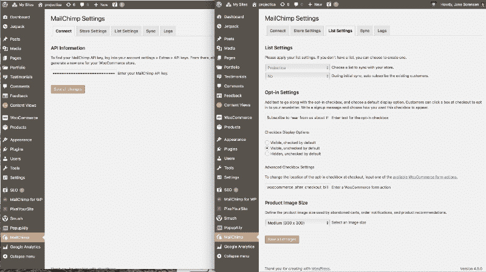
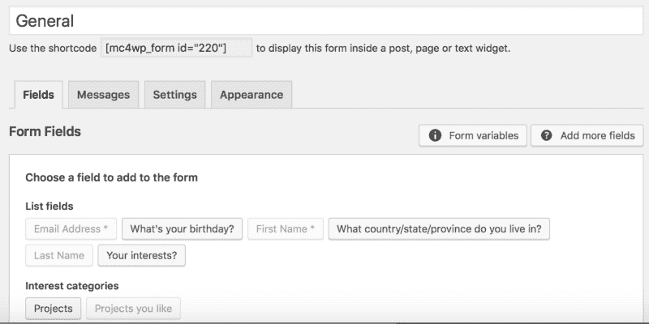

# 如何营销你的新项目:整合设计，创建一个登陆页面，并“获得”你的用户

> 原文：<https://www.freecodecamp.org/news/how-to-market-your-new-project-incorporate-design-create-a-landing-page-and-get-your-users-97812fd9dd4d/>

简·索伦森

# 如何营销你的新项目:整合设计，创建一个登陆页面，并“获得”你的用户

Photo by [William Iven](https://unsplash.com/photos/gcsNOsPEXfs?utm_source=unsplash&utm_medium=referral&utm_content=creditCopyText) on [Unsplash](https://unsplash.com/search/photos/marketing?utm_source=unsplash&utm_medium=referral&utm_content=creditCopyText)

你好。？？

假设你和我都是营销新手。我将假设两件事可能会帮助你更好地与营销你的作品的旅程联系起来，以及现在就开始的重要性。

首先，你在学习新技能——你总是在学习！—为了:

*   更好地与你领域和环境中的其他人联系
*   对雇主和合作者更有用，以及
*   建立你自己的想法，因为，当然，它们很酷。

第二，你更喜欢在幕后做好工作。你有你辉煌的时刻，当它们被注意到的时候，你喜欢它。但是，在很大程度上，你更喜欢制作东西，而不是刻意去炫耀，有些东西会让你不舒服。足够谦虚和处理事情的能力是你希望别人注意到你的两个品质。但是你必须先引起别人的注意…

因此，我的制作同事们，我要告诉你们我学到的关于为人们创造产品或服务的事情，吸引他们注意的登陆页面，基本的内容营销，以及拥有电子邮件列表的基本知识。这是目录:

1.  设计你的产品或服务为你的用户服务
2.  在开发的同时，传达你所提供的内容
3.  为什么电子邮件营销并不总是糟糕——它是必要的
4.  将邮件列表与你的网站整合
5.  登录页面—它们是关于什么的
6.  我们来谈谈重写…
7.  你应该有多少个登陆页面？和分析…
8.  选择加入的人？给他们发一个“谢谢”
9.  当免费对他们来说毫无意义，对你来说是一种负担时(以及如何应对)
10.  多个产品需要不同的列表组
11.  您将在随附的视频中看到的内容

### 设计你的产品或服务来服务你的用户(以及你的创造力)

你很可能会根据你确定的需求和你能做的有趣的事情来设计一个想法。现在你想让它适合其他人。没关系。记住:无论人们会被什么吸引，它都将符合以下三个标准中的至少一个:

1.  客户在从状态 A 到状态 A’或状态 b 的过程中经历了**痛苦**。有一个障碍或缺口，他们无法自己解决。
2.  客户正在以一种普遍的、习惯性的或变通的方式绕过障碍或缺口。但是由于低效率、额外的步骤、美学和批准，这里有令人沮丧的地方。这是一些他们希望不是它的一部分，或者更清楚，更容易，更快的事情。
3.  顾客对身份、货币、安全、爱情、美丽、地位、和谐、自我表达、自我实现或实现梦想有着强烈的欲望。

弄清楚你想用你的想法回应什么，然后出去问人们关于这个事情的问题。如果你从自己的头脑中走出来，试着去听听别人脑子里在想什么，你会想出一些啊哈时刻，这将在两个方面帮助你:

1.  您可以将它设计到您的产品或服务中，以更好地响应他们的实际需求，或者
2.  你可以针对这一确切需求进行沟通，并展示你的产品将如何帮助他们。

你正在做的研究、设计和沟通是你的**价值主张** *。*你的产品/项目的特性与你的价值主张相对应，但是随着你工作的发展，你的特性也会随之发展。

### 在开发的同时，传达你所提供的内容

太多的人等到产品完成或接近完成时，才开始谈论它。为什么？

他们不想让人觉得他们是骗子，或者不可靠。他们害怕竞争中的轻视(这种轻视往往来自质问者，而不是真正的竞争对手)。但是正如在 [Traction](https://www.goodreads.com/book/show/22091581-traction) 中解释的那样，有许多不同的方式来接触你的客户，其中只有一部分是在线的。在开发产品的同时，你需要开始开发你的销售渠道，你的沟通渠道。当你的产品准备好的时候，你的观众也应该准备好了。

你可能会提供一个应用程序，一个软件，一个代码扩展，或者包装在一个漂亮的基于代码的包装器中的内容。这让我们谈到了登陆页面和可怕的电子邮件营销。

### 为什么电子邮件营销并不总是糟糕——它是必要的

我花了几年时间抵制营销。

甚至在社交媒体出现之前(可能是加拿大人)，我来自一个初级制作人的背景，与营销无关，我觉得自我推销和销售是不体面的。如果营销和销售是微妙的、性感的、有效的，那么它显然是专为才华横溢和美丽的人准备的，完全遥不可及(“全有或全无”的思维)。

我得到了惨痛的教训:

1.  你的朋友和网络——即使他们爱你——对你的客户来说也不是一个有用的渠道。他们甚至可能没有你的客户作为他们网络或受众的一部分。别管你认识的人。去找你想服务的人吧。(不管是幸运还是不幸，两者都在社交媒体上——如果你也是，你就有被分散注意力或误导的风险。)
2.  别人让你烦恼的事情，或者你自己害怕做的事情，可能是你应该做的事情。做别人做的事，但如果你是目标受众，用一种不会让你生气的方式去做。
3.  如果没人知道你的业务、服务或产品，你就没有业务或职业，你只有爱好。所以不要退缩，开始营销吧。

在过去的一年里，我逐渐收回并退出了所有不符合我兴趣的社交媒体。如果它不能给你带来改善生活的线索，那它对你就没用。如果它耗费了你的时间、冷静或社会资本，它就会对你不利。我日常习惯中打开的窗口让我重新关注我的电子邮箱。

在这两者之间，我开始更好地完成我的工作。电子邮件仍然是完成工作的重要渠道，我已经在电子邮件方面“打电话联系”了很长时间。

老实说，滥用营销策略和电子邮件数量(你好，GDPR 的一个好理由！)是让我如此不擅长处理电子邮件的原因。打开你的电子邮件，发现除了你不需要的信息和通知之外什么也没有，你不得不关掉它们或取消订阅，这降低了使用电子邮件的质量。

这让你对它的关注变得松懈。它还会把真正需要的东西藏在你的收件箱里——结果，我在派对上迟到了。信息的数量和质量以及迷失在线程、链和叉中可能是许多企业转向 Slack 进行沟通的原因。

尽管如此，还是有一些我喜欢收到的电子邮件。当我在周日晚上坐下来阅读和“处理”它们时，我会分享我所阅读的文章中的垃圾。(同样，如果我喜欢某个我试过的工具，因为它帮助我完成了某件事，我会把它发在推特上。)

电子邮件营销比其他社交渠道有更高的投资回报率。与其他社交渠道不同，**你拥有与他们的联系**。你有没有注意到脸书和 LinkedIn 的联系人列表会保护联系人，这样交流就可以在同一个平台上进行？如果这是你与他们联系的唯一方式，那么这个人并不真正在你的人际网络中。相反，你只是网络的一部分。当你有他们的电子邮件或电话号码，他们是。

了解你的客户并让他们了解你的另一个好处是，电子邮件是相对私密的交流方式(不包括任何密件抄送或隐私滥用)。电子邮件不会受到社交媒体上的朋友的观察，他们可能会关注支持票、反对票和互动。电子邮件不受那些提升你的 回复和知名度及优先级的算法的影响，这取决于关系之外有多少人认为你是否重要。

为此，电子邮件是令人耳目一新的老式和良好的行为。事实是:如果你放入邮箱的人让自己成为了好客人，欢迎他们继续成为你的客人。他们甚至可能成为你喜欢、尊重、分享和购买的“朋友”。

自从对电子邮件营销有了更多的了解之后，在 CASL 和 GDPR 的鼓励下，我现在回复那些有趣的、有用的或者非常烦人的电子邮件。所以我正在想办法用它给想成为我顾客的人送货。

这些是我决定的与名单上的人交流的最佳实践。

1.  不要发得太频繁。设定一个大概的时间表，每月一次(我选择)，每两周一次，或者每周一次，并让他们预测下一次的时间。如果比这更频繁的话，我只会在特殊事件或募捐活动时这样做。任何读到此文的营销人员:我讨厌你每天/每周 3 次的邮件。真的。你试图吸引懒惰的发邮件的人，而你对那些试图尽责的人来说是个混蛋。
2.  写一封我能写的最高质量的邮件，附上让他们打开它的理由，并附上个人观点。我给人们一个理由来享受我的邮件，并理解为什么它是相关或重要的。
3.  尽管如此，还是要简洁，稍微逗逗他们——好奇心会带来点击——但如果我不需要那种点击就不会了。当你是完整的，而不是试图从他们那里得到什么的时候，人们会尊重你。当你保持简洁时，人们会尊重你的观点——不要太简单，超过一个标题和图片——但是当他们想要更多的时候，让他们点击进入。
4.  不要把电子邮件中的大图片做成可点击的。不同人的计算机有渲染时间滞后，你可以假设他们是多任务的。意外点击是偷偷摸摸的，很讨厌。**让每一次点击都显而易见但却是有意为之。**
5.  即使我真的长大了，也不会回复我发来的电子邮件地址。我用我的两个清单清楚地表明，我是一个真正的人，我很乐意随时收到他们的来信。当我遇到“不回复—去知识库/技术支持”时，我觉得他们不太关心我的输入如何改善他们的输出。

### 将邮件列表与你的网站整合

(本文中您将看到的唯一的操作技术细节！)

我用 [MailChimp](https://mailchimp.com) 和 [WordPress](https://wordpress.com) 作为例子。如何整合这些？

简单。他们有一个 API 密匙和一个插件。这些没有在附带的视频中具体显示，因为屏幕空间和遗忘，所以我正在弥补这个差距。

如果你还没有注册 MailChimp(或者我下面提到的其他列表服务中的一个),请注册它，并获取你的 API 密匙。然后下载 MailChimp 插件，如下所示，并输入它。你只需要这两个屏幕。“商店设置”选项卡用于您选择的姓名、地址、时区和货币:

The Mailchimp plugin to integrate with WordPress and WooCommerce. The “Mailchimp for WP” plugin helps you make prettier forms for your website, and update them globally by using a shortcode. You‘ll see this in action in the video.

顺便说一下，本文不打算讨论弹出、滑动或 lightbox 电子邮件选择加入。它们很容易说服人们订阅，还可以将人们放入你的列表中的群组——但实现弹出窗口的学习曲线并不快速也不容易。这取决于你的 WordPress 主题，弹出插件，它在 Bootstrap/其他 CMS 中的工作方式，以及你选择的邮件服务提供商(MailChimp，ConvertKit，Ontraport，MadMimi，ConstantContact，AWeber，等等)。

到了你做弹窗的时候，把的时间和金钱奉献给学习，创作，**反复**测试。有一个关于弹出窗口的部分，我们基本上从附带的视频中删除了，因为插件更新“破坏了构建”(正如我们过去在我工作的一家公司所说的)。您可以看到弹出窗口的样子，也可以看到一些后端。

### 登录页面—它们是关于什么的

你可能知道，登录页面是一个网页，它通知用户你的产品，并迫使他们做一件事:访问你的网站，下载你的应用程序，订阅你的电子邮件列表，预先注册他们对你的课程、活动、书籍、产品或其他开发的兴趣。但是让我们把它退回一个档次。

登陆页面就是要尽可能的消除用户和**之间的摩擦啊！**将他们的痛苦、挫折或愿望联系起来，以及你如何为他们解决这些问题。用户的耐心、兴趣和注意力是短暂的。别挡他们的路。这是“主要焦点，行动号召/报名。”登陆页面会对你有用，因为它们能衡量人们的兴趣。

所以你需要清楚你的想法，你在做什么，你需要去掉任何无关的东西，比如你的社交链接，“关于”，或者任何其他的菜单导航。如果他们下定决心，他们会把你的网址截回你的域名，然后四处查看——这就是为什么专业营销人员为每个产品或活动购买一个独特的域名。这不仅仅是一个 SEO 策略。考虑到这一点，我拒绝把任何导航放在我的 WordPress 站点上，直到我不得不拥有它，然后我把它放在页面的底部。

当你给人们一条你想让他们采取的行动之外的路时，即使是“更多的信息”，他们也会接受，而且几乎总是不会改变。这就是为什么有登录页面服务使用唯一的 URL，并使用匹配标题广告和联盟营销来增加流量。

亲爱的读者，所有这些对我来说听起来也像皮塔饼，但你最终必须这样做，作为发展你的数字营销渠道的一部分。请记住:有比数字渠道更多的方式来营销你的登录页面和你的产品。他们可以是有效的，而且亲自来看，更令人愉快。

以下是您需要做的事情以及您的登录页面需要包含的内容的清单:

1.  用 250 字或更少的篇幅写出你的价值主张(更多关于写作的内容，见下文)。)既不是行话，也不是高级 it(“有块，然后有链！”).想出一个你想与之交谈的特定的人，并写下你正在和他们交谈的样子。
2.  从这些句子中挑出五个——最有力、最清晰的句子，可以构成一个完整的论点——并把它们用在你的登陆页面上。
3.  现在考虑一下，你的登陆页面本身就是你的价值主张。无论你在那里做什么，都会产生和满足好奇心，或者不会。利用这种好奇心，发出一个行动号召——通常，注册电子邮件列表(或“等待列表”，直到你有事情要宣布)——在“文件夹上方”，或在登录页面的第一个屏幕内。
4.  然后，使用讲解视频、一些故事、引用证词、图片和其他有说服力的文字。这些确保用户理解用例，你现在提供这个东西的原因(如果它还不可用)，以及它能如何帮助他们。
5.  提供最后的行动号召，并使之成为中心的、明显的和有说服力的。在我参加的一个关于这个话题的讲座中，他们提到有一幅漫画或一个人直视 CTA 的图像，以及它如何很好地“转化”人们。转化意味着人们足够相信你的拷贝，想要提供一些价值——也就是他们的信息——来换取学习或获得更多。你很快就会看到，你将能够大致了解谁准备支持或采纳你的想法。
6.  利用搜索引擎优化的机会，有人会进行搜索——输入关键词，要么是最相似的想法，要么是基于用户可能需要的搜索词的三个单词的短语。使用与您的文本匹配的短 URL。(我视频里的例子:“更好地安排时间。”)
7.  不要担心或嫉妒大公司的登陆页面有多光滑。他们可能会利用代理机构或登录页面提供商来帮助他们。一旦你学会了如何从头开始做这件事，你就能更好地评估许多为你做同样事情的登陆页面解决方案。虽然它并不光滑，MailChimp 为你提供了在你的账户上制作独特的活动登陆页面的能力，这在附带的视频中有所介绍。

### 我们来谈谈重写吧，因为你会经常这么做

不要让任何人说你写不出来，你“令人困惑”，或者任何其他批评性的评论，当你真正倾注你的心或焦虑时，这些评论会让你泄气。**提示**:你应该发自内心地写作。焦虑让你保持敏锐，太多人有 a 2 的看法。接受有用的反馈并做出改变。以下是一些能让写作变得更好的技巧:

1.  用你自己的声音写。走出自己的路，去写。像对你认识和喜欢的人一样说出来。如果你在现实生活中真的认识你的“理想顾客”中的一员，和那个人谈谈。
2.  代词用法:如果是你和其他人或一群人，说**我们** *。*如果只是你，说**我** *。*去他妈的假的，直到我做出来:**诚实解除武装并连接**。拥有你的作品！
3.  把长句变短。
4.  把长段落分成两三段。
5.  将它粘贴到海明威应用程序中，并确保它的**不高于 9 级的**。6 级更好。
6.  大声读出来。听起来像你吗？如果没有，就修复它。
7.  增强好心情！
8.  为登陆页面设计一个清晰、有趣、醒目的标题，以及与之匹配的社交媒体标题和电子邮件主题。写大约 20 个不同的标题。这一点非常重要。我很早就开始写即兴的东西了。我从来没有专门学习过如何写一个好的标题，但是我发现我对它们有很好的直觉。阅读关于标题写作的资源**总是会** 启发我想出我自己从来没有想到过的短语**。**

**然后给别人看，或者放飞，以后再(再)编辑。内容冷冻的日子早就过去了，不要完美主义。**

**在你的登陆页面获得最初的吸引力之后，在你解决了任何技术或复制方面的转换问题(人们订阅或下载)之后，如果你已经准备好了产品/服务，开始向聚合器提交你的登陆页面和细节。这是我还没有准备好的一步，它更以公关为中心。也就是说，作为一名程序员，你可能首先想到的是[ProductHunt.co](http://ProductHunt.co)。**

### **你应该有多少个登陆页面？和分析…**

#### **登录页面**

**你刚刚开始吗？在你的客户访谈中，你应该对你的“理想客户”(也称为**人物**)有一个不错的想法。然后，你还应该知道他们可能在社交媒体上的什么地方，或者其他哪些企业的电子邮件列表中有他们。与企业主交谈，询问他们是否会提及你，作为交换，他们会给你写一些内容或你可以为他们的客户做一些其他事情。这很吓人，但它真的可以帮助你达到目标。**

**如果你很了解你的市场，你会有一个主要的“理想客户”和两个次要的。确定它们的重叠，并确定任何显著的差异。还要确定你是否想要有不同的目标，例如:订购产品、下载应用程序，或者交出他们的电子邮件(也称为线索生成)。**

**在我看来，重叠，差异，以及你对每一个的目标就是你应该拥有的登陆页面的数量。因此，如果您的登录页面有两个目标，两个部分有重叠，那么您有六个登录页面要做。而是从主要部分及其目标开始。一旦这个“引擎”为你工作，并且你想扩大你的影响范围，你就可以开始创建二级登录页面。**

**有不同的方法可以让你的“理想客户”点击你的登陆页面。**

**你可以把链接放在电子邮件的页脚，或者在论坛或 Slack 频道中提到它——但是请确保你在相关的对话中这样做，如果你希望你以前出现过的话。**

**你可以通过社交媒体(如脸书、推特、Instagram)分享它——这是一个众所周知的途径，就像广告一样，但也可以试着把它放在传单或免费的讲义/作品样本上。**

**只需为您所做的每种分享类型定制信息，并熟练匹配信息标题或关键点，以便登录页面的内容符合引导他们的销售线索的期望。**

**了解这种多渠道方法的高级读者:我自己的产品还没有走那么远。我有两个登录页面和几个频道，但差异化定位不足。新手读者:我们都会遇到这种情况，我建议分批发送消息，并将它们安排到下周(你马上就会看到如何做)。总是寻找机会随意分享你正在做的事情！**

**在设置了一个以上的登录页面和几个以上的频道后，为每个登录页面创建一个唯一的 URL**和**的频道会有所帮助。这些被称为活动 URL，或 UTM。**

**在这些情况下，使用 HootSuite、Buffer、SproutSocial 或 Edgar 等社交媒体日程安排工具会有所帮助，这些工具可能会帮你完成 UTMs。Google Analytics 上还有一个[工具，用于创建 UTM](https://ga-dev-tools.appspot.com/campaign-url-builder/)。(在 WordCamp， [Kissmetrics](https://www.spacepencil.com/kissmetrics/) 被提到是为了这个目的，但我还没有检查他们的套件。知道交易就评论！)**

#### **分析学**

**但是首先，各位！**确保你的谷歌分析已经设置好**。由于你可能是新手，你需要确保谷歌分析和搜索控制台有你的域名和域名的 XML 地图。你会想知道访问者访问了哪些页面，如何访问的，以及你的流量是如何到达的。搜索控制台，而不是谷歌分析，会告诉你访问者在你的网站上使用的搜索词。**

**当你建立他们的时候，为他们登陆你的“感谢”页面创建一个“行为目标”(下一节)。基本上，在输入 XML 映射后，你需要做的就是这个目标，然后让 GA 运行。**

**我之前和一个非盈利的网站管理员聊过，他每天都忙于写博客。但是“忙”在这里不是借口。建立你的分析需要一个上午或一个下午的时间，让你自己进入，定位，并得到验证。不过，在那之后，你就随它去吧。**

**随着时间的推移，它会给你提供丰富的信息，所以不要虚度光阴，浪费这个机会，即使你的大部分流量是由你的网站成员驱动的(就像非营利组织的 was)。成员与朋友分享链接。任何事情都是一个学习的过程——让自己准备好去学习。(我很想知道非营利网站管理员的人口统计数据，因为我们共享一个客户角色，但她不能告诉我。)**

**我上面提到的活动 URL(UTM)帮助你看到你的最佳沟通渠道和你的转化。当你刚刚开始的时候，不要纠结于此。您可以通过两种方式检查转换:**

1.  **看看每一个在你的谷歌分析中点击的登陆页面频道 UTM**
2.  **看看有多少人通过登录页面访问了你的“感谢”页面。**

**然后你就有了一个想法，什么渠道，什么文案，甚至什么人物角色与你真正的用户和客户产生了共鸣。**

**虽然我很乐意在另一个时间谈论更多关于 UTMs 和 Google Analytics 的内容，作为学习和为我自己的产品和服务做更多事情的激励，但让我们回到电子邮件营销。**

### **选择加入的人？给他们发一个“谢谢”**

**为了增加交易的甜头，吸引某人与你建立这种电子邮件/产品/服务关系，你必须为这种关系带来一些额外的东西。你必须免费提供给他们一些东西。你必须表现出善意，让他们真正喜欢，或者从现在或未来受益。**

**一个免费赠品为他们提供了一个活动。它可以是现场活动或网络研讨会。这也是网上研讨会在过去几年爆炸式增长的部分原因——当教育是服务时，网上研讨会是“产品”,有时网上研讨会是购买的渠道。如果是现场活动，Eventbrite 等活动门票提供商会提供与 MailChimp 等电子邮件服务的集成。参加活动的人会订阅您的名单。确保你在未来的邮件中明确选择了它们。**

**那么这和“谢谢”页面有什么关系呢？**

**我的一个邮件列表提供了一份有价值的时事通讯(DIY 项目、问答、活动和资源链接)，但只有在一定数量的订户加入之后。在我的一些弹出窗口和博客帖子中，我在帖子底部提到还有一个免费的东西。一旦他们订阅了，这个表单——稍后会详细介绍——会将他们重定向到我的“谢谢”页面。在那里他们看到了一张大大的可爱的红松鼠的照片。**

**在这里，这篇文章很长！你应该休息一下。停下来凝视一会儿。我当然知道。那就是凝视。我有一个松鼠屋，还有一系列灰色和黑色的松鼠供我无尽的娱乐。我也是 Twitter 上一个#松鼠粉丝俱乐部的成员。加入我们的# SundaySquirrelShoutouts！**

**

“Well… this is embarrassing. I don’t know quite how to thank you with a freebie yet for joining my mailing list…***Oh, wait. Yes, I do.“*** Photograph: Steward Ellet/Natural England/PA** 

**好了，凝视够了。在松鼠下面的文案里，我告诉他们“回复确认邮件，附上你的邮寄地址，我会给你寄一包马利筋种子。”我的特定观众(州际区域，虽然世界范围是受欢迎的)，将会对其中一个或两个感到高兴。**

#### **选择加入表单提交方法**

**回到你 WordPress 上的集成模块或插件列表。每个邮件列表提供商都提供表单代码，您可以在登录页面中输入这些代码。该代码与邮件列表服务交互。**

**你必须在你的邮件服务中设置**，成功的选择加入表单提交**会将用户重定向回你网站上的一个页面**，上面写着“谢谢”。****

**为什么？几个原因。“谢谢”页面会执行以下操作:**

1.  **它会礼貌地立即向人们致谢，并且可以用来建立你期望从列表中得到什么的标准:“我会在两个博客帖子之间的某个时候，每月给你发一封电子邮件。”“这个时候你会再收到我的消息:_ _ _ _ _ _ _。”**
2.  **它传达了他们将如何收到你的赠品，比如“在你点击确认邮件后，你将收到一个下载链接。”为了你自己的利益，不要让它从感谢页面下载——那会降低你免费赠品的价值。这意味着您必须在您的邮件服务中创建一个欢迎/机载自动化，当订户确认他们的选择加入时触发。(可以不经过确认步骤发送。然而，精明的电子邮件用户意识到，这种向没有双重选择的人开始营销的渴望可能来自一个及时性或易用性不是最大问题的地方。)**
3.  **这可以告诉他们有机会回答一些关于他们自己的问题，这样你就可以更好地回应他们的需求。我用过的例子:
    答:“我对你感兴趣的东西感兴趣，所以当你收到欢迎邮件时，你可以用你的爱好和你所在的地区更新你的列表简介。你更新生日，我们就给你发生日邮件！”“如果你想要一些马利筋种子，回复欢迎邮件，把你的地址电邮给我。”
    c .“我们现在正在设计软件，我们有几个问题要问，为了取得最大的初始效果，我们应该把注意力集中在哪里。能否请您回答一个简短的调查？”**
4.  **它通知谷歌分析发生了转换，并帮助您找到他们通过哪个登陆页面的网址。**

**当您登录邮件服务时，也考虑一下 GDPR。如果你的营销对象是全世界，确保你选择加入的名单符合 GDPR 标准。如果您使用的是与邮件服务集成的插件，您可以在选择加入按钮下声明“此列表符合 GDPR 标准”，因为邮件服务的法律术语和复选框可能不会出现在插件在您页面上插入的代码中。否则，在确认邮件中提及。如果你看一下附带的视频，这种区别会更明显。Mailchimp 上的登录页面包含所有 GDPR 字段；我网站上通过表单插件的那个没有(但是更漂亮)。**

### **当免费对他们来说毫无意义，对你来说是一种负担时(以及如何应对)**

**对于我们中的一些人来说，免费赠送一些东西仍然是一个问题，我们从小就接受(或需要)一种更具交易性和自我保护性的做生意方式。**

**人们理所当然地对这些“免费！”优惠。他们认为“是的，你给我一些免费的东西，然后你在接下来的两个星期里每天都给我发邮件，然后暗示如果我不在你的截止日期前从你那里购买，我就会退缩。”当你出于慷慨和好奇心(设计思维)提供有价值的东西时，你不想和那些人混为一谈。**

**因此，我从电子商务中想到了一个策略:这可能意味着你必须为所有人开发一个临时免费赠品，并为那些参与的人提供促销。如果你对直接分享有价值的东西感到不舒服，并且你发现你的开发团队中的其他人还没有分享过类似的东西，那么试试下面的方法。**

**首先，对你的粉丝和你知道会喜欢它的人，通过其他渠道(包括你的邮件列表)交流，并提供带有促销代码*的好东西。*这样，那些打开你电子邮件的人可以免费或以一定的折扣获得邮件，这让他们觉得自己是独一无二的，而你的其他渠道也可以通过他们喜欢的方式发现邮件。**

**第二，为被动订阅者(那些不打开邮件的人)创建一个登陆页面。)以及你网站上的新货，以你认为物有所值的价格出售。在那个页面上，有一个弹出窗口提供轻微的折扣，或者提供“想以朋友和家人的价格购买这个吗？加入我们吧。【下次在你家吃意大利面大餐！]"**

**此外，当使用免费的**产品**作为加入你的 alpha、beta 或 general 列表的激励时，有时你必须**而不是**把它拿出来。有些旁观者喜欢获得免费赠品或满足好奇心。他们是善意的人，他们重视你提供的帮助，但他们并不总是你的市场。价值 5 美元的好东西，你可以负担得起宣传和社区善意，但是太多了——或者 45 美元一个！–你需要学习**销售预防**。**

#### **销售预防**

**想象一下，你举办了一场派对，有人信步走进来，对与你的对话毫无兴趣。他们只想去自助餐厅大吃一顿。你必须做好准备。这些人可能会成为谈话的灾难——也许在下一次活动中，他们会邀请他们的朋友！**

**如果这是你通过赠送产品或内容来吸引人们参与的方式，你必须**知道**你在为需要你帮助的人服务(例如，进行客户访谈，并给惊喜留有余地。)如果你不经审查就把它分发给每个人，你得到的反馈会很少。挑选你的人。模糊的反馈会导致产品实际上不为任何人服务，或者他们会玩，但不会承诺购买。**

**我最初提供的是[一个有 3 个月日程的人生规划手册](https://projectica.org/product/lifes-battle-plan-development/)。我的预算是 1000 美元，所以这是一个有限的印刷量(猜猜每 4 个单位的成本)。那些不使用议事日程的人，那些尝试过但从未坚持过的人，无论如何都会点它。**为什么？**好奇心。那是**我的错**没有把他们过滤掉**给他们提供一些别的东西来奖励他们的好奇心。我做了一个电子邮件系列，向人们介绍工作手册，记者们也可以加入进来。无论我多么相信使用工作簿和议程的有效性，**那些客户应该得到的是**。****

**那么什么是合理的销售预防技巧呢？简单。写出来告诉用户**他们不是目标客户，**以便他们可以自行选择。为此，您也可以使用调查(调查的结束是选择加入)。你可以在他们的列表确认电子邮件中向他们发送最后一步，确定他们已经准备好进行双向的设计交流(特别给出项目的访问权限，以便你可以观察或征求反馈)。克服障碍。如果他们订购的是免费产品，那么至少要收取运费。如果你提供的东西不值 5-10 美元去邮寄，他们就不会投资。**

**战胜坏习惯——这就是生活规划、议程、课程和有用的应用程序(比如你的！)都是关于——它有助于预先养成一个好习惯。要形成良好的关系，双方都要投资。这项投资将有助于你获得反馈和推荐，以及未来的客户。**

**最后:人们购买并支付他们并不经常使用的东西。所以，在你吸引观众的同时，不要为你的产品建立盈利模式而感到内疚！**

### **多个产品需要不同的列表组**

**我有两个不同网站的邮件列表。一个很简单。另一种是分段分组。所有的订阅者都会得到一张幻灯片，上面有一套关于如何提高工作效率的启发。然后，一些人通过电子邮件加入了这个人生规划课程，其他人则收到了每月的 PDF 议程(这是我在视频中展示的例子)。还有一些人进入了一个安静的区域，只有当我在一个单独的项目上取得进展或有意向时，他们才会听到我的消息(提示:这是通过游戏支持收容所宠物的小额捐款)。**

**你的登陆页面和网站必须简单，所以不要链接你提供的其他东西，或者谈论你做的所有事情。它带来的困惑多于帮助。**

**希望你的新产品或项目是独立的。你还不需要把人分组。除非你使用更高级的插件来获取人们的电子邮件(插件可能比简单的表单更强大)，否则很难将新订户分配到合适的群组。**

**我曾要求人们通过选择他们喜欢的项目来进行自我分组，但很少有人这样做。然而，对于附带视频中的登录页面，我使用了 MailChimp for WordPress 插件的短代码来创建一个简单的登录页面表单。**

**

This part you can see in the video** 

**然后，我(在屏幕外)将该表单更新为一个按项目分组的列表，我让他们需要加入哪一个变得非常明显。**

**

If the short code form is in multiple places in the website, they will all update to this when I save the design.** 

**探索您的电子邮件提供商，看看他们如何识别注册的来源，以及您如何自动将此人放入您的某个组中。然后，如果你有时间，探索插件，让你的用户尽可能容易地注册并在第一时间进入正确的群组。每次插件或 WordPress 更新后测试你的表单。如果你的形式不行，对双方都很失望。**

### **您将在附带的视频中看到什么**

**我无意中把这篇文章定位为“我很想有一个关于建立有效的登陆页面的教程，它可以连接 Mailchimp 和 EventBrite，WordPress 和 Bootstrap 整合这些东西，写出正确的东西，因为我自己要花很长时间才能搞清楚这些东西。”所以昆西回信说:“如果你在寻找这些信息，那么其他人也可能在寻找。”我希望我在这篇文章中已经讲得太多了，有视频可以帮助说明这一点。**

**这些视频是一个创建者的演示，他已经创建了一个列表，但还没有做什么。有人需要建立一个登录页面，设置欢迎自动化，并需要这些帮助:**

*   **WooCommerce 如何与 MailChimp 集成(用于电子商务订单)**
*   **如何避免使用电子商务集成进行下载——带有下载链接的电子邮件自动化！(一个弹出窗口…和大约半分钟的后端)**
*   **讨论登录页面的结构以及一般的写作技巧和窍门**
*   **使用 MailChimp 表单插件生成使用短代码的表单(可以更新整个站点的更改)**
*   **当您使用群组、分割或自动化消息和活动时，MailChimp 是什么样子的**
*   **MailChimp 的本地登录页面生成器**

**如果有足够的兴趣，我还可以创建一个额外的视频，目前需要画外音，通过电子邮件活动从 alpha/beta 测试成员那里获得反馈。**

**对于这些用户来说，邮件列表是必要的，但还不够。在列表订阅阶段，将额外的联系信息预先加载到他们的订阅中(WooCommerce 帮助了我)。然后，将他们的详细信息保存在笔记本、电子表格或电子邮件文件夹中，这样你就可以很容易地找到他们。与他们保持联系，邀请他们加入您的 Slack，并设置电话、Skype 和 Facetime 对话。为什么要这么麻烦呢？**因为为了能影响你设计的真正意义，你必须采访他们**、**、**有时不止一次。**

### ****总之，各位网络开发者和新想法/产品创造者们****

**这篇文章是关于了解你的用户，在你的想法准备诞生之前让他们接受你的想法——这样你就能更好地了解他们的需求，并知道他们需要或想要如何被营销。在这一点上，你的沟通就像你的产品一样，是你价值主张的一部分。但是，不要担心，一切都是迭代的，你会边走边学。**

**创建一个邮件列表并帮助人们加入——除非不是给他们的。你可以利用其他渠道，比如网络和面对面的活动以及其他机会，邀请他们订阅。**

**为不同的“理想客户”角色和不同的目标使用不同的登录页面(例如，下载应用程序，或注册列表)，并在不同的社交媒体渠道(和广告)上使用不同的文案，以吸引其他人查看和分享它。**

**要想选择加入，免费向人们提供一些有用或令人愉快的东西。这些奖金或预览有助于创造和建立你与他们的关系。有鉴于此，确保**你**是名单上的回复地址。**

**像对待客户和朋友一样对待你的用户:和他们在一起，以个人的方式和他们交谈，保持简洁、有意义、有帮助和愉快。**

****现在是你反馈的时候了**。如果你正在解决一个类似的问题，在视频旁边工作并评论它是如何为你工作的。对于读者来说，你们中的一些人可能走在了曲线的前面，有一些好的地方需要根据新的信息或具体的配置进行调整、纠正或改进。你们中的一些人可能会做出其他贡献。我期待着阅读它们！**

**简·索伦森(在大多数平台上是@janerette )是一个多学科的人，并且一直如此。如果你想要马利筋种子和常规剂量的[生态园艺和野生动物热情，看看她的博客](http://bigcitylittlehomestead.ca)。如果你想理顺你的人生目标，整理你的东西，并做到这一点，在 [Projectica](http://projectica.org) 下载一个[战术计时码表](http://projectica.org/chronograph)——视频中显示的例子。最后，如果你是一名开发者，你想开发一款向收容所宠物发送小额捐款的刷卡游戏，那么[这需要发生](https://projectica.org/pettinder-game/)。**