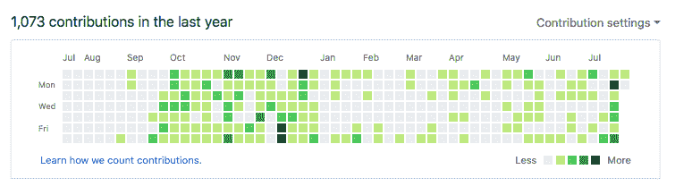
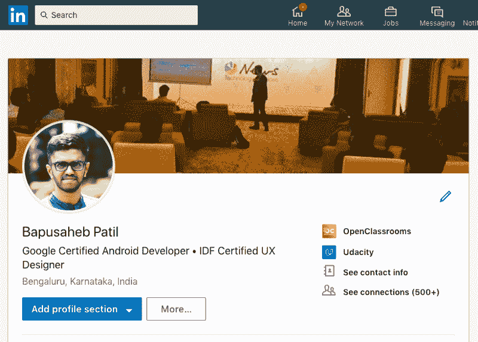

# 当你还是学生时，如何找到一份技术工作

> 原文：<https://www.freecodecamp.org/news/how-to-get-that-entry-level-job-you-want-a46c14f9d86e/>

巴普萨赫布·帕蒂尔

# 当你还是学生时，如何找到一份技术工作

#### 以正确的方式展示你的工作和你自己，赢得第一份技术工作

Photo by [Felix Russell-Saw](https://unsplash.com/photos/Q2yWkGV5Cqk?utm_source=unsplash&utm_medium=referral&utm_content=creditCopyText) on [Unsplash](https://unsplash.com/search/photos/student?utm_source=unsplash&utm_medium=referral&utm_content=creditCopyText)

我是 Bapusaheb Patil，我是 Google 认证的 Android 开发人员，我有大约两年的 Android 工作经验。我在印度班加罗尔学习计算机科学和工程，最近，在通过三轮面试后，我得到了一家名为 [OneDirect](https://www.onedirect.in/) 的公司的工作邀请，成为一名移动开发人员。

你可能会问，选拔过程如何？我很难“打动他们”吗？扔给我的测试和问题是一种折磨人的经历吗？

不完全是。但是让我澄清一下:我不一定知道我需要知道的所有事情，但是我已经做了很长时间了。所以在那个时候，我只需要展示我的作品，并以正确的方式谈论它。

### 那么我为什么要写这篇文章呢？

我写这篇文章是为了分享我的故事，告诉你我是如何在大学期间被选中的。我将讨论我是如何建立我的投资组合、我的项目和我的在线形象，并在一家好公司找到一份初级开发人员的工作的。

即使你不在发展中，我仍然认为这篇文章将仍然是一个很好的蓝图，供你在决定如何展示你的工作和向科技招聘人员展示你自己时遵循。

### **让我们从头开始……**

Photo by [Tegan Mierle](https://unsplash.com/@tegan?utm_source=medium&utm_medium=referral) on [Unsplash](https://unsplash.com?utm_source=medium&utm_medium=referral)

我从 2015 年冬天开始 Android 开发，用的是 [Udacity](http://udacity.com/) 上的免费课程。我大学一年级的时候。只是觉得很有意思，就从如何搭建一个简单的单屏 app 的基础开始。

在开发了一些应用程序并更多地参与 Android 社区后，我遇到了 [Git](http://git.sc/) 和 [GitHub](http://github.com/) 。这改变了我对我的项目的看法。

### 项目，项目，项目！

Photo by [Markus Petritz](https://unsplash.com/@petritzdesigns?utm_source=medium&utm_medium=referral) on [Unsplash](https://unsplash.com?utm_source=medium&utm_medium=referral)

你看，在那之前，我认为项目只是我编码和学习的东西。但是在社区中，**我从其他开发者那里了解到展示你的项目也同样重要**。哪怕只是一个简单的“Hello World”app。这在你看来可能很傻，但无论如何你都需要这么做。为什么？

因为它确立了你在这个领域的地位。

上面写着，“我的名字叫 XYZ，我对这个领域很感兴趣，在不久的将来，我会继续追求它”。举例来说，它向任何查看你在线资料的人(眨眼、招聘人员)发出了一个信号，表明你可能是一个很好的潜在求职者。

它告诉人们你对什么有热情。

Snapshot of my GitHub contributions over the last year

当然，在你感兴趣的领域发展技能是非常重要的。但是展示和能够详细谈论这些话题也很重要。如果你是一名开发人员，GitHub 是展示你的项目的绝佳方式。它有“**资源库**”，基本上就像你的项目的在线文件夹。

我开始把我所有的应用程序上传到 GitHub 上。随着时间的推移，这些应用变得越来越复杂。

当我申请 OneDirect 的工作时，我在 GitHub 上有 [52 个存储库，我的三个应用在](https://github.com/bapspatil) [**【谷歌 Play 商店】**](https://play.google.com/) 上。当工程主管看到我的资料时，情况发生了巨大的变化。；-)

这就把我带到了下一个需要你关注的世界: [**LinkedIn**](https://www.linkedin.com) 。

### “巴普，我真的需要 LinkedIn 吗？”

是的。是的，你有。

把 LinkedIn 想象成工作、招聘人员和机会的脸书/Instagram。

这是招聘人员用来搜寻人才的顶级门户网站之一。你在 LinkedIn 上如何描述自己，有助于招聘人员或其他任何查看你个人资料的人决定你在自己感兴趣的领域是否有能力。

你的 LinkedIn 个人资料讲述了一个关于你的故事。所以不要忽视。

[Bapusaheb Patil on LinkedIn](https://www.linkedin.com/in/bapspatil/)

因此，如果你还没有 LinkedIn 个人资料，就创建一个吧。确保你已经在 LinkedIn 个人资料中添加了你的技能、学历、课程和项目。开始吧，为你自己写一个好的标题和简短的简历——这通常会显示在你个人资料的顶部，就在你名字的下面。请你的朋友在 LinkedIn 上为你的技能**背书**(他们确认你拥有你列出的那些技能)。

LinkedIn 是一个很好的方式，可以让你的在线形象更好，讲述一个关于你自己的好的职业故事。不用说，我花了很多时间和精力让我的 LinkedIn 个人资料看起来不错。

### 好吧，接下来呢？

一旦你完成了 GitHub 和 LinkedIn 个人资料的设置，是时候开始设计和撰写人们一直在谈论的简历了。

Photo by [rawpixel](https://unsplash.com/@rawpixel?utm_source=medium&utm_medium=referral) on [Unsplash](https://unsplash.com?utm_source=medium&utm_medium=referral)

如果你正在寻找一个好的在线简历制作人，我会推荐 [Novoresume](https://novoresume.com/) 。

但是关于简历的内容，有一些事情要记住:

*   确保没有拼写错误
*   列出你的学历，你可能取得的任何成就，你的项目，至少用一行字描述所有这些
*   提到“足球队队长”这样的事情可能不会帮你找到一份技术工作。招聘人员根本不在乎这些东西。

这是我的简历的链接，你可以看看。现在，让我们继续…

### 面试过程

Photo by [Hunters Race](https://unsplash.com/@huntersrace?utm_source=medium&utm_medium=referral) on [Unsplash](https://unsplash.com?utm_source=medium&utm_medium=referral)

我参加过很多工作面试，但我目前这份工作的面试是最长的一次。我在早上 8:30 进入选拔程序，在我的申请被接受后，他们让我知道我被允许继续下去。

选拔过程包括**三轮**:

#### **第一轮**

给了我们一张纸和三个问题。它们是基于算法的问题，我们被要求在 1 小时内编写代码或算法来解决它们。它们并不容易，但我认为如果我能解决至少 1 个或 2 个问题，或者甚至能够提出一个部分的解决方案来阐述我的思维过程，这就足以让我进入下一轮。因此，在能够完全解决一个问题和部分解决两个问题之后，我通过了考试。

因此，加强你的批判性思维和解决问题的能力。

有趣的是，该公司的工程负责人走到我面前，并在第一轮后立即认出了我(*感谢我的在线状态*)。他非常友好，我们交谈了一分钟，然后他离开去评估我们的解决方案。

#### **第二轮**

这个过程的第二轮主要是一个技术回合，有一些个人问题。他们问了我一些关于算法、数据结构、操作系统、网络和 Android 开发的问题。

对于技术面试，我建议你在你感兴趣领域的所有关键技术方面都有坚实的基础。

技术知识至关重要。

#### **第 3 轮**

这一过程的第三轮更像是一个人力资源回合。我被问了几个关于特定情况的问题:

*   如果出了问题，我必须向老板报告，我该怎么办
*   如果我的家人要搬到另一个城市，我该怎么办(关于我的工作)

诸如此类。只要确保你不紧张地解决这些问题，并保持真实的自我。

面试官也是人。完全没有必要害怕他们。

他们需要你尽可能的自信，这样他们才会考虑你的工作。

那天下午 6:30 我回家了。就在我准备把手机放在充电座上的时候，我接到了大学就业官的电话，他告诉我，我被 OneDirect 的移动开发人员选中了。

我于 2019 年 1 月开始在那里工作。在那之前，我只是专注于提高我的 Android 知识，学习 iOS 和 Flutter，并建立一些好的项目——无论是为了工作还是为了我的个人成长。

### 外卖

因此，这里的要点是，如果你想在那家公司获得初级技术职位，就要专注于:

*   您的 GitHub 个人资料
*   您的 LinkedIn 个人资料
*   你的简历
*   你的技术知识
*   你的沟通技巧

我希望这篇文章能帮助你准备好这份伟大的工作！

击中了吗？按钮，如果你喜欢这篇文章，并分享到你的社会！

#### **我的网站**:

[**巴普萨赫伯帕蒂尔**](https://bapspatil.com)
[*一个热爱制作应用的谷歌认证安卓开发者，看脸&迷因。*bapspatil.com](https://bapspatil.com)

#### **领英**:

[**巴普萨赫伯帕蒂尔- Android & UX 设计导师-open classrooms | LinkedIn**](https://linkedin.com/in/bapspatil)
[*查看巴普萨赫伯帕蒂尔在全球最大的职业社区 LinkedIn 上的简介。巴普萨赫布有 4 份工作列在…*linkedin.com](https://linkedin.com/in/bapspatil)上

#### **GitHub** :

[**【bapspatil(Bapusaheb Patil)**](https://github.com/bapspatil)
[*bapspatil 有 56 个可用的存储库。在 GitHub 上关注他们的代码。*github.com](https://github.com/bapspatil)