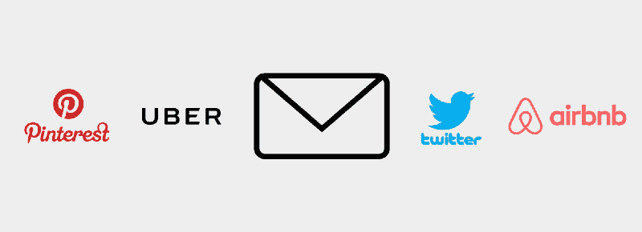
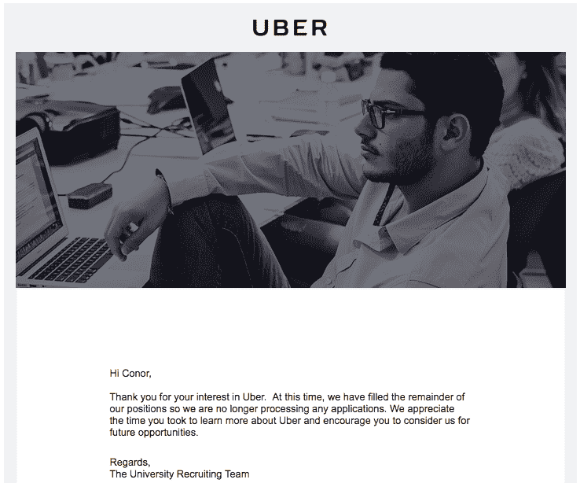
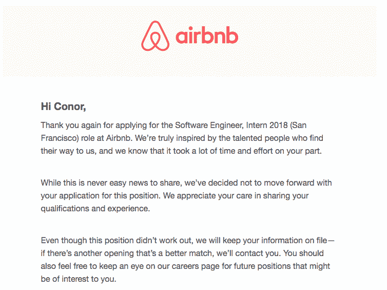
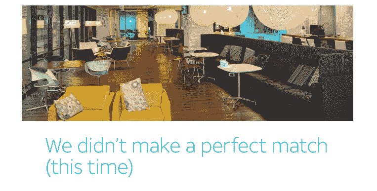
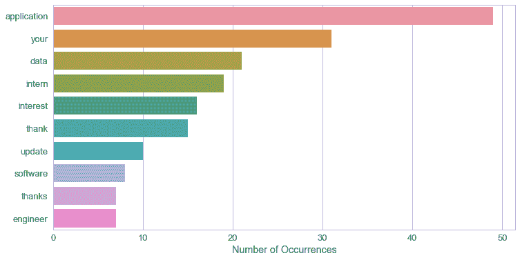
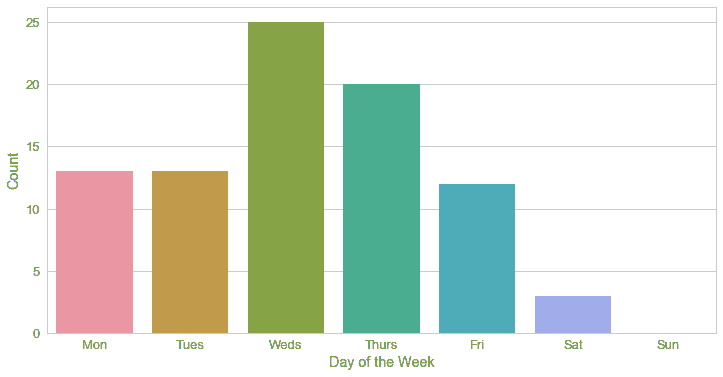
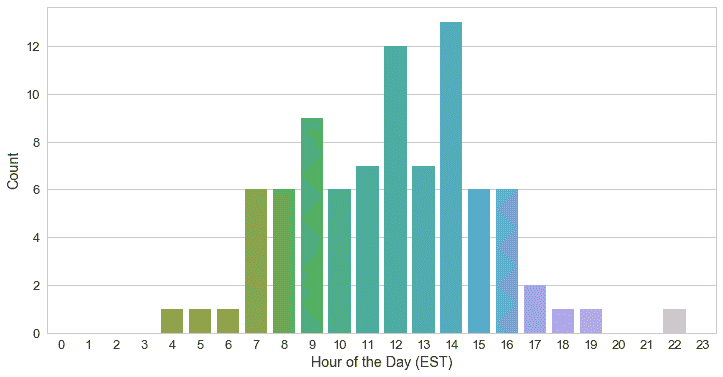

# 我用 Python 分析了 80 多份工作拒绝后学到了什么

> 原文：<https://www.freecodecamp.org/news/what-i-learned-from-analyzing-more-than-80-job-rejections-with-python-11044ee6927b/>

康纳·杜威

# 我用 Python 分析了 80 多份工作拒绝后学到了什么

我们都曾经收到过这些邮件。你知道，那些以“谢谢你的关注”开始，以梦想破灭和自我怀疑结束的。好吧，也许这有点极端。尽管如此，被拒绝工作还是很困难的。

相信我，我知道。在过去的一年里，我在申请实习的时候收到了 80 多封明确拒绝工作的电子邮件。让我们看一下[我的经历](https://github.com/conordewey3/DS-Career-Resources)的数字，在我们深入研究数据之前提供一点背景。

*   应用:234
*   答复:93
*   拒绝:90
*   报价:3

值得指出的是，至少对于实习来说，没有任何回应并不少见。事实上，我填写的超过 60%的申请都没有任何回应。从很多方面来说，这比得到一个明确的“不”的回答更让人焦虑。至少在这种情况下，你可以继续寻找，而不是专注于一个失败的原因。

正如你所想象的，在听到 80 多次“不”之后，你会对它产生一种抵触情绪。这种抵制加上一点好奇心最终激发了这个项目的想法。简而言之，我想调查是什么让这些自动拒绝邮件起作用，以及它们在不同公司之间有什么不同。如果你想直接跳到代码本身，可以直接进入 [GitHub repo](https://github.com/conordewey3/Job-Rejection-Analysis) 开始阅读。

在这篇文章的其余部分，我将讲述我是如何收集拒绝邮件的。然后我会回答一些关于时间和内容的有趣问题。

Everything happens for a reason, right?

### 数据收集

首先，让我们得到数据。在查询我的 Gmail 收件箱时，我发现了 1000 多封包含“实习生”和“申请”字样的电子邮件。从自动化的角度来看，这让事情变得有些棘手。

我仔细检查并整理了每家公司拒绝的工作。我在 Gmail 中给每个人都贴上了“拒绝工作”的标签。一旦完成，就该利用 Python 的力量了。我可以用`imaplib`登录，用`email`包抓取电子邮件的特定部分。为了进行内容分析，我必须用`nltk`对文本进行标记，并删除任何标点符号和停用词进行分析。

### 常用单词和短语

你有没有想过这些邮件似乎都使用相同的通用语言？就我个人而言，我注意到很多公司之间使用的相同的短语和台词。这并不是说没有一些创造性的尝试来减轻这种打击，但它们肯定是少之又少。

A little optimism goes a long way, thanks AT&T

让我们来看看这些邮件主题中最常用的单词和短语。你知道，这样你至少可以预见它的到来。

正如你在上面看到的，流行的词汇选择包括“应用”和“你的”等等。只需浏览一下，您就可以毫不费力地拼凑出最有可能的主题标题:

*   感谢您的关注。
*   更新您的[插入角色]申请。

这些屡试不爽的主题似乎有一些小的变化，但这些词通常是坏消息的最初传达者。

### 时间模式

让我们更进一步，看看这些电子邮件的时间是如何分解的。这让我想起了一个古老的建议，永远不要在周五解雇某人，因为他们在周末真的无法采取任何措施找到新工作。虽然没有解雇某人那么严重，但想想公司选择发布坏消息时的思维过程仍然很有意思。

让我们按照这个想法，看看拒绝邮件的星期几。之后，我将深入研究时间分解。

看来“驼峰日”是这里最明显的赢家。周四排在第二位，工作日的其余时间看起来相当一致。除了周六发送的一些明显的异常外，周末看起来大部分时间都很顺利。可耻…

对于一天中的某个小时，它看起来就像我们预期的正态分布。在上午 9 点和中午，拒绝次数出现峰值。这些时间分别表示美国东部时间和太平洋标准时间的工作日开始。太平洋标准时间下午 5 点后(第 20 小时)，只有一个拒绝。看着你宝洁公司。

这篇文章的分析部分到此结束。同样，你可以在 GitHub 或下面链接的要点中查看代码和原始分析。

### 最后的话

我发现这个项目是对工作拒绝邮件的有趣探索。更重要的是，我发现这是对我求职和处理一般拒绝的有益反思。没有足够多的人将处理失败的能力视为一种实用技能，甚至在某些方面是一种[超能力](https://www.ted.com/talks/jia_jiang_what_i_learned_from_100_days_of_rejection)。

> “在我的一生中，我一次又一次地失败……这就是我成功的原因”——迈克尔·乔丹

在 80 多次明确拒绝后，你开始习惯失败的概念。我发现自己在申请知名公司的职位或冰冷的电子邮件招聘人员时越来越不犹豫了。这让我获得了最初我认为无法获得的机会。

如果你正在读这篇文章，抓住这些机会，走远一点，走出去，然后失败。站起来。然后再失败一些。只有通过这个过程，才能实现改进，并最终取得成功。当你取得下一个成功时，不要忘记回顾所有让你成功的失败，并说一句话:

> 感谢您的关注。

感谢阅读！如果你喜欢这篇文章，请继续向鼓掌按钮展示你的爱，看看我下面的一些相关文章:

*   [解构介质上的指标](https://towardsdatascience.com/deconstructing-metrics-on-medium-bf5b4863bf96?source=friends_link&sk=8bd7eb3ae6d762eccb2111788c7a8933)
*   [DS/ML 面试资源大单](https://towardsdatascience.com/the-big-list-of-ds-ml-interview-resources-2db4f651bd63?source=friends_link&sk=e229d4fc3452514bd8d560ae898809cc)
*   [用于数据科学的 Python:你可能已经忘记的 8 个概念](https://towardsdatascience.com/python-for-data-science-8-concepts-you-may-have-forgotten-i-did-825966908393?source=friends_link&sk=f8daac7acb936a5a7eaa65e80cfda01f)

如果你对未来的更多帖子感兴趣，请确保[关注我](https://medium.com/@conordewey3)并订阅下面的[我的简讯](https://www.conordewey.com/newsletter/)以接收任何新内容。更多关于我和我在做什么，请查看[我的网站](https://www.conordewey.com/)。