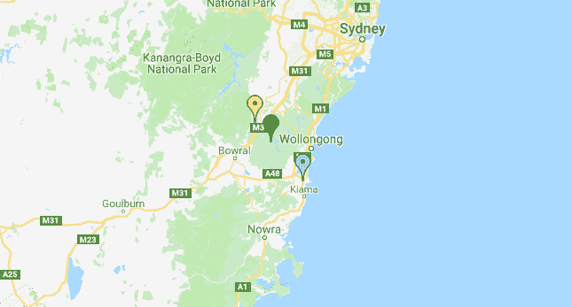

# 如何用 JavaScript 改变谷歌地图标记的颜色

> 原文：<https://www.freecodecamp.org/news/how-to-change-javascript-google-map-marker-color-8a72131d1207/>

作者:田

# 如何用 JavaScript 改变谷歌地图标记的颜色

#### 让它们变成粉色、蓝色、绿色、黄色或紫色！


默认情况下，谷歌地图标记是红色的。本文将展示如何给谷歌地图添加不同的颜色标记。那么，我们开始吧。？

### 1.加载谷歌地图

按照 [Google Maps API 官方文档:Hello World](https://developers.google.com/maps/documentation/javascript/tutorial) 创建一个加载 Google Maps 的 HTML 文件。

您的代码将类似于下面的代码片段。

**注意:**记得把`YOUR_API_KEY`改成你实际的谷歌地图 API 密钥。

### 2.添加不同的颜色标记

要添加蓝色标记，我们需要更改标记的图标。这是通过添加一个图标属性并为其指定一个 URL 来实现的，如下所示。

```
icon: {                               url: "http://maps.google.com/mapfiles/ms/icons/blue-dot.png"                           }
```

注意，我们在 URL 的末尾指定了`blue-dot.png`来获得一个蓝色标记。要添加一个绿色标记，只需将其更改为`green-dot.png`，这样 URL 就会变成`[http://maps.google.com/mapfiles/ms/icons/green-dot.png](http://maps.google.com/mapfiles/ms/icons/blue-dot.png)`。

一些其他颜色可供选择:

1.  粉色:`pink-dot.png`
2.  黄色:`yellow-dot.png`
3.  紫色:`purple-dot.png`

要获取更多标记图标的 URL，请参考[本网站](https://sites.google.com/site/gmapsdevelopment/)。

### 3.包装成添加标记函数

为了让代码更简洁，我们可以定义一个`addMarker`函数，它接受标记的`latLng`和`color`。请注意，我们存储了添加到全局`markersArray`中的标记，以备以后需要对标记执行任何操作时使用。

在浏览器中打开 HTML 文件。它应该是这样的:



你可以从[这里](https://gist.github.com/getsudocode/605bf60f5de40eb3f6b00addd93c913d)获得完整的最终版本代码。请在下面的评论中告诉我进展如何。

随意查看我写的另一个谷歌地图教程:
[实现点击 JavaScript 谷歌地图添加可拖动的折线标记](https://medium.com/@letian1997/click-javascript-google-map-add-draggable-markers-polyline-b834dd5762b2)