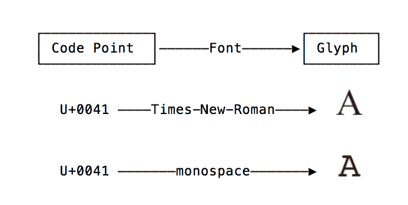
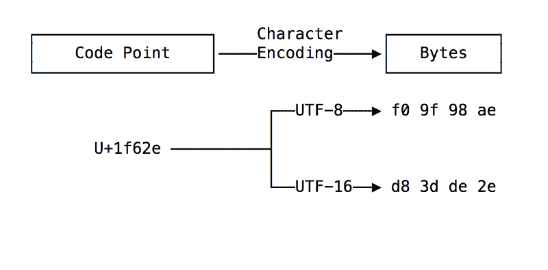
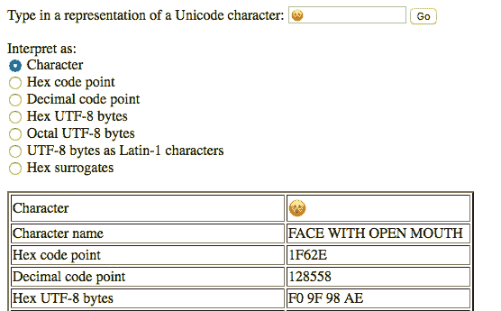
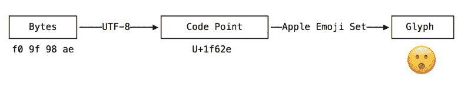
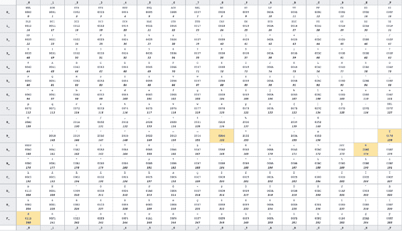
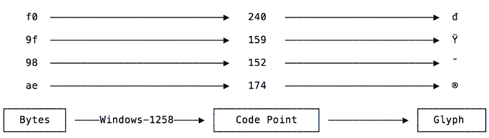
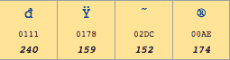

# Python 中 Unicode 的初学者友好指南

> 原文：<https://www.freecodecamp.org/news/a-beginner-friendly-guide-to-unicode-d6d45a903515/>

作者吉米·张

我曾经花了几天时间学习如何正确处理 Python 中的 Unicode 字符串，这让我很沮丧。在那两天里，我吃了很多零食——大约每遇到一个错误就吃一袋金鱼，这对用 Python 编程的人来说应该太熟悉了:

```
UnicodeDecodeError: ‘ascii’ codec can’t decode byte 0xf0 in position 0: ordinal not in range(128)
```

在解决我的问题时，我做了大量的谷歌搜索，这使我找到了[一篇](https://www.joelonsoftware.com/2003/10/08/the-absolute-minimum-every-software-developer-absolutely-positively-must-know-about-unicode-and-character-sets-no-excuses/) [几篇](https://nedbatchelder.com/text/unipain.html) [不可或缺的](https://betterexplained.com/articles/unicode/) [篇](http://www.pgbovine.net/unicode-python.htm)。但是，尽管它们很伟大，但它们都是在没有当今时代一个重要的交流方面的帮助下写成的。

那就是:都是在没有表情符号的帮助下写出来的。

因此，为了利用这种情况，我决定编写自己的理解 Unicode 的指南，其中提供了大量的面孔和图标？✌?。

在深入技术细节之前，我们先来问一个有趣的问题。你最喜欢的表情符号是什么？

我的是“[张着嘴的脸](https://emojipedia.org/face-with-open-mouth/)，长这样？—有一个重要的警告。你所看到的实际上取决于你阅读这篇文章的平台！

在我的 Mac 上看，这个表情符号看起来像一个黄色的保龄球。在我的三星平板电脑上，眼睛是黑色的圆形，被一个白点突出，显示出更深层次的情感。

复制粘贴表情符号(？)进入 Twitter，你会看到完全不同的东西。复制并粘贴到 messenger.com，但是，你会看到为什么它是我的最爱。

？？？？为什么都不一样？


From left to right: Apple, Samsung, messenger.com ([source](https://emojipedia.org/face-with-open-mouth/)).

注意:截至 2018 年 7 月 9 日:Messenger 似乎更新了他们的表情符号图标，因此右上方的图标不再适用。？

这个有趣的小秘密是我们进入 Unicode 世界的开始，因为表情符号自 2010 年以来一直是 Unicode 标准的一部分。除了给我们表情符号，Unicode 也很重要，因为它是互联网一致的“T2”编码、表示和文本处理的首选。

### Unicode 和编码:简明入门

与许多主题一样，理解 Unicode 的最佳方式是了解其创建的背景——为此，Joel Spolsky 的文章是必读的。

#### 代码点

既然我们现在已经进入了 Unicode 的世界，我们需要首先将表情符号从它们精彩的表达图标中分离出来，并将它们与一些不那么激动人心的东西联系起来。因此，我们不会根据表情符号所代表的事物或情感来思考表情符号，而是将每个表情符号视为一个简单的数字。这个数字被称为**代码点**。

代码点是 Unicode 的[关键概念，Unicode](https://www.unicode.org/standard/standard.html)是“为支持现代世界不同语言的书面文本的全球交换、处理和显示而设计的”它通过将几乎每个可打印字符与一个唯一的代码点相关联来实现这一点。这些字符共同组成了 Unicode **字符集**。

代码点通常以十六进制编写，并以`U+`为前缀，表示与 Unicode 的连接，代表以下字符:

*   外来语言如[泰卢固语](https://en.wikipedia.org/wiki/Telugu_(Unicode_block))【ఋ|代码点:U+0C0B】
*   [象棋符号](https://en.wikipedia.org/wiki/Chess_symbols_in_Unicode)【♖|代码点:U+2656】
*   当然还有[表情符号](https://en.wikipedia.org/wiki/Emoticons_(Unicode_block))【？|代码点:U+1F64C]

#### 字形就是你所看到的

码点在屏幕上的实际表示称为**字形**，(码点到字形的****完全映射称为**字体****)。******

****以**、**为例，以字母 A 为例，它是 Unicode 中的代码点`U+0041`。你用眼睛看到的“A”是一个字形——它看起来是这样的，因为它是用 Medium 的字体渲染的。例如，如果您将字体更改为 Times New Roman，只有“A”的字形会更改，而底层代码点不会更改。****

****

Fonts map the same code point to different glyphs**** 

****字形是我们的小渲染之谜的答案。在引擎盖下，所有张开嘴的面部表情符号都指向同一个代码点`U+1F62E`，但代表它的**字形**因平台而异？。****

#### ****代码点是抽象的****

****因为它们没有说它们是如何可视化呈现的(需要字体和字形来“赋予它们生命”)，所以代码点被认为是一种抽象。****

****但是正如代码点对于终端用户来说是一种抽象，它们对于计算机来说也是一种抽象。这是因为代码点需要一个**字符编码**来将它们转换成计算机可以解释的东西:字节。一旦转换成字节，码位就可以保存到文件中或通过网络发送到另一台计算机上？➡️?。****

****UTF-8 是目前世界上最流行的字符编码。UTF-8 使用一组规则将一个码位转换成一个唯一的(1 到 4)字节序列，反之亦然。据说代码点被**编码**成一个字节序列，而字节序列被**解码**成代码点。这篇堆栈溢出文章解释了 UTF-8 编码算法是如何工作的。****

****然而，尽管 UTF 8 是世界上最主要的字符编码，但它远不是唯一的。例如，UTF-16 是 Unicode 字符集的替代字符编码。下图比较了我们表情符号的 UTF-8 和 UTF-16 编码？。****

********

****当一台计算机用一种编码方式将代码点编码成字节，而另一台计算机(或同一台计算机上的另一个进程)用另一种编码方式解码这些字节时，就会出现问题。****

****幸运的是，UTF-8 无处不在，在大多数情况下，我们不必担心不匹配的字符编码。但是当它们真的发生时，你需要熟悉上面提到的概念才能从混乱中解脱出来。****

#### ****简要概述****

*   ****Unicode 是一个由**个代码点**组成的集合，这些代码点是通常以十六进制编写的普通数字，前缀为`U+`。这些代码点实际上映射到世界各地的书面语言中的每一个可打印字符。****
*   ******字形**是一个角色的物理表现。这家伙？是一个字形。f **ont** 是代码点到字形的映射。****
*   ****为了通过网络发送它们或把它们保存在文件中，字符和它们的基本码位必须编码成字节。一个**字符编码**包含了一个代码点如何嵌入到一个字节序列中的细节。****
*   ******UTF-8** 是目前世界上必须流行的字符编码。给定一个代码点，UTF-8 **将其编码为一个字节序列。给定一个字节序列，UTF-8 **将其解码**成一个代码点。******

### ****一个实际的例子****

**Unicode 字符的正确呈现包括遍历一个链，从字节到代码点再到字形。**

****

**现在让我们使用一个文本编辑器来看看这个链的一个实际例子——以及当事情出错时可能出现的问题类型。文本编辑器是完美的，因为它们包含了上面显示的渲染链的所有三个部分。**

**注意:下面的例子是在我的 MacOS 上使用 Sublime Text 3 完成的。值得称赞的是:这个例子的开始很大程度上受到了来自 Philip Guo 的这篇文章的启发，这篇文章向我介绍了`hexdump` command(以及更多内容)。**

**我们将从一个包含单个字符的文本文件开始——我最喜欢的“张着嘴的脸”表情符号。对于那些想跟进的人，我把这个文件放在了 Github [gist](https://gist.githubusercontent.com/jzhang621/d7d9eb167f25084420049cb47510c971/raw/e35f9669785d83db864f9d6b21faf03d9e51608d/emoji.txt) 中，你可以在本地通过`curl`获得。**

```
`curl https://gist.githubusercontent.com/jzhang621/d7d9eb167f25084420049cb47510c971/raw/e35f9669785d83db864f9d6b21faf03d9e51608d/emoji.txt > emoji.txt`
```

**正如我们所知，为了保存到文件中，表情符号使用字符编码被编码成字节。这个特殊的文件是使用 UTF-8 编码的，我们可以使用`hexdump`命令来检查文件的实际字节内容。**

```
`j|encoding: hexdump emoji.txt0000000 f0 9f 98 ae 0000004`
```

**`hexdump`的输出告诉我们文件总共包含 4 个字节，每个字节都是十六进制的。实际的字节序列`f0 9f 98 ae`与预期的 UTF-8 编码的字节序列相匹配，如下所示。**

**

Source: [http://www.ltg.ed.ac.uk/~richard/utf-8.cgi?input=%F0%9F%98%AE&mode=char](http://www.ltg.ed.ac.uk/~richard/utf-8.cgi?input=%F0%9F%98%AE&mode=char)** 

**现在，让我们在 Sublime Text 中打开我们的文件，在那里我们应该看到我们的 single？性格。既然我们看到了预期的字形，我们可以假设 Sublime Text 使用了正确的字符编码将这些字节解码成代码点。让我们打开控制台 V `iew -> Show Conso` le，检查 Sublime Text 作为 Python API 的一部分公开的新对象。**

```
`>>> view<sublime.View object at 0x1112d7310>`
```

```
`# returns the encoding currently associated with the file>>> view.encoding()'UTF-8'`
```

**利用一点 Python 知识，我们还可以找到与我们的表情符号相关联的 Unicode 码位:**

```
`# Returns the character at the given position>>> view.substr(0)'?'` 
```

```
`# ord returns an integer representing the Unicode code point of the character (docs)>>> ord(view.substr(0))128558`
```

```
`# convert code point to hexadecimal, and format with U+>>> print('U+%x' % ord(view.substr(0)))U+1f62e`
```

**正如我们所料。这展示了 Unicode 呈现链的完整遍历，包括:**

*   **将文件读取为 UTF-8 编码的字节序列。**
*   **将字节解码为 Unicode 码位。**
*   **呈现与代码点关联的字形。**

**

The actual glyph that you see is dependent on the platform.** 

**到目前为止，一切顺利吗？。**

#### **不同的字节，相同的表情**

**除了是我最喜欢的文本编辑器之外，我为这个例子选择了 Sublime Text，因为它允许对字符编码进行简单的实验。**

**我们现在可以使用不同的字符编码保存文件。为此，点击`File -> Save with Encoding -> UTF` -16 BE。(非常 bri [efly，](https://en.wikipedia.org/wiki/UTF-16) UTF-16 是 Unicode 字符集的替代字符编码。UTF-16 不是像 UTF-8 那样用一个字节编码最常见的字符，而是用两个字节编码从 1 到 65536 的每一点。大于 65536 的代码点，比如我们的表情符号[，使用代理](https://stackoverflow.com/a/5903080/1586242)对进行编码。BE 代表大端字节序)。**

**当我们使用`hexdump`再次检查文件时，我们看到字节内容已经改变。**

```
`# (before: UTF-8)j|encoding: hexdump emoji.txt0000000 f0 9f 98 ae 0000004`
```

```
`# (after: UTF-16 BE)j|encoding: hexdump emoji.txt0000000 d8 3d de 2e0000004`
```

**回到崇高的文本，我们仍然看到相同的？人物盯着我们。用不同的字符编码保存文件可能会改变文件的实际内容，但它也更新了 Sublime Text 如何解释这些字节的内部表示。我们可以通过再次启动控制台来确认。**

```
`>>> view.encoding()'UTF-16 BE'`
```

**从现在开始，其他一切都一样。**

```
`>>> view.substr(0)'?'` 
```

```
`>>> ord(view.substr(0))128558`
```

```
`>>> print('U+%x' % ord(view.substr(0)))U+1f62e`
```

**字节可能已经改变，但代码点没有改变，表情符号保持不变。**

#### **同样的字节，但đÿ˜**

**是时候来点编码“乐趣”了。首先，让我们使用 UTF-8 重新编码我们的文件，因为这是一个更好的例子。**

**现在让我们继续使用 Sublime Text 使用不同的字符编码重新打开一个现有的文件。在`File -> Reopen with Encod` ing，cli `ck Vietnamese (Windows 12` 58)下，这就把我们的表情符号字符变成了以下四个无意义的字符:đÿ˜。**

**当我们点击“带编码重新打开”时，我们并没有改变文件的实际字节内容，而是改变了 Sublime Text 解释这些字节的方式。Hexdump 确认字节是相同的:**

```
`j|encoding: hexdump emoji.txt0000000 f0 9f 98 ae0000004`
```

**为了理解我们为什么会看到这些无意义的字符，我们需要查阅 [Windows-1258](https://en.wikipedia.org/wiki/Windows-1258) 代码页，它是字节到越南语字符集的映射。(将代码页想象成由字符编码产生的表)。由于该代码页包含一个少于 255 个字符的字符集，每个字符的代码点可以表示为一个 0 到 255 之间的十进制数，而这些十进制数又可以全部用一个字节进行编码。**

**

The Windows-1258 code page, which maps decimal code points to Vietnamese language characters. Taken from Wikipedia, with some custom styling applied to show the 4 code points relevant to this example.** 

**因为我们的单曲？表情符号需要 4 个字节来使用 UTF-8 编码，当我们用 Windows-1258 编码解释文件时，我们现在可以看到 4 个字符。**

****

**一个错误的字符编码选择会直接影响我们所看到的和理解的东西，因为它会把字符乱码成一团无法理解的乱码。**

****

**现在，到了“有趣”的部分，我加入这个部分是为了给 Unicode 增添一些色彩，以及它存在的原因。在 Unicode 之前，存在许多不同的代码页，如 Windows-1258，每个代码页都以不同的方式将 1 字节的数据映射为 255 个字符。**创建 Unicode 是为了将所有不同代码页的所有不同字符整合到一个系统中**。换句话说，Unicode 是 Windows-1258 的超集，Windows-1258 代码页中的每个字符都有一个对应的 [Unicode 字符](https://stackoverflow.com/a/3441690/1586242)。**

**

The Unicode counterparts for each character is listed on the middle row of each cell ([Wikipedia](https://en.wikipedia.org/wiki/Windows-1258))** 

**事实上，正是这些 Unicode 对应物允许 Sublime 文本通过点击一个按钮在不同的字符编码之间转换。在内部，Sublime Text 仍然将每个“Windows-1258 解码”字符表示为一个 Unicode 码位，正如我们在启动控制台时看到的:**

```
`>>> view.encoding()'Vietnamese (Windows 1258)'`
```

```
`# Python 3 strings are "immutable sequences of Unicode code points">>> type(view.substr(0))<class 'str'>`
```

```
`>>> view.substr(0)'đ'>>> view.substr(1)'Ÿ'>>> view.substr(2)'˜'>>> view.substr(3)'®'`
```

```
`>>> ['U+%04x' % ord(view.substr(x)) for x in range(0, 4)]['U+0111', 'U+0178', 'U+02dc', 'U+00ae']`
```

**这意味着我们可以重新保存我们的 4 个无意义的字符使用 UTF-8。我将把这个问题留给您——如果您这样做了，并且能够正确地预测文件的结果`hexdump`,那么您已经成功地理解了 Unicode、代码点和字符编码背后的关键概念。([使用这个 UTF-8 代码页](https://www.utf8-chartable.de/unicode-utf8-table.pl?number=512))。答案可以在这篇文章的最后找到。).**

### **包扎**

**有效地使用 Unicode 涉及到始终知道您在渲染链的哪个级别上操作。它意味着总是问自己:我拥有什么？在引擎盖下，字形只不过是代码点。如果您正在处理代码点，请知道这些代码点必须用字符编码方式编码成字节。如果您有一个表示文本的字节序列，要知道如果不知道创建这些字节所使用的字符编码，这些字节是没有意义的。**

**与任何计算机科学主题一样，了解 Unicode 的最佳方式是进行实验。输入字符，玩字符编码，并使用`hexdump`进行预测。虽然我希望这篇文章解释了您需要了解的关于 Unicode 的一切，但是如果它仅仅是让您进行自己的实验，我会非常高兴。**

**感谢阅读！？**

#### **回答:**

```
`j|encoding: $ hexdump emoji.txt0000000 c4 91 c5 b8 cb 9c c2 ae0000008`
```